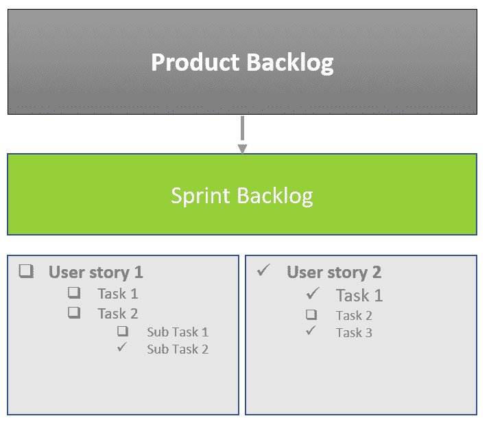
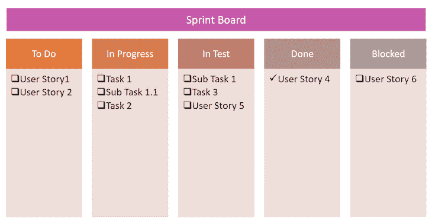
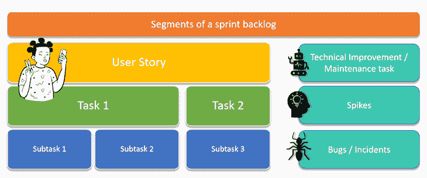

# 什么是 sprint backlog 以及如何区分它的优先级(举例)

> 原文：<https://blog.logrocket.com/product-management/sprint-backlog-how-to-prioritize-examples/>

你不能为 sprint 中将要发生的每件事做计划，但是创建一个详细的、有良好优先级的 sprint backlog 可以帮助你的团队走向成功。

在本指南中，我们将分解 sprint backlog 的元素，用真实的例子演示如何创建一个，并概述一些技巧和最佳实践来帮助你优化团队在 sprint 期间的工作方式。

## 目录

## 什么是 sprint backlog？

sprint backlog 是产品团队在 sprint 期间工作的项目列表。如果团队选择在 sprint 期间处理产品待办事项中优先级最高的项目，那么这些项目会被添加到 sprint 待办事项中。

顾名思义，sprint backlog 是在 sprint 规划期间创建的。[冲刺规划](https://blog.logrocket.com/product-management/what-is-sprint-planning-guide-meeting-agenda-cheat-sheet/)是 [scrum 框架](https://blog.logrocket.com/product-management/what-are-five-types-of-scrum-meetings/)中的事件之一，团队在此期间规划未来几周的工作。

## sprint backlog 包含什么？

几个因素导致了 sprint backlog 的产生，包括团队速度、任何现存的障碍、可用的资源、依赖等等。

sprint backlog 应该包含开发人员在当前 sprint 中要完成的简单任务。backlog 还包括描述产品的高级用户价值的故事，以及将用户故事分解成简单、可实现的开发步骤的详细任务。

更广泛或复杂的任务可以进一步分解成子任务。目标是将用户故事分解成可以在一天内完成的可实现的行动项目，产生特定的用户价值，并为 sprint 目标做出贡献。

The sprint backlog contains detailed items from the product backlog to be developed in the current sprint

## 谁执行 sprint backlog 的工作？

整个 scrum 团队负责创建和维护 sprint backlog:

*   产品负责人负责用户故事的完成、优先级排序和开发准备
*   开发人员负责创建完成用户故事所必需的任务和子任务
*   scrum master 确保每个故事都经过评估，并监控这些故事的进展和障碍

所有团队成员都应该不断更新和维护 backlog，以便 scrum 团队可以一目了然地跟踪每个 sprint 的进度和完成的工作。这种透明性对于跨职能工作并依赖其他团队来完成用户故事的团队来说尤其重要。

每个故事都经历了几个步骤，scrum 团队在冲刺开始时就同意了这些步骤。sprint backlog 是 scrum 委员会的基础。scrum 团队创建 sprint backlog 来帮助它可视化日常工作、进展和剩余任务。sprint backlog 的输入来自产品 backlog，产品 backlog 是从[产品路线图](https://blog.logrocket.com/product-management/how-to-build-product-roadmap-overview-examples/)中创建的。

Example of sprint board

## 如何创建 sprint backlog(有例子)

sprint backlog 是 sprint 待办事项列表的可视化。因此，它由产品待办事项列表中的最高优先级项目以及任何其他任务、子任务、技术债务、bug 和缺陷组成。

scrum 团队计划在 sprint 期间处理的任何项目都应该添加到 sprint backlog 中。

Components of a sprint backlog

让我们更详细地检查 sprint backlog 的每个元素，并通过参考真实世界的例子来展示如何创建一个元素。

### 1.用户故事

用户故事总结了用户的期望，描述了用户的旅程。

用户故事应该包含验收标准，并描述一些常见的场景，包括负面场景。

下面是一个用户故事的例子:

> *作为用户，我想从手机上传一张图片与朋友分享。*

类似上面例子的用户故事应该告知开发团队构建新特性的方法和优先级。例如，当用户点击按钮时，会出现一个弹出窗口，要求用户允许访问照片库。当用户拒绝该权限时，应该向用户显示一条错误消息。

### 2.任务

任务部分应该包括完成用户故事需要开发或实现的东西的列表。

以下任务可能会遵循上面示例中的用户情景:

> 1.  *创建上传图片的按钮*
> 2.  *请求访问照片库的权限*
> 3.  *打开**app 中的图片库作为缩略图* *选择一张照片*
> 4.  *发送前显示所选照片的放大预览*
> 5.  *发送成功后，在图片下方显示发送日期和时间戳*

### 3.子任务

子任务代表任务的进一步划分。子任务对于需要完成多个步骤的复杂项目非常有用。

子任务列表的示例可能如下所示:

> *编写一个单元测试*
> 
> 1.  *创建测试用例*
> 2.  *为按钮*创建一个 UI 组件
> 3.  4.疯狂的

### 当系统没有按照预期的方式运行时，就会创建一个 bug 来调查和解决问题。

bug 是不可估计的，并且通常是优先的，因为它们在产品中并且影响真实的用户。在 sprint 计划期间，scrum 团队应该为不可预见的错误分配时间。

订阅我们的产品管理简讯
将此类文章发送到您的收件箱

* * *

错误的一个例子是用户遇到 404 错误，而不是一个新页面。

* * *

5.技术债务/维护问题

### 技术债务和维护问题是开发团队需要完成的任务，以保持系统运行或防止系统崩溃。

有时，由于缺乏时间或资源，团队可能决定走捷径，快速开发工作软件，而不是致力于稳定的、面向未来的开发。根据[敏捷原则](https://blog.logrocket.com/product-management/12-agile-manifesto-principles-how-to-adopt-them/#3-deliver-working-software-frequently)，这是可以接受的，前提是这只是一个短期的解决方案。

这些实现被称为技术债务。维护任务是保持程序运行和由于缺乏支持而将数据库升级到新版本或代码库所需的任务。

下面是一个技术债务的例子:

*在弹出的* *中动态取文本，而不是硬**—**编码。*

> 下面是一个维护任务的示例:

*将 oracle 数据库升级到 19 C 版本* *。*

> 技术债务和维护问题并不总是包含在 sprint backlog 中；它们可能会在产品所有者要求和确定优先级时出现。

6.穗

### 尖峰是在[敏捷框架](https://blog.logrocket.com/product-management/6-product-management-frameworks-you-should-know/)中引入的一种新的任务类型，使团队能够为探索、调查和研究分配时间。

峰值的示例包括以下任务:

> *调查新的* *用于登录服务的人脸识别软件*
> 
> *   *调查新的语音搜索服务*
> *   像技术债务和维护任务一样，峰值并不是 sprint backlog 的常规部分。它们可能出现在一个新项目的开始，或者如果组织决定进行一些改进。

如何优先处理你的 sprint 待办事项

## 虽然[对产品待办事项](https://blog.logrocket.com/product-management/6-product-management-frameworks-you-should-know/)进行优先级排序以实现路线图中概述的[产品愿景](https://blog.logrocket.com/product-management/what-is-a-product-vision-statement-examples/)很重要，但正确地对其进行优先级排序同样重要。

优先化的 sprint backlog 使您能够:

在冲刺阶段保持事情的进展

*   激励团队成员
*   优化流程
*   提高效率和速度
*   实现你的冲刺目标
*   下面是一些提示和最佳实践，可以帮助你优先处理你的 sprint 待办事项，并让你的团队为成功的 sprint 做好准备。

先拿速赢

### 复杂的用户故事往往会抓住开发者的注意力，激起他们的好奇心。因此，优先处理复杂的任务是很有诱惑力的。这种方法经常导致项目在“开发中”和“准备测试”之间徘徊太久。然后测试人员在 sprint 接近尾声时得到一堆故事，导致进一步的延迟。进展缓慢会导致沮丧，削弱动力，并导致不完整的冲刺目标。

对 sprint backlog 进行优先级排序的最佳实践是从小而简单的任务开始，然后转移到更复杂的任务。在 sprint backlog 中总是有一些独立的任务，任何团队成员都可以接手并开始开发，如果他们被困在一个由于未解决的依赖关系而暂停的不同任务上的话。

区分依赖关系的优先级

### 按照正确的顺序排列依赖关系的优先级将会优化开发时间。在许多情况下，前端任务依赖于后端服务准备就绪。找出相互依赖的角色，并相应地对它们进行优先级排序，这样团队中就没有人在等待另一个人完成任务。

对跨职能团队的依赖性进行优先级排序甚至更具挑战性。当工作在一个主要的跨功能特性上时，试着预先有一个 [backlog 精化](https://blog.logrocket.com/product-management/what-is-backlog-grooming-aka-refinement/)来识别和解决依赖性。如果可能的话，在开始冲刺计划之前，试着建立一个承诺或者时间计划。

尽早识别障碍并进行调查

### 当在 sprint 规划期间谈论故事时，如果发现了一系列问题，那么在 sprint 的早期优先考虑这些调查，这样就有足够的时间进行开发和测试。调查可能需要一些会议和协作，这些可以在 sprint 开始时与不太复杂的任务一起管理。

在开发过程中很少有障碍会再次出现。试着预先识别并解决它们，然后为开发任务划分优先级。

这种障碍的一个常见例子与防火墙有关；在使用第三方服务时，提前打开防火墙可以节省大量开发时间。

考虑资源可用性和计划

### 在 sprint 计划中，一个常见的错误是未能估计团队成员的疾病、休假和假期。

讨论所有团队成员的可用性，并确定在冲刺阶段是否有假期。相应地组织任务和速度。协调任务和资源可用性之间的相关性。

即使有一个 T 型团队，一些专业知识也是由某些个人分享的，其他人即使在需要的时候也无法贡献。

预见错误

### 产品团队犯的另一个常见错误是未能考虑到不可预见的任务和复杂性。如果一个团队管理一个已经激活的产品，应该总是有解决事件和 bug 的空间。即使团队正在开发一个产品的第一个特性，仍然会有难以识别的错误，并且需要花费大量的精力来解决。

对于不可预测的情况，一个很好的经验法则是将团队速度的 80%用于新的开发，同时保留 20%用于不可预测的事件。

结论

## 这些技巧和最佳实践纯粹来自经验，而不是来自任何书籍或课程。产品管理总是在发展，因此学习和适应应该是常态。让你自己和你的团队走向成功的最好方法是始终保持敏捷的核心。

*精选图片来源:[icon scout](https://iconscout.com/icon/agile-prioritize-2310243)*

[LogRocket](https://lp.logrocket.com/blg/pm-signup) 产生产品见解，从而导致有意义的行动

## [LogRocket](https://lp.logrocket.com/blg/pm-signup) 确定用户体验中的摩擦点，以便您能够做出明智的产品和设计变更决策，从而实现您的目标。

使用 LogRocket，您可以[了解影响您产品的问题的范围](https://logrocket.com/for/analytics-for-web-applications)，并优先考虑需要做出的更改。LogRocket 简化了工作流程，允许工程和设计团队使用与您相同的[数据进行工作](https://logrocket.com/for/web-analytics-solutions)，消除了对需要做什么的困惑。

让你的团队步调一致——今天就试试 [LogRocket](https://lp.logrocket.com/blg/pm-signup) 。

Get your teams on the same page — try [LogRocket](https://lp.logrocket.com/blg/pm-signup) today.

[Bindiya Thakkar Follow](https://blog.logrocket.com/author/bindiyathakkar/) Experienced product manager and product owner with a demonstrated history of working in the Omni channel and digital tools. Skilled in product management, digital strategy, roadmapping, business strategy, and user experience.