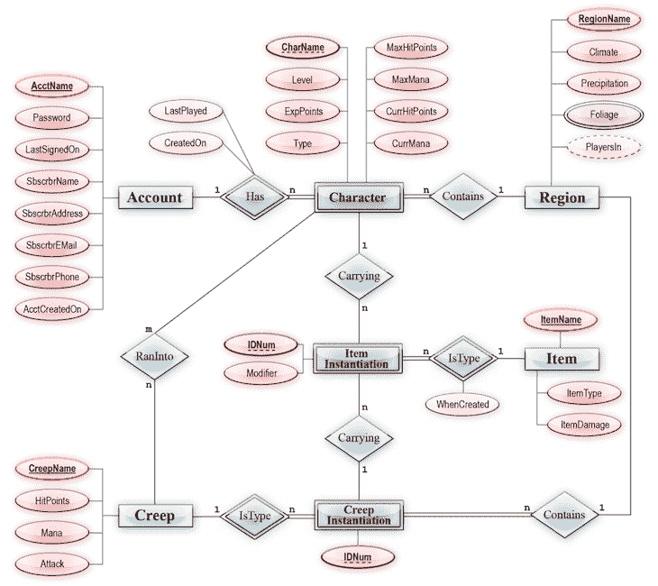

# 产品经理的 SQL 技能:你需要知道什么？

> 原文：<https://blog.logrocket.com/product-management/sql-skills-product-managers/>

数据往往是产品经理做出产品开发决策的决定性因素。一把好剑对于刺客就像数据对于产品经理一样。

对于一个涉及决策和下注的职业来说，拥有可靠的事实来支持你的假设可以产生更好的结果，并有助于减少偏见和遗漏。

* * *

## 目录

* * *

## 产品经理如何与数据互动？

对于一个产品经理来说，我认为以下面向数据的技能至关重要:

*   掌握数据查询(SQL)
*   注重数据的心态
*   了解数据可视化(PowerBI、Tableau)
*   熟练掌握基本的探索性数据分析和假设检验(EDA)
*   熟悉事件映射和[产品分析](https://blog.logrocket.com/product-management/what-metrics-kpis-product-managers-track/)

第一个方面，结构化查询语言(SQL)使 PMs 能够查询大量数据。如果您需要立即做出决策，您可以在几分钟内查询相关数据，而不是等待工程或数据团队查看和回复您的请求数小时或数天。

此外，访问产品数据可以增进您对产品的了解。更不用说，它将您的工程师和分析人员从为您提供数据的任务中解放出来。

## 什么是结构化查询语言(SQL)？

[关系数据库管理系统(RDBMS)](https://www.techtarget.com/searchdatamanagement/definition/RDBMS-relational-database-management-system) 使用[结构化查询语言(SQL)](https://blog.logrocket.com/detailed-look-basic-sqljs-features/) ，通常读作“sequel”，来管理数据和交换信息(RDMS)。

数据库类似于 Excel 文件。Excel 文件的各种工作表类似于数据库中的表格。此外，您将看到我们将涉及的 SQL 命令与您可能从 Excel 中熟悉的任何方程和数据透视表之间的相似之处。

数据库、数据仓库和数据湖是我们保存大部分数据的地方。随着规模的扩大，产品的管理变得越来越具有挑战性和复杂性，RDBMS 是管理与大型项目相关的大量数据的一种方法。

你应该经常和开发者谈论他们使用的技术；他们可能会选择 NoSQL 数据库，它在特定情况下伸缩性更好。

在关系数据库中， [CRUD 操作](https://blog.logrocket.com/crud-rest-api-node-js-express-postgresql/)——创建、检索、更新和删除——是在编程语言 SQL 的帮助下进行的。分析现有数据的检索活动是产品经理应该熟悉的最重要的操作。

当第一次向数据库管理员请求访问权限时，请确保指定只需要查询级别的访问权限就可以从数据库中获取数据。

有一系列可用的 SQL“风格”，如 [MySQL](https://blog.logrocket.com/build-rest-api-node-express-mysql/) 、 [PostGRESQL](https://blog.logrocket.com/crud-rest-api-node-js-express-postgresql/) 、 [SQLite](https://blog.logrocket.com/speeding-up-development-environment-sqlite/) 和 MSSQL，但它们都遵循相同的 SQL 基本原则，略有不同。

## 产品经理为什么要学 SQL？

作为产品经理，学习 SQL 可以帮助您:

### 更有效地跟踪 KPI

如果有效利用，数据可以成为你最好的朋友，所以要紧紧抓住它。

学习 SQL 将使你更容易[跟踪你的 KPI](https://blog.logrocket.com/product-management/what-are-okrs-how-to-write-templates-examples/)，对你所衡量的进行必要的调整，寻找新产品机会，以及与利益相关者沟通。

### 变得更加独立

SQL 查询不需要您的工程师或数据分析师的关注。

通过自己检索这些数据，您可以让您的团队免去处理积压请求的麻烦，从而更快、更好地做出决策。

### 提高你对产品的了解

我们经常认为我们对自己的产品了如指掌，但事实很少如此——总有机会更深入地了解你的产品。

了解您的数据存储在哪里可以帮助您更好地处理您的产品，确保预先的准确监控，并确定随时间推移跟踪的[成功指标](https://blog.logrocket.com/product-management/what-metrics-kpis-product-managers-track/)。

## 作为产品经理需要了解多少 SQL？

根据你所在公司的规模、类型、行业和阶段，你会不可避免地发现自己作为产品经理从事各种工作。

大多数产品上市前的 fit 公司没有收集足够的数据来证明使用 SQL 的合理性。然而，在一家已经开发出数据收集产品的公司工作时，熟悉数据是至关重要的。

没有人会期望你建立或维护一个数据库；这就是数据工程师的作用。但是您应该能够根据需要运行简单的查询，进行数学运算，运行聚合函数，并适当地对数据进行分组和排序。

您还应该熟悉在 SQL 中连接表。网上有许多免费课程可以帮助你掌握这些 SQL 基础知识。值得注意的课程包括:

更进一步，有经验的产品经理知道哪些技术最能解决特定的问题并满足应用需求。

刷新您对关系数据库和 NoSQL 数据库、它们的优缺点以及分布式计算和云技术如何影响软件开发的知识可以[帮助您获得技术优势](https://blog.logrocket.com/product-management/technical-skills-product-managers-should-possess/)并作为产品经理脱颖而出。

## 产品经理如何使用 SQL

企业使用各种图形用户界面(GUI)工具连接到他们的数据库，如 SQLyog、Workbench 或 Sequel Pro。因此，您应该首先了解您的组织使用或希望使用什么工具，并熟悉它。

* * *

订阅我们的产品管理简讯
将此类文章发送到您的收件箱

* * *

接下来，付钱给你的数据库管理员(工程师、数据科学家等)。)一次拜访。他们必须允许您查看您公司的数据，并帮助您进行设置。

只读访问是可以接受的，因为您不需要更新数据库中的任何数据来进行分析。

最后，花一些时间熟悉您的模式(您的一组数据表)。建议从您的数据库管理员或其他精通数据的同事那里获得一个演示。看看他们是否能为您提供当前的模式图。

通过检查每个表中的列，您应该熟悉其中包含的信息的一般组织。

### 什么是实体关系图(ERD)？

了解这组表之间的交互方式也很有帮助。这通常以[实体关系图(ERD)](https://www.lucidchart.com/pages/er-diagrams) 的形式记录下来。

与一组 Excel 表类似，关系数据库是由表、记录和列排列的各种数据集的集合。基于称为键的特定数据库字段，这些表可以相互通信。

数据库中的这些连接使用实体关系图(ERD)来显示。实体关系图对于数据库工程和设计也很有用。

ER 图的主要元素如下:

*   **实体** —将在数据库中被跟踪的位置、对象或个人
*   **属性** —一个实体的特征和品质
*   **关系** —项目由线条连接，以描述它们之间的关系。这些联系由 [ER 图基数](https://www.gleek.io/blog/er-model-cardinality.html)进一步解释
*   **事实表**—RDBMS 中存储数字数据和外键的基本实体
*   **主键** —唯一的、不变的、从不为空的、可识别的属性
*   **外键** —位于别处的主键的副本

一旦理解了表、ER 图和数据的一般设置，就该编写查询了。

### 如何进行查询

SQL 查询用于从数据库中提取数据。可以把它想象成您的代码在与数据库“对话”的同时向它请求信息。数据库的响应是发送一个包含所请求数据的表。

设计你的询问的最好方式是用一个你想要回答的商业问题，比如“在注册两周内有多少比例的用户转变为付费用户？”或者“每个客户一生的平均收入是多少？”

## 结论

如果你在一家公司工作，那里的数据随时可用，而且格式适合查询，学习 SQL 可以帮助你[成为一名更好的产品经理](https://blog.logrocket.com/product-management/product-manager-career-path/)。

SQL 很容易学习，了解如何使用它有很多好处。当然，数据不会神奇地变成有用的特征和见解；这取决于你使用你的数据通知选择，[影响关键利益相关者的意见](https://blog.logrocket.com/product-management/how-to-communicate-product-strategy/)，并对发现采取行动。

*精选图片来源:[icon scout](https://iconscout.com/icon/sql-file-2917473)*

## [LogRocket](https://lp.logrocket.com/blg/pm-signup) 产生产品见解，从而导致有意义的行动

[LogRocket](https://lp.logrocket.com/blg/pm-signup) 确定用户体验中的摩擦点，以便您能够做出明智的产品和设计变更决策，从而实现您的目标。

使用 LogRocket，您可以[了解影响您产品的问题的范围](https://logrocket.com/for/analytics-for-web-applications)，并优先考虑需要做出的更改。LogRocket 简化了工作流程，允许工程和设计团队使用与您相同的[数据进行工作](https://logrocket.com/for/web-analytics-solutions)，消除了对需要做什么的困惑。

让你的团队步调一致——今天就试试 [LogRocket](https://lp.logrocket.com/blg/pm-signup) 。

[Advait Lad Follow](https://blog.logrocket.com/author/advaitlad/) Graduate Student @ UC Berkeley (Product Management) | Product enthusiast who loves to talk about features and workflows that drive people toward products.