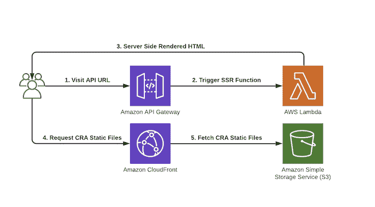

# 两全其美:具有同构 JavaScript 的 SSR-log rocket 博客

> 原文：<https://blog.logrocket.com/ssr-with-isomorphic-javascript/>

服务器端渲染，或 SSR，是您在前端开发社区中经常听到的一个短语。

在最基本的层面上，服务器端呈现正是它所描述的:在服务器上呈现应用程序。您导航到一个网站，它向服务器发出请求，呈现一些 HTML，然后您在浏览器中获得完整的呈现结果。相当简单。你可能会问自己，为什么这个社区对此有一个专门的术语。

在大量依赖 JavaScript 和 jQuery 的丰富的动态 web 应用程序出现之前，基本上所有的 web 应用程序都是服务器呈现的。PHP，WordPress，甚至只是基本的 HTML 站点都是这样的例子。

当你访问这些网站上的一个页面时，你会得到所有的 HTML 数据和所有的东西。如果您单击一个链接，浏览器将向服务器发出另一个请求。根据响应，浏览器将从头开始刷新并呈现下一个页面。这种方法效果很好，而且多年来一直如此；浏览器呈现静态 HTML 的速度惊人地快。有什么变化？

自从世纪之交以来，JavaScript 的使用已经从网页交互性的零星应用发展成为 web 上无可争议的首选语言。我们不断地向浏览器提供更多的逻辑和 JavaScript。

像 React 和 Vue 这样的单页面框架已经开创了这个动态、复杂、数据驱动的客户端呈现的 web 应用的新时代。这些 spa 与服务器呈现的应用程序不同，因为它们在屏幕上呈现之前，不会从服务器获取完整的呈现内容和数据。

客户端呈现的应用程序使用 JavaScript 在浏览器中呈现其内容。他们不是从服务器获取所有内容，而是简单地获取一个没有正文内容的准系统 HTML 页面，并使用 JavaScript 呈现页面中的所有内容。

这样做的好处是，您可以避免完全由服务器呈现的应用程序所发生的页面刷新，这对于用户来说可能有点不舒服。单页面客户端呈现的应用程序将更新屏幕上的内容，从 API 获取数据，并在您面前更新，而无需任何页面刷新。这一特性使得现代 web 应用程序在您与它们交互时感觉更快更“自然”。

## 客户端渲染权衡

在客户端渲染的 SPA 世界里，不全是阳光和彩虹。在客户端呈现您的应用程序需要一些权衡。两个主要的例子是 SEO 和初始负载性能。

### 搜索引擎优化

由于客户端呈现的应用程序返回一个基本的 HTML 页面，在 JavaScript 开始运行并呈现其余内容之前，内容非常少，搜索引擎爬虫很难理解您页面的 HTML 结构，这对您网站的搜索排名是有害的。谷歌已经围绕这一点做了很多工作，但是如果搜索引擎优化特别重要的话，还是建议避免客户端渲染。

### 初始负载性能

对于客户端呈现的应用程序，当您第一次打开页面时，通常会看到以下情况:

*   该应用程序加载一些基本的 HTML，如应用程序外壳或静态导航栏
*   你会看到某种装载指示器
*   然后，您的内容被呈现

这样做的问题是，在 JavaScript 从网络上完全加载并完成在屏幕上呈现元素之前，您的应用程序不会显示任何内容。

简而言之，客户端性能的问题通常在于，您无法控制用户在什么客户端设备上使用您的应用程序——无论是他们最先进的智能手机、功能强大的高端台式机，还是 100 美元的低端智能手机。

然而，我们确实控制着服务器。我们几乎总是可以给我们的服务器更多的 CPU 和内存，并对其进行调整，使其为我们的用户提供更好的性能。

## 两全其美

当使用现代前端技术的服务器端渲染时，我们可以两全其美。这通常的工作方式是，服务器在第一次加载时呈现并发送回完全呈现的应用程序。下一步称为水合，是下载和执行 JavaScript 包的地方。这将附加事件处理程序，并像客户端路由器一样进行连接。

使用这种方法，您可以在初始加载时获得 SSR 的所有好处，然后从那时起的每个交互都将由客户端 JavaScript 处理。这提供了一个快速的、SEO 友好的初始加载，然后是我们熟悉和喜爱的动态单页 web 应用程序体验。

像这样的应用程序被称为通用应用程序，因为相同的 JavaScript 运行在客户端和服务器端。你可能还会听到更有趣的术语“同构”，意思完全一样。

## 教程:实现 SSR

SSR 也不是没有利弊。它引入了更复杂的配置，并且必须托管和管理自己的服务器，从而增加了开发的开销。这些问题就是像 Next.js 和 Razzle 这样不可思议的框架非常受欢迎的原因:它们抽象掉了 SSR 配置部分，让你专注于编写 UI 代码。

在本教程中，我们不打算使用任何 SSR 框架。了解事物工作原理的最佳方式是实际构建它，因此我们将学习如何创建尽可能简单的 SSR 设置，它将提供:

*   全球 CDN
*   全功能后端 API
*   无需管理服务器或基础架构
*   单一命令部署

我们将在 Amazon Web Services (AWS)上部署一个使用 create-react-app 创建的通用服务器渲染的 React 应用程序。你不需要有 AWS 的经验。

### 我们的工具

为了构建我们的应用程序，我们将利用一些不同的 AWS 服务。

*   AWS Amplify:管理 AWS 服务的高级框架，主要用于移动和 web 开发
*   **AWS Lambda** :在云中运行代码，无需管理服务器
*   **AWS Cloudfront (CDN)** :一个内容交付网络，负责在全球范围内交付和缓存内容
*   AWS 简单存储服务(S3) :我们将在这里存储静态资产(JS、CSS 等)。)

#### 架构图

我们的 Lambda 函数负责 React 应用程序的服务器呈现。我们将使用 S3 来存储我们的静态内容，使用 Cloudfront CDN 来提供服务。您不需要事先了解这些服务，因为 AWS Amplify 将使我们创建它们变得非常简单。



### 构建我们的应用程序

首先，您需要安装 AWS Amplify CLI 并创建一个 AWS 帐户(如果您还没有的话)。你可以按照这个[简短指南](https://docs.amplify.aws/start)来做。

#### 项目设置

现在放大器已经配置好了，我们可以开始设置 React 项目了。我们将使用神奇的 [create-react-app](https://github.com/facebook/create-react-app) 来帮助我们。假设您已经安装了 Node.js 和 npm，我们可以运行:

```
npx create-react-app amplify-ssr
cd amplify-ssr 
yarn add aws-amplify 
amplify init

```

在 AWS Amplify 向导中选择默认选项。

我们的 React 项目现在用 Amplify 引导，并准备好为 SSR 添加我们的“服务器”。我们通过运行`amplify add api`并回答一些问题来做到这一点:

```
$ amplify add api

? Please select from one of the below mentioned services: REST
? Provide a friendly name for your resource to be used as a label for this category in the project: amplifyssr
? Provide a path (e.g., /items): /ssr
? Choose a Lambda source: Create a new Lambda function
? Provide a friendly name for your resource to be used as a label for this category in the project: amplifyssr
? Provide the AWS Lambda function name: ssr
? Choose the function runtime that you want to use: NodeJS
? Choose the function template that you want to use: Serverless expressJS function
? Do you want to access other resources created in this project from your Lambda function? N
? Do you want to edit the local lambda function now? N
? Restrict API access: N
? Do you want to add another path? N

```

这将创建我们的 AWS 基础设施和后端所需的相关模板、目录和代码:一个 AWS Lambda 函数，它将运行一个小型 Express 服务器，负责呈现我们的 React 应用程序。

在部署基础设施之前，我们需要在 React 应用程序内部进行一些更改，以便为服务器端呈现做准备。打开【React 应用程序的主要应用程序组件)并粘贴以下内容:

```
import React from 'react';

function App() {
  return (
    <div className="App">
      <header className="App-header">
        Server Rendered React App
      </header>
    </div>
  );
}

export default App;

```

接下来，我们需要创建一个脚本来在服务器端呈现我们的 React 应用程序。这是通过`react-dom/server`包中的`renderToString`函数完成的。这个函数负责获取我们的`<App />`组件，并在服务器端将其呈现为一个字符串，准备好作为完全呈现的 HTML 返回给客户端。

使用以下代码在`src/render.js`处创建一个文件:

```
import React from "react";
import { renderToString } from "react-dom/server";
import App from "./App";

export default () => renderToString(<App />);

```

太好了——我们的客户端 React 应用程序拥有所有需要在服务器端呈现的代码。这意味着我们现在必须编写将呈现 React 应用程序的服务器端端点。

但是，我们有一个问题——我们需要在服务器端运行`src/render`函数和`<App />`组件代码。默认情况下，服务器对 React 甚至 es 模块一无所知。出于这个原因，我们将使用[巴别塔](https://babeljs.io)从 React 应用程序中传输代码到服务器端。

为此，让我们在项目中安装一些 Babel 依赖项。

```
yarn add --dev @babel/core @babel/cli @babel/preset-react @babel/preset-env

```

接下来，在项目的根目录下创建一个`.babelrc`。这个文件用于配置 Babel，并告诉它使用哪些插件/预置。

```
{
    "presets":[
        "@babel/preset-react",
        "@babel/preset-env"
    ]
}

```

最后，作为构建步骤的一部分，让我们更新我们的`package.json`来传输我们的代码。这将把文件传输到`amplify/backend/function/amplifyssr/src/client`目录中，在那里我们将存储所有需要在客户端和服务器上运行的通用 JavaScript。

```
  "scripts": {
    "start": "react-scripts start",
    "transpile": "babel src --out-dir amplify/backend/function/amplifyssr/src/client --copy-files",
    "build": "npm run transpile && react-scripts build && npm run copy",
    "copy": "cp build/index.html amplify/backend/function/amplifyssr/src/client",
    "test": "react-scripts test",
    "eject": "react-scripts eject"
  },

```

#### 用 Lambda 渲染应用程序

构建配置完成了！让我们跳到`amplify/backend/function/amplifyssr/src`并安装`react`和`react-dom`，因为 Lambda 执行 SSR 都需要它们。

```
yarn add react react-dom

```

现在来配置我们的 Express 服务器，它将在 Lambda 上运行。当我们完成前面的`amplify add api`步骤并选择了`REST`和`ExpressJS` API 时，Lambda 函数是自动生成的。

Amplify 已经为我们配置了在 Lambda 上运行的 Express 服务器，所以我们现在需要做的就是添加一个端点，以便当有人点击浏览器中的 API URL 时，服务器呈现我们的 React 应用程序。更新您的`amplify/backend/function/amplifyssr/src/app.js`文件以包含以下代码:

```
/* Amplify Params - DO NOT EDIT
    ENV
    REGION
Amplify Params - DO NOT EDIT */

const express = require('express')
const bodyParser = require('body-parser')
const awsServerlessExpressMiddleware = require('aws-serverless-express/middleware')
const fs = require('fs');
const render = require('./client/render').default;

// declare a new express app
const app = express()
app.use(bodyParser.json())
app.use(awsServerlessExpressMiddleware.eventContext())

// Enable CORS for all methods
app.use(function(req, res, next) {
  res.header("Access-Control-Allow-Origin", "*")
  res.header("Access-Control-Allow-Headers", "Origin, X-Requested-With, Content-Type, Accept")
  next()
});

app.get('*', function(req, res) {
  // Read the index.html file from the create-react-app build
  const html = fs.readFileSync("./client/index.html", "utf-8");
  // Server side render the react application
  const markup = render();

  // Replace the empty body of index.html with the fully server rendered react application and send it back to the client
  res.send(html.replace(`<div id="root"></div>`, `<div id="root">${markup}</div>`))
});

module.exports = app

```

我们的 Express 服务器现在已经为 SSR 做好了准备，我们可以部署 React 应用程序了。

### 主持和最后润色

一旦我们从应用程序的初始渲染接收到服务器渲染的 HTML，我们将从那里获取客户端 JavaScript 包来接管，并给我们一个完全交互式的 SPA。

我们需要一个地方来存放我们的客户端 JavaScript 和静态文件。在 AWS 中，通常用于此的服务是 S3(简单存储服务)，这是一个大规模可扩展的云对象存储。

我们还将在它前面放置一个 CDN，以实现全局缓存和性能。使用 Amplify，我们可以通过从项目根目录运行几个命令来为项目创建这两个资源:

```
$ amplify add hosting

Select the plugin module to execute Amazon CloudFront and S3
? Select the environment setup: PROD (S3 with CloudFront using HTTPS)
? hosting bucket name (name your bucket or use the default)

```

您现在可以通过运行`amplify publish`命令来部署您的整个基础设施，包括您的 Express server Lambda 功能、S3 桶和 CDN。

您的控制台输出将显示 Amplify 为您创建的模板中的所有相关资源。请注意，创建一个 Cloudfront CDN 需要一段时间，请耐心等待。一旦创建了您的资源，您的 Cloudfront CDN URL 将显示在终端中。

```
Publish started for S3AndCloudFront
✔ Uploaded files successfully.
Your app is published successfully.
https://d3gdcgc9a6lz30.cloudfront.net

```

我们需要做的最后一件事是告诉 React 在服务器呈现应用程序后从哪里获取我们的客户端包。这是在 create-react-app 中使用`PUBLIC_URL`环境变量完成的。让我们再次更新 React 应用程序`package.json`脚本，如下所示:

```
  "scripts": {
    "start": "react-scripts start",
    "transpile": "babel src --out-dir amplify/backend/function/amplifyssr/src/client --copy-files",
    "build": "npm run transpile && PUBLIC_URL=<your-cloudfront-url> react-scripts build && npm run copy",
    "copy": "cp build/index.html amplify/backend/function/amplifyssr/src/client",
    "test": "react-scripts test",
    "eject": "react-scripts eject"
  },

```

使用更新后的配置重新构建应用程序并将其部署到 AWS。

```
amplify publish

```

我们现在应该有一个完全服务器端渲染的 React 应用程序在 AWS 上运行了！

#### 运行我们的应用

您的 SSR API URL 可以在`amplify/backend/amplify-meta.json`找到。在 JSON 文件中查找`RootUrl`,您应该看到可以访问新的服务器呈现应用程序的 URL。它应该如下所示:

```
"output": {
    "ApiName": "amplifyssr",
    "RootUrl": "https://g6nfj3bvsg.execute-api.eu-west-1.amazonaws.com/dev",
    "ApiId": "g6nfj3bvsg"
}, 

```

在`<your-api-url>/ssr`访问浏览器中的 API 网关 URL，您应该会看到全新的服务器渲染 React 应用程序！如果您在您选择的浏览器中进入**网络**标签并查看请求，您会注意到对`/ssr`的请求有一个完全呈现的 HTML 响应，我们的 React 应用程序呈现在文档的`<body>`中。

```
<div id="root">
  <div class="App" data-reactroot="">
      <header class="App-header">Server Rendered React App</header>
  </div>
</div>

```

您还会注意到从浏览器向 Cloudfront URL 发出的请求，这些请求用于加载客户端 JavaScript，该 JavaScript 将从这里接管渲染，为我们提供了客户端和服务器端的最佳渲染环境。

## 从这里去哪里

本教程旨在让您尽快开始使用服务器端渲染，而不必担心管理基础设施、cdn 等。使用无服务器方法后，我们可以对我们的设置做一些很好的改进。

### 供应的并发

AWS Lambda 能够保持极低成本的一个方法是，一段时间没有使用的 Lambda 函数将会“闲置”。这实质上意味着当我们再次执行它们时，将会有所谓的“冷启动”——在 Lambda 响应之前必须发生的初始化延迟。

此后，lambda 将再次“预热”一段时间，并快速响应后续请求，直到下一个长空闲期。这可能会导致稍微不可靠的响应时间。

尽管是“无服务器的”，Lambda 使用轻量级容器来处理任何请求。每个容器在任何给定时间只能处理一个请求。除了空闲期后的冷启动问题，当许多并发请求命中同一个 Lambda 函数，导致更多并发容器或工作者在响应前被冷启动时，情况也是如此。

过去，许多工程师通过编写脚本来周期性地 ping Lambda 以保持其热度，从而解决了这个问题。现在有一个更好的 AWS 原生方法来解决这个问题，它被称为[供应并发](https://aws.amazon.com/about-aws/whats-new/2019/12/aws-lambda-announces-provisioned-concurrency/)。

通过提供并发性，您可以非常容易地请求给定数量的专用容器为特定的 Lambda 函数保温。这将使您在高负载和零星负载时获得更加一致的 SSR 响应时间。

### Lambda 版本

您可以为您的函数创建几个 [Lambda 版本](https://docs.aws.amazon.com/lambda/latest/dg/configuration-versions.html)，并在它们之间划分流量。这在我们的 SSR 应用程序中是非常强大的，因为它允许我们在 Lambda 端进行更新，并使用一小部分用户对它们进行 A/B 测试。

您可以发布 Lambda 的多个版本，并在它们之间按您指定的权重分配流量。例如，您可能希望在服务器上呈现一个 CTA 横幅以供某些用户测量参与度，但不要呈现给其他用户。你可以用 Lambda 版本做到这一点。

### 全栈 web 应用

如前所述，AWS Amplify 已经为我们创建了一个 REST API 和一个 Express 服务器，我们在其中创建了一个端点来服务器呈现我们的 React 应用程序。我们总是可以在`amplify/backend/function/amplifyssr/src/app.js`向这个 Express 服务器添加更多代码和端点，使我们能够将我们的应用程序变成一个全栈 web 应用程序，包括数据库、身份验证等等。

您可以利用 AWS Amplify 工具的奇妙套件来创建这些资源或插入到您自己的基础架构中——即使它不是托管在 AWS 上。您可以将 AWS Lambda 后端视为任何其他 Express 服务器，并在其上构建。

您已经通过运行`amplify publish`设置好了整个部署管道，因此您可以专注于编写代码。本教程的起点为您提供了完全的灵活性，让您可以从这里开始做自己想做的事情。

## 结论

服务器端渲染不一定很难。我们可以使用完全托管的工具，如 Next 或 Razzle，它们本身就很棒，但对于许多团队来说，考虑到他们现有的代码或需求，这可能是一个太大的范式转变。使用简单、低维护、定制的方法可以让生活更轻松，尤其是如果您已经在项目中使用 AWS 或 Amplify。

SSR 可以为您的 web 应用程序增加大量价值，并提供急需的性能或 SEO 提升。在 web 开发社区中，我们很幸运拥有一些工具，只需几个命令或点击，就可以创建 cdn、无服务器后端和完全托管的 web 应用程序。

即使您认为不需要 SSR，这也是 JavaScript 生态系统中非常普遍和常见的话题。了解它的好处和缺点对几乎所有参与 web 开发领域的人来说都会很方便。

我希望你今天学到了一些东西——感谢阅读！欢迎联系我或在 Twitter 上关注我，我会在 Twitter 上发布关于 JavaScript、Python、AWS、自动化和无代码开发的消息和博客。

## [LogRocket](https://lp.logrocket.com/blg/react-signup-general) :全面了解您的生产 React 应用

调试 React 应用程序可能很困难，尤其是当用户遇到难以重现的问题时。如果您对监视和跟踪 Redux 状态、自动显示 JavaScript 错误以及跟踪缓慢的网络请求和组件加载时间感兴趣，

[try LogRocket](https://lp.logrocket.com/blg/react-signup-general)

.

[ ](https://lp.logrocket.com/blg/react-signup-general) [](https://lp.logrocket.com/blg/react-signup-general) 

LogRocket 结合了会话回放、产品分析和错误跟踪，使软件团队能够创建理想的 web 和移动产品体验。这对你来说意味着什么？

LogRocket 不是猜测错误发生的原因，也不是要求用户提供截图和日志转储，而是让您回放问题，就像它们发生在您自己的浏览器中一样，以快速了解哪里出错了。

不再有嘈杂的警报。智能错误跟踪允许您对问题进行分类，然后从中学习。获得有影响的用户问题的通知，而不是误报。警报越少，有用的信号越多。

LogRocket Redux 中间件包为您的用户会话增加了一层额外的可见性。LogRocket 记录 Redux 存储中的所有操作和状态。

现代化您调试 React 应用的方式— [开始免费监控](https://lp.logrocket.com/blg/react-signup-general)。