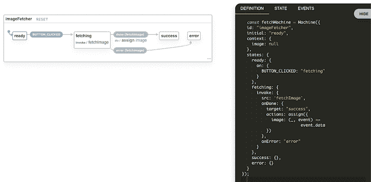

# XState 的状态驱动界面

> 原文：<https://blog.logrocket.com/state-driven-interfaces-with-xstate/>

## 用户界面的当前状态

在日常生活中，我们每天都会使用许多不同的用户界面。我醒来后在 iPhone 的时钟界面上按了贪睡键。五分钟后，我再次醒来，在谷歌日历中查看我的日程安排，然后在推特上查看我的早间新闻——这一切都发生在早上 7 点之前

在我用过的所有 ui 中，大部分都有一个共同点:都有 bug。界面越复杂，bug 越多。在大多数情况下，这些错误会导致一些小的不便，我们可以解决。然而，由于这些界面每天都在使用，经常是每天多次使用，这些小的不便可能会发展成大的挫折。

随着时间的推移，这些接口被迭代，bug 被移除，留给我们的是更愉快的体验。但是随着时间的推移，新的用户需求出现了，界面发生了变化，我们又回到了起点，出现了新的错误。自从有电脑以来，我们就一直在制作界面。我们怎么还处在一个仍然有这么多 bug 的情况下？

## 不适合的开发方法

简单的答案是，因为我们在为人类建造。不管我们的设计有多好，我们都不能肯定地预测用户将如何与我们的界面交互。

在大多数界面中，用户可以选择许多不同的路径。软件越强大，UI 越复杂，路径就越多。

其中一些路径我们可以预测和建造；有些我们不能。我们称之为边缘案例。边缘情况会导致接口进入我们没有预料到的状态，这可能会导致意想不到的行为。

我相信边缘案例是 UI bugs 的主要来源。我还认为这些边缘案例的来源是一种不适合构建 ui 的开发方法:事件驱动开发。

## 示例 UI 组件

为了解释，让我们看看如何使用事件驱动开发来开发一个简单的 UI 组件。

我们的组件将有一个按钮。单击时，会发出图像请求。如果请求成功，则显示图像。如果请求失败，将显示一条错误消息。你可以在下面的沙箱中测试这个组件。

事件驱动方法

## 根据我的经验，这将是开发该组件的一种常见方法。

我们使用 React 和`useState`钩子来管理我们的状态，创建多个布尔标志——一个标志用于`isFetching`、`isSuccess`和`isError`。我认为这种方法有两个明显的缺点:

```
import React, { useState } from "react";
import { fetchImage } from "./fetchImage";

const ImageFetcher = () => {
  const [isFetching, setFetching] = useState(false);
  const [isError, setError] = useState(false);
  const [isSuccess, setSuccess] = useState(false);
  const [image, setImage] = useState(null);

  const clickHandler = e => {
    setFetching(true);
    fetchImage()
      .then(response => {
        setSuccess(true);
        setImage(response);
      })
      .catch(() => {
        setError(true);
      })
      .finally(() => {
        setFetching(false);
      });
  };

  return (
    <section>
      {isFetching && <p>loading...</p>}
      {isSuccess && }
      {isError && <p>An error occured</p>}
      <button onClick={clickHandler}>Get Image</button>
    </section>
  );
};
```

1.代码没有准确地表示我们组件的预期行为

#### 组件不应该同时处于获取状态和错误状态。但是有了这个装置，这是可能的。我们的组件只有四种预期状态:默认状态、获取、成功和错误。

然而，有了这个，我们就有了八种不同的组合。我们的组件现在相对简单。但是如果我们得到了新的需求，并且它变得越来越复杂，我们在不稳定的基础上构建，就是搬起石头砸自己的脚。

2.关注点没有分离

#### 我认为当你有一个清晰的关注点分离时，代码更具可读性、稳定性和可操作性。在这个例子中，状态逻辑嵌入在 UI 实现中。负责决定应该呈现什么的代码与决定应该如何呈现的代码纠缠在一起。

如果我们需要迁移到不同的 UI 库或框架，比如 Vue.js 或 Angular，这也会带来更多的工作。无论您迁移到哪一个，您都希望保持相同的状态逻辑。但是因为它是纠缠在一起的，你需要重写它。

考虑一个场景，我们在测试这个组件时发现了一个新的需求:我们需要考虑多次按下按钮的用户。这些用户发出多个请求，给服务器带来不必要的负载。为了防止这种情况发生，我们在 click 处理程序中添加了一个检查，这将防止发送多个请求。

这说明了事件驱动的开发。我们以事件为中心发展。我们首先处理事件(通过点击处理程序)，然后检查状态以确定结果。

```
import React, { useState } from "react";
import { fetchImage } from "./fetchImage";

const ImageFetcher = () => {
  const [isFetching, setFetching] = useState(false);
  const [isError, setError] = useState(false);
  const [isSuccess, setSuccess] = useState(false);
  const [image, setImage] = useState(null);

  const clickHandler = e => {
    if (isFetching) {
      return;
    }
    setFetching(true);
    fetchImage()
      .then(response => {
        setSuccess(true);
        setImage(response);
      })
      .catch(() => {
        setError(true);
      })
      .finally(() => {
        setFetching(false);
      });
  };

  return (
    <section>
      {isFetching && <p>loading...</p>}
      {isSuccess && }
      {isError && <p>An error occured</p>}
      <button onClick={clickHandler}>Get Image</button>
    </section>
  );
};
```

当我们发现新的需求或边缘情况时，我们开始向事件处理程序和更多状态添加逻辑。这反过来创造了更多的边缘案例。最终，我们以状态爆炸结束，这是一个难以阅读和难以增强的组件。

国家驱动的发展:一个更好的方法

## UI 开发的另一种方法是状态驱动开发。这种方法将状态放在第一位，事件放在第二位。对我来说，最核心的区别是我们从防守转为进攻。

用户不能触发任何事件，让我们手忙脚乱地捕捉所有事件并编写逻辑来处理它们，我们给用户一个包含一组事件的状态。当我们处于这种状态时，用户可以触发该组中的任何事件，但仅此而已。我相信这使得 UI 代码更简单、可伸缩、更健壮。

XState 是一个状态管理库，通过有限状态机实现状态驱动开发。如果我们使用 React with XState 重新制作组件，它可能看起来像这样:

上面我们通过调用 XState 的`Machine`函数并传入一个配置来定义我们的机器。配置只是一个 JavaScript 对象。它有一个`states`属性，定义了我们的机器可以处于什么状态。

```
import { Machine, assign } from "xstate";
import { fetchImage } from "./fetchImage";

export const machine = Machine({
  id: "imageFetcher",
  initial: "ready",
  context: {
    image: null
  },
  states: {
    ready: {
      on: {
        BUTTON_CLICKED: "fetching"
      }
    },
    fetching: {
      invoke: {
        src: fetchImage,
        onDone: {
          target: "success",
          actions: assign({
            image: (_, event) => event.data
          })
        },
        onError: "error"
      }
    },
    success: {},
    error: {}
  }
});
```

这里我们定义了四种状态:`ready`、`fetching`、`success`和`error`。我们的机器一次只能处于其中一种状态。在每个状态中，我们定义当机器处于该状态时会发生什么事件。如果机器处于`ready`状态并且`BUTTON_CLICKED`事件发生，我们将转换到`fetching`状态。

在`fetching`状态中，我们有一个`invoke`。当我们进入这种状态时，一个承诺将被调用。如果承诺解决，机器将转换到`success`状态，图像将存储在机器的`context`(存储定量数据的地方)。如果承诺被拒绝，机器将转换到`error`状态。

上面是我们的反应组件。我们调用 XState 的`useMachine`钩子并传入我们的机器。这将返回两个值:

```
import React from "react";

const ImageFetcher = () => {
  const [current, send] = useMachine(machine);
  const { image } = current.context;

  return (
    <section>
      {current.matches("ready") && (
        <button onClick={() => send("BUTTON_CLICKED")}>
          Get Image
        </button>
      )}
      {current.matches("fetching") && <p>loading...</p>}
      {current.matches("success") && }
      {current.matches("error") && <p>An error occured</p>}
    </section>
  );
};
```

`current`，一个我们可以用来查询机器状态的变量

1.  `send`，可以向机器发送事件的功能
2.  国家驱动发展的优势

## 这种方法有五个优点:

1.我们已经命名了国家

#### 这使得事情明显更容易理解。

2.对组件的行为更有信心

#### 在前面的例子中，我们处理了事件，然后检查了状态，看看结果会是什么。在状态驱动的开发中，我们交换它:当一个事件被触发时，我们做的第一件事是检查我们处于什么状态。

现在，在这个状态中，我们检查事件做了什么。事件的作用域是状态:如果一个事件被触发，并且它没有用当前状态定义，那么它不会做任何事情。这给你更多的信心和对用户能做什么的更大的控制。

3.关注点分离

#### 我们所有的状态逻辑都独立于 UI 实现。状态逻辑和呈现实现的分离使得我们的代码可读性更好，也更容易移植。例如，如果我们想从 React 更改为 Vue，我们可以复制并粘贴我们的机器。

4.更简单、更准确的测试

#### 我们可以使用我们的机器来生成测试。这减少了我们需要编写的普通测试的数量，并捕捉到更多的边缘情况。你可以[在这里](https://css-tricks.com/model-based-testing-in-react-with-state-machines/)了解更多信息。

5.形象化

#### 说到可读性，我们可以把这个机器配置放到 [XState 的可视化器](https://xstate.js.org/viz/)中。这会给我们一个状态图，一个我们系统的图表。方块代表状态，箭头代表事件——你甚至不需要成为一名程序员就能理解这一点。也是互动的。



今后

## 使用状态驱动开发，不管有没有 XState，都可以使 UI 代码更简单、可伸缩、更健壮。这为开发人员创造了更好的体验，并且可以将人们每天面对的 UI 挫折变成愉快的体验。

如果你想了解更多关于使用 React with XState 构建 UI 组件的知识，我已经开始了一个[指南，它分解了 XState 的概念](https://bradwoods.io/xstate-guide)以及如何使用 React 的有限状态机。

笔记

## 示例代码:

您是否添加了新的 JS 库来提高性能或构建新特性？如果他们反其道而行之呢？

## 毫无疑问，前端变得越来越复杂。当您向应用程序添加新的 JavaScript 库和其他依赖项时，您将需要更多的可见性，以确保您的用户不会遇到未知的问题。

LogRocket 是一个前端应用程序监控解决方案，可以让您回放 JavaScript 错误，就像它们发生在您自己的浏览器中一样，这样您就可以更有效地对错误做出反应。

[LogRocket](https://lp.logrocket.com/blg/javascript-signup) 可以与任何应用程序完美配合，不管是什么框架，并且有插件可以记录来自 Redux、Vuex 和@ngrx/store 的额外上下文。您可以汇总并报告问题发生时应用程序的状态，而不是猜测问题发生的原因。LogRocket 还可以监控应用的性能，报告客户端 CPU 负载、客户端内存使用等指标。

[](https://lp.logrocket.com/blg/javascript-signup)[https://logrocket.com/signup/](https://lp.logrocket.com/blg/javascript-signup)

自信地构建— [开始免费监控](https://lp.logrocket.com/blg/javascript-signup)。

请注意，我对状态驱动开发的定义不同于您可能熟悉的[事件驱动编程](https://en.wikipedia.org/wiki/Event-driven_programming)的概念。

> Please note my definition of state-driven development is different than the idea of [event-driven programming](https://en.wikipedia.org/wiki/Event-driven_programming) that you might be familiar with.