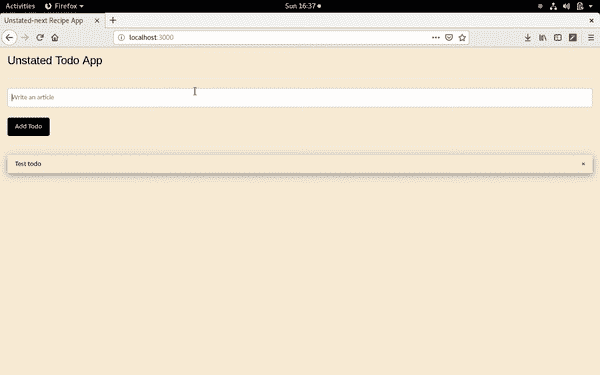

# 使用未声明的 Next - LogRocket 博客进行状态管理

> 原文：<https://blog.logrocket.com/state-management-with-unstated-next/>

状态是 React 应用程序的基础部分，这意味着管理状态非常重要。自从引入了上下文 API 和钩子之后，管理状态变得相对容易了，因为上下文 API 帮助我们减轻了使用 Redux 的压力。

因此，已经发布了多个状态管理库，以进一步促进使用上下文 API 进行状态管理，在本文中，我将研究下一个中没有提到的[。](https://github.com/jamiebuilds/unstated-next)

## 接下来还有什么没说的？

未说明的 Next 是一个基于 React 的上下文 API 构建的库，它允许在我们的应用程序中全局共享状态。未声明的 Next 有简单的 API 方法，可以作为钩子或者组件方法使用。在接下来的部分中，我将讨论 API 方法，然后构建一个简单的演示来演示未声明的 Next 是如何工作的。

未说明的 Next 可以从 Yarn 或 npm 安装:

```
yarn add unstated-next 

// or

npm install unstated-next
```

## 《未陈述的下一个》解决了哪些问题？

因为未声明的 Next 是建立在上下文 API 之上的，所以它解决了上下文 API 所解决的相同问题。未说明的 Next 允许我们:

*   从子组件访问父状态
*   避免支柱钻孔

如果您不熟悉上下文 API，建议在继续之前[阅读这篇文章](https://blog.logrocket.com/whats-new-in-ember-octane/)。

## 未声明的下一个 API 方法

未说明的 Next 包含三个 API 方法，我将简要讨论每个方法:

### `createContainer(ourHook)`

`createContainer`方法用于初始化上下文，并将状态将被全局共享的钩子作为参数。该上下文通常分配给一个变量，如下所示:

```
import { createContainer } from 'unstated-next'

function ourHook() {}

let ourContext = createContainer(ourHook)
// ourContext == {Provider, useContainer}
```

该变量反过来返回一个提供者和`useContainer`方法。`useContainer`方法也可以称为消费者。

### 提供商方法

追加到上下文的 provider 方法接受一个可选的初始值，在应用程序第一次呈现时呈现，并接受一个要呈现的子组件。下面是它的用法示例:

```
import { createContainer } from 'unstated-next'

...

function Component() {}

<OurContainer>
  <Component />
</Ourcontainer>

<OurContainer initialState={"initial value"} />
  <Component />
</Ourcontainer>
```

### `useContainer(ctx)`

`useContainer(ctx)`钩子接受上下文变量作为参数，并存储在一个用于访问全局状态的变量中。`useContainer(ctx)`钩子用在要访问状态的组件中——在本例中是子组件。这将在下一节中演示。

```
import { useContainer } from "unstated-next"

function ChildComponent() {
  let activity = useContainer(OurContainer)
  return <input value={activity.value} onChange={activity.onChange} />
}
```

以上是未说明的 Next 库中可用的 API 方法，它们纯粹是建立在 React API 上的。在下一节中，我将构建一个简单的待办事项应用程序来演示这些方法是如何工作的。

## 设置

在我们深入研究之前，让我们规划出项目结构和待办事项应用程序所需的依赖项的安装。我们将从创建项目文件夹开始。

```
mkdir unstated-todo-app && cd unstated-todo-app
mkdir public src src/components
cd public && touch index.html style.css
cd ../src && touch index.js
cd components && touch Todos.js
```

接下来，我们将初始化目录并安装所需的依赖项。

```
npm init -y
npm i react react-dom react-scripts unstated-next
```

现在是时候在`index.js`文件中编写`App`渲染组件了。

### `index.js`

这个文件包含了负责呈现我们的`Todo``s`组件的组件。首先，我将导入所需的依赖项:

```
import React from "react";
import { render } from "react-dom";
import TodoList from "./Components/Todos";
```

不要担心，`TodoList`组件将在此之后构建。接下来，我们告诉 React 使用标识符`"root"`在 div 节点上呈现我们的应用程序:

```
function App() {
  return (
    <>
      <h3> Unstated Todo App </h3>
      <hr />
      <TodoList />
    </>
  )
}

render(<App />, document.getElementById("root"))
```

接下来，我们将开始编写`Todo``s`组件。

### `Todos.js`

`Todos`组件包括一个自定义钩子，它将处理我们的待办事项应用程序的状态以及一些状态方法，还有一个让我们添加和呈现待办事项的组件。

我们将从创建我们的定制钩子开始，并用两个状态对象进行初始化:

```
import React, { useState } from "react";

function useTodos(initialstate = [{todo: "Test todo"}]) {
  let [todos, setTodo] = useState(initialstate)
  let [todo, setTodoItem] = useState("")
```

我们的钩子`useTodos()`接受一个初始的待办事项(这是可选的),它在应用程序加载时呈现。它有两个状态对象:`todos`和`todo`。`todos`状态对象是我们应用程序中所有待办事项的数组，而`todo`状态对象是添加到`todos`数组中的待办事项，初始值为空字符串。

从用户输入中设置`todo`，然后通过一个`setTodo()`方法将其添加到`todos`数组中，我们接下来会看到这个方法。

```
  ...
  const handleInput = e => {
    setTodoItem(e.target.value)
  }

  const addTodo = e => {
    e.preventDefault()
    setTodo([...todos, {todo}])
    setTodoItem("")
  }

  const removeTodo = id => {
    const todoList = todos.filter(todo => todo.todo !== id)
    return setTodo(todoList)
  }

  return { todos, todo, addTodo, removeTodo, handleInput }

}
```

1.  `handleInput()`方法用于通过使用`setTodoItem`状态处理程序将`todo`状态设置为用户在表单中输入的值。
2.  `addTodo()`方法通过`setTodo([...todos, todo])`方法将待办事项添加到`todos`数组中。然后它将`todo`状态设置为空字符串。
3.  方法从数组中删除一个待办事项。

然后，我们返回状态和钩子方法的值，这样就可以在我们的组件中访问它。

接下来，我们将从我们的`useTodo()`钩子创建一个容器。首先，我们将从未声明的 Next 导入`createContainer`钩子:

```
// After the react import
import { createContainer } from "unstated-next";
```

然后，我们创建将在组件中使用的容器。它让我们可以直接访问我们的应用程序的状态及其方法，如前一节所述:

```
let Todos = createContainer(useTodos)
```

容器还没有做任何事情，我们还没有为待办事项构建组件。你猜对了——我们接下来将构建它。

```
function Todo({ todo }) {
  let todosContainer = Todos.useContainer()
  return (
    <>     
      <ul className="w3-ul w3-card-4">
        <li key={todo.todo} className="w3-display-container" >
           {todo.todo}
           <span className="w3-button w3-transparent w3-display-right" onClick={() => todosContainer.removeTodo(todo.todo)}>&times;</span>
        </li>
      </ul>
    </>
  )
}
```

上面的组件负责呈现从`todos`数组的迭代中作为道具传递的`todo`。

接下来，我们构建显示待办事项的消费者组件，并添加一个待办事项:

```
function DisplayTodos() {  
  let todosContainer = Todos.useContainer()
  return (
    <React.Fragment>
      <input type="text" className="w3-input w3-border w3-round" placeholder="Write an article" value={todosContainer.todo} onChange={todosContainer.handleInput} />
      <button onClick={todosContainer.addTodo} className="w3-button w3-round w3-black">Add Todo</button>
      <hr />
      {
        todosContainer.todos.map(todo => (
          <Todo todo={todo} />
        ))
      }
    </React.Fragment>
  )
}
```

在第 8–12 行，我们遍历了`todos`数组状态，然后将每个`todo`作为道具传递给`Todo`组件。

在上面的组件中，从变量`todosContainer`中使用容器来允许访问状态及其方法，这可以在每个组件的渲染块中看到。

接下来，我们定义一个在上下文提供者下呈现消费者组件`DisplayTodos()`的组件，因为没有提供者就不能消费任何东西🙂

```
export default function TodoList() {
  return (
    <Todos.Provider>
      <DisplayTodos />
    </Todos.Provider>
  )
}
```

我们将该组件设为默认导出，因为它已被导入并呈现在`App`组件中。

## 运行我们的应用

随着我们应用程序构建过程的完成，我们还没有为`index.html`和`style.css`文件编写代码。在我们继续之前，让我们这样做:

### `index.html`

```
<!DOCTYPE html>
<html lang="en">
<head>
  <meta charset="UTF-8">
  <meta name="viewport" content="width=device-width, initial-scale=1.0">
  <meta http-equiv="X-UA-Compatible" content="ie=edge">
  <link rel="stylesheet" href="https://www.w3schools.com/w3css/4/w3.css">
  <link rel="stylesheet" href="style.css" type="text/css">
  <title>Unstated-next Recipe App</title>
</head>
<body>
  <div id="root" class="w3-container"></div>
</body>
</html>
```

### `style.css`

```
body {
  font-family: 'Gill Sans', 'Gill Sans MT', Calibri, 'Trebuchet MS', sans-serif;
  background-color: antiquewhite;
}
```

之后，让我们配置`package.json`以便运行我们的应用程序。在`scripts`部分下，将代码替换为:

```
"start": "react-scripts start"
```

完成后，让我们启动应用程序并在`[http://localhost:3000](http://localhost:3000)`上观看直播:

```
npm run start
```

这是正在使用的应用程序的演示:



## 结论

这篇文章应该让你对什么是未声明的 Next 有一个基本的了解，它的特性，以及它是如何工作的。主要的收获是，您可以使用未声明的 Next 来代替传统的 React 上下文 API 钩子和 Redux。

未声明的 Next 是一个优秀的 React 库，用于管理状态应用程序。但是，请注意，有些情况下不应该使用上下文 API，因此接下来没有说明。请阅读本文中的[部分。本文使用的代码可以在](https://blog.logrocket.com/pitfalls-of-overusing-react-context/) [GitHub](https://github.com/Youngestdev/unstated-next-todo) 上找到。

## 使用 LogRocket 消除传统反应错误报告的噪音

[LogRocket](https://lp.logrocket.com/blg/react-signup-issue-free)

是一款 React analytics 解决方案，可保护您免受数百个误报错误警报的影响，只针对少数真正重要的项目。LogRocket 告诉您 React 应用程序中实际影响用户的最具影响力的 bug 和 UX 问题。

[ ](https://lp.logrocket.com/blg/react-signup-general) [  ](https://lp.logrocket.com/blg/react-signup-general) [LogRocket](https://lp.logrocket.com/blg/react-signup-issue-free)

自动聚合客户端错误、反应错误边界、还原状态、缓慢的组件加载时间、JS 异常、前端性能指标和用户交互。然后，LogRocket 使用机器学习来通知您影响大多数用户的最具影响力的问题，并提供您修复它所需的上下文。

关注重要的 React bug—[今天就试试 LogRocket】。](https://lp.logrocket.com/blg/react-signup-issue-free)