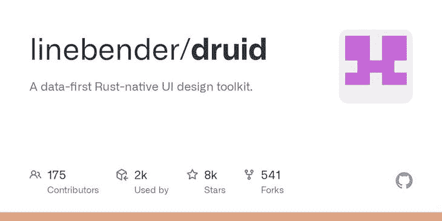
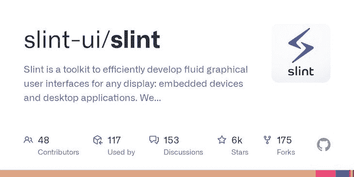
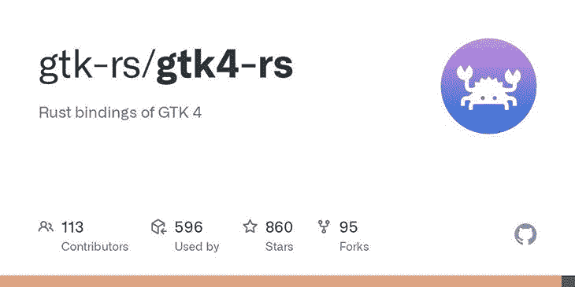
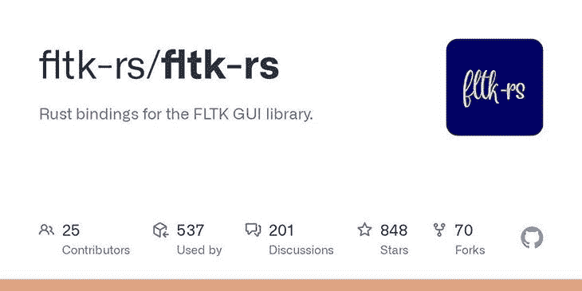
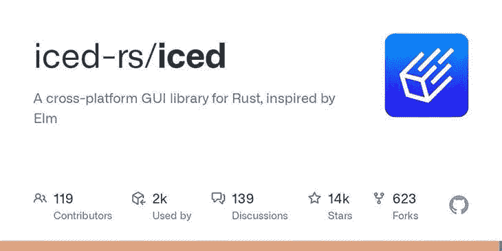
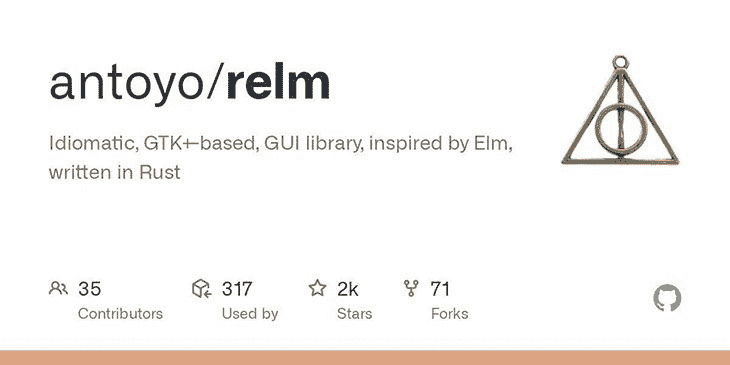
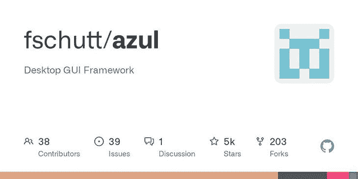
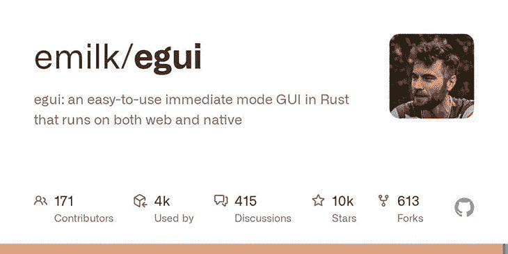

# Rust GUI 库的现状

> 原文：<https://blog.logrocket.com/state-of-rust-gui-libraries/>

图形用户界面(GUI)提供了与计算机交互的直观的视觉前端。GUI 使用图标、窗口和菜单等视觉指示器来提供更好的用户交互和体验，这与使用文本进行输入和输出操作的命令行界面(CLI)不同。

Rust 随着时间的推移越来越受欢迎，可能是因为它的灵活性和充满活力的开源社区。开发人员使用 Rust 进行系统设计、web 开发和构建 GUI 等工作。Rust 中有许多用于开发快速、复杂 GUI 应用程序的软件包和板条箱。

在本文中，我们将回顾一些流行的 Rust GUI 库和框架，包括 Tauri、Druid、Slint、gtk-rs、fltk-rs、ice、relm、Azul 和 egui。我们还将比较这些 GUI 库，讨论它们何时是构建 GUI 应用程序的好选择。我们开始吧！

## 托里

[T](https://github.com/tauri-apps/tauri) [aur](https://github.com/tauri-apps/tauri) [i](https://github.com/tauri-apps/tauri) 是一个开源包，它使开发者能够使用 Rust 编程语言创建轻量级的、基于 web 的桌面应用程序。

[Tauri 利用 JavaScript、WebAssembly 和其他 web 技术](https://blog.logrocket.com/build-pomodoro-timer-tauri-using-react-and-vite/)创造无缝开发体验。Tauri 为创建和定制桌面应用程序提供了一个简单的 API，使开发人员能够轻松构建运行在 Windows、Mac 和 Linux 上的跨平台应用程序:


Tauri 包的一个关键特性是它的跨平台兼容性。使用 Tauri，您可以创建一个只需很少修改就可以在多个平台上运行的单一 GUI，从而实现“一个构建，所有运行”的场景。

由于其基于网络的架构，Tauri 应用程序是轻量级和快速的。Tauri 运行在网络技术上，应用程序可以在低端硬件上流畅运行。

最后，Tauri 使用事件驱动的架构，允许与事件轻松交互。Tauri 提供了对本地 API 和 JavaScript 互操作性的访问，使包能够从 Rust 代码访问 JavaScript 函数。

将 Tauri 添加到您的项目很简单；您只需要将包添加到项目根目录下的`Cargo.toml`文件的`dependencies`部分:

```
[dependencies]
tauri = "0.9.0"

```

一旦您将 Tauri 添加为项目依赖项，您就可以通过将以下代码添加到文件的顶部来将其导入 Rust 文件:

```
use tauri::{Builder, Tauri};

```

Tauri 为创建基于 web 的桌面应用程序提供了许多特性和功能。Tauri 具有简单的 API、跨平台兼容性以及对性能和安全性的关注，对于希望使用 Rust 构建健壮可靠的图形用户界面的开发人员来说，它是一个绝佳的选择。

## 德鲁伊特

D [ruid](https://github.com/linebender/druid) 是一个强大而灵活的 Rust 库，用于构建桌面应用程序的 GUI。Druid 的一个关键特性是布局系统，它允许基于约束的简单而直观的小部件布局，使得创建视觉上一致且响应迅速的用户界面变得容易。

Druid 还提供了广泛的内置小部件，包括按钮、标签和文本输入，您可以使用它们来定制应用程序的外观和感觉，并支持定制小部件:



Druid 是跨平台兼容的，支持 Windows、macOS 和 Linux，允许您编写一次应用程序，无需任何修改就可以在多个平台上运行。Druid 还提供了一个全面的事件处理系统，使得实时响应用户交互和更新用户界面变得容易。

要开始使用 Druid 包，将以下代码添加到您的`cargo.toml`文件中的`dependencies`:

```
[dependencies]
druid = "0.7.0"

```

要将 Druid 导入 Rust 文件，请使用以下代码:

```
use druid::{AppLauncher, WindowDesc};

```

Druid 是一个强大而通用的 GUI 库，非常适合在 Rust 中构建高性能、跨平台的桌面应用程序。凭借其广泛的内置小部件、直观的布局系统和丰富的文档，Druid 可以轻松地为 Rust 应用程序创建具有视觉吸引力和响应能力的用户界面。

## 斯林

构建在众所周知的 [Y](https://yew.rs) [ew](https://yew.rs) 框架之上， [S](https://github.com/slint-ui/slint) [lint](https://github.com/slint-ui/slint) 是 Rust 编程语言的 UI 库。Slint 为在 Rust 中构建 web 应用程序提供了一个全面而简单的解决方案，通过提供广泛的预构建 UI 组件、状态管理和数据绑定来扩展其功能:



Slint 的关键特性之一是它的各种各样的预构建 UI 组件，如按钮、表单、模态等等，这使得开发人员无需花费时间从头开始构建 UI 组件就可以构建 web 应用程序。预构建的组件也是可定制的，因此您可以根据应用程序的特定需求对它们进行调整。

Slint 还支持响应式设计，允许 web 应用适应不同的屏幕尺寸。最后，Slint 包括一组健壮的 API，用于构建定制组件。

要安装 Slint 包，请将以下代码添加到您的`cargo.toml`文件中的`dependencies`部分:

```
[dependencies]
slint = "0.2.0"

```

您可以将 Slint 包导入 Rust 文件，如下所示:

```
use slint::prelude::*;

```

上面的代码让您可以访问 Slint 包的所有功能。总的来说，Slint 是在 Rust 中构建 web 应用程序的强大而通用的解决方案。它的预构建组件、响应式设计和定制组件 API 使它成为任何从事 web 项目的 Rust 开发人员的宝贵工具。

## 德国技术合作公司

GTK 是一个流行的、跨平台的、面向对象的小部件工具包，由 GNOME 项目开发。它用于构建可移植的 GUI 应用程序，这些应用程序可以在多种语言的 Unix、Windows 和 macOS 系统上工作，从 Python 到 JavaScript、C 和 Rust。

GTK 项目有各种版本，如 GTK 3，每个版本都有变化和升级。

[gtk-rs 项目](https://gtk-rs.org/)为基于 GNOME 堆栈的库提供了安全的 Rust 绑定，比如 GTK 3 和 GTK 4 库。 [`gtk3-rs`](https://github.com/gtk-rs/gtk3-rs) 和`[gtk4-rs](https://github.com/gtk-rs/gtk4-rs)`库分别提供 GTK 3 和 GTK 4 的功能:



要开始使用 gtk-rs 库，你需要 Rust 工具链和 gtk 库。创建项目后，将库添加到 GTK 4 机箱的`Cargo.toml`文件中的依赖项中:

```
gtk = { version = "X.X", package = "gtk4" }

```

如果您使用的是 macOS 或 Linux，请使用 brew 软件包管理器安装 GTK 4 库:

```
brew install gtk4

```

查看这些页面，了解各种 [Linux 发行版](https://gtk-rs.org/gtk4-rs/stable/latest/book/installation_linux.html)和 [Windows](https://gtk-rs.org/gtk4-rs/stable/latest/book/installation_windows.html) 上的安装说明。安装 GTK 4 并将其添加到您的依赖项后，您可以按如下方式导入机箱:

```
use gtk::prelude::*;
use gtk::Application;

```

gtk-rs 书籍是学习如何使用库在 Rust 中构建 GUI 的好资源。

在开发者社区中，GTK 图书馆非常受欢迎；许多流行的 Linux GUI 应用程序使用 GTK 库和 GNOME 堆栈。gtk-rs 库只是许多 Rust GUI 库中的一个，在撰写本文时已经被用于 500 多个项目。

## fltk-rs 板条箱

FLTK (Fast Light Toolkit) 是一个轻量级的、跨平台支持的工具包，用于构建 GUI。FLTK 在 Windows、macOS 和 UNIX 系统上受支持，最初是为 C++构建的。如果使用 FLTK 工具包创建 GUI 应用程序，该应用程序在所有支持的操作系统上看起来都是一样的。

fltk-rs 库为 fltk 工具包提供了 Rust 绑定。fltk-rs 板条箱支持旧的架构，有超过 80 个可定制的小部件和超过四个支持的主题方案，包括 GTK 方案。你也可以使用[fltk 主题箱](https://crates.io/crates/fltk-theme)进行更多定制:



fltk-rs 库可以通过一次执行快速安装、构建、启动和运行。开始使用 fltk-rs 板条箱很容易；您所要做的就是将项目作为依赖项添加到您的`Cargo.toml`文件中，并在您的计算机上安装这个库。

如果您在 macOS 或 Linux 计算机上，可以使用以下 brew 命令安装 fltk 库:

```
brew install fltk

```

对于其他操作系统，你可以在文档中找到安装 fltk 库的说明。接下来，将项目作为依赖项添加到您的`Cargo.toml`文件中:

```
[dependencies]
fltk = { version = "^1.3", features = ["fltk-bundled"] }

```

在添加项目并安装 fltk 库之后，您可以将机箱导入到您的项目中，如下所示:

```
use fltk::{app, button::Button, frame::Frame, prelude::*, window::Window};

```

查看 [fltk-rs 文档](https://github.com/fltk-rs/fltk-rs)了解其功能和用途的详细概述。在撰写本文时，fltk 库在 GitHub 上相当受欢迎，有 800 多位明星。fltk 发展很快，已经发布了 200 多个版本，您可以放心地在生产中使用这个库。

根据许多开发人员的说法，使用 fltk-rs 库比使用 C++库更简单。

## 冰冷的

受 Elm 架构的启发，ice 是一个独立于渲染器的、包含电池的、以数据为中心的跨平台 Rust 库，用于构建 GUI 和前端。[ice](https://github.com/iced-rs/iced)提供了一个易于使用的反应式编程模型，对异步操作和定制小部件提供了一流的支持:



用 ice 库构建的 GUI 应用程序可以在 Windows、macOS、Linux 和 web(使用 DOM)上运行，具有响应性布局。通常，ice 将应用程序分为四个概念:

*   状态:应用程序的状态
*   消息:消息和事件
*   视图逻辑:将状态显示为用户交互的小部件
*   更新逻辑:更新状态并与消息交互

你可以很容易地开始使用前端 web 应用程序的 ice 库。这个过程类似于构建 GUI 应用程序，你可以查看[的 ice 文档](https://github.com/iced-rs/iced/tree/master/examples)来了解更多关于这个包的信息。

由于其多功能性，ice 库是最受欢迎的 Rust 库之一。尽管在许多项目中使用，但 ice 有些不稳定，并且正在快速发展。然而，主分支是不断变化的，在生产中使用可能会很昂贵。你可以考虑使用旧版本的。

您可以在[这个资源库](https://github.com/iced-rs/iced/tree/master/examples)中找到灵感、代码示例和库实现的项目。

## 真的吗

relm 最初是用 Rust 编写的，是一个基于 GTK 的异步 GUI 库。它的灵感来自榆树架构，以简化 GTK 图书馆的使用，并提供类似榆树的体验。

像 GTK 库一样，您可以使用 relm 构建跨平台的 GUI:



你需要有使用[GTK 图书馆](https://gtk-rs.org/gtk4-rs/git/book/)的经验才能使用 relm 并充分利用图书馆。

要使用 relm，您需要将 gtk 和 [relm 库](https://github.com/antoyo/relm)添加到您的`Cargo.toml`文件中的项目依赖项中。您还需要安装 gtk 库:

```
[dependencies]
gtk = "0.9.0"
relm = "0.20.0"
relm-derive = "0.20.0"

```

最后，将 gtk 板条箱与 relm 板条箱一起导入:

```
use relm::{connect, Relm, Update, Widget};
use gtk::prelude::*;
use gtk::{Window, Inhibit,a WindowType};
use relm_derive::Msg;

```

Rust 社区欣赏 relm 提供的类似榆树的体验，其他 Rust 库，如 Yew、Seed 和 ice 都提供了这种体验。

在撰写本文时，relm 还处于测试阶段，这意味着它还没有经过适当的测试，并且正在快速变化。也就是说，您可能还不想在生产中使用它。

## Azul 框架

Azul 框架是一个反应式 GUI 库，用于在 Rust、C 和 C++中构建桌面 GUI。由 WebRender 支持，Azul 是一个文档对象模型，类似于 HTML 和 CSS。由于 Azul 利用了 WebRender，它提供了渐变、框阴影、边框样式和 CSS 转换等功能:



[Azul 框架](https://azul.rs/)还提供了许多内置的小部件、每秒超过 60 帧的动画、跨平台的本地对话、SVG 解析、通过共享库的动态链接，以及用于热重载的 HTML to Rust 编译。

要开始使用 Azul 框架，请将其添加到项目的依赖项中，如下所示:

```
[dependencies]
azul = "1.0.0-alpha"

```

然后，将板条箱导入到您的项目中并使用它们:

```
use azul::prelude::*;
use azul::widgets::{button::Button, label::Label};

```

Azul 框架[有很好的文档记录](https://docs.rs/azul/latest/azul/)来帮助你开始构建 GUI。

Azul 框架采用了一种不同的 GUI 开发方法，到目前为止，该框架已经在 200 多个 Rust 项目中使用。Azul 框架是实用的，根据文档，您可以在生产中使用它。

## 鄂桂

egui 是一个即时模式的、易于使用的、可移植的库，用于在 Rust 中构建运行在 web、计算机和开发中的游戏引擎上的 gui。egui 的目标是成为在 Rust 中构建 web 应用程序的最简单的库:



egui 的目标是提供一个安全的、响应迅速的、友好的、可移植的体验来构建没有回调和最小依赖性的 gui。要了解如何使用它来制作跨平台 gui，请查看 egui 的官方文档。

egui 库正在积极开发中，如果你足够勇敢，你可以在生产中使用它。egui 库的特定部分已经准备好了，您可以求助于较旧的版本，因为较新的版本容易发生重大变化。

## 比较 Rust GUI 库

本文中讨论的每个 GUI 库都提供了不同的特性和功能。下面的对照表将帮助你为下一个项目做出选择和考虑:

| 生产就绪 | 和睦相处 | gtk-rs |
| --- | --- | --- |
| 是 | 跨平台 | fltk-rs |
| 是 | 跨平台 | 冰冷的 |
| 不 | 跨平台和网络 | relm |
| 不 | 跨平台 | 阿祖耳 |
| 是 | 跨平台 | 鄂桂 |
| 旧版本 | 跨平台 | 托里 |
| 是 | 桌面和网络 | 斯林特 |
| 是 | 网 | 德鲁伊特 |
| 是 | 桌面和网络 | Rust 生态系统中的许多 GUI 库都是不成熟的项目，有很多好的特性。请务必考虑项目的库状态；使用未经测试的库是有风险的。 |

您还需要根据您正在构建的内容和项目运行的位置来考虑库的兼容性。在生产环境中使用任何库或工具之前，总是建议[对其进行彻底的测试和评估。](https://blog.logrocket.com/end-to-end-testing-for-rust-web-services/)

结论

## Rust 生态系统中还有很多其他 GUI 库；你可以在[We GUI Yet](http://areweguiyet.com/)和 [LibHunt](https://www.libhunt.com/l/rust/topic/gui) 上找到一个全面的列表。在本教程中，我们探索了 Rust 生态系统中几个流行的 GUI 库，包括 Druid、Slint、Tauri、gtk-rs、fltk-rs、ice、relm、Azul 和 egui。希望这篇教程能给你一些启示，让你为下一个项目选择最好的 GUI 库！

[log rocket](https://lp.logrocket.com/blg/rust-signup):Rust 应用的 web 前端的全面可见性

## 调试 Rust 应用程序可能很困难，尤其是当用户遇到难以重现的问题时。如果您对监控和跟踪 Rust 应用程序的性能、自动显示错误、跟踪缓慢的网络请求和加载时间感兴趣，

.

[try LogRocket](https://lp.logrocket.com/blg/rust-signup)

LogRocket 就像是网络和移动应用程序的 DVR，记录你的 Rust 应用程序上发生的一切。您可以汇总并报告问题发生时应用程序的状态，而不是猜测问题发生的原因。LogRocket 还可以监控应用的性能，报告客户端 CPU 负载、客户端内存使用等指标。

[](https://lp.logrocket.com/blg/rust-signup)

现代化调试 Rust 应用的方式— [开始免费监控](https://lp.logrocket.com/blg/rust-signup)。

Modernize how you debug your Rust apps — [start monitoring for free](https://lp.logrocket.com/blg/rust-signup).