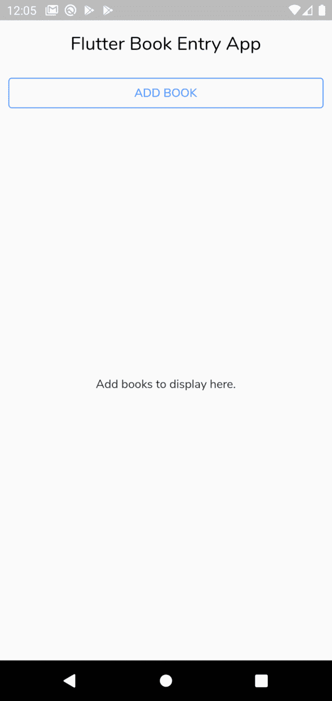
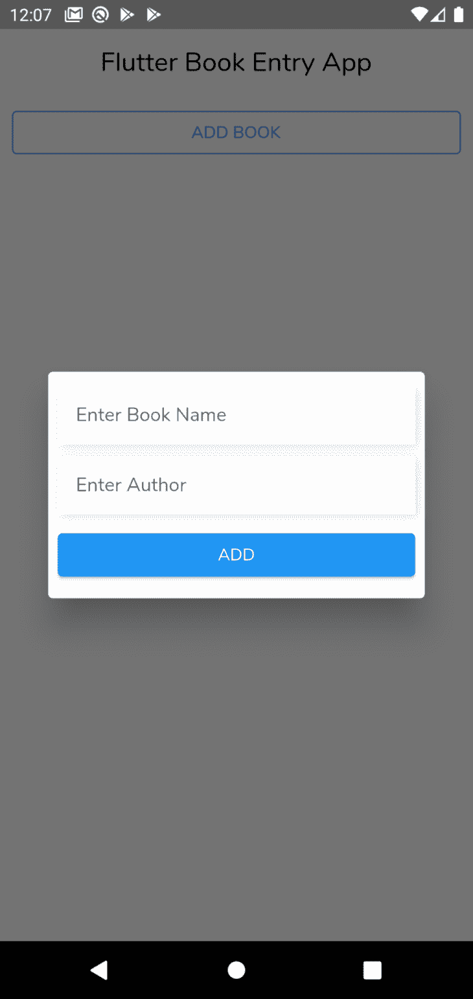
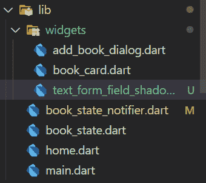
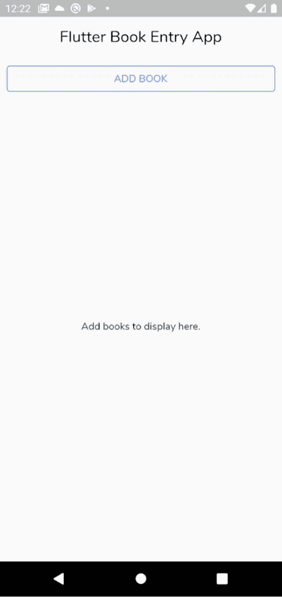
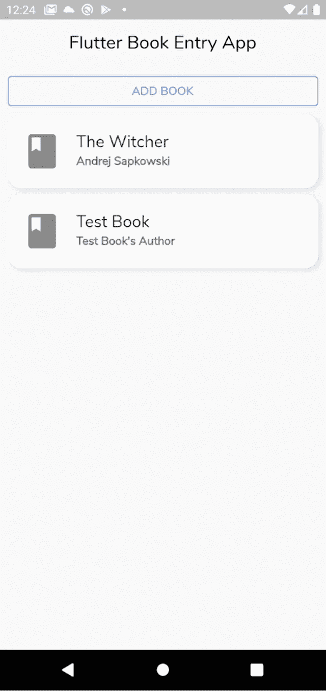

# StateNotifier:改进 Flutter - LogRocket 博客中的状态变化通知程序

> 原文：<https://blog.logrocket.com/statenotifier-improving-state-change-notifiers-flutter/>

如果你已经在使用 Flutter 或者开始你的 Flutter 应用程序开发之旅，你可能听说过 Flutter 社区的一个热门话题:状态管理。

对理想状态管理解决方案的探索已经讨论了近几年，对此没有明确的答案。所有这些解决方案都有各自的优缺点，这取决于哪个工具为您的用例提供了最好的特性。

这篇博客主要关注 StateNotifier，这是管理状态的另一个解决方案。

## 什么是状态？

在继续之前，您应该修改您对 Flutter 中状态的理解。

颤振本质上是声明性的。这意味着 Flutter 通过覆盖您的构建方法来构建 UI，以反映应用程序的当前状态:

```
UI = fn(state)
```

根据 [Flutter 文档](https://docs.flutter.dev/development/data-and-backend/state-mgmt/ephemeral-vs-app)，状态被描述为“为了在任何时刻重建用户界面，你需要的任何数据。”

此外，状态分为两种类型:短暂状态和应用程序状态。

### 短暂状态与应用程序状态

可以包含在单个小部件中的状态称为临时(本地)状态。Flutter 提供了内置的类和方法来处理这种自包含状态，如`[StatefulWidget](https://api.flutter.dev/flutter/widgets/StatefulWidget-class.html)`和`setState`。你可以以短暂状态的颤动计数器应用程序为例。

相反，需要在不同小部件之间共享的状态被称为应用程序(全局)状态。正是在这一点上，状态管理工具发挥了它们的优点和缺点。然而，首先检查一下 Flutter 为这种情况提供的内置工具。

## ValueNotifier 和 ChangeNotifier

[ChangeNotifier](https://api.flutter.dev/flutter/foundation/ChangeNotifier-class.html) 是一个向其监听器提供变更通知的类。这意味着您可以订阅一个由 ChangeNotifier 扩展或混合的类，并在该类发生变化时调用其`notifyListeners()`方法。该调用将通知订阅该类的小部件进行重建。

[ValueNotifier](https://api.flutter.dev/flutter/foundation/ValueNotifier-class.html) 是一个 ChangeNotifier，它只有一个值，当它的 value 属性改变时，它会通知它的监听器。

一般来说，ValueNotifier 对于应用程序中的状态管理来说已经足够了。但是，它并不适用于所有场景。因此，这里有一个 StateNotifier 来帮助您处理这样的场景。

## StateNotifier

在常规的 Flutter 应用程序中使用 ChangeNotifier 时，你不会遇到问题。然而，ChangeNotifier 本质上是可变的。这意味着它可以直接改变状态。

另一方面， [StateNotifier](https://pub.dev/documentation/state_notifier/latest/state_notifier/StateNotifier-class.html) 是一个不可变的状态管理解决方案，其中状态只能在通知程序中直接更改。它是 ValueNotifier 的扩展。此外，与 ChangeNotifier 不同，StateNotifier 是一个不依赖于 Flutter 的独立包，也可以在 Dart 项目中使用。

以下是 StateNotifier 的一些优点:

*   舒适地比较新旧状态
*   使用单个修改点更容易调试状态
*   监听器是自动激活的

所以不要用 ChangeNotifier 来扩展你的类，而是用 StateNotifier 来扩展。这个包的作者推荐在使用 [Provider 或 Riverpod](https://blog.logrocket.com/provider-vs-riverpod-comparing-state-managers-in-flutter/) 时使用这个状态管理解决方案。

## 带有 StateNotifier 的 Riverpod

本教程将把 [Riverpod](https://riverpod.dev/) 与 StateNotifier 一起使用，但是如果您喜欢 Provider 或另一个状态管理包，同样的基本原理也是有效的。因此，考虑一个图书录入应用程序的例子，它通过添加和删除图书来跟踪图书。

### 入门指南

从这里下载 [starter 项目](https://github.com/himanshusharma89/state-notifier-example/tree/starter)。

本项目使用稳定的 [Flutter SDK 版本 2.5.0](https://blog.logrocket.com/whats-new-in-flutter-2-5/) 和编辑器 Visual Studio 代码。

在您喜欢的编辑器中打开 starter 项目。构建并运行您的应用程序:





起始项目的文件结构如下所示:



*   `widgets` —包含帮助构建 UI 的附加自定义小部件的目录:
    *   `add_book_dialog.dart` —用于添加书籍以更新状态的对话框小部件
    *   `book_card.dart` —一个定制的小部件，它从图书列表中接受一个`Book`对象来显示列表项
    *   `text_from_field_shadow.dart`——在`add_book_dialog.dart`中的输入文本字段上添加阴影的小部件

### 添加依赖关系

首先在`pubspec.yaml`中向您的应用添加以下包:

```
  flutter_riverpod: ^1.0.0
```

Riverpod 包中带有 StateNotifier。

*注意，未来版本的实现可能与本教程中的不同。*

### 实施`book_state_notifier`

添加 Riverpod 后，您可以创建图书状态通知程序。因此，首先在 lib 中创建一个新文件`book_state_notifier.dart`。

在`book_state_notifier`中添加以下代码:

```
import 'package:flutter_riverpod/flutter_riverpod.dart';
import 'package:state_notifier/state_notifier.dart';
import 'package:state_notifier_example/book_state.dart';

// 1
class BookStateNotifier extends StateNotifier<List<Book>> {
  // 2
  BookStateNotifier() : super([]);

  // 3
  void addBook(Book bookToAdd) => state = [...state, bookToAdd];

  // 4
  void removeBook(Book booktoRemove) => state = [
        for (final book in state)
          if (book != booktoRemove) book,
      ];
}

// 5
final StateNotifierProvider<BookStateNotifier, List<Book>> booksProvider =
    StateNotifierProvider((ref) => BookStateNotifier());
```

在上面的代码中:

1.  `BookStateNotifier`类用`Book`模型/状态的类型`List`扩展了`StateNotifier`
2.  `StateNotifier<List<Book>>`超类的零参数构造函数
3.  `addBook` —将一本书添加到当前状态
4.  `removeBook` —从当前状态中删除一本书
5.  `booksProvider` —图书供应商全局变量，用于监视和读取以更新 UI

你可能会想，“为什么不在这里使用`.add`和`.remove`”原因是状态必须被改变，导致`oldState == newState`成为`false`，但是像`.add`这样的方法就地改变了列表，所以等式被保留。这就是为什么`addBook`和`removeBook`方法都有类似于`state = [...state, book]`的东西，它在状态中提供了一个全新的列表。

### 使用`book_state_notifier`

要在您的应用程序中使用 Riverpod，请将整个应用程序封装在一个`ProviderScope`中。所以在`main.dart`中，更新`runApp`的方法:

```
void main() {
  runApp(const ProviderScope(
    child: MyApp(),
  ));
}
```

`ProviderScope`小部件存储您创建的所有提供者的状态。

接下来，更新您的`MyHomePage`视图，将它扩展到`ConsumerWidget`并更新`build`方法:

```
class MyHomePage extends ConsumerWidget {
  ...

  @override
  Widget build(BuildContext context, WidgetRef ref) {...}
}
```

`ConsumerWidget`允许窗口小部件树监听提供者的变化，并在需要时更新 UI。

在`build`方法中，使用`WidgetRef object`与`bookProvider`交互，观察当前状态(`List<Book>`)并对变化做出反应:

```
final List<Book> bookList = ref.watch(booksProvider);
```

接下来，要显示更改，请添加一个条件运算符:

```
...
Expanded(
  child: Center(
    child: bookList.isEmpty
        ? const Text("Add books to display here.")
        : ListView.builder(
            itemCount: bookList.length,
            itemBuilder: (_, index) {
              return BookCard(book: bookList[index]);
            }),
  ),
)
...
```

在上面的代码中，您检查了`bookList`是否为空。如果为空，则显示文本。如果没有，使用`ListView.builder`显示列表。

然而，这不会反映 UI 中的任何内容，除非我们通过添加一本书来更新 UI。


### 更新状态

首先，通过向当前状态添加一本书来在 UI 中反映它。

#### 添加一本书

转到`AddBookDialog`小部件，并像我们之前所做的那样将其扩展到`ConsumerWidget`。

但是，这一次，在`build`方法中，使用`WidgetRef`对象来观察`booksProvider.notifier`:

```
final BookStateNotifier bookStateNotifier =
        ref.watch(booksProvider.notifier);
```

`booksProvider.notifier`获取 StateNotifier 而不监听它。

同样推荐的是，如果值仅用于事件，避免在`build`内调用 read，因为这是一种反模式，很容易在将来导致错误。

现在使用`bookStateNotifier`在`onPressed`事件上使用`addBook`方法:

```
bookStateNotifier.addBook(Book(
                        name: bookNameController.text,
                        author: bookAuthorContorller.text));
```

使用对话框添加一本书，最后，您将在主视图中看到一本书:



接下来，您可以从 UI 中删除一两本书。

#### 拿走一本书

转到您的`BookCard`小部件，将其扩展到`ConsumerWidget`，并创建一个如前所述的`bookStateNotifier`。

在此之后，使用`bookStateNotifier`删除一个关于`ListTile`的`onLongPress`事件的书:

```
bookStateNotifier.removeBook(book)
```

在上面的代码中，`book`对象通过`ListView`构建器从主视图发送。



使用 Riverpod 和 StateNotifier，您的简单簿记应用程序终于完成了。

## 结论

你可以在这里找到最终项目。

在本教程中，您了解了 StateNotifer，它的优点，以及如何将它与 Riverpod 一起使用。然而，这仅仅是开始。下一步，您可以学习如何使用 StateNotifier 和冻结的包来生成密封的联合，或者用服务定位器来集成 T2。此外，你可以使用 StateNotifier 和其他状态管理工具，如 flutter_bloc，或者你可以[了解更多关于 Riverpod 本身的信息，如果你有兴趣的话](https://riverpod.dev/docs/getting_started)。

我们希望你喜欢这个教程。如果您有任何疑问，请随时联系我们。谢谢大家！

## 使用 [LogRocket](https://lp.logrocket.com/blg/signup) 消除传统错误报告的干扰

[](https://lp.logrocket.com/blg/signup)

[LogRocket](https://lp.logrocket.com/blg/signup) 是一个数字体验分析解决方案，它可以保护您免受数百个假阳性错误警报的影响，只针对几个真正重要的项目。LogRocket 会告诉您应用程序中实际影响用户的最具影响力的 bug 和 UX 问题。

然后，使用具有深层技术遥测的会话重放来确切地查看用户看到了什么以及是什么导致了问题，就像你在他们身后看一样。

LogRocket 自动聚合客户端错误、JS 异常、前端性能指标和用户交互。然后 LogRocket 使用机器学习来告诉你哪些问题正在影响大多数用户，并提供你需要修复它的上下文。

关注重要的 bug—[今天就试试 LogRocket】。](https://lp.logrocket.com/blg/signup-issue-free)