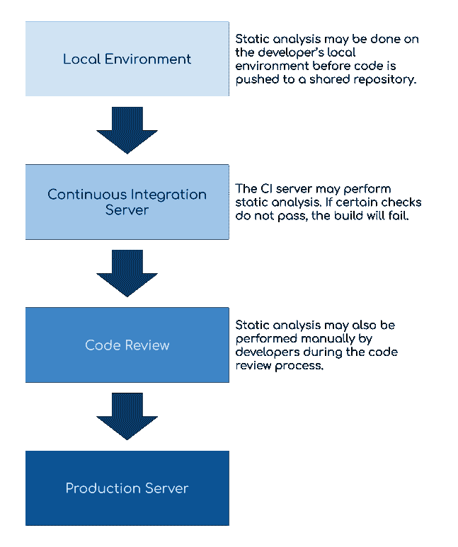
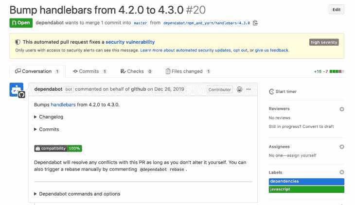

# JavaScript 中的静态分析:帮助你在用户之前发现错误的 11 种工具

> 原文：<https://blog.logrocket.com/static-analysis-in-javascript-11-tools-to-help-you-catch-errors-before-users-do/>

你可能知道[林挺可以提高你的代码质量](https://hackernoon.com/how-linting-and-eslint-improve-code-quality-fa83d2469efe)，但是林挺并不是静态分析可以确保你的团队持续编写高质量代码的唯一方法。静态分析工具可以在您的开发周期中发挥不可或缺的作用，即使是在动态类型的语言中，比如 JavaScript。

在本指南中，我们将看看 JavaScript 生态系统中一些最著名的静态分析工具，并讨论为什么以及何时使用它们。

## 静态分析简介

首先，让我们回顾一下静态分析的定义及其在软件开发生命周期中的位置。

静态分析是在不实际运行代码的情况下验证代码是否满足某些预期的过程。与[单元和集成测试](https://blog.logrocket.com/unit-and-integration-testing-for-node-js-apps/)不同，静态分析可以在原始源代码上执行，而不需要网络服务器或构建过程。

静态分析器通常解析您的代码，并将其转化为所谓的[抽象语法树](https://medium.com/@jotadeveloper/abstract-syntax-trees-on-javascript-534e33361fc7)。然后遍历这个树，并根据静态分析器指定的规则检查各个部分。大多数静态分析器还包括一种让开发人员编写他们自己的定制规则的方法，但这因工具而异。

静态分析最常用于:

*   确保一致的样式和格式
*   检查常见错误和可能的错误
*   限制代码的复杂性
*   验证类型一致性
*   最小化安全风险
*   保持第三方依赖关系最新

## 静态分析什么时候发生？

在像 JavaScript 这样的动态解释语言中，开发人员必须决定何时以及如何对他们的代码运行静态分析。我经常看到静态分析在每个开发人员的机器上运行，然后他们推动变更(作为一个 [Git 预提交钩子](https://codeinthehole.com/tips/tips-for-using-a-git-pre-commit-hook/))作为持续集成服务器工作流的一部分或者作为每个代码审查的一部分。



无论静态分析何时或如何发生，目标都是一样的:帮助代码更加一致、可维护和正确。它不会取代自动化或手动测试，但它可能会捕捉到其他质量保证工具遗漏的错误。

因为 JavaScript 是动态类型的，而且从客户端应用程序收集错误日志历来都很困难，[静态分析工具甚至比静态类型的服务器端语言更有用。](https://inventitech.com/publications/2016_beller_bholanath_mcintosh_zaidman_analyzing_the_state_of_static_analysis_a_large-scale_evaluation_in_open_source_software.pdf)

如果您是静态分析的新手，那么在众多可用的工具中进行筛选可能会让人不知所措。我将向您介绍 JavaScript 中一些最常用的静态分析工具。我们将探索它们的一些用例，以及如何在您的开发工作流中实现它们。

### 1.埃斯林特

ESLint 可能是当今使用最广泛的 JavaScript 静态分析工具。Prettier 和 Standard JS 都使用 ESLint 来驱动它们的格式化引擎，所以即使你没有明确地包含它，你也可能在幕后使用它。

ESLint 的主要用例是作为一个[linter](https://www.freecodecamp.org/news/what-is-linting-and-how-can-it-save-you-time/)——一种特定的静态分析工具，可以捕捉不一致的格式、样式和可能的错误。ESLint 通过使用[预先确定的规则](https://eslint.org/docs/rules/)来做到这一点，您可以根据自己的需要配置或定制这些规则。

如何使用它的一个很好的例子是防止开发人员[在产品](https://eslint.org/docs/rules/no-console)中意外使用`console`语句。如果您正在编写一个 JavaScript 函数来对数字进行排序，并且想要验证您是否做对了，那么您可以使用`console.log()`来进行自我检查。

```
function sortNumbers(numbers) {
    console.log(numbers);
    const result = numbers.sort((a, b) => (a - b));
    console.log(result);

    return result;
}
sortNumbers([30, 12, 22, 19]);

```

如果启用了该规则，ESLint 会在您将它发送给用户之前警告您这个可能的错误。

### 2.较美丽

使用 ESLint 可能会让人不知所措。有几十个规则，你可以在上面写自定义的。一些规则可能要求你改变你的应用程序的行为，所以如果你想从简单地使你的代码格式更加一致开始，[更漂亮的](https://prettier.io/)可能适合你。

更漂亮的是[不是全功能的棉绒](https://prettier.io/docs/en/comparison.html)；它只涉及样式和格式规则。它通过限制选择和自动修复不符合其风格指南的代码来提供帮助。

例如，假设您编写了这样一个函数:

```
function createUser() { return {
    id: 1, name: "Karl", birthdate: "6/10/86",
       hometown: "Lansing, MI" };
}

```

如果你更漂亮地运行它，它会重写函数以符合其一贯的风格。

```
function createUser() {
  return {
    id: 1,
    name: "Karl",
    birthdate: "6/10/86",
    hometown: "Lansing, MI",
  };
}

```

虽然 Prettier 为您提供的自定义样式规则的选项较少，但它是确保开发团队中的每个人在代码中使用相同格式和样式的一个好方法。

### 3.标准 JS

介于 ESLint 和 Prettier 之间的是 [Standard](https://standardjs.com/) 。和 Prettier 一样，Standard 也很固执——你不需要决定实现和配置哪个 ESLint 规则——但它不仅仅是解决了风格问题。它还包括可以减少错误和改变代码行为的规则。

例如，标准包括 ESLint 规则，以使[总是使用`===`而不是`==`](https://standardjs.com/rules.html#rules) 。因为 JavaScript 强制类型，盲目遵循 Standard 的建议可能会以意想不到的方式改变代码的行为。

如果运行下面的代码，所有三个日志语句都将是`true`。

```
function isTrue (x) {
  return x == true
}
console.log(isTrue('1'))   // true
console.log(isTrue(1))     // true
console.log(isTrue(true))  // true

```

但是如果你按照 Standard 的建议做`x === true`，结果就变了:

```
function isTrue (x) {
  return x === true
}
console.log(isTrue('1'))   // false
console.log(isTrue(1))     // false
console.log(isTrue(true))  // true

```

虽然标准可能不容易在大型现有代码库上实现，但它仍然是林挺代码的优秀工具。消除编码风格上的小争议可以提高开发人员的生产力，加快入职时间。

### 4.JSHint

与 ESLint 类似， [JSHint](https://jshint.com/) 是一个林挺工具，它使您能够设置和配置规则来捕捉常见的编码错误和格式不一致。总的来说，ESLint 的规则比较多，[为](https://medium.com/@sheldonled/from-jshint-to-eslint-8a0a135fa2bf)编写自定义规则要简单一点。这些差异主要归因于偏好。

相比 ESLint，JSHint 更受青睐的一个特例是，当你开发一个具有 Mozilla Firefox 浏览器特有特性的应用程序时。JSHint 有一个规则允许调用 Mozilla 特定的 JavaScript 扩展，而 ESLint 没有。

像 ESLint 一样，浏览规则并决定哪些规则适合你的代码库是最需要时间的部分。因为 JSHint 的规则和配置选项更少，所以如果您不想做非常特殊的事情，它的设置可能会更快一些。

### **5。PMD**

如果你正在构建一个 Java 或 Saleforce Apex 应用程序，你可能已经熟悉了 [PMD](https://pmd.github.io/pmd-6.23.0/pmd_rules_ecmascript.html) 。顺便说一下，PMD—[不代表任何东西](https://pmd.github.io/pmd-6.12.0/pmd_projectdocs_trivia_meaning.html)——是一个支持几种编程语言的 linter，包括 JavaScript。

它针对 JavaScript 应用的规则集[相当有限](https://pmd.github.io/pmd-6.23.0/pmd_rules_ecmascript.html)，但与上述林挺工具不同，PMD 捆绑了一个[复制粘贴检测器](https://pmd.github.io/pmd-6.23.0/pmd_userdocs_cpd.html)。这有助于在广泛的应用程序中找到重复或相似的代码，并鼓励干代码。

### 6.LGTM

仅仅基于预先确定的规则的林挺是提高代码质量的好方法，但它不是检查代码库常见错误的唯一方法。林挺最大的劣势是它只知道你能告诉它的规则。

[LGTM](https://lgtm.com/help/lgtm/about-lgtm)——代表“对我来说看起来不错”——利用错误经常再次出现的事实来检查你的代码库的[常见漏洞，并利用它通过分析其他代码库了解到的](https://en.wikipedia.org/wiki/Common_Vulnerabilities_and_Exposures)。换句话说，它寻找的不是程序员明确告诉它的规则，而是可能表明引入了新的错误或安全漏洞的变化。

虽然开源项目是免费的，但 LGTM 为私有代码库付费。

### 7.声纳云

[SonarCloud](https://sonarcloud.io/) 提供了一套全面的静态分析工具，可以从多方面评估代码库的质量。虽然私人项目必须付费才能访问，但开源项目是免费的，并且集成到 GitHub 中，因此您可以确保每次提交都保持您的代码质量。

如果你想深入了解 SonarCloud 所做的检查，它在其网站上提供了开源项目结果的[样本。每一个都基于可靠性、安全性、可维护性、代码覆盖率和重复代码进行评估。](https://sonarcloud.io/explore/projects)


您还可以[深入到每个文件](https://sonarcloud.io/code?id=mediawiki-core&selected=mediawiki-core%3Aincludes%2Fapi%2FApiBase.php)中，查看 SonarCloud 发现的所有建议和错误，让您能够进行粒度访问，并根据需要调整某些质量阈值。

### 8.从属机器人

如果你把你的源代码放在 GitHub 上，你可能已经看过[dependent bot](https://dependabot.com/)的运行了。GitHub [于 2019 年 5 月收购了 dependent bot](https://dependabot.com/)，此后将其集成为一项功能，可供所有存储库使用，以帮助解决过时依赖项带来的安全漏洞。



鉴于 JavaScript 对第三方库的依赖性越来越强，这可以节省团队的时间并更快地弥补安全漏洞。

不过，在合并 Dependabot pull 请求时，您必须非常小心。如果您没有一套好的自动化测试，那么即使是微小的版本升级也可能导致重大的变化。

### 9.NPM-审计

从[版本 6](https://docs.npmjs.com/auditing-package-dependencies-for-security-vulnerabilities) 开始，npm 就有了`audit`命令，为 Dependabot 提供类似的检查。如果你使用 npm 作为你的包管理器，但是不喜欢在你的代码上得到自动的拉请求，运行 [`npm audit`](https://docs.npmjs.com/cli/audit) 命令是一个很好的方法来确保你的第三方依赖是最新的和安全的。

由于盲目更新所有的依赖项可能并不明智，`npm audit`提供了一些选项来限制它的范围。

*   `npm audit fix`自动更新软件包，但仅执行较小的更新[永远不更新](https://semver.org/)
*   `npm audit fix --dry-run`输出将要进行的更改列表，以便您可以在它们生效前仔细检查它们
*   `npm audit fix --force`更新所有存在安全漏洞的包的主版本和次版本

与 Dependabot 一样，`npm audit`应该与自动和手动测试相结合，以避免破坏性的变化。

### 10.流动

脸书的[流程](https://flow.org/)可以使用显式注释或隐式推理来确保 JavaScript 代码的类型一致性。

类型检查通过确保变量以程序期望的方式使用来最小化错误。

例如，假设您有这样的代码:

```
function isTrue (x: bool) {
  return x === true;
}
isTrue(1);

```

Flow 会抛出一个错误，因为它期望`x`是一个`boolean`，而不是一个整数。当您希望确保对象包含特定属性或数字不会被错误地强制转换为字符串时，此警告尤其有用。

### 11.以打字打的文件

由微软开发的 [TypeScript](https://www.typescriptlang.org/) 用于谷歌的 Angular 框架中。TypeScript 扩展了 JavaScript，像 Flow 一样，[提供了类型注释和类型检查](https://blog.logrocket.com/typescript-vs-flow/)。但是，与 Flow 不同，TypeScript 受到大多数主流 JavaScript 框架和 ide 的支持，因此在这一点上，它可能是更好的选择。

虽然您不必使用 TypeScript 的所有特性来获得一些优势，例如隐式类型安全，但是您可以[深入研究以获得更多优势](https://blog.logrocket.com/a-quick-and-complete-guide-to-typescript-types-438c259257d3/)。对于接口、泛型、模板文字和枚举等特性，JavaScript 开发人员有很多东西需要学习。

## 结论

这个列表[远非全面](https://www.softwaretestingmagazine.com/tools/open-source-javascript-code-analysis/)，但是我希望它能帮助你开始探索和使用静态分析来改进你的代码库。

如果你有喜欢的 JavaScript 静态分析工具，我很乐意听听。请在下面给我留言，继续我们的对话。

## 通过理解上下文，更容易地调试 JavaScript 错误

调试代码总是一项单调乏味的任务。但是你越了解自己的错误，就越容易改正。

LogRocket 让你以新的独特的方式理解这些错误。我们的前端监控解决方案跟踪用户与您的 JavaScript 前端的互动，让您能够准确找出导致错误的用户行为。

[](https://lp.logrocket.com/blg/javascript-signup)

LogRocket 记录控制台日志、页面加载时间、堆栈跟踪、慢速网络请求/响应(带有标题+正文)、浏览器元数据和自定义日志。理解您的 JavaScript 代码的影响从来没有这么简单过！

[Try it for free](https://lp.logrocket.com/blg/javascript-signup)

.