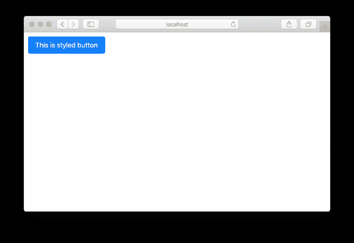
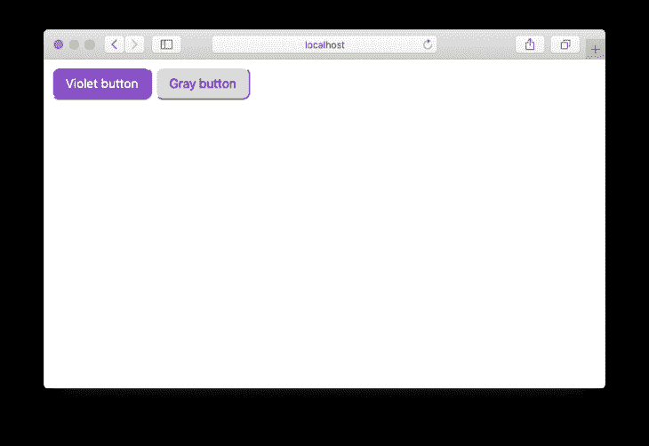

# Stitches:一个现代的、服务器渲染的 CSS-in-JS 库

> 原文：<https://blog.logrocket.com/stitches-server-rendered-css-in-js/>

使用 [CSS-in-JS](https://cssinjs.org/?v=v10.4.0) 设计组件的样式于 2014 年首次推出，并持续流行。开发人员社区对该模式的广泛采用帮助库制作者确定了什么概念对 CSS-in-JS 库是重要的。

例如， [Stitches](https://stitches.dev/) 是一个 CSS-in-JS 库，它采用了最新的组件样式趋势，例如为组件重用和服务器端渲染创建变体，作为其核心特性。这是一个完全类型化的 CSS-in-JS 库，侧重于基于组件的架构和开发人员体验。

像其他 CSS-in-JS 库一样，Stitches 具有关键 CSS 注入和自动供应商前缀的常见优点。但是与其他 CSS-in-JS 库相比，Stitches 由于以下优势而脱颖而出:

### 表演

Stitches 避免了运行时不必要的适当插值，使它比其他样式库更具性能

### 服务器端渲染

Stitches 支持跨浏览器的服务器端渲染，甚至是响应性的样式和变体

### 变体

变体拥有一流的支持，使您能够设计可组合的组件 API

### 主题

用 CSS 变量定义多个主题，然后通过定义类名在组件中使用它们

### 特征

由于其原子输出，特异性问题已成为过去

### 开发者体验

它有一个非常有用的配置文件，包含标记感知属性、断点助手和自定义实用程序。缝线提供了一个有趣和直观的 DX

虽然 Stitches 被设计成与框架无关，但在撰写本文时，它只支持 React，并支持 Vue in progress。

## 开始缝针

要开始在 React 中使用 Stitches，您需要在软件包管理器中安装这个库:

```
# With npm
npm install @stitches/react

# With yarn
yarn add @stitches/react

```

然后，您需要创建一个配置文件，并为您的设计系统定义配置。创建一个`stitches.config.ts`文件(如果不使用[类型脚本](https://www.typescriptlang.org/)，则创建`.js`，并从库中导入`createStyled`函数。

`createStyled`函数的工作方式类似于 React 钩子函数。它接收具有以下可选属性的配置对象:

*   为所有的类名使用前缀以避免冲突
*   `tokens`:可以定义并应用为 CSS 值的特殊变量
*   创建响应断点来帮助你编写响应风格
*   创建自定义函数，作为编写 CSS 属性的速记

并根据您的样式需求返回两个函数:

*   `styled`:创建带有样式的 React 组件的功能
*   `css`:创建主题和 SSR 风格的功能

```
// stitches.config.ts
import { createStyled } from '@stitches/react';export const { styled, css } = createStyled({
prefix: '',
tokens: {},
breakpoints: {},
utils: {},
});
```

我们稍后将查看配置属性。现在，让我们把重点放在实现缝合和呈现样式化的组件上。

需要将`stitches.config`文件导入到您的组件中，所以如果您正在使用 [Create-React-App](https://create-react-app.dev/) ，不要忘记将它放在`src/`目录中。

让我们创建一个样式化的按钮组件来测试针脚。创建一个新的组件文件，并从顶部的配置中导入`styled`:

```
// Change the import to where you put your stitches.config file
import { styled } from '../stitches.config';

```

现在为你的按钮写样式。与在 styled-components 中使用模板字符串语法不同，Stitches 选择使用普通对象语法来实现样式模式，以减小包的大小:

```
import { styled } from '../stitches.config';

const Button = styled('button', {
  color: '#fff',
  backgroundColor: '#007bff',
  borderRadius: '10px',
  fontSize: '16px',
  fontWeight: 400,
  paddingTop: '10px',
  paddingBottom: '10px',
  paddingLeft: '16px',
  paddingRight: '16px',
  '&:hover': {
    backgroundColor: '#0069d9',
  },
});

export default Button;

```

现在，您需要导入您的组件以呈现它:

```
import React from 'react';
import ReactDOM from 'react-dom';
import Button from './components/Button'

function App() {
  return (
    <Button>This button is styled using Stitches</Button>
  );
}

ReactDOM.render(
  <App />,
  document.getElementById('root')
);

```

仅此而已。现在，屏幕上呈现了一个 Stitches 按钮组件:



Here’s a button component styled using Stitches.

接下来让我们了解如何创建组件的不同版本。

## 缝线内置变体支持

Stitches 的一个关键特性是它支持编写同一个组件的多个变体作为一流的 API。您可以直接在样式对象语法中编写变量，这些变量将被编译为该组件的道具。这是同样的按钮组件，但有`color`的变化:

```
const Button = styled('button', {
  color: '#fff',
  backgroundColor: '#007bff',
  borderRadius: '10px',
  fontSize: '16px',
  fontWeight: 400,
  paddingTop: '10px',
  paddingBottom: '10px',
  paddingLeft: '16px',
  paddingRight: '16px',
  '&:hover': {
    backgroundColor: '#0069d9',
  },
  variants: {
    color: {
      violet: {
        backgroundColor: 'blueviolet',
        ':hover': {
          backgroundColor: 'darkviolet',
        },
      },
      gray: {
        color: '#000',
        backgroundColor: 'gainsboro',
        ':hover': {
          backgroundColor: 'lightgray',
        },
      },
    },
  }
});

```

当你渲染按钮时，你只需要指定颜色作为它的道具:

```
<div style={{ display: 'flex', gap: '20px' }}>
  <Button color="violet">Violet button</Button>
  <Button color="gray">Gray button</Button>
</div>

```

并且它将被相应地呈现:



Variations of the same button component.

欲了解更多信息，请查看[缝线的变体文档](https://stitches.dev/docs/variants)。现在您已经了解了变体支持，让我们继续了解配置属性。

## 缝合中的配置属性

正如我们之前看到的，在调用`createStyled`函数时，您可以设置四个配置属性:

*   前缀
*   代币
*   断点
*   实用工具

让我们了解这些配置如何改善您的开发人员体验。

### 1.前缀配置

前缀配置将简单地为每个由 Stitches 生成的类名添加一个前缀，以避免任何可能的 CSS 冲突:

```
export const { styled, css } = createStyled({
  prefix: 'zxc',
  tokens: {},
  breakpoints: {},
  utils: {},
});

```

您可以通过在浏览器中检查元素来查看前缀。结果将如下所示:

```
<button class="zxc__initial_bc_hiMOlA zxc__initial_bc_cfnJEG zxc__initial_c_kFTTvV zxc__initial_bblr_eEqHhd zxc__initial_btlr_fAvRqR zxc__initial_btrr_hGRUya zxc__initial_bbrr_iAiVRy zxc__initial_fs_kBiqwx zxc__initial_fw_cftqkj zxc__initial_pt_keBEHr zxc__initial_pb_ddiFNf zxc__initial_pl_frIgGZ zxc__initial_pr_eOnNpm scid-bZicNS">
  Violet button
</button>

```

### 2.令牌配置

令牌配置允许您编写可重用的设计令牌，作为保存 CSS 值的变量。下面是如何定义`colors`和`fontSizes`令牌类型的示例:

```
export const { styled, css } = createStyled({
  tokens: {
    colors: {
      $gray500: 'hsl(206,10%,76%)',
      $blue500: 'hsl(206,100%,50%)',
      $purple500: 'hsl(252,78%,60%)',
      $green500: 'hsl(148,60%,60%)',
      $red500: 'hsl(352,100%,62%)',
    },
    fontSizes: {
      $1: '12px',
      $2: '13px',
      $3: '15px',
    },
  },
});

```

您可以在组件中直接使用令牌:

```
const Button = styled('button', {
  color: '#fff',
  backgroundColor: '$red500',
  borderRadius: '10px',
  fontSize: '$3',
  fontWeight: 400,
  paddingTop: '10px',
  paddingBottom: '10px',
  paddingLeft: '16px',
  paddingRight: '16px',
  '&:hover': {
    backgroundColor: '$blue500',
  },
});

```

Stitches 提供了 14 种标记类型，你可以在你的配置文件中定义它们。

### 3.断点配置

断点配置允许您在某些断点期间将样式应用到组件中。您可以自由定义自己的断点属性名。例如:

```
# using bp1, bp2, bp3 and bp4
export const { styled, css } = createStyled({
  breakpoints: {
    bp1: (rule) => `@media (min-width: 640px) { ${rule} }`,
    bp2: (rule) => `@media (min-width: 768px) { ${rule} }`,
    bp3: (rule) => `@media (min-width: 1024px) { ${rule} }`,
    bp4: (rule) => `@media (min-width: 1280px) { ${rule} }`,
  },
});

#or using sm, md, lg, xl
export const { styled, css } = createStyled({
  breakpoints: {
    sm: (rule) => `@media (min-width: 640px) { ${rule} }`,
    md: (rule) => `@media (min-width: 768px) { ${rule} }`,
    lg: (rule) => `@media (min-width: 1024px) { ${rule} }`,
    xl: (rule) => `@media (min-width: 1280px) { ${rule} }`,
  },
});

```

然后，您可以将断点属性作为组件样式的一部分来应用:

```
const Button = styled('button', {
  height: '35px',
  // apply styles to the `bp1` breakpoint
  bp1: {
    height: '45px'
  }
});

```

或者，如果您想避免覆盖样式模式，您可以使用结合断点属性的变体 API。首先将变体写入您的风格:

```
const Button = styled('button', {
  height: '35px',
  // variants for height
  variants: {
    height: {
      small: {
        height: '25px'
      },
      normal: {
        height: '45px'
      },
      large: {
        height: '75px'
      },
    }
  }
});

```

接下来，定义在每个断点应用哪个变量。在应用任何断点之前，必须使用`initial`断点来声明初始变量:

```
<Button height={{ initial: 'small', bp2: 'normal', bp3: 'large' }}>
  Responsive button
</Button>

```

### 4\. utils config

utils 配置允许您编写自定义函数，在定义您的风格时作为快捷方式。例如，让我们编写一个`m` util 函数作为编写边距属性的快捷方式:

```
export const { styled, css } = createStyled({
  utils: {
    m: (config) => (value) => ({
      marginTop: value,
      marginBottom: value,
      marginLeft: value,
      marginRight: value,
    }),
  }
});

```

接下来，在组件中使用 util:

```
const Button = styled('button', {
  height: '35px',
  m: '20px'
});

```

请注意，呈现的按钮在所有边上都有`20px`边距。你可以根据需要定义任意多的实用函数 T2。

## 结论

除了其出色的性能和对组件架构的关注，Stitches 是最新的 CSS-in-JS，最终为变体提供了内置的一流支持。variants API 的设计允许您更改组件的可视化表示，而无需覆盖基于 props 的样式，也无需按照传统方式编写多个类。

这个库还有一个功能强大的配置文件，您可以在其中定义自定义标记、断点和 util 函数，使组件的样式化变得有趣而简单。请务必查看缝线[文档，了解更多信息](https://stitches.dev/docs/introduction)。

## 使用 [LogRocket](https://lp.logrocket.com/blg/signup) 消除传统错误报告的干扰

[](https://lp.logrocket.com/blg/signup)

[LogRocket](https://lp.logrocket.com/blg/signup) 是一个数字体验分析解决方案，它可以保护您免受数百个假阳性错误警报的影响，只针对几个真正重要的项目。LogRocket 会告诉您应用程序中实际影响用户的最具影响力的 bug 和 UX 问题。

然后，使用具有深层技术遥测的会话重放来确切地查看用户看到了什么以及是什么导致了问题，就像你在他们身后看一样。

LogRocket 自动聚合客户端错误、JS 异常、前端性能指标和用户交互。然后 LogRocket 使用机器学习来告诉你哪些问题正在影响大多数用户，并提供你需要修复它的上下文。

关注重要的 bug—[今天就试试 LogRocket】。](https://lp.logrocket.com/blg/signup-issue-free)