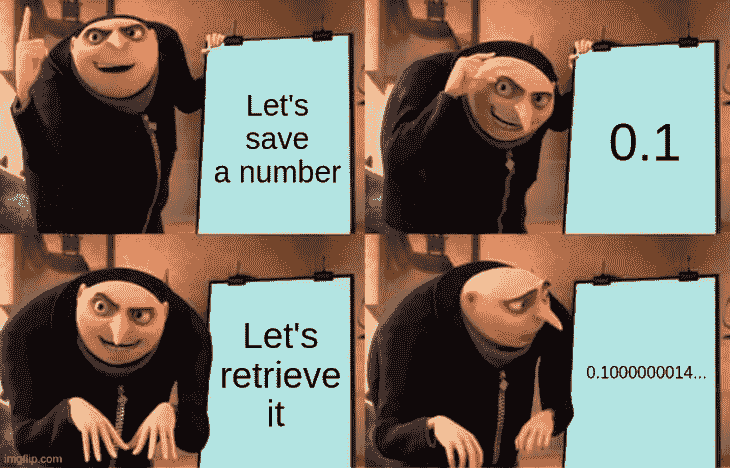
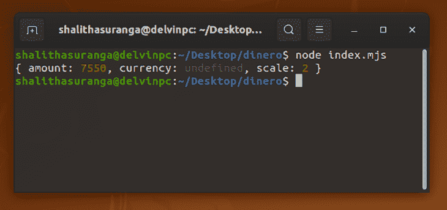
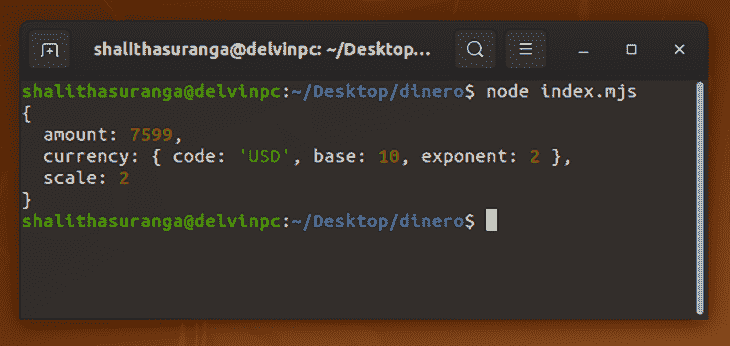

# 使用 Dinero.js - LogRocket Blog 在 JavaScript 中存储和检索精确的货币值

> 原文：<https://blog.logrocket.com/store-retrieve-precise-monetary-values-javascript-dinero-js/>

程序员使用属于不同业务领域的各种 web 应用程序，如医疗保健、金融、电子商务、云计算、业务流程管理和教育。这些行业经常操纵货币价值，随着越来越多的金融企业将其服务转换为基于云的应用程序，越来越明显的是，这些基于云的应用程序需要能够精确地表示、操纵和存储金融金额。

即使您的 web 应用程序可能并不明确存在来执行财务计算，但它可能会计算货币金额以用于计费目的。这些类型的货币计算应该更加准确，因为错误可能会导致这些金融交易中所涉及的各方在现实世界中遭受损失。

因此，我们需要选择最合适的数据类型来存储财务数字。C#和 Java 等几种编程语言本身支持任意小数点类型的货币值。然而，JavaScript 的基于硬件的浮点数据类型不适合货币应用程序。它没有货币值的本地数据类型，只允许您将小数存储为[双精度浮点数(IEEE 754)](https://developer.mozilla.org/en-US/docs/Glossary/Number) 。

在本文中，我将解释如何使用 Dinero.js 库在 JavaScript 和 TypeScript 中用对象更精确地存储、操作和表示货币值。

## 为什么 float 数据类型不适合存储货币值？

一般来说，人们使用十进制来计算。十进制数字系统使用从`0`到`9`的数字。因此，我们计算的所有数字都是由这些数字或这些数字的组合构成的。

我们的数字计算经常产生精确的小数，也可以产生无穷的分数。例如，`1/3`分数产生一个无穷的`0.3333…`。另一方面，`1/4`分数产生了精确的`0.25`。

我们知道，计算机只能理解被称为二进制数系统的以二为基数的数字系统，它由较高的电压值(`1`)和较低的电压值(`0`)组成。计算机在内部将十进制数值存储为以二为基数的数字，和以十为基数的系统一样，十进制到二进制的转换也可以产生无穷多的二进制分数。

例如，`1/10`十进制小数构成一个无穷无尽的`0.00011…`二进制数。另一方面，`1/2`十进制小数产生了精确的`0.1`二进制数。

现在您可能已经知道，当二进制表示太长或太长时，float 数据类型存储给定十进制值的近似值。当您检索存储的浮点值进行计算时，它不是您之前存储的精确值。



这些换算误差可能会在合计金额中产生相当大的差距，并可能导致舍入误差。因此，原生 JavaScript float 数据类型不适合货币值。

## Dinero.js 入门

Dinero.js 是基于马丁·福勒的金钱模式(T1)构建的，这在他的书《企业应用架构的 T2 模式》(Patterns of Enterprise Application Architecture)中有所解释。这本书解释说，软件开发人员需要用 OOP(面向对象编程)模式存储货币价值。该模式促使开发人员使用带有货币和金额的类来存储货币值。

因此， [Dinero.js](https://github.com/dinerojs/dinero.js) 允许程序员使用对象在 JavaScript 中精确地存储、操作和呈现货币价值。它支持世界上所有活动货币的定义，包括像[马达加斯加阿里亚](https://en.wikipedia.org/wiki/Malagasy_ariary)这样的非十进制货币，并且作为一组独立的模块出现，因此您可以在生产应用程序中只包含所需的模块，以保持包的大小较小。

Dinero 的 v2 alpha 版本最近发布了，很快就会成为稳定版。与此同时，您可以将 Dinero 与 Node.js、您的浏览器以及所有流行的前端框架一起使用。

首先，用 npm 或 Yarn package manager 安装这个库。

```
npm install [email protected]
# or
yarn add [email protected]

```

或者，您可以导入一个缩小版的 Dinero 来直接在网络浏览器中使用。在本教程中，我将通过使用 ECMAScript 模块(MJS)演示 Dinero with Node。

### 基本概念

首先，让我们尝试用 Dinero 存储一个值`75.50`。假设这个值带有一个未知货币。将下面的代码保存到一个名为`index.mjs`的文件中，并使用`node index.mjs`命令运行它。

```
import { dinero } from 'dinero.js';
const price = dinero({amount: 7550, scale: 2});
console.log(price.toJSON());

```

我们需要明白，我们处理的不是浮点数或整数值。用 Dinero API，每个货币金额都将成为一个 Dinero 对象。

上面的代码片段用`7550`创建了一个 Dinero 对象，因为我们需要提供一个整数作为金额。我们还要求 Dinero 使用比例因子`2`，因为实际价格是`75.50`。最后一行记录了 Dinero 对象的结构，如下所示。



### 货币

我们创建了上面的没有任何货币的 Dinero 对象。如前所述，该库支持世界上几乎所有的活跃货币，但为了方便起见，让我们尝试存储`75.99` USD。

在使用预定义的货币之前，您需要首先安装 Dinero 货币包。

```
npm install @dinero.js/[email protected]
# or  
yarn add @dinero.js/[email protected]

```

安装货币包后，运行下面的代码片段。

```
import { dinero } from 'dinero.js';
import { USD } from '@dinero.js/currencies';
const price = dinero({amount: 7599, currency: USD})
console.log(price.toJSON());

```

现在，我们可以看到比例是根据货币的指数属性自动定义的。



### 格式化

我们可以使用 Dinero 对象进行内部货币表示，但是我们需要在 web 应用程序中以纯文本形式显示它们。因此，我们需要通过使用库的格式化函数将 Dinero 对象转换成典型的十进制数。

看看下面的 Dinero 对象是怎么转换成一个有一个小数位的十进制值的。

```
import { dinero, toUnit, down } from 'dinero.js';
import { USD } from '@dinero.js/currencies';
const price = dinero({amount: 7599, currency: USD});
const priceDecimal = toUnit(price, { digits: 1, round: down });
console.log(priceDecimal); // 75.9

```

此外，您可以使用`toFormat`函数获得十进制值的字符串表示，如下所示。

```
import { dinero, toFormat } from 'dinero.js';
import { USD } from '@dinero.js/currencies';
const transformer = ({ amount, currency }) => `${currency.code} ${amount}`;
const price = dinero({ amount: 7599, currency: USD });
console.log(toFormat(price, transformer)); // "USD 75.99"

```

### 存储和检索

Dinero 对象像其他通用 JavaScript 对象一样存储在计算机的物理内存中。显然，我们需要将它们保存到数据库中，以便长期保存。

Dinero 提供了用于序列化和反序列化的 API 函数，我们可以使用`toSnapshot`函数来获得一个可存储的原始 JSON 对象。

```
import { dinero, toSnapshot } from 'dinero.js';
import { USD } from '@dinero.js/currencies';
const price = dinero({ amount: 5000, currency: USD });
const rawData = toSnapshot(price);
console.log(rawData); // Store rawData in database

```

我们可以像往常一样用`dinero`方法将存储的原始 JSON 对象转换回 Dinero 对象。

```
import { dinero, toSnapshot } from 'dinero.js';
import { USD } from '@dinero.js/currencies';
const price = dinero({ amount: 5000, currency: USD });
const rawData = toSnapshot(price); 
// Store rawData in database
const priceFromDb = dinero(rawData);
console.log(priceFromDb.toJSON());

```

## 算术运算

Dinero 有几个 API 变异函数，允许您操作在 Dinero 对象中定义的货币数量。有了这些函数，我们就可以进行加、乘、减等算术运算。请看下面的一些示例算术运算的代码片段。

```
import { dinero,
        toUnit,
        down,
        add,
        subtract, 
        multiply 
} from 'dinero.js';
import { USD } from '@dinero.js/currencies';

const d1 = dinero({amount: 7599, currency: USD});
const d2 = dinero({amount: 1599, currency: USD});
console.log(`d1 = ${toUnit(d1)}`);
console.log(`d2 = ${toUnit(d1)}`);

let ans;

ans = add(d1, d2);
console.log(`d1 + d2 = ${toUnit(ans)}`);

ans = subtract(d1, d2);
console.log(`d1 - d2 = ${toUnit(ans)}`);

ans = multiply(d1, 2);
console.log(`d1 x 2 = ${toUnit(ans)}`);

```

### 货币部门

在现实世界的交易中，我们经常需要划分货币金额。在某些情况下，这些划分可能会更复杂一些。例如，假设您的 web 应用程序为一个特定的服务在两个交易中处理了总额为 USD `100.53`的付款。您可能会猜测会有两笔相同的付款`50.265`。但是你不能把一枚硬币分成两部分，对吗？

尽管您可以将该值四舍五入为`50.27`美元，但您收取的费用高于实际价值。为了解决这个问题，Dinero 提供了`allocate`方法来分配货币值，没有任何除法误差。

以下示例将 USD `100.53`分成两笔金额。

```
import { dinero, allocate, toUnit } from 'dinero.js';
import { USD } from '@dinero.js/currencies';
const price = dinero({ amount: 10053, currency: USD });
const [d1, d2] = allocate(price, [1, 1]);
console.log(toUnit(d1), toUnit(d2)); // 50.27 50.26 

```

上面的代码片段创建了两个 Dinero 对象:一个带有`50.27`，一个带有`50.26`。因此，除法运算会产生两个正确转换为货币的金额。

### 算术比较

Dinero 有许多用于比较的功能。例如，我们可以使用`equal`方法来检查两个 Dinero 对象是否相等。

```
import { dinero, equal } from 'dinero.js';
import { USD } from '@dinero.js/currencies';
const d1 = dinero({ amount: 5022, currency: USD });
const d2 = dinero({ amount: 5022, currency: USD });
if(equal(d1, d2)) {
   console.log("d1 equals d2");
}

```

同样，还有 API 函数来检查大于、小于等。Dinero API 文档有所有支持的比较函数的定义。

## 类型脚本支持

Dinero.js 是用 TypeScript 编写的，它本身就支持 TypeScript 开发环境。

将 Dinero 作为依赖项添加到 TypeScript 项目中。之后，您的包管理器也将获取所有的 TypeScript 定义。

看看下面的 Dinero TypeScript 例子。

```
import { Dinero, dinero, toUnit, down } from 'dinero.js';
import { USD } from '@dinero.js/currencies';
const price: Dinero = dinero({ amount: 50011, currency: USD });
const priceDecimal: number = toUnit(price, { digits: 2, round: down });
console.log(priceDecimal);

```

你可以从这个 [StackBlitz 演示](https://stackblitz.com/edit/typescript-hxewg6?devtoolsheight=33&file=index.ts)中查看上面例子的完整源代码。

## Dinero.js 与其他现有解决方案

Dinero.js 最初发布于大约一年前。在此之前，程序员使用不同的类似 Dinero 的库在 JavaScript 中表示货币数量。一些程序员使用其他方法而不使用库，比如 Martin Fowler 的 money 模式，它将货币值存储为整数，但是他们需要从头开始实现所有的东西。Money$afe 库提供了一个类似于 Dinero 的 API，但是它没有实现预定义的货币，文档显示它还没有准备好投入生产。

[big.js](https://github.com/MikeMcl/big.js) 是另一个流行的库，用于操作任意精度的十进制数。然而，它存储没有舍入误差的十进制值的解决方案是一种通用的解决方案，我们不能指望有许多与货币相关的功能，如预定义的货币或等分。然而，big.js 对于[处理加密货币](https://blog.logrocket.com/sending-bitcoin-with-javascript/)是一个很好的解决方案——甚至 [Dinero 也在他们的 FAQ 页面上推荐 big.js 用于加密货币](https://v2.dinerojs.com/docs/faq/does-dinerojs-support-cryptocurrencies)。

## 结论

程序员总是需要使用正确的数据类型来存储金融值。否则，web 应用程序可能会存储、处理和显示不正确的财务金额，web 应用程序所有者可能会面临客户不满意的问题，甚至会因此而面临法律诉讼。

幸运的是，Dinero 是一个 [JavaScript 库](https://blog.logrocket.com/tag/js-libraries)，它通过一个模块化且不可变的 API 为 JavaScript 中的货币操纵提供了一个安全的域模型。

## 您是否添加了新的 JS 库来提高性能或构建新特性？如果他们反其道而行之呢？

毫无疑问，前端变得越来越复杂。当您向应用程序添加新的 JavaScript 库和其他依赖项时，您将需要更多的可见性，以确保您的用户不会遇到未知的问题。

LogRocket 是一个前端应用程序监控解决方案，可以让您回放 JavaScript 错误，就像它们发生在您自己的浏览器中一样，这样您就可以更有效地对错误做出反应。

[](https://lp.logrocket.com/blg/javascript-signup)[https://logrocket.com/signup/](https://lp.logrocket.com/blg/javascript-signup)

[LogRocket](https://lp.logrocket.com/blg/javascript-signup) 可以与任何应用程序完美配合，不管是什么框架，并且有插件可以记录来自 Redux、Vuex 和@ngrx/store 的额外上下文。您可以汇总并报告问题发生时应用程序的状态，而不是猜测问题发生的原因。LogRocket 还可以监控应用的性能，报告客户端 CPU 负载、客户端内存使用等指标。

自信地构建— [开始免费监控](https://lp.logrocket.com/blg/javascript-signup)。