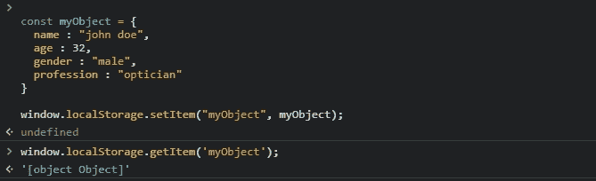
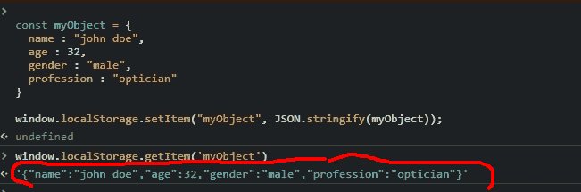

# 在 localStorage - LogRocket 博客中存储和检索 JavaScript 对象

> 原文：<https://blog.logrocket.com/storing-retrieving-javascript-objects-localstorage/>

web 存储 API 为客户端浏览器提供了安全存储和轻松访问键值对的机制。这对于存储用户名或电子邮件等简单数据很有用，对于通过存储访问和刷新令牌等数据来检查用户是否可以访问特定资源也很有用。

我们可以使用运行在客户端浏览器上的 JavaScript 客户端代码轻松查看存储在该浏览器上的数据，因此，如果用户离开网站，稍后又回来，您的 JS 代码可以从`window.localStorage`读取，以检索保存在其中的任何数据。

在本文中，我们将了解如何将 JavaScript 对象字符串化并解析成 JSON 字符串，以便保存在`localStorage`中。我们还将了解`localStorage`、`sessionStorage`和 cookie 之间的区别，以及使用 cookie 代替`localStorage`的好处和坏处。

## 什么是`localStorage`？

`[LocalStorage](https://blog.logrocket.com/localstorage-javascript-complete-guide/)`是一种网络存储机制，允许我们在客户端的浏览器上存储数据，即使在浏览器窗口关闭后，这些数据仍然存在。存储在这里的数据可以通过特定的域进行访问。例如，存储在来自`[http://www.example.com](http://www.example.com)`的`localStorage`对象中的数据可以被这个域中的任何页面访问。

而且，根据[w3schools](https://www.w3schools.com/jsreF/prop_win_localstorage.asp),`localStorage`对象存储的数据没有截止日期。当浏览器关闭时，数据不会被删除，并将在第二天、第一周或第二年可用。

## 使用`sessionStorage`vs .`localStorage`vs . cookie

`sessionStorage`是一个 web 存储 API，用于客户端存储特定领域的数据。类似于`window.localStorage`，但是有有效期。

`window.sessionStorage`在选项卡或浏览器打开时处于活动状态，并在页面重新加载和恢复过程中持续存在。将文档加载到浏览器选项卡中时，会创建一个新的页面会话并将其分配给该选项卡。该页面会话仅对有问题的选项卡有效。

> 注意:存储在`sessionStorage`中的数据不同于该页面的协议。这意味着存储在通过 HTTP 访问的站点上的数据与存储在通过 HTTPS 访问的同一站点上的数据存储在不同的`sessionStorage`对象上。

`localStorage`的工作方式与`sessionStorage`类似，但不同之处在于，存储在`localStorage`中的数据是持久的，并且永远适用于特定的域，除非浏览器的缓存被清除，或者我们使用 JavaScript 清除`localStorage`，因为`localStorage`数据只能由 JavaScript 操作。

> 注意:当最后一个私有标签关闭时，存储在以私有标签或匿名模式打开的站点的`localStorage`对象中的数据被清除。

另一方面，HTTP cookies 是网站服务器创建的文本文件，并发送给访问网站的新用户。当您连接时，服务器会生成保存在 cookie 中的信息。此信息标有一个对您和您的计算机来说唯一的 ID。

Cookies 包含特定于特定用户的信息，用于识别该用户。它们保存身份验证信息、购物车信息等数据，以帮助个性化用户体验。然而，它们可能会成为隐私噩梦，我们将在下一节中看到。

## 使用 cookies 进行网络存储

在这一节中，我们将看看在`localStorage`上使用 cookies 的利弊。

### 为什么使用 cookies？

*   Cookies 更适合于执行与身份验证相关的任务。它们在 HTTP 头中从浏览器发送到服务器，而不是使用`localStorage`或`sessionStorage`，它们只能作为客户端数据存储由应用程序访问
*   Cookies 可以被标记为仅 HTTP，从而在会话期间限制对用户浏览器的 XSS(跨站点脚本)攻击，但是这不能保证对 XSS 攻击的完全免疫

### 使用 cookies 的缺点

*   cookie 很容易受到网络攻击，被劫持的 cookie 可以访问用户的浏览会话。
*   第三方 cookies 是隐私噩梦。它们是由与您当前查看的网站不同的网站创建的。它们通常链接到网页上的广告，因此访问有七个广告的网站可能会生成七个 cookies，即使用户没有点击广告
*   使用`localStorage`，出于性能原因，web 应用程序可以在客户端存储整个用户创作的文档，但是 cookies 不能很好地处理这一点，因为它们是随着对服务器的每个请求一起传输的
*   cookies 的存储容量只有大约 4kb，而`localStorage`的容量为 10MB
*   因为 cookies 是以文本文件的形式存储在硬盘上的，所以它们会带来严重的安全风险。任何入侵者都可以轻易地打开这些文件并查看其中包含的信息

## 如何在`localStorage`中存储 JavaScript 对象

使用`window.localStorage`对象时，您应该熟悉以下方法:`setItem`、`getItem`、`removeItem`、`clear`和`key`。

让我们看看如何使用`setItem`和`getItem`方法，以及两个 JSON 方法`stringify`和`parse`在`localStorage`对象中存储 JavaScript 对象。

*   `[setItem()](https://developer.mozilla.org/en-US/docs/Web/API/Storage/setItem)`–方法`setItem`用于向 web 存储对象添加数据。它接受两个参数，一个键和值对，`window.localStorage.setItem("key", value)`
*   `[getItem()](https://developer.mozilla.org/en-US/docs/Web/API/Storage/getItem)`—`getItem`方法返回传递给它的键名的值，例如`window.localStorage.getItem("key name")`
*   `[JSON.stringify](https://developer.mozilla.org/en-US/docs/Web/JavaScript/Reference/Global_Objects/JSON/stringify)`–`JSON.stringify`方法将任何对象或可接受的值转换成字符串 JSON
*   `[JSON.parse](https://developer.mozilla.org/en-US/docs/Web/JavaScript/Reference/Global_Objects/JSON/parse)`–`JSON.parse`方法将一个字符串转换成它所描述的相应对象或值

让我们看一个如何使用上述方法在`localStorage`中存储 JavaScript 对象的例子:

```
//javascript

const myObject = {
  name : "john doe",
  age : 32,
  gender : "male",
  profession : "optician" 
}

window.localStorage.setItem("myObject", JSON.stringify(myObject));

```

在代码块中，我们首先使用`JSON.stringify()`方法将 JavaScript 对象转换成字符串，因为我们只能在`window.localStorage`对象中存储字符串。

如果我们试图存储一个 JavaScript 对象，而没有先将它转换成字符串，我们将得到一个`[object, object]`响应，如图所示。



`[object object]`是一个对象实例的字符串表示，但是它的值永远不会被读取。

现在我们需要检索我们的 JavaScript 对象，我们之前将它保存为一个 JSON 字符串。为此，我们需要解析字符串。

```
 //javascript

let newObject = window.localStorage.getItem("myObject");
console.log(JSON.parse(newObject));

```

在这里，我们通过对`window.localStorage`对象使用`getItem`方法来检索我们之前设置的 JavaScript 对象，并将其保存到变量中。接下来，我们将该字符串解析成一个 JavaScript 对象，然后将其记录到控制台。

如果我们试图检索对象而不首先解析它，我们将得到一个字符串作为响应。我的意思是:



## 可以存储为 JSON 字符串的数据类型

有些数据类型不是 JSON 安全的，如果在转换过程中发现这样的值，它们要么在对象中被排除，要么在数组中被更改为`null`。

像数字、布尔和字符串这样的原始数据类型是 JSON 安全的，而像函数、未定义、符号、日期对象这样的值不是 JSON 安全的。

## 结论

在本文中，我们了解了一个将 JavaScript 对象作为 JSON 字符串存储在`window.localStorage`对象中的巧妙技巧。这样，我们可以在一个密钥中存储更多的用户信息。

总之，我们可以将 JavaScript 对象存储在`localStorage`中，首先用`JSON.stringify`方法将它们转换成字符串，然后用`JSON.parse`方法将它们转换回对象。

## 通过理解上下文，更容易地调试 JavaScript 错误

调试代码总是一项单调乏味的任务。但是你越了解自己的错误，就越容易改正。

LogRocket 让你以新的独特的方式理解这些错误。我们的前端监控解决方案跟踪用户与您的 JavaScript 前端的互动，让您能够准确找出导致错误的用户行为。

[](https://lp.logrocket.com/blg/javascript-signup)

LogRocket 记录控制台日志、页面加载时间、堆栈跟踪、慢速网络请求/响应(带有标题+正文)、浏览器元数据和自定义日志。理解您的 JavaScript 代码的影响从来没有这么简单过！

[Try it for free](https://lp.logrocket.com/blg/javascript-signup)

.