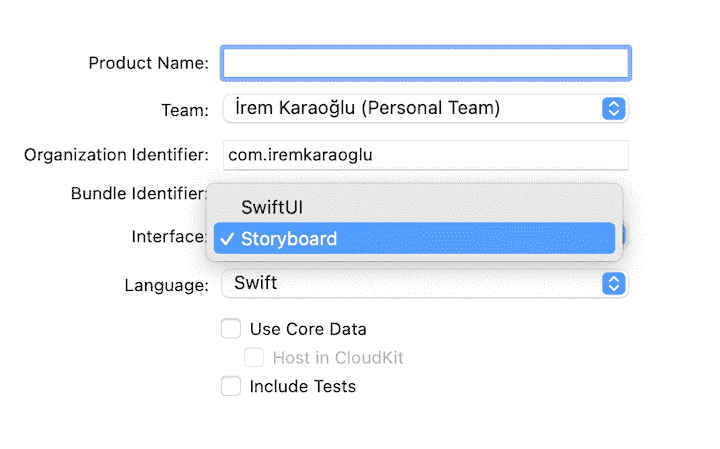
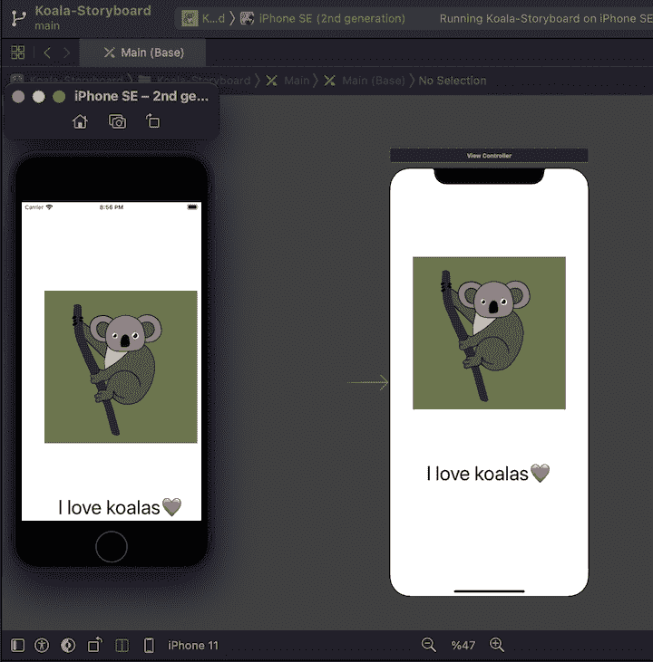
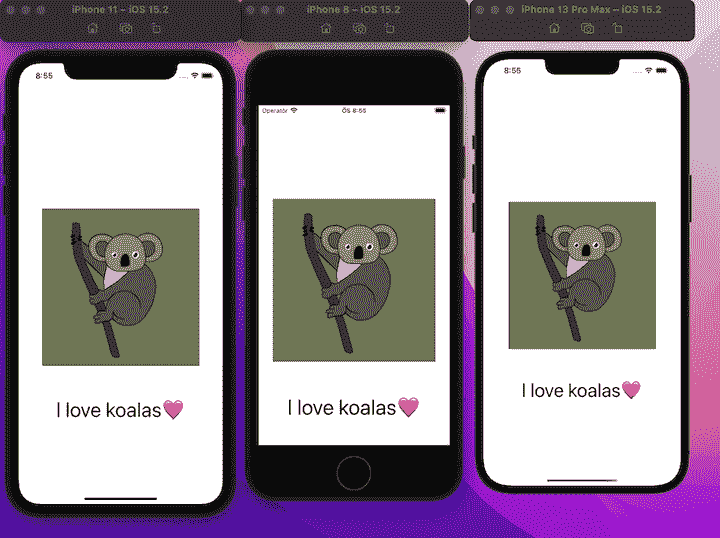
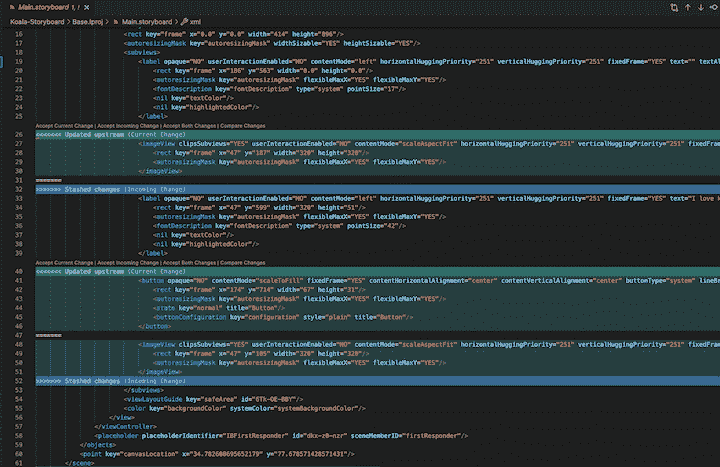
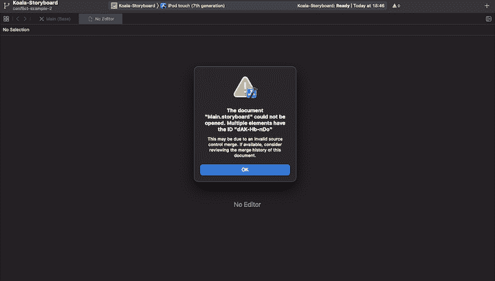
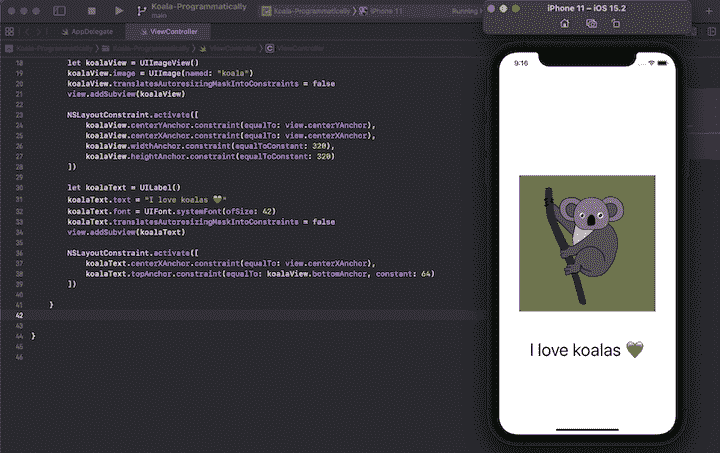

# iOS 应用程序 UI 设计的故事板与编程

> 原文：<https://blog.logrocket.com/storyboard-vs-programmatically-ios-ui-design/>

使用 UIKit 框架，有两个选项可用于为 iOS 应用程序创建 UI:故事板和编程。这两种方法都有几个优点。

当我第一次开始学习为 iOS 创建用户界面时，我不确定如何在使用故事板和以编程方式编写 UI 之间做出决定。然而，经过大量的研究和实际开发经验，我准备分享我所学到的东西，并提供一些见解和意见。

在本文中，我们将比较用故事板和编程方式为 iOS 创建 UI 的优缺点。我们将演示使用这两种方法编写相同的用户界面，我们还将讨论在某些情况下哪种方法更好。

让我们开始吧！

## 用故事板设计 iOS 用户界面

Storyboard 允许我们通过简单的拖放将 UI 元素添加到屏幕上。为了在 UIKit 中创建一个带有故事板的项目，我们在 Xcode 项目**界面**下拉菜单中选择**故事板**:



使用界面生成器，我们将 UI 元素添加到屏幕上，如下面的视频所示。我们点击 **+** 按钮，选择一个对象，然后将其拖放到屏幕上所需的位置。

 [https://www.youtube.com/embed/G8F02mxfiyE?version=3&rel=1&showsearch=0&showinfo=1&iv_load_policy=1&fs=1&hl=en-US&autohide=2&wmode=transparent](https://www.youtube.com/embed/G8F02mxfiyE?version=3&rel=1&showsearch=0&showinfo=1&iv_load_policy=1&fs=1&hl=en-US&autohide=2&wmode=transparent)

视频

### 用故事板创建一个示例用户界面

让我们创建一个名为`Koala-Storyboard`的示例项目。如下面的视频所示，我们将在界面生成器中添加一个考拉图片和文本“考拉”:

 [https://www.youtube.com/embed/HyhC_9vUFd4?version=3&rel=1&showsearch=0&showinfo=1&iv_load_policy=1&fs=1&hl=en-US&autohide=2&wmode=transparent](https://www.youtube.com/embed/HyhC_9vUFd4?version=3&rel=1&showsearch=0&showinfo=1&iv_load_policy=1&fs=1&hl=en-US&autohide=2&wmode=transparent)

视频

故事板使我们能够在几秒钟内将对象添加到 UI 中。我们只需将对象放在期望的位置，就完成了。然而，重要的是要理解这种方法不会自动产生响应式设计。

当我们在示例 iOS 设备画布上创建 UI，然后在不同的设备上构建应用程序时，最终结果可能会略有不同。

这里有一个例子可以说明这个问题:



这个 UI 是在 iPhone 11 画布上创建的(右图)，但在第二代 iPhone SE 上运行时看起来有所不同(左图)。

为了创建在所有设备上看起来都一样的 UI，我们必须为不同的 UI 元素添加关系约束，并使用 Interface Builder 的自动布局功能。自动布局自动调整用户界面的布局，以适应设备屏幕大小以及外部变化，如用户旋转设备或调整窗口大小。

首先，我们将添加一些约束，使不同的设备具有相同的 UI。我们将调整图像的大小，并将其放置在屏幕中央:

 [https://www.youtube.com/embed/5NUdTz4E9iU?version=3&rel=1&showsearch=0&showinfo=1&iv_load_policy=1&fs=1&hl=en-US&autohide=2&wmode=transparent](https://www.youtube.com/embed/5NUdTz4E9iU?version=3&rel=1&showsearch=0&showinfo=1&iv_load_policy=1&fs=1&hl=en-US&autohide=2&wmode=transparent)

视频

接下来，我们将把“我爱考拉”文本 64px 放置在图像下方:

 [https://www.youtube.com/embed/7ZTiMya32Dg?version=3&rel=1&showsearch=0&showinfo=1&iv_load_policy=1&fs=1&hl=en-US&autohide=2&wmode=transparent](https://www.youtube.com/embed/7ZTiMya32Dg?version=3&rel=1&showsearch=0&showinfo=1&iv_load_policy=1&fs=1&hl=en-US&autohide=2&wmode=transparent)

视频

这个过程使我们能够为 iPhone 11、iPhone 8 和 iPhone 13 Pro Max 等不同设备构建相同的 UI。每个设备都在屏幕中央显示图像，图像下方显示 64px 的文本:



App UI built in Storyboard, using the Interface Builder’s Auto Layout feature.

尽管故事板不会自动生成一个响应式的设计，但它是一个非常有用的原型制作方法。要创建演示或原型，我们只需选择适当的设备画布。

### 合并故事板中的冲突

合并冲突可能是故事板最大的缺点。合并冲突很容易发生，而且因为 Storyboard 实际上是一个 XML 文件，所以很难调试和解决冲突。

让我们回顾一个故事板合并冲突场景:

假设我们有两个开发人员:开发人员 A 和开发人员 b。他们都在一个特定的屏幕上工作。每个开发人员都有自己的分支，这些分支是从主分支创建的。

在开发过程中，会发生以下一系列事件:

1.  开发人员 A 将`imageView`(在本例中是考拉图像)向上移动一定数量的像素
2.  开发人员 B 添加了一个按钮，并将`imageView`向下移动了一定数量的像素
3.  开发者 B 的分支合并到主分支

这些事件之后，开发者 A 的分支在主分支后面，他们分支的代码库已经过时了。开发人员 A 试图将他们的分支与主分支合并，但是存在合并冲突:



Merge conflict shown in VS Code.

我们可以看到 VS 代码中的冲突。更新的流(显示为绿色)代表开发人员 B 的变更。隐藏的变更(显示为蓝色)代表开发人员 A 的变更。

尝试解决冲突有三个选项:

1.  接受最近的变更(开发人员 A 的变更)并丢失更新的流(开发人员 B 的变更)
2.  仅接受更新的流(开发人员 B 的更改)
3.  接受所有更改的行，不丢失任何更改

接受每一个更改(选项 3)最初可能看起来是最好的选择，但是首先，让我们仔细看看代码。

一个开发者将`imageView`上移，另一个开发者将其下移。该文件现在包含两个`imageViews`(在第 26 和 48 行)。由于两个`imageViews`有相同的 ID，当我们打开 Xcode 时，我们会看到一个错误:



Merge conflict error in Xcode.

合并冲突在开发中并不少见，在 Xcode 中也经常发生。Xcode 向 XML 文件添加一些引用和 id。因此，随着 UI 变得越来越复杂，XML 文件也变得越来越复杂。即使只有两个开发人员在同一个 UIKit Storyboard 项目上工作，也会面临合并冲突，这需要花费一些时间和精力来解决。

### 使用故事板设计 iOS 用户界面的利与弊

以下是故事板利弊的总结:

| 赞成的意见 | 面向连接的网络服务(Connection Oriented Network Service) |
| --- | --- |
| 向屏幕添加 UI 元素的简单选项(拖放) | 需要自动布局的约束(响应) |
| 原型创建的简单选项(静态 UI) | 困难的代码审查(XML 文件) |
| 提供 Xcode 上所有屏幕的可视化表示 | 难以解决合并冲突(XML 文件) |
|  | 一个以上的开发人员很难在同一个屏幕上工作 |
| 代码不可搜索 | 如果故事板组织得不好，性能(应用程序加载时间)会受到影响 |
|  | 不支持动画(任何动画都必须以编程方式添加) |
|  | 很难看到 UI 元素的属性 |
| 以编程方式设计 iOS 用户界面 | 以编程方式构建 UI 意味着用代码(确切地说是 Swift)创建用户界面，而不是使用界面构建器。 |

## 为了以编程方式在 UIKit 中创建一个项目，我们创建一个新的 Xcode 项目，并像以前一样选择**故事板**。默认情况下，Xcode 会创建一个故事板，并将其作为初始屏幕。我们转到**项目导航器**，删除任何对故事板的引用。我们还对`Info.plist`和`AppDelegate.swift`进行了一些配置更改，以移除故事板依赖性。对于这些配置更改的教程，[跟随此视频](https://www.youtube.com/watch?v=WoXn1fUe1K4)。

为了以编程方式构建 UI，我们首先创建一个 UI 元素的实例。然后，我们对实例在屏幕上的位置进行编码。

以编程方式创建示例用户界面

让我们以编程方式创建一个与`Koala-Storyboard`匹配的示例用户界面。

### 我们将使用以下 Swift 代码片段:

首先，我们创建一个名为`koalaView`的`UIImageView`。我们给它一个图像属性`UIImage`，和一个文件名`koala`。我们将这个子视图添加到父视图中。

然后，我们使用`NSLayoutConstraint`类来定位 UI 元素。我们通过指定 UI 元素的`centerYAnchor`和`centerXAnchor`值应该等于父元素(在本例中是屏幕的)`centerYAnchor`和`centerXAnchor`值，将 UI 元素放在屏幕的中心。就像我们对故事板的界面构建器所做的那样，我们将图像的宽度和高度指定为 320px。

```
let koalaView = UIImageView()
koalaView.image = UIImage(named: "koala")
koalaView.translatesAutoresizingMaskIntoConstraints = false
view.addSubview(koalaView)

NSLayoutConstraint.activate([
  koalaView.centerYAnchor.constraint(equalTo: view.centerYAnchor),
  koalaView.centerXAnchor.constraint(equalTo: view.centerXAnchor),
  koalaView.widthAnchor.constraint(equalToConstant: 320),
  koalaView.heightAnchor.constraint(equalToConstant: 320)
])

```

我们为“我爱考拉”文本创建一个`UILabel()`，并指定一个`UIFont`大小来匹配故事板示例中使用的大小。接下来，我们使用`centerXAnchor.constraint`来水平居中对齐文本(沿着 x 轴)。我们使用`topAnchor.constraint`将测试 64px 定位在图像的`bottomAnchor`下方。

下面是一个以编程方式创建的用户界面示例:

```
let koalaText = UILabel()
koalaText.text = "I love koalas ❤️"
koalaText.font = UIFont.systemFont(ofSize: 42)
koalaText.translatesAutoresizingMaskIntoConstraints = false
view.addSubview(koalaText)

NSLayoutConstraint.activate([
      koalaText.centerXAnchor.constraint(equalTo: view.centerXAnchor),
      koalaText.topAnchor.constraint(equalTo: koalaView.bottomAnchor, constant: 64)
])

```

***N.B.** ，苹果提供了`NSLayoutConstraint`类，用于约束 UI 元素之间的关系；然而，一些第三方库更容易提供相同的功能。最流行的库之一是 SnapKit。要了解更多关于 SnapKit 的信息，请查看 GitHub 上的[库。](https://github.com/SnapKit/SnapKit)*

以编程方式为 iOS 创建 UI 的利与弊



Demo of the app UI built programmatically.

下面总结了以编程方式构建 UI 的优缺点:

### 赞成的意见

面向连接的网络服务(Connection Oriented Network Service)

| 所有用户界面和屏幕控制都在一个地方 | 大多数开发人员发现编写代码比拖放代码更耗时 |
| --- | --- |
| 代码可以被搜索和重用 | 在代码运行之前，没有屏幕的可视化表示 |
| 有经验的开发人员可以轻松地重构代码，因为开发人员控制着 UI 元素 | 在旧代码或由其他开发人员编写的代码的情况下，潜在的复杂重构 |
| 更容易解决合并冲突 | 需要自动布局的约束(响应) |
| 易于查看 UI 元素的属性 | 支持添加动画 |
| 结论 | 在本文中，我们评估了使用 Storyboard 创建 iOS 应用程序用户界面和以编程方式构建的优缺点。我们展示了每种方法都是有利的，这取决于场景。这里是本文中使用的[故事板示例](https://github.com/iremkaraoglu/iOS-Storyboard-Example)和[编程示例](https://github.com/iremkaraoglu/iOS-ProgrammaticallyUI-Example)的存储库。 |
| 我推荐你习惯使用故事板和程序设计，这样你就可以在逐个项目的基础上决定使用哪种方法。 | 如果你有创建一个静态 UI 的冲动，并且是一个单独的开发者，故事板可能是最好的选择。故事板很快，没有其他开发人员参与项目，你不会面临合并冲突。 |

## 我希望你喜欢这篇文章。如果您有任何反馈或想分享这方面的知识，请随时在下面的评论中联系我，或直接发送[【电子邮件保护】](/cdn-cgi/l/email-protection)

使用 [LogRocket](https://lp.logrocket.com/blg/signup) 消除传统错误报告的干扰

[LogRocket](https://lp.logrocket.com/blg/signup) 是一个数字体验分析解决方案，它可以保护您免受数百个假阳性错误警报的影响，只针对几个真正重要的项目。LogRocket 会告诉您应用程序中实际影响用户的最具影响力的 bug 和 UX 问题。

然后，使用具有深层技术遥测的会话重放来确切地查看用户看到了什么以及是什么导致了问题，就像你在他们身后看一样。

LogRocket 自动聚合客户端错误、JS 异常、前端性能指标和用户交互。然后 LogRocket 使用机器学习来告诉你哪些问题正在影响大多数用户，并提供你需要修复它的上下文。

## 关注重要的 bug—[今天就试试 LogRocket】。](https://lp.logrocket.com/blg/signup-issue-free)

[](https://lp.logrocket.com/blg/signup)

[LogRocket](https://lp.logrocket.com/blg/signup) is a digital experience analytics solution that shields you from the hundreds of false-positive errors alerts to just a few truly important items. LogRocket tells you the most impactful bugs and UX issues actually impacting users in your applications.

Then, use session replay with deep technical telemetry to see exactly what the user saw and what caused the problem, as if you were looking over their shoulder.

LogRocket automatically aggregates client side errors, JS exceptions, frontend performance metrics, and user interactions. Then LogRocket uses machine learning to tell you which problems are affecting the most users and provides the context you need to fix it.

Focus on the bugs that matter — [try LogRocket today](https://lp.logrocket.com/blg/signup-issue-free).