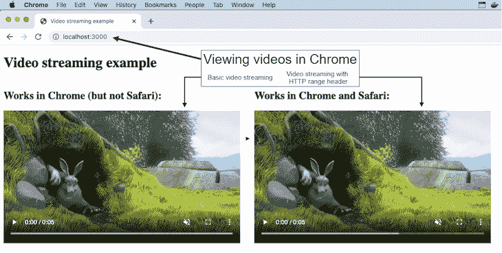
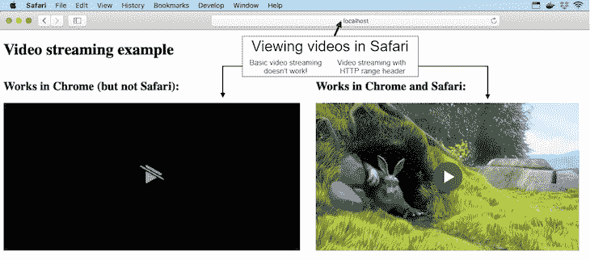
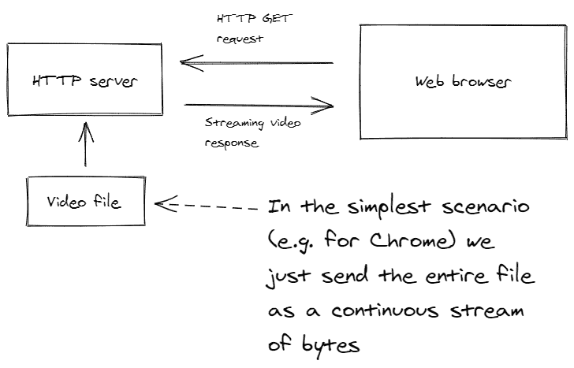
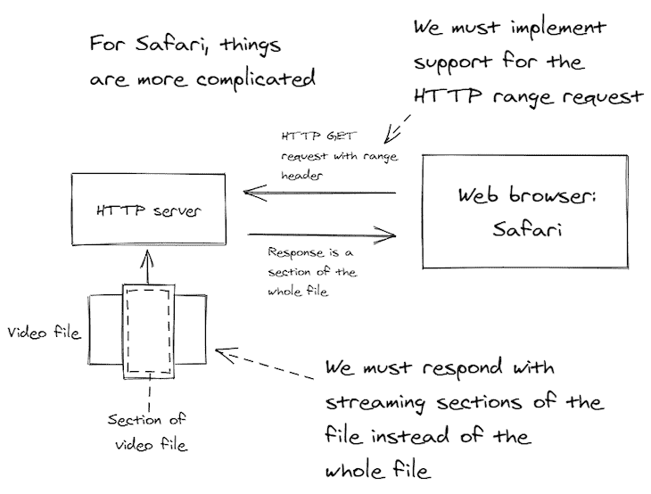

# Safari 中的流媒体视频:为什么这么难？- LogRocket 博客

> 原文：<https://blog.logrocket.com/streaming-video-in-safari/>

## 问题是

我最近在我的产品 [Sortal](https://www.sortal.io/) 中实现了对视频的人工智能标记的支持。该功能的一部分是，你可以播放你上传的视频。我想，没问题——视频流看起来很简单。

事实上，它是如此简单(只有几行代码)，以至于我在我的书 *[自举微服务](http://bit.ly/2o0aDsP)* 中选择了视频流作为例子的主题。

但当我们在 Safari 中进行测试时，我了解到了一个丑陋的事实。所以让我重新表述一下之前的断言:视频流对 Chrome 浏览器来说很简单，但对 T2 Safari 浏览器来说就不那么简单了。

为什么 Safari 这么难？如何才能让它在 Safari 中发挥作用？这些问题的答案在这篇博文中揭晓。

## 你自己试试吧

在我们开始一起看代码之前，请自己尝试一下！这篇博文附带的代码[可以在 GitHub](https://github.com/bootstrapping-microservices/video-streaming-example) 上获得。您可以[下载代码](https://github.com/bootstrapping-microservices/video-streaming-example/archive/master.zip)或者使用 Git 克隆存储库。你需要安装的 [Node.js 来试用它。](https://nodejs.org/en/download/)

按照自述文件中的说明[启动服务器，并在浏览器中导航至](https://github.com/bootstrapping-microservices/video-streaming-example/blob/master/README.MD)`[http://localhost:3000](http://localhost:3000)`。您将看到图 1 或图 2，这取决于您是在 Chrome 还是 Safari 中查看页面。

请注意，在图 2 中，当在 Safari 中查看网页时，左侧的视频不起作用。然而，右边的例子确实有效，这篇文章解释了我如何为 Safari 实现视频流代码的工作版本。



Figure 1: Video streaming example viewed in Chrome.



Figure 2: Video streaming example viewed in Safari. Notice that the basic video streaming on the left is not functional.

## 基本视频流

在 Chrome 中工作的视频流的基本形式在 HTTP 服务器中实现起来很简单。我们只是将整个视频文件从后端传输到前端，如图 3 所示。



Figure 3: Simple video streaming that works in Chrome.

### 在前端

为了在前端呈现视频，我们使用 HTML5 video 元素。没什么大不了的。清单 1 展示了它是如何工作的。这个版本只能在 Chrome 上使用。可以看到视频的`src`是由`/works-in-chrome`路由在后端处理的。

##### *清单 1:一个在 Chrome* 中呈现流媒体视频的简单网页

```
<!doctype html>
<html>
    <head>
        <meta charset="utf-8">
        <title>Video streaming example</title>
        </head>
    <body> 
        <video
            muted
            playsInline
            loop
            controls
            src="/works-in-chrome" 
            >
        </video>
    </body>
</html>

```

### 在后端

这个例子的后端是一个非常简单的 HTTP 服务器，构建在 Node.js 上运行的快速框架之上。这是执行`/works-in-chrome`路线的地方。

为了响应 HTTP GET 请求，我们将整个文件流式传输到浏览器。在这个过程中，我们设置了各种 HTTP 响应头。

`content-type`头被设置为`video/mp4`,所以浏览器知道它正在接收一个视频。

然后我们`stat`文件来获取它的长度，并将其设置为`content-length`头，这样浏览器就知道它接收了多少数据。

##### *清单 2:带有简单视频流的 Node.js Express web 服务器，适用于 Chrome*

```
const express = require("express");
const fs = require("fs");

const app = express();

const port = 3000;

app.use(express.static("public"));

const filePath = "./videos/SampleVideo_1280x720_1mb.mp4";

app.get("/works-in-chrome", (req, res) => {
    // Set content-type so the browser knows it's receiving a video.
    res.setHeader("content-type", "video/mp4"); 

    // Stat the video file to determine its length.
    fs.stat(filePath, (err, stat) => {
        if (err) {
            console.error(`File stat error for ${filePath}.`);
            console.error(err);
            res.sendStatus(500);
            return;
        }

        // Set content-length so the browser knows
        // how much data it is receiving.
        res.setHeader("content-length", stat.size);

        // Stream the video file directly from the 
        // backend file system.
        const fileStream = fs.createReadStream(filePath);
        fileStream.on("error", error => {
            console.log(`Error reading file ${filePath}.`);
            console.log(error);
            res.sendStatus(500);
        });

        // Pipe the file to the HTTP response.
        // We are sending the entire file to the 
        // frontend.
        fileStream.pipe(res);
    });
});

app.listen(port, () => {
    console.log(`Example app listening at http://localhost:${port}`)
});
```

## 但是在 Safari 里不行！

不幸的是，我们不能只是将整个视频文件发送到 Safari，并期望它能够工作。Chrome 可以应对，但 Safari 拒绝玩游戏。

### 少了什么？

Safari 不希望一次传送整个文件。这就是为什么流式传输整个文件的暴力策略不起作用。

Safari 希望对文件的某些部分进行流式处理，以便以渐进的方式对其进行增量缓冲。它还希望对文件的任何部分进行随机、专门的访问。

这其实是有道理的。想象一下，一个用户想要将视频倒回一点——你不会想要重新开始整个文件流吧？

相反，Safari 只是想退回一点，再次请求文件的那一部分。事实上，这在 Chrome 中也适用。尽管基本的流媒体视频可以在 Chrome 中工作，但 Chrome 确实可以发出 HTTP 范围请求，以便更有效地处理流媒体视频。

图 4 向您展示了这是如何工作的。我们需要修改我们的 HTTP 服务器，这样我们就可以根据浏览器的请求提供文件的随机访问部分，而不是将整个视频文件传输到前端。



Figure 4: For video streaming to work in Safari, we must support HTTP range requests that can retrieve a portion of the video file instead of the whole file.

### 支持 HTTP 范围请求

具体来说，我们必须支持 HTTP 范围请求。但是我们如何实施呢？

令人惊讶的是，这方面的可读文档很少。当然，我们可以阅读 HTTP 规范，但是谁有时间和动机去做呢？(我会在本文末尾给你参考资料的链接。)

相反，请允许我向您介绍一下我的实现。它的关键是以前缀`"bytes="`开始的 HTTP 请求`range`头。

这个头是前端如何要求从视频文件中检索特定范围的字节。您可以在清单 3 中看到我们如何解析这个头的值来获得字节范围的开始和结束值。

* * *

### 更多来自 LogRocket 的精彩文章:

* * *

##### *清单 3:解析 HTTP 范围头*

```
const options = {};

let start;
let end;

const range = req.headers.range;
if (range) {
    const bytesPrefix = "bytes=";
    if (range.startsWith(bytesPrefix)) {
        const bytesRange = range.substring(bytesPrefix.length);
        const parts = bytesRange.split("-");
        if (parts.length === 2) {
            const rangeStart = parts[0] && parts[0].trim();
            if (rangeStart && rangeStart.length > 0) {
                options.start = start = parseInt(rangeStart);
            }
            const rangeEnd = parts[1] && parts[1].trim();
            if (rangeEnd && rangeEnd.length > 0) {
                options.end = end = parseInt(rangeEnd);
            }
        }
    }
}
```

### 响应 HTTP HEAD 请求

HTTP HEAD 请求是前端如何探测后端关于特定资源的信息。我们应该小心处理这件事。

Express 框架还将 HEAD 请求发送到我们的 HTTP GET 处理程序，因此我们可以检查`req.method`并在我们做 HEAD 请求不必要的工作之前从请求处理程序返回`early` 。

清单 4 显示了我们如何响应 HEAD 请求。我们不需要从文件中返回任何数据，但是我们需要配置响应头来告诉前端我们支持 HTTP 范围请求，并让它知道视频文件的完整大小。

这里使用的`accept-ranges`响应头表示这个请求处理程序可以响应 HTTP 范围请求。

##### *清单 4:响应 HTTP HEAD 请求*

```
if (req.method === "HEAD") {
    res.statusCode = 200;

// Inform the frontend that we accept HTTP 
// range requests.
    res.setHeader("accept-ranges", "bytes");

    // This is our chance to tell the frontend
    // the full size of the video file.
    res.setHeader("content-length", contentLength);

    res.end();
}
else {        
    // ... handle a normal HTTP GET request ...
}
```

### 完整文件与部分文件

现在是棘手的部分。我们是发送整个文件还是发送文件的一部分？

只要稍加小心，我们就可以让请求处理程序支持这两种方法。您可以在清单 5 中看到，当它是一个范围请求并且那些变量被定义时，我们如何从开始和结束变量计算`retrievedLength`;否则，当它不是一个范围请求时，我们就使用`contentLength`(整个文件的大小)。

##### *清单 5:根据请求的文件部分确定内容长度*

```
let retrievedLength;
if (start !== undefined && end !== undefined) {
    retrievedLength = (end+1) - start;
}
else if (start !== undefined) {
    retrievedLength = contentLength - start;
}
else if (end !== undefined) {
    retrievedLength = (end+1);
}
else {
    retrievedLength = contentLength;
}
```

### 发送状态代码和响应标头

我们已经处理了头的请求。剩下要处理的就是 HTTP GET 请求了。

清单 6 显示了我们如何发送适当的成功状态代码和响应头。

根据这是对整个文件的请求还是对文件一部分的范围请求，状态代码会有所不同。如果是范围请求，状态码会是 206(针对部分内容)；否则，我们使用常规的旧成功状态代码 200。

##### *清单 6:发送响应头*

```
// Send status code depending on whether this is
// request for the full file or partial content.
res.statusCode = start !== undefined || end !== undefined ? 206 : 200;

res.setHeader("content-length", retrievedLength);

if (range !== undefined) {  
    // Conditionally informs the frontend what range of content
    // we are sending it.
    res.setHeader("content-range", 
           `bytes ${start || 0}-${end || (contentLength-1)}/${contentLength}`
       );
    res.setHeader("accept-ranges", "bytes");
}
```

### 流式传输文件的一部分

现在是最简单的部分:流式传输文件的一部分。清单 7 中的代码与清单 2 中的基本视频流示例中的代码几乎相同。

现在不同的是，我们传入的是`options`对象。方便地，来自[node . js’文件系统模块](https://nodejs.org/api/fs.html)的`[createReadStream](https://nodejs.org/api/fs.html#fs_fs_createreadstream_path_options)`函数获取`options`对象中的`start`和`end`值，这使得能够从硬盘驱动器中读取文件的一部分。

在 HTTP 范围请求的情况下，清单 3 中前面的代码已经解析了来自头部的`start`和`end`值，我们将它们插入到了`options`对象中。

在普通 HTTP GET 请求(不是范围请求)的情况下，`start`和`end`不会被解析，也不会在`options`对象中，在这种情况下，我们只是读取整个文件。

##### *清单 7:流式传输文件的一部分*

```
const fileStream = fs.createReadStream(filePath, options);
fileStream.on("error", error => {
    console.log(`Error reading file ${filePath}.`);
    console.log(error);
    res.sendStatus(500);
});

fileStream.pipe(res);
```

### 把所有的放在一起

现在，让我们将所有代码放入一个完整的请求处理程序，用于在 Chrome 和 Safari 中都能工作的流媒体视频。

清单 8 是从清单 3 到清单 7 的组合代码，因此您可以在上下文中看到全部内容。这个请求处理程序可以以两种方式工作。如果浏览器请求，它可以检索视频文件的一部分。否则，它将检索整个文件。

##### *清单 8:完整的 HTTP 请求处理程序*

```
app.get('/works-in-chrome-and-safari', (req, res) => {

    // Listing 3.
    const options = {};

    let start;
    let end;

    const range = req.headers.range;
    if (range) {
        const bytesPrefix = "bytes=";
        if (range.startsWith(bytesPrefix)) {
            const bytesRange = range.substring(bytesPrefix.length);
            const parts = bytesRange.split("-");
            if (parts.length === 2) {
                const rangeStart = parts[0] && parts[0].trim();
                if (rangeStart && rangeStart.length > 0) {
                    options.start = start = parseInt(rangeStart);
                }
                const rangeEnd = parts[1] && parts[1].trim();
                if (rangeEnd && rangeEnd.length > 0) {
                    options.end = end = parseInt(rangeEnd);
                }
            }
        }
    }

    res.setHeader("content-type", "video/mp4");

    fs.stat(filePath, (err, stat) => {
        if (err) {
            console.error(`File stat error for ${filePath}.`);
            console.error(err);
            res.sendStatus(500);
            return;
        }

        let contentLength = stat.size;

        // Listing 4.
        if (req.method === "HEAD") {
            res.statusCode = 200;
            res.setHeader("accept-ranges", "bytes");
            res.setHeader("content-length", contentLength);
            res.end();
        }
        else {       
            // Listing 5.
            let retrievedLength;
            if (start !== undefined && end !== undefined) {
                retrievedLength = (end+1) - start;
            }
            else if (start !== undefined) {
                retrievedLength = contentLength - start;
            }
            else if (end !== undefined) {
                retrievedLength = (end+1);
            }
            else {
                retrievedLength = contentLength;
            }

            // Listing 6.
            res.statusCode = start !== undefined || end !== undefined ? 206 : 200;

            res.setHeader("content-length", retrievedLength);

            if (range !== undefined) {  
                res.setHeader("content-range", `bytes ${start || 0}-${end || (contentLength-1)}/${contentLength}`);
                res.setHeader("accept-ranges", "bytes");
            }

            // Listing 7.
            const fileStream = fs.createReadStream(filePath, options);
            fileStream.on("error", error => {
                console.log(`Error reading file ${filePath}.`);
                console.log(error);
                res.sendStatus(500);
            });

            fileStream.pipe(res);
        }
    });
});
```

### 更新的前端代码

除了确保`video`元素指向可以处理 HTTP 范围请求的 HTTP 路由之外，前端代码不需要做任何修改。

清单 9 显示我们简单地将视频元素重新路由到一个名为`/works-in-chrome-and-safari`的路径。这个前端在 Chrome 和 Safari 中都可以工作。

##### *清单 9:更新前端代码*

```
<!doctype html>
<html>
    <head>
        <meta charset="utf-8">
        <title>Video streaming example</title>
        </head>
    <body> 
        <video
            muted
            playsInline
            loop
            controls
            src="/works-in-chrome-and-safari" 
            >
        </video>
    </body>
</html>
```

## 结论

尽管视频流在 Chrome 上很容易实现，但在 Safari 上却很难实现——至少如果你试图自己根据 HTTP 规范来实现的话。

幸运的是，我已经走过了这条路，这篇博客文章已经为你自己的流媒体视频实现打下了基础。

## 资源

使用 [LogRocket](https://lp.logrocket.com/blg/signup) 消除传统错误报告的干扰

## [LogRocket](https://lp.logrocket.com/blg/signup) 是一个数字体验分析解决方案，它可以保护您免受数百个假阳性错误警报的影响，只针对几个真正重要的项目。LogRocket 会告诉您应用程序中实际影响用户的最具影响力的 bug 和 UX 问题。

[](https://lp.logrocket.com/blg/signup)

然后，使用具有深层技术遥测的会话重放来确切地查看用户看到了什么以及是什么导致了问题，就像你在他们身后看一样。

LogRocket 自动聚合客户端错误、JS 异常、前端性能指标和用户交互。然后 LogRocket 使用机器学习来告诉你哪些问题正在影响大多数用户，并提供你需要修复它的上下文。

专注于重要的 bug-[试试今天的 log 火箭](https://lp.logrocket.com/blg/signup-issue-free)。

Focus on the bugs that matter — [try LogRocket today](https://lp.logrocket.com/blg/signup-issue-free).