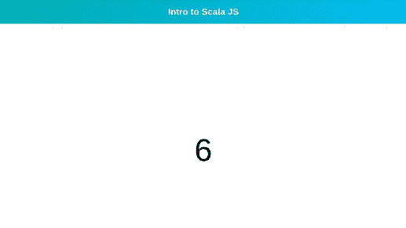

# 使用 Scala.js 的强类型前端代码

> 原文：<https://blog.logrocket.com/strongly-typed-frontend-code-scala-js/>

JavaScript 最初是为在网站上实现用户交互和添加动画等浏览器效果而定制的，现在已经成为最重要和最广泛使用的编程语言之一。

然而，随着世界对网络依赖的增长，JavaScript 被迫做比基本浏览器效果更多的事情，到目前为止，这种语言已经很好地满足了人们的期望。毫无疑问，如果从一开始就理解这种责任，这种语言会更适合于满足这些新的要求。

## 网络对 Scala 的需求

在开始使用 JavaScript 构建大型复杂的 web 应用程序之前，您可能不会质疑它的能力。动态类型最初是 JavaScript 的一个优势，但在现代 web 开发中却成了它的一个巨大劣势。

在运行时将类型推断留给解释器会导致许多错误，这些错误是由不正确的假设引起的。这在开发过程中引入了许多顾虑，因为开发人员可能不确定他们是否做对了变量声明、值赋值或数据类型的正确使用。

这就是 [Scala.js](https://github.com/scala-js/scala-js) 大放异彩的地方。它强大的类型系统将防止你在编译期间犯这些错误，当你在 [VS Code](https://marketplace.visualstudio.com/items?itemName=scalameta.metals) 或 [IntelliJ IDEA](https://plugins.jetbrains.com/plugin/1347-scala) 中安装 Scala 插件时，你的 IDE 甚至能在你编译代码之前就指出它们。在开发过程中有这种类型的帮助，可以更轻松地编写和重构代码。

您可以使用 Scala 进行前端开发，但您不再被迫使用 Node.js 进行后端开发，因为您希望维护服务器和前端之间的共享代码。现在，您可以用 Scala 编写后端和前端代码，并利用 Scala 作为编程语言的所有优势，以及用于 web 开发的 JVM 库甚至 npm 工具。

让我们通过构建一个基于 web 的倒计时器来学习 Scala.js。我们最终的应用程序将如下所示:



## Scala.js 设置

要设置 Scala.js，我们需要安装我们的 Scala 构建工具和编译器 [sbt](https://www.scala-sbt.org/1.x/docs/Setup.html) 。为了让 sbt 工作，我们还需要安装 [Java 开发工具包(JDK)](https://www.oracle.com/java/technologies/javase/javase-jdk8-downloads.html) 。

接下来，我们将通过在终端上运行以下代码来确认我们已经安装了 Node.js:

```
node -v
```

这将返回当前安装在您机器上的 Node.js 版本。如果你得到一个错误，这里有[下载链接](https://nodejs.org/en/download/)。

在我们成功设置了 sbt 之后，我们将继续为我们的应用程序创建一个新目录。接下来，我们将在应用程序的根目录下创建一个名为`project`的文件夹，然后在`project`文件夹下为我们的插件创建一个文件:`./project/plugins.sbt`。

让我们将下面一行粘贴到我们的`plugins.sbt`文件中。这将把`sbt`插件添加到我们的项目中:

```
addSbtPlugin("org.scala-js" % "sbt-scalajs" % "1.1.0")
```

值得注意的是，我们的`sbt`编译器将会寻找一个`./project/plugins.sbt`文件。还要记住`project`并不是直接指我们的根；相反，它是我们根目录下的一个文件夹。

## 在 Scala.js 中管理依赖关系

接下来，在我们的根目录中，我们将创建一个`build.sbt`文件。如果您来自节点/JavaScript 后台，这就像是`package.json`文件。在这里，我们将存放我们的应用程序描述和项目依赖关系:

```
name := "Scala.js test-app"
scalaVersion := "2.13.1"

enablePlugins(ScalaJSPlugin)
```

我们在这里定义的`name`和`scalaVersion`非常重要，因为它们将决定 sbt 在将 Scala 代码编译成 JavaScript 时使用的文件名/路径。根据我们在这里的定义，我们的 JavaScript 代码将在`./target/scala-2.13/scala-js-test-app-fastopt.js`中生成。我们一会儿将处理`fastopt`后缀。

我们还启用了最初添加到`./project/plugins.sbt`文件中的`ScalaJSPlugin`。

## 使用 HTML 文件

现在我们知道了 JavaScript 文件路径在编译时的样子，我们可以继续创建我们的`index.html`文件，并将我们的 JS 文件作为`<script />`引用。让我们在根目录下创建`index.html`文件，并粘贴以下代码:

```
<!DOCTYPE html>
<html>
  <head>
    <meta charset="UTF-8">
    <title>Scala JS App</title>
    <link rel="stylesheet" href="./assets/index.css">
  </head>
  <body>
    <div id="root"></div>
    <script type="text/javascript" src="./target/scala-2.13/scala-js-test-app-fastopt.js"></script>
  </body>
</html>
```

注意，我们还在`./assets/index.css`中链接了一个`stylesheet`文件。我们将在用 Scala 构建完计时器应用程序后创建这个文件。

## 使用 Scala 文件

接下来，我们将在目录`./src/main/scala`中创建一个`index.scala`文件。这个目录是`sbt`在寻找我们要编译的 Scala 代码时要去的地方。

在我们的`index.scala`文件中，让我们定义一个函数`main`。这是我们想要存放代码的地方。在 Scala 中，值、函数和变量需要包装在一个类中。因为我们只需要实例化这个类一次，所以我们将使用`object`关键字来创建一个 [singleton](https://en.wikipedia.org/wiki/Singleton_pattern#:~:text=In%20software%20engineering%2C%20the%20singleton,mathematical%20concept%20of%20a%20singleton.) :

```
object Main {
  def main(args: Array[String]): Unit = {
    println("Hey there!")
  }
}
```

在上面的块中，我们定义了一个`Main`对象，然后在其中定义了一个`main`方法。`def`关键字用于在 Scala 中定义函数，而`println()`在编译成 JavaScript 时会像`console.log()`一样工作。

让我们在终端上使用以下代码运行我们的`sbt`构建工具:

```
$ sbt
```

如果`sbt`成功启动，您应该会收到类似如下的消息:

```
[info] sbt server started at local:///.../.sbt/1.0/server/a1b737386b81d864d930/sock
sbt:Scala.js test-app>
```

接下来，为了在我们的终端上运行我们的`index.scala`文件，我们将在`sbt` shell 中使用`run`命令。我们的编译器将寻找一个带有`Array[String]`类型的`args`参数的`main`模块。return `Unit`类型就像 TypeScript 中的`[void](https://www.typescriptlang.org/docs/handbook/basic-types.html#void)`类型一样工作。Scala 中常见的其他[类型有`Int`、`String`、`Boolean`、`Long`、`Float`和`Any`类型。](https://intellipaat.com/blog/tutorial/scala-tutorial/basic-types-in-scala/)

```
sbt:Scala.js test-app> run
```

我们的终端应该向我们显示类似这样的内容:

```
[info] Running Main. Hit any key to interrupt.
Hey there
[success] Total time: 6 s, completed Jun 15, 2020, 1:01:28 PM
sbt:Scala.js test-app>
```

在我们在浏览器中测试我们的代码之前，让我们告诉`sbt`在我们编译的 JavaScript 代码的末尾初始化(或调用)我们的`main`函数，方法是在我们的`./build.sbt`文件的末尾添加下面一行:

```
scalaJSUseMainModuleInitializer := true
```

## 用 Scala.js 编译和优化 JavaScript

接下来，我们将在我们的`sbt` shell 中运行`fastOptJS`来重新编译我们的 JavaScript 文件。每当我们对 Scala 文件进行修改时，我们都会使用`fastOptJS`命令来编译我们的代码:

```
sbt:Scala.js test-app> fastOptJS
```

如果我们想在修改时自动重新编译，我们也可以使用`~fastOptJS`——这类似于 Node.js 的`nodemon`。如果我们的编译成功，我们应该得到类似如下的响应:

```
sbt:Scala.js test-app> ~fastOptJS
[success] Total time: 1 s, completed Jun 15, 2020, 1:39:54 PM
[info] 1\. Monitoring source files for scalajs-app/fastOptJS...
[info]    Press <enter> to interrupt or '?' for more options.
```

现在，当我们在浏览器上运行我们的`index.html`文件并打开开发人员控制台时，我们应该会看到我们记录的消息:`Hey there!`

注意`fastOptJS`代表“快速优化 JS。”考虑到编译速度，最好在开发过程中使用。对于我们的生产环境，我们必须使用完全优化版本的编译 JS。

如果您猜对了，我们将运行`fullOptJS`，而不是在我们的`sbt` shell 中运行`fastOptJS`。这编译成 5.42KB，而不是我们从`fastOpt`得到的 54.25KB。我们还需要将`index.html`中的`src`改成`./target/scala-2.13/scala-js-test-app-opt.js`。

## 使用 DOM

如果没有文档对象模型(DOM ),在浏览器上使用 Scala.js 没有多大意义，除非我们想告诉用户无论何时访问我们的站点都要打开开发人员控制台。要为浏览器 DOM 操作设置 Scala.js，让我们将`scalajs-dom`依赖项添加到我们的`./build.sbt`文件中:

```
libraryDependencies += "org.scala-js" %%% "scalajs-dom" % "1.0.0"
```

添加完依赖项后，我们的`./build.sbt`文件应该如下所示:

```
name := "Scala.js test-app"
scalaVersion := "2.13.1"

enablePlugins(ScalaJSPlugin)
scalaJSUseMainModuleInitializer := true

libraryDependencies += "org.scala-js" %%% "scalajs-dom" % "1.0.0"
```

就像我们在 JavaScript 中导入模块一样，让我们在`index.scala`文件中导入`document`对象:

```
import org.scalajs.dom.{ document, window }
```

Scala.js 中的析构也类似于 JavaScript。现在，我们可以通过`document`对象访问浏览器文档属性，通过`window`对象访问`window`属性。

让我们通过在浏览器页面而不是开发人员控制台中显示欢迎消息来测试这一点:

```
import org.scalajs.dom.{ document, window, raw }

object Main {
  def main(args: Array[String]): Unit = {
    val title: raw.Element = document.createElement("h1")
    title.textContent = "Hey there! Welcome!"
    document.body.appendChild(title)
  }
}
```

在上面的块中，我们用`val`定义了一个变量`title`。在 Scala 中，`val`关键字用于定义不可变变量，而`var`关键字定义可变变量——就像 JavaScript 中的`const`和`let`关键字一样。我们还向我们的`dom`导入添加了`raw`属性，并使用它的`Element`属性作为`title`的类型。

现在，当我们编译我们的代码并在浏览器中打开`./index.html`时，我们应该会看到一个带有消息“嘿，你好！欢迎！”

## 在 Scala.js 中使用模板引擎

在 Scala 中使用 DOM 有一种更简单的方法。让我们看看如何使用模板引擎在 Scala 中编写 HTML，甚至模块化我们的代码。对于本教程的这一部分，我们将使用`scalatags`模板引擎来构建一个倒计时应用程序。

* * *

### 更多来自 LogRocket 的精彩文章:

* * *

我们还将展示如何通过将 navbar 和 countdown 部分作为不同的包写在它们自己的 Scala 文件中，来将我们的代码分成模块。

让我们从将`scalatags`依赖项添加到我们的`./build.sbt`文件开始:

```
libraryDependencies += "com.lihaoyi" %%% "scalatags" % "0.9.1"
```

注意我们这里用的版本，`0.9.1`。根据您何时阅读本教程，这个版本可能与 Scala.js 的最新版本不兼容。在这种情况下，您需要使用更高版本的`scalatags`或我们在这里使用的相同版本的 Scala.js。

接下来，我们将在`./src/main/scala`文件夹中创建 navbar 包。我们把这个文件命名为`nav.scala`。在`nav.scala`内部，我们将粘贴以下代码:

```
package nav

import scalatags.JsDom.all._

object nav {
  val default =
    div(cls := "nav",
      h1(cls := "title", "Intro to Scala JS")
    )
}
```

在第 1 行，我们开始使用`package`关键字来命名我们的`nav`模块。当我们想要在`index.scala`文件中导入`nav`时，我们将需要这个。此外，我们还引进了`scalatags`。import 语句中的`._`后缀将`scalatags.JsDom.all`中的 DOM 属性作为析构变量导入。

在`scalatags`中，每个标签都是一个函数。父子关系被定义为函数参数，兄弟关系用函数参数中的`comma`分隔。我们还将属性声明为函数参数。这里，我们使用了`cls`关键字来定义我们的`div`和`h1`标签的类。

## 将我们的方案付诸行动

因为我们已经在第 1 行用关键字`package`命名了我们的模块，所以没有必要导出对象。通过导入`nav`，我们可以在任何 Scala 文件中使用它。用以下代码替换`index.scala`文件中的现有代码，看看这是如何实现的:

```
import org.scalajs.dom.document
import scalatags.JsDom.all._
import nav._

object Main {
  def main(args: Array[String]): Unit = {
    val content =
      div(cls:="container",
        nav.default,
      )
    val root = document.getElementById("root")
    root.appendChild(content.render)
  }
}
```

在上面的代码中，我们在第 3 行导入了我们的`nav`包，然后我们使用在`nav.scala`文件中创建的默认变量作为第 9 行的`div`的内容。在第 12 行，我们已经将`content`变量添加到了`index.html`文件中 ID 为`"root"`的 div 中。

现在，让我们在根目录的`./assets`文件夹中创建我们的样式文件`index.css`。接下来，将以下代码粘贴到其中:

```
* {
  margin: 0;
}
.container {
  font-family: Arial, Helvetica, sans-serif;
  text-align: center;
  margin: unset;
}
.nav {
  background: linear-gradient(90deg, #04adad 0%, #00bdff);
  color: #fff;
  padding: 1.5em;
}
.nav .title {
  font-size: 2em;
}
#timer {
  font-size: 7em;
  margin-top: 20%;
}
```

现在，当我们重新编译我们的代码并在浏览器中运行`index.html`文件时，我们应该会看到类似这样的内容:


接下来，我们将研究我们的倒计时模块。让我们在`./src/main/scala`文件夹中创建一个新文件`countdown.scala`。我们将在新文件中粘贴以下代码:

```
package countdown

import org.scalajs.dom.{ document, window }

object countdown {
  def timer(): Unit = {
    var time: Int = document.getElementById("timer").innerHTML.toInt
    if (time > 0) time -= 1
    else {
      window.alert("times up!")
      time = 60
    }
    document.getElementById("timer").innerHTML = time.toString;
  }
}
```

从我们的代码中可以看出，JavaScript 和 Scala 有很多相似之处。在第 7 行，我们使用`var`关键字声明了`time`变量。这引用了一个 ID 为`"timer"`的`div`，我们马上就会创建它。由于`.innerHTML`返回一个`String`，我们使用`.toInt`方法将时间值转换成一个`Integer`。

在第 8–12 行，我们使用了`if-else`条件，这与 JavaScript 的条件非常相似。如果时间值大于`0`，我们希望将时间值减少`1`，并显示一个警告框，提示“时间到了！”当等于`0`时。然后我们将时间值重置为`60`。

## 将这一切结合在一起

现在我们已经创建了我们的`countdown`包，我们将使用`setInterval`方法每隔`1`秒运行一次我们的`timer`函数。让我们使用`index.scala`文件中的`countdown`包:

```
import org.scalajs.dom.document
import scalatags.JsDom.all._
import nav._
import countdown._

object Main {
  def main(args: Array[String]): Unit = {
    val content =
      div(cls:="container",
        nav.default,
        div(id:="timer", 60)
      )
    val root = document.getElementById("root")
    root.appendChild(content.render)
  }
}
```

在上面的代码中，我们已经使用`import countdown._`为`countdown`添加了导入语句。这样，我们可以使用`countdown.timer()`调用`timer`函数。

或者，我们可以用`import countdown.countdown.timer`导入定时器函数，在我们的`index.scala`文件中直接调用它作为`timer()`。我们还添加了 ID 为`"timer"`的`div`，并赋予它默认值`60`。

接下来，我们将从`scala.scalajs.js.timers`导入`setInterval`方法，并用它来调用`countdown.timer()`方法:

```
...
import scala.scalajs.js.timers.setInterval
...
root.appendChild(content.render)
setInterval(1000) {countdown.timer}

```

最后，我们的`index.scala`文件应该是这样的:

```
import org.scalajs.dom.document
import scalatags.JsDom.all._
import scala.scalajs.js.timers.setInterval
import nav._
import countdown._

object Main {
  def main(args: Array[String]): Unit = {
    val content =
      div(cls:="container",
        nav.default,
        div(id:="timer", 60)
      )
    val root = document.getElementById("root")
    root.appendChild(content.render)
    setInterval(1000) {countdown.timer}
  }
}
```

现在，当我们使用`fastOptJS`重新编译我们的代码并在浏览器中运行我们的`index.html`文件时，我们应该会看到类似这样的内容:


## 结论

在本文中，我们通过构建基于 web 的倒计时器介绍了 Scala.js。我们讲述了 Scala 编程语言的基础知识，如何使用 DOM、浏览器 API、使用像`scalatags`这样的模板引擎，以及将 Scala 代码编译成 JavaScript 的不同选项。

Scala.js 还支持前端框架，如 [React](https://github.com/japgolly/scalajs-react) 、 [Vue](https://github.com/fancellu/scalajs-vue) 和 [Angular](https://github.com/greencatsoft/scalajs-angular) 。您会发现设置与我们在本文中所做的非常相似，使用它们应该与您在 JavaScript 中所习惯的没有什么不同。

与 TypeScript 等类型检查工具相比，如果您来自 JavaScript 背景，Scala.js 可能更难设置和习惯，但这是因为 Scala 是一种完全不同的语言。一旦你度过了设置和学习一门新编程语言的初级阶段，你会发现它提供的不仅仅是类型检查。

最后，[这里有一个到我们的演示应用程序的 GitHub repo 的链接](https://github.com/ebenezerdon/scala-js-timer)。

## 您是否添加了新的 JS 库来提高性能或构建新特性？如果他们反其道而行之呢？

毫无疑问，前端变得越来越复杂。当您向应用程序添加新的 JavaScript 库和其他依赖项时，您将需要更多的可见性，以确保您的用户不会遇到未知的问题。

LogRocket 是一个前端应用程序监控解决方案，可以让您回放 JavaScript 错误，就像它们发生在您自己的浏览器中一样，这样您就可以更有效地对错误做出反应。

[](https://lp.logrocket.com/blg/javascript-signup)[https://logrocket.com/signup/](https://lp.logrocket.com/blg/javascript-signup)

[LogRocket](https://lp.logrocket.com/blg/javascript-signup) 可以与任何应用程序完美配合，不管是什么框架，并且有插件可以记录来自 Redux、Vuex 和@ngrx/store 的额外上下文。您可以汇总并报告问题发生时应用程序的状态，而不是猜测问题发生的原因。LogRocket 还可以监控应用的性能，报告客户端 CPU 负载、客户端内存使用等指标。

自信地构建— [开始免费监控](https://lp.logrocket.com/blg/javascript-signup)。