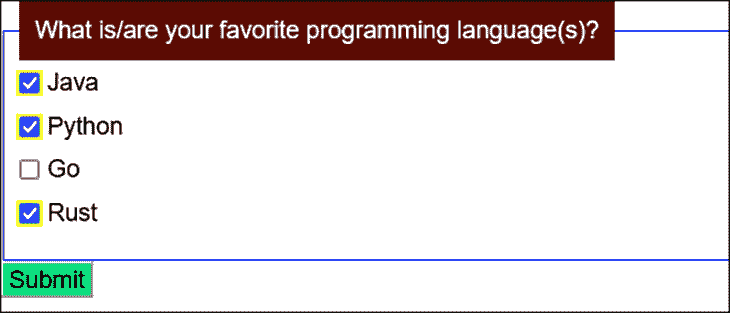
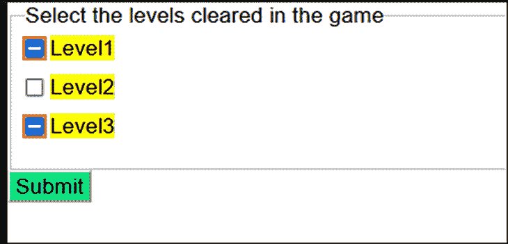
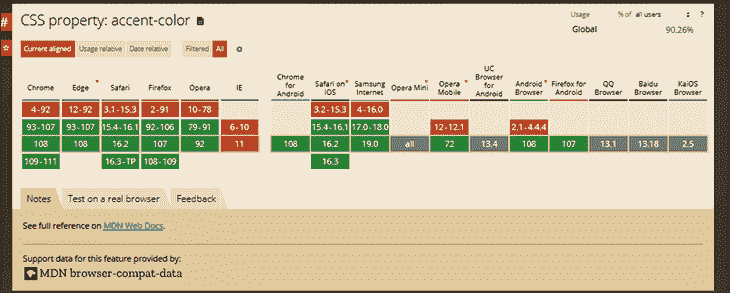
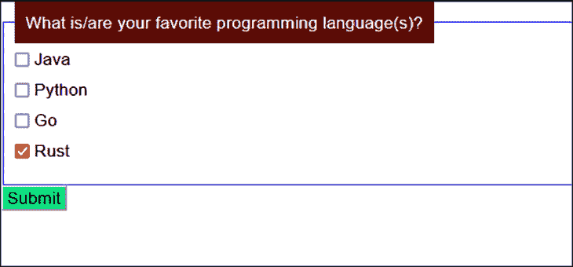
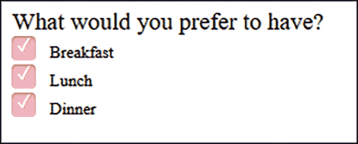

# 用 CSS 属性设置复选框的样式

> 原文：<https://blog.logrocket.com/styling-checkboxes-css-properties/>

复选框是表单和调查中常用的元素。无论是作为机票预订表单的一部分，接受用户输入，还是在在线产品调查中接受反馈，复选框都是接受用户多项选择的简单方法。HTML 输入元素复选框用于在网页上呈现复选框。

web 设计人员和开发人员必须充分利用 CSS 提供的样式特性，以确保用户拥有良好的视觉体验。与其他 HTML 元素类似，复选框也可以设计成更吸引人的样式。

颜色、字体、边框、宽度和高度等 CSS 属性不适用于复选框。在这篇文章中，我们将讨论你可以应用于复选框的 CSS 属性，以及它们对你的用户界面/UX 做出有益补充的场景。

*向前跳转:*

## 使用 CSS 伪选择器

对复选框进行样式化的最简单也是最常见的方法之一是利用`input[type=checkbox]`或[伪选择器](https://blog.logrocket.com/css-pseudo-elements-guide/)根据特定状态设置 CSS 属性的样式。

考虑下面的例子。这里，我们将所有复选框的轮廓设计为黑色，宽度为`3px`，而不考虑它们的状态。

```
<fieldset>
  <legend>What is/are your favorite programming language(s)?</legend>
  <div>
    <input type="checkbox" id="lang1" name="lang1" value="Java">
    <label for="lang1">Java</label>
  </div>
  <div>
  <input type="checkbox" id="lang2" name="lang2" value="Python">
  <label for="lang2"> Python</label>
  </div>
  <div>
  <input type="checkbox" id="lang3" name="lang3" value="Go">
  <label for="lang3">Go</label>
  </div>
  <div>
  <input type="checkbox" id="lang4" name="lang4" value="Rust" checked>
  <label for="lang4">Rust</label>
  </div>
     </legend>
</fieldset>
<div>
<input type="submit" value="Submit" id="btnSubmit">
</div>
```

```
div {
  margin-bottom: 10px;
}

fieldset {  
  border: 1px solid blue;
}

legend {
  padding: 10px;
  background:  #5c0b02;
  color: white;
}

input[type="submit"]{
  background: #0de281;
}

input[type="checkbox"] {
    outline: 3px solid black;
}

```


在 [CodePen/a >上试用代码。](https://codepen.io/mamta_d/pen/YzjXyyB)

## 基于状态设置特定样式

当复选框被选中时，我们还可以为它设置一个特定的样式。这是通过使用`input:checked`伪选择器完成的。

保留了前一个示例中的 HTML 标记，并对 CSS 样式进行了调整，以添加它来代替前面的`input[type="checkbox"]`。

```
input:checked {
    outline: 2px solid yellow;
}

```

观察所选复选框周围的黄色:


在[代码笔](https://codepen.io/mamta_d/pen/ExpKojo)上试用代码。

## 为不确定状态设置样式

除了复选框的选中和未选中状态，第三种状态是可能的——不确定状态。在这种状态下，无法确定该项目是否被选中。

此状态只能通过 JavaScript 设置，不能使用 HTML 属性设置。在 JavaScript 中，HTML input 元素的不确定属性可以设置为`true`来启用这种状态。

在不确定状态下，复选框在框中有一条水平线，而不是大多数浏览器中的勾号。

假设你要求用户选择他们在游戏中通关的关卡数量。

当您选中或取消选中某个级别的复选框时，JavaScript 函数会检查以下选中级别的总数:

*   如果没有勾选，级别名称的复选框设置为`unchecked`
*   如果选中一个或两个，级别名称的复选框被设置为`indeterminate`
*   如果三个都被选中，级别名称的复选框被设置为`checked`

在这种情况下，不确定状态用于指示用户已经开始收集级别，但是还没有完成所有级别。

假设您想要设置奇数编号的不确定级别的样式。你可以这样做:

```
<fieldset>
  <legend>Select the levels cleared in the game</legend>
  <div>
    <input type="checkbox" id="level1" name="level1" value="Level1">
    <label for="level1">Level1</label>
  </div>
  <div>
  <input type="checkbox" id="level2" name="level2" value="Level2">
  <label for="level2"> Level2</label>
  </div>
  <div>
  <input type="checkbox" id="level3" name="level3" value="Level3">
  <label for="level3">Level3</label>
  </div>
     </legend>
</fieldset>
<div>
<input type="submit" value="Submit" id="btnSubmit">
</div>
```

```
div {
  margin-bottom: 10px;   
}

input[type="submit"]{
  background: #0de281;
}

input:indeterminate {
  background: yellow;
  outline: 2px solid red;
}
label {
  background: yellow;
}

const inputs = document.getElementsByTagName("input");
for (let i = 0; i < inputs.length; i++) {
  if(i%2==0)
  inputs[i].indeterminate = true;
}

```



参见[代码笔](https://codepen.io/mamta_d/pen/xxJGwQM)上的代码。

## 在复选框上使用`accent-color`属性

自 2021 年起，一个新的样式特性/CSS 属性`accent-color`可用于 HTML 输入元素，包括复选框。

大多数流行浏览器的最新版本都支持`accent-color`，从[can use](https://caniuse.com/mdn-css_properties_accent-color)的这张图中可以看出:



Browser support for `accent-color`. Image from [CanIUse.com](https://caniuse.com).

当应用于复选框时，`accent-color`使开发人员能够定制复选标记颜色并覆盖默认颜色。如果处理得当，这可以极大地提高可访问性。

在渲染时，浏览器还可以自动获得最适合复选标记的颜色，通过利用其内部算法来确保足够的颜色对比度。

```
<fieldset>
  <legend>What is/are your favorite programming language(s)?</legend>
  <div>
    <input type="checkbox" id="lang1" name="lang1" value="Java">
    <label for="lang1">Java</label>
  </div>
  <div>
  <input type="checkbox" id="lang2" name="lang2" value="Python">
  <label for="lang2"> Python</label>
  </div>
  <div>
  <input type="checkbox" id="lang3" name="lang3" value="Go">
  <label for="lang3">Go</label>
  </div>
  <div>
  <input type="checkbox" id="lang4" name="lang4" value="Rust" checked>
  <label for="lang4">Rust</label>
  </div>
     </legend>
</fieldset>
<div>
<input type="submit" value="Submit" id="btnSubmit">
</div>

<p class="info">Your browser does not support the <code>accent-color</code> property.</p>
```

```
div {
  margin-bottom: 10px;
}

fieldset {  
  border: 1px solid blue;
}

legend {
  padding: 10px;
  background:  #5c0b02;
  color: white;
}

input[type="submit"]{
  background: #0de281;
}

input[type=checkbox]{
  accent-color:  #C70039;
  }
.info {
  background: #fff9c4;
  border-radius: 6px;
  padding: 0.5rem;
  text-align: center;
  width: clamp(300px, 60%, 850px);
}

@supports (accent-color: #fff) {
  .info {
    display: none;
  }
}

```



参见[代码笔](https://codepen.io/mamta_d/pen/ZExGoYr)上的代码。

如果一页上有两个或更多的窗体或字段集，并且希望每个窗体/字段集中的复选框具有不同的颜色，则该属性非常有用。

## 覆盖默认复选框行为

开发人员和 web 设计人员有时会自定义他们的复选框来覆盖默认行为。例如，如果您想要完全覆盖复选框的默认用户界面，而不仅仅是与元素相关联的复选标记，您可以:

*   编写冗长的自定义 CSS 代码来呈现它，或者
*   如果你想有一个很酷的功能，如切换按钮，但使用 HTML 复选框

一个简单的示例显示了复选框及其复选标记的自定义尺寸、颜色和字体大小:

```
What would you prefer to have?
 <br>
<div class="checkbox">
  <input id="check1" type="checkbox" name="check" value="check1">
  <label for="check1">Breakfast</label>
  <br>
  <input id="check2" type="checkbox" name="check" value="check2">
  <label for="check2">Lunch</label>
  <br>
  <input id="check3" type="checkbox" name="check" value="check3">
  <label for="check3">Dinner</label>
</div>

```

```
label {
  display: inline-block;
  cursor: pointer;
  position: relative;
  padding-left: 25px;
  margin-right: 15px;
  font-size: 11px;
}

label:before {
  content: "";
  display: inline-block;

  width: 16px;
  height: 16px;

  margin-right: 10px;
  position: absolute;
  left: 0;
  bottom: 1px;
  background-color: pink;
  box-shadow: inset 0px 2px 3px 0px rgba(0, 0, 0, .3), 0px 1px 0px 0px rgba(255, 255, 255, .8);
}

input[type=checkbox] {
  display: none;
}
.checkbox label:before {
  border-radius: 3px;
}

input[type=checkbox]:checked + label:before {
  content: "\2713";
  text-shadow: 1px 1px 1px rgba(0, 0, 0, .2);
  font-size: 12px;
  color: #fff;
  text-align: center;
    line-height: 12px;
}

```



参见[代码笔](https://codepen.io/mamta_d/pen/ZEMLRaq)上的代码。

## 结论

除了使用简单的 HTML checkbox input 元素之外，您还可以对它应用各种 CSS 样式，并以视觉上吸引人的方式呈现它。在这篇文章中，我们讨论了如何应用 CSS 样式来定制和覆盖复选框的默认 UI 外观。通过将不同的样式特性与复选框结合使用，开发人员和 web 设计人员可以为用户提供丰富的视觉体验！

## 你的前端是否占用了用户的 CPU？

随着 web 前端变得越来越复杂，资源贪婪的特性对浏览器的要求越来越高。如果您对监控和跟踪生产环境中所有用户的客户端 CPU 使用、内存使用等感兴趣，

[try LogRocket](https://lp.logrocket.com/blg/css-signup)

.

[](https://lp.logrocket.com/blg/css-signup)[https://logrocket.com/signup/](https://lp.logrocket.com/blg/css-signup)

LogRocket 就像是网络和移动应用的 DVR，记录你的网络应用或网站上发生的一切。您可以汇总和报告关键的前端性能指标，重放用户会话和应用程序状态，记录网络请求，并自动显示所有错误，而不是猜测问题发生的原因。

现代化您调试 web 和移动应用的方式— [开始免费监控](https://lp.logrocket.com/blg/css-signup)。