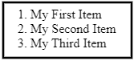
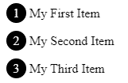
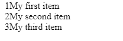
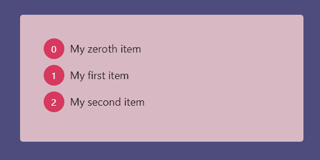
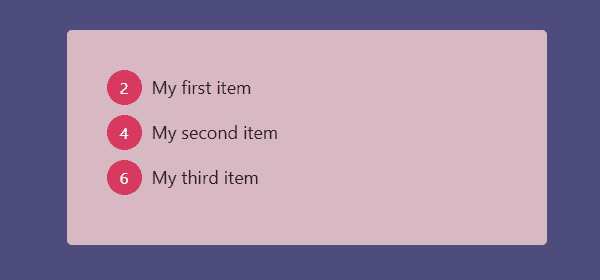
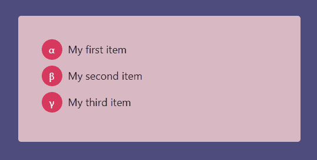
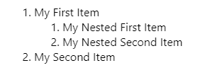
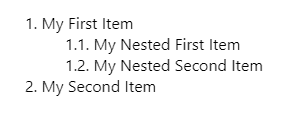
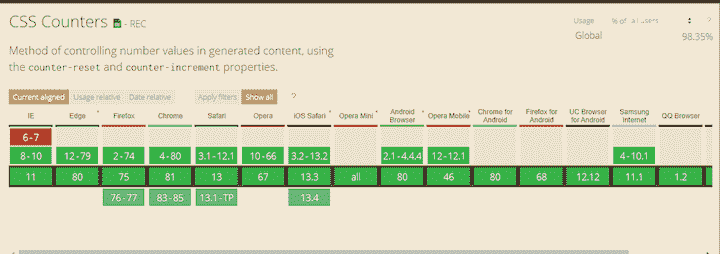

# 用 CSS 计数器设计编号列表

> 原文：<https://blog.logrocket.com/styling-numbered-lists-with-css-counters/>

在网页设计中，以一种有组织的方式来表现数据是很重要的，这样用户可以很容易地理解网站的结构或内容。最简单的方法是使用有序列表。

如果您需要对数字的外观有更多的控制，您可能会认为您需要通过 HTML 或 JavaScript 向 DOM 添加更多的元素，并对它们进行样式化。幸运的是，CSS 计数器为您省去很多麻烦。

在本教程中，我们将演示如何开始使用 CSS 计数器，并回顾一些用例。

## 有序列表的问题是

当你写一个如下所示的有序列表时，浏览器会自动为你显示数字。

```
<ol>
  <li>My First Item</li>
  <li>My Second Item</li>
  <li>My Third Item</li>
</ol>

```



这很好，但是它不允许您对数字进行样式化。例如，假设您需要将数字放在一个圆内。你会怎么做？

一种方法是完全去掉列表，自己手动添加数字。

```
<div>
  <span>1</span> My First Item
</div>
<div>
  <span>2</span> My Second Item
</div>
<div>
  <span>3</span> My Third Item
</div>

div {
  margin-bottom:10px;
}
div span {
  display:inline-flex;
  align-items:center;
  justify-content:center;
  width:25px;
  height:25px;
  border-radius:50%;
  background-color:#000;
  color:#fff;
}

```



这做了我们需要它做的事情，但是有一些缺点。首先，手写数字很难。如果你需要换一个号码呢？你必须一个一个地改变它们。您可以使用 JavaScript 动态添加`<span>`元素来解决这些问题，但是这将向 DOM 添加更多节点，从而导致大量内存使用。

在大多数情况下，最好使用 CSS 计数器。让我们来看看为什么。

## CSS 计数器介绍

CSS 计数器是网页范围的变量，其值可以使用 CSS 规则进行更改。

首先，使用`counter-reset`属性设置一个计数器。`list-number`是这里使用的变量名。

```
div.list {
  counter-reset: list-number;
}

```

接下来，使用`counter-increment`属性增加计数器的值。

```
div.list div {
  counter-increment: list-number;
}

```

现在，每出现一个`div.list div`元素，`list-number`变量就加 1。

最后，使用带有`content`属性和`counter()`函数的`:before`伪元素来显示数字。

```
div.list div:before {
  content: counter(list-number);
}

```

以下是完整的代码:

```
<div class="list">
  <div>My first item</div>
  <div>My second item</div>
  <div>My third item</div>
</div>

div.list {
  counter-reset: list-number;
}
/** Note that we can use counter-increment in :before psuedo element **/
div.list div:before {
  counter-increment: list-number;
  content: counter(list-number);
}

```

输出如下所示:



我们还没到那一步。让我们设计一下`:before`伪元素的样式，让它看起来更好。

```
div.list div:before {
  counter-increment: list-number;
  content: counter(list-number);

  margin-right: 10px;
  margin-bottom:10px;
  width:35px;
  height:35px;
  display:inline-flex;
  align-items:center;
  justify-content: center;
  font-size:16px;
  background-color:#d7385e;
  border-radius:50%;
  color:#fff;
}

```

参见 [CodePen](https://codepen.io) 上 Supun Kavinda([@ SupunKavinda](https://codepen.io/SupunKavinda))的笔 [OJybvoq](https://codepen.io/SupunKavinda/pen/OJybvoq) 。

改变起点

## 默认情况下，`counter-reset`将计数器设置为`0`。从第一次`counter-increment`呼叫后的`1`开始。通过将一个整数作为第二个参数传递给`counter-reset`函数来设置初始值。


```
div.list {
  counter-reset: list-number 1;
}

```

如果要从`0`开始，将初始值设置为`-1`。



```
div.list {
  counter-reset: list-number -1;
}

```

更改增量值

## 默认情况下，`counter-increment`将计数器的值增加 1。就像`counter-reset`一样，您可以为`counter-increment`属性定义一个偏移量。

在本例中，`counter-reset`将`list-number`设置为`0`。每次调用`counter-increment`时，`list-number`的值增加`2`，所以，你会看到数字为`2`、`4`和`6`。



```
div.list {
  counter-reset: list-number;
}
div.list div:before {
  counter-increment: list-number 2;
  // other styles
}

```

计数器格式

## `counter()`函数可以有两个参数:`counter-name`和`counter-format`。对于第二个参数，您可以使用任何有效的列表样式类型值，包括:

`decimal`(例如，1，2，3…)

*   `lower-latin`(例如，a、b、c…)
*   `lower-roman`(例如，一、二、三……)
*   默认值为`decimal`。

比如你和我一样热爱科学，可以用`lower-greek`进行 alpha-beta 值编号。



```
div.list div:before {
  counter-increment: list-number;
  content: counter(list-number, lower-greek);
  // ... other styles
}

```

嵌套计数器

## 使用嵌套有序列表时，编号总是以这种格式显示:



如果您需要子列表项的数字(例如，`1.1`)，您可以使用带有`counters()`功能的 CSS 计数器。



```
<ol>
  <li>
     My First Item
    <ol>
      <li>My Nested First Item</li>
      <li>My Nested Second Item</li>
    </ol>
  </li>
  <li>My Second Item</li>
</ol>

ol {
  list-style-type:none;
  counter-reset:list;
}
ol li:before {
    counter-increment:list;
    content: counters(list, ".") ". ";
}

```

注意，我们使用的是`counters()`函数，而不是`counter()`。

`counters()`函数的第二个参数是连接字符串。它还可以有第三个参数来设置格式(例如，希腊语或罗马语)。

带标题的嵌套计数器

### 像`<h1>`、`<h2>`这样的元素没有嵌套在文档中。它们看起来是不同的元素，但仍然代表一种层次结构。以下是如何在标题前添加嵌套数字:

每当发现一个`h1`时，`h2`计数器复位。文件中的每一个`<h2>`都有一个类似`x.y.`的相对于`<h1>`的数字。

```
body {
  counter-reset:h1;
}
h1 {
  counter-reset:h2;
}
h1:before {
  counter-increment: h1;
  content: counter(h1) ". ";
}
h2:before {
  counter-increment:h2;
  content: counter(h1) "." counter(h2) ". ";
}

```

浏览器支持

## 幸运的是，自从 CSS2 引入 CSS 计数器以来，它们得到了浏览器的广泛支持。虽然在除了`content`之外的属性中使用`counter()`函数仍然是实验性的，但是你可以毫不犹豫地做我们在本教程中涉及的所有练习。

以下是来自[的浏览器支持详情，我可以使用](http://caniuse.com)吗？



一个简单的挑战

## 你准备好迎接一个涉及 CSS 计数器的简单挑战了吗？

使用 CSS 计数器在 10 行代码中显示`1`到`1000`，以及它们的罗马字符。

如果你被难住了，你可以这样做:

要创建 1000 个`div`元素，请使用下面的代码。

CSS 计数器:

```
for (var i = 0; i < 1000; i++) {
  document.body.appendChild( document.createElement("div") );  
}

```

参见 [CodePen](https://codepen.io) 上 Supun Kavinda([@ SupunKavinda](https://codepen.io/SupunKavinda))
的笔 [MWabGZQ](https://codepen.io/SupunKavinda/pen/MWabGZQ) 。

```
body {
  counter-reset:number;
}
div:before {
  counter-increment:number;
  content: counter(number) " => " counter(number, lower-roman);
}
```

你想到了什么？

结论

CSS 计数器是 CSS 中一个鲜为人知的特性，但是你会惊讶于它们如此频繁地派上用场。在本教程中，我们介绍了如何以及何时使用 CSS 计数器，并查看了一些示例。

## 下面是我们使用的属性列表。

**属性**

**用途**

| `counter-reset` | 将计数器重置(或创建)为给定值(默认值为 0) |
| `counter-increment` | 给定的计数器增加给定的偏移量(默认为 1) |
| `counter(counter-name, counter-format)` | 从给定格式中获取计数器的值 |
| `counters(counter-name, counter-string, counter-format)` | 从给定格式获取嵌套计数器的值 |
| 当然，CSS 计数器很酷。但我担心的一点是，所有的计数器都是全局的。如果您在有许多 CSS 文件的大型项目中使用它们中的许多，您可能无法找到它们的创建、重置和递增位置。如果可以的话不要过度使用它们，如果必须的话，一定要使用描述性的名字来避免冲突。 | 你的前端是否占用了用户的 CPU？ |

随着 web 前端变得越来越复杂，资源贪婪的特性对浏览器的要求越来越高。如果您对监控和跟踪生产环境中所有用户的客户端 CPU 使用、内存使用等感兴趣，

## .

LogRocket 就像是网络和移动应用的 DVR，记录你的网络应用或网站上发生的一切。您可以汇总和报告关键的前端性能指标，重放用户会话和应用程序状态，记录网络请求，并自动显示所有错误，而不是猜测问题发生的原因。

[try LogRocket](https://lp.logrocket.com/blg/css-signup)

现代化您调试 web 和移动应用的方式— [开始免费监控](https://lp.logrocket.com/blg/css-signup)。

[](https://lp.logrocket.com/blg/css-signup)[https://logrocket.com/signup/](https://lp.logrocket.com/blg/css-signup)

[LogRocket](https://lp.logrocket.com/blg/css-signup) is like a DVR for web and mobile apps, recording everything that happens in your web app or site. Instead of guessing why problems happen, you can aggregate and report on key frontend performance metrics, replay user sessions along with application state, log network requests, and automatically surface all errors.

Modernize how you debug web and mobile apps — [Start monitoring for free](https://lp.logrocket.com/blg/css-signup).