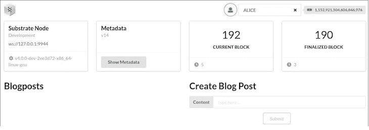
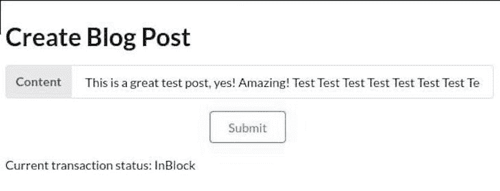
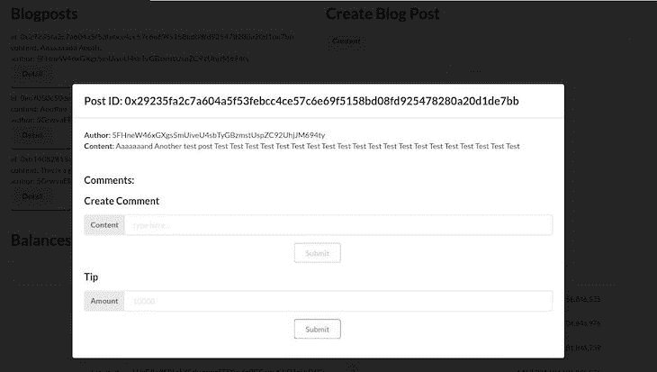
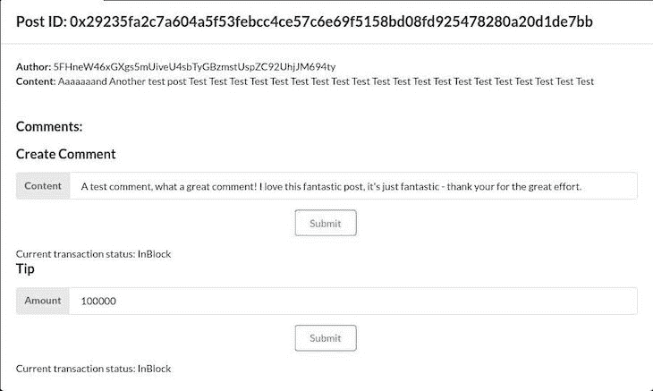
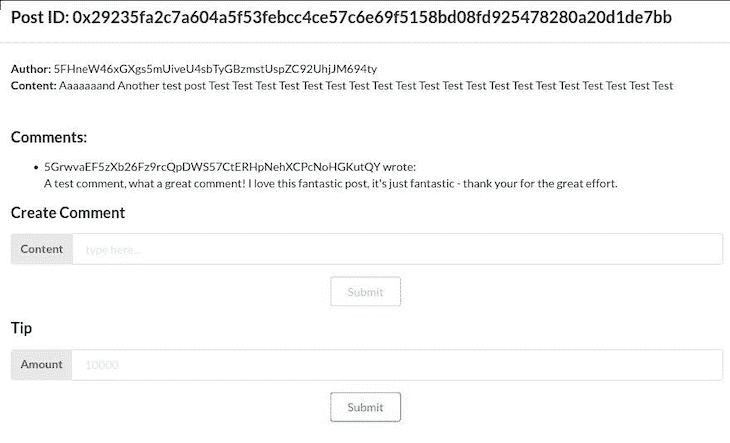

# 带有自定义 React 前端的衬底区块链应用程序

> 原文：<https://blog.logrocket.com/substrate-blockchain-application-custom-react-frontend/>

在上一篇文章中，我介绍了如何使用 Rust 中的底层框架[构建一个定制的区块链实现。然而，在本文中，我们只查看了应用程序的后端部分。我们使用默认的](https://blog.logrocket.com/custom-blockchain-implementation-rust-substrate/)[基板前端模板](https://docs.substrate.io)与区块链交互，手动调用函数并检查区块链状态。

在本文中，我们将使用 React 为前一篇文章中构建的`Blogchain`区块链实现一个自定义前端。有许多方法可以为基于衬底的区块链构建前端，包括本地方法和使用 web 的方法。在这个例子中，我们将继续使用 web。你可以在 GitHub 上找到这个例子的完整代码。我们开始吧！

### 目录

## 用衬底建造的区块链

默认情况下，使用底层构建的[区块链为客户端提供了一个 API 来连接 RPC 调用，例如，使用 WebSockets。官方推荐的与任何基于衬底的链交互的方式是使用](https://blog.logrocket.com/substrate-blockchain-framework-core-concepts/) [Polkadot-JS](https://polkadot.js.org/docs/) 。

然而，也有用于其他语言的[库](https://docs.substrate.io/v3/integration/client-libraries/)，以及使用[基板连接](https://docs.substrate.io/v3/integration/substrate-connect/)的选项，该选项在内部使用 Polkadot-JS，并专注于为基板区块链的轻型客户端提供基础。你可以[查看 Polkadot-JS 文档](https://polkadot.js.org/docs/)来了解它是如何工作的。本质上，您对一个区块链有完全的 RPC 访问权限。

为了节省时间，我们将基于[衬底前端模板](https://github.com/substrate-developer-hub/substrate-front-end-template)定制 React 前端，通过用一些`Blogchain`特定的 UI 元素扩展模板来与我们的定制区块链交互，来派生和定制它。

虽然我们的设置和样板文件将由模板处理，但我们将使用与任何其他应用程序相同的库和功能。前端模板基于 React，也包括 Polkadot-JS。

在模板内部，许多有用的与区块链相关的功能已经捆绑在一起，可以在更高的级别上使用。此外，通过扩展现有项目，我们可以查看模板中使用的代码，以了解如何以惯用的方式构建工作组件。

让我们开始设置项目并开始编码吧！

## 设置基底

首先，我们将分叉[衬底前端模板](https://github.com/substrate-developer-hub/substrate-front-end-template)库。然后，我们可以克隆我们的叉子:

```
git clone url-of-your-fork

```

完成后，我们就可以在本地使用我们的 fork 了，我们可以在目录中导航并执行下面的命令:

```
yarn install

```

上面的命令将安装所有必要的依赖项，并在`[http://localhost:8000](http://localhost:8000)`上启动模板。当然，这只有在本地运行`Blogchain`项目的情况下才能正常工作。要做到这一点，只需在本地克隆这个库之后，按照这个库的[自述文件中概述的步骤进行操作。注意](https://github.com/zupzup/blogchain-example-substrate)[你将需要铁锈和货物](https://blog.logrocket.com/demystifying-cargo-in-rust/)来在本地运行基板区块链。

现在，我们可以在 Substrate frontend 模板中检查文件夹结构，它本质上只是一个现代的 React 应用程序。入口点在`src/index.js`中，它包含了`src/App.js`文件。

浏览`src/App.js`，我们看到模板使用了[语义 UI React](https://react.semantic-ui.com/) ，一个[语义 UI](https://semantic-ui.com/) 框架的 React 版本。因此，我们可以使用现有的、预样式的语义 UI 组件。

在渲染功能中，我们还可以看到浏览器中实际可见的所有组件，如`<NodeInfo />`、`<Balances />`等。所有这些组件实际上都是在项目中实现的，所以，举例来说，我们可以只看一下`Transfer.js`,看看我们如何构建一个组件来将资金从一个帐户发送到另一个帐户。

另一个重要的方面是`substrate-lib/`文件夹，它捆绑和抽象了我们需要与我们的链交互的许多与区块链相关的 RPC 逻辑，以及一些为此目的预先构建的组件。

如果您想更深入地为 Substrate 区块链构建 web 客户端，探索和理解前端模板项目是一个很好的开始。设置完成后，让我们开始编码吧！

## 基本组件

我们将构建几个定制组件。在最高级别上，我们希望显示现有的博客文章，并有一个创建博客文章的表单。然后，我们想查看帖子的详细信息，包括帖子上的评论。最后，我们要给博文作者小费，并添加新的评论。

我们将创建以下组件:

*   顶层组件，它将包含我们剩下的组件。我们将把`Blogchain`集成到我们的前端模板中
*   `blogchain/ListBlogPost`:用于列出博客文章及其详细信息的组件
*   `blogchain/CreateBlogPost`:添加新博文的表单
*   `blogchain/CreateComment`:添加新评论的表单
*   `blogchain/Tip`:给博客作者小费的表格

由于这只是一个例子，而不是一个生产应用程序，我们不会处理错误处理和输入验证。但是，如果您熟悉 React，那么您在其他项目中使用的任何东西在这里都应该可以正常工作。

让我们从高层次的`Blogchain`组件开始:

```
import { Grid, Container } from 'semantic-ui-react'

function Blogchain() {
  return (
    <Grid.Column width={16}>
      <Container>
        <Grid stackable columns="equal">
          <ListBlogPosts />
          <CreateBlogPost />
        </Grid>
      </Container>
    </Grid.Column>
  )
}
export default Blogchain

```

如上所述，我们使用语义 UI 组件来构建 UI。本质上，我们只是创建一个网格列，因为我们的组件将被集成到模板应用程序的现有网格中。该列的大小为`16`，这意味着它将跨越页面的整个宽度。

在`Blogchain`组件中，我们创建了一个新的容器，里面有一个网格，我们可以将自己的组件一个挨着一个地放置，每个组件占据 50%的空间。

接下来，让我们看一下`CreateBlogPost`组件，这将更有趣一些:

```
import { Grid, Form, Input } from 'semantic-ui-react'
import { useState } from 'react'
import { TxButton } from '../substrate-lib/components'

function CreateBlogPost() {
  const [status, setStatus] = useState(null)
  const [formState, setFormState] = useState({ content: '' })

  const onChange = (_, data) =>
    setFormState(prev => ({ ...prev, [data.state]: data.value }))

  const { content } = formState

  return (
      <Grid.Column width={8}>
        <h1>Create Blog Post</h1>
        <Form>
          <Form.Field>
            <Input label="Content" type="text" placeholder="type here..." state="content" onChange={onChange} value={content} />
          </Form.Field>
          <Form.Field style={{ textAlign: 'center' }}>
            <TxButton
              label="Submit"
              type="SIGNED-TX"
              setStatus={setStatus}
              attrs={{
                palletRpc: 'blogchain',
                callable: 'createBlogPost',
                inputParams: [content],
                paramFields: [true],
              }}
            />
          </Form.Field>
        <div style={{ overflowWrap: 'break-word' }}>{status}</div>
        </Form>
      </Grid.Column>
  )
}
export default CreateBlogPost

```

让我们一行一行地检查我们的代码。稍后我们还将为`CreateComment`和`Tip`组件重用这种基于表单的组件模型，因此很好地理解这里发生的事情是很重要的。

首先，我们用`useState`定义一个名为`status`的本地状态，将其初始化为`null`。在这种情况下，状态意味着事务的生命周期。在典型的基于 web 的请求-响应系统中，没有太多相关的状态。我们发送请求并期待响应，处理错误。

为了在区块链系统中持久化状态，而不是将其放入某个数据库中，我们将它添加到一个块中，这必须得到网络的同意。但是，由于这种性质，一个事务可以有几种状态。

首先，当我们发送它时，它可能不被区块链接受，例如，因为我们发送了无效的数据。如果它是一个有效的请求，我们仍然要等到它被挖掘成一个块。所以，这个`status`状态本质上以一种简单的方式向用户反映了这个状态。

然后，我们定义了`formState`，它是一个包含表单字段的对象。如果输入字段发生变化，可使用`onChange`函数更新此`formState`。

所有这些表单处理逻辑基本上都是从现有的`Transfer.js`组件复制来的，尽可能地符合习惯。让我们看看我们用来构建实际表单的组件。

* * *

### 更多来自 LogRocket 的精彩文章:

* * *

### 建筑构件

语义 UI 有内置的`Form`组件，我们可以通过设置`state`属性来使用和自动连接我们的`formState`和`onChange`功能。

然后，我们添加一个`TxButton`组件，它是来自`substrate-lib`包的一个预先存在的组件，用于与区块链交互。该按钮还负责执行交易。在这种情况下，我们希望进行一个签名交易，这就是为什么我们使用`SIGNED-TX`类型。

在这里，我们还看到我们的`status`状态为我们的函数设置了`setStatus`属性，这意味着跟踪被触发事务的生命周期的`TxButton`功能更新了这个状态。

接下来，我们可以设置`attrs`。这些属性定义了我们实际上想要通过这个事务实现什么。在我们的例子中，我们说我们想调用`blogchain::createBlogPost`的外部内容，该内容来自我们在`inputParams`中的表单。在表单下面，我们显示了我们的`status`状态，它将在事务执行期间被更新。

`TxButton`组件实际上是在`substrate-lib/components`文件夹中实现的，所以如果您对幕后发生的一切感兴趣，不妨去看看。

现在，让我们继续列出我们的博客文章。

## 获取数据并列出博客文章

要列出我们的博客文章，我们需要获取博客文章及其评论，然后呈现它们:

```
import { useSubstrateState } from '../substrate-lib'
import { Grid, Button, Modal } from 'semantic-ui-react'
import { useEffect, useState } from 'react'

function ListBlogPosts() {
  const { api } = useSubstrateState()
  const [ blogPosts, setBlogPosts ] = useState([])
  const [ blogPostComments, setBlogPostComments ] = useState({})

  useEffect(() => {
    api.query.blogchain.blogPosts.entries().then((posts) => {
      const p = posts.map(post => {
        return {
          id: post[0].toHuman(),
          content: post[1].toHuman().content,
          author: post[1].toHuman().author,
        }
      })
      setBlogPosts(p)
    })

  }, [api])

  useEffect(() => {
    api.query.blogchain.blogPostComments.entries().then((commentsMap) => {
      const c = commentsMap.reduce((acc, commentsEntry) => {
        return {
          ...acc,
          [commentsEntry[0].toHuman()]: commentsEntry[1].toHuman(),
        }
      }, {})
      setBlogPostComments(c)
    })

  }, [api])

  return (
      <Grid.Column width={8}>
        <h1>Blogposts</h1>
        {blogPosts.map((post) => {
          return <BlogPost key={post.id} post={post} comments={blogPostComments[post.id]}/>
        })}
      </Grid.Column>
  )
}
export default ListBlogPosts

```

我们从使用`useSubstrateState`方法获取 API 开始。`useSubstrateState`是来自`substrate-lib`的内置库函数。该 API 基本上是对区块链进行 RPC 调用的抽象。

我们使用`useState`为`blogPosts`和`blogPostComments`创建组件状态。然后，我们实际上使用 React 生命周期函数`useEffect`定义了两个效果。在这种情况下，我们基本上只是在加载组件时发出请求。然而，Polkadot-JS 在实时数据方面非常强大，我们也可以创建基于 WebSocket 的订阅。

例如，如果我们有一个存储项，它在每次添加博客文章时都会改变，我们可以订阅该值，并在每次它改变时重新提取数据，相应地更新我们的 UI。因此，从请求-响应模型到完全实时模型的转变完全受到我们在这里已经使用的技术的支持。

我们使用 API 抽象首先查询`blogchain.blogPosts.entries()`，它返回实际的`StorageMap`，一个从博客文章 ID 散列到实际博客文章的映射。

我们以数组的形式得到它，其中每个元素本质上是 ID 和博客文章的元组。我们使用`.toHuman()`函数获取博文 ID 和博文数据的可读表示，并将其设置为我们的`blogPosts`状态。

我们对博客文章的评论也是如此。然而，我们不只是映射它来创建一个博客文章列表，而是将博客文章 ID 映射到每个 ID 的博客文章评论。我们还在我们的`blogPostComments`状态中设置这个数据。

然后，我们简单地呈现另一个网格列，并将`blogPosts`映射到`BlogPost`组件，将`post`和`comments`传递到细节组件。我们用来在列表中显示博客文章的`BlogPost`组件非常简单:

```
function BlogPost(props) {
  const { post, comments } = props

  return (
    <div>
      id: {post.id} <br />
      content: {post.content.substring(0, 15) + '...'} <br />
      author: {post.author}<br />
      <BlogPostModal post={post} comments={comments} />
      <hr/>
    </div>
  )
}

```

我们只显示 ID、内容的前 15 个字符和帖子的作者，使用道具传递。更有趣的是，在数据下面，我们显示了`BlogPostModal`，这将是当人们点击一篇博客文章的`Detail`按钮时弹出的`Detail`组件:

```
function BlogPostModal(props) {
  const [open, setOpen] = useState(false)
  const { post, comments } = props

  return (
    <Modal
      onClose={() => setOpen(false)}
      onOpen={() => setOpen(true)}
      open={open}
      trigger={
        <Button>Detail</Button>
      }
    >
      <Modal.Header>Post ID: {post.id}</Modal.Header>
      <Modal.Content>
        <b>Author:</b> {post.author} <br />
        <b>Content:</b> {post.content}
      </Modal.Content>
      <Modal.Content>
        <h3>Comments:</h3>
        <ul>
          {comments && comments.map((comment) => {
            return <li key={comment.content}>{comment.author} wrote: <br />{comment.content}</li>
          })}
        </ul>

        <CreateComment postId={post.id} />
        <Tip postId={post.id} />
      &lt;/Modal.Content>
    </Modal>

  )
}

```

语义 UI 内置了`Modal`组件。我们可以定义打开和关闭模态的状态函数，更有趣的是，还有一个`trigger`属性。在我们的例子中，这个`trigger`只是一个按钮，当点击时会触发`onOpen`。

当`Modal`组件在打开状态下被点击时，它触发`onClose`。在一个更复杂的应用程序中，我们可以使用这些钩子来实现关于打开和关闭`Modal`的更有趣的功能。

在`Modal`组件中，我们可以实现细节视图的逻辑和用户界面。在我们的例子中，我们以文章 ID 作为标题，后面是文章的完整内容和作者。在下面，我们显示我们传递到`BlogPost`和`Modal`组件的注释，以及我们的`CreateComment`和`Tip`组件，我们接下来将会看到。

否则，这里不会发生太多的事情；我们使用语义 UI 中强大的`Modal`来为我们完成繁重的工作。如上所述，`CreateComment`和`Tip`组件与`CreateBlogPost`相似，略有变化:

```
import { Grid, Form, Input } from 'semantic-ui-react'
import { useState } from 'react'
import { TxButton } from '../substrate-lib/components'

function CreateComment(props) {
  const [status, setStatus] = useState(null)
  const [formState, setFormState] = useState({ content: '' })
  const { postId } = props;

  const onChange = (_, data) =>
    setFormState(prev => ({ ...prev, [data.state]: data.value }))

  const { content } = formState

  return (
      <Grid.Column width={8}>
        <h3>Create Comment</h3>
        <Form>
          <Form.Field>
            <Input label="Content" type="text" placeholder="type here..." state="content" onChange={onChange} value={content} />
          </Form.Field>
          <Form.Field style={{ textAlign: 'center' }}>
            <TxButton
              label="Submit"
              type="SIGNED-TX"
              setStatus={setStatus}
              attrs={{
                palletRpc: 'blogchain',
                callable: 'createBlogPostComment',
                inputParams: [content, postId.toString()],
                paramFields: [true, true],
              }}
            />
          </Form.Field>
        <div style={{ overflowWrap: 'break-word' }}>{status}</div>
        </Form>
      </Grid.Column>
  )
}
export default CreateComment

```

我们再次创建一个表单，并使用从外部使用道具传入的`postId`。与博客文章创建表单不同，我们在定义`inputParams`时将`[content, postId.toString()]`设置在`TxButton`中。

`createBlogPostComment`外部参数有两个参数，一个是字符串`content`,另一个是我们想要评论的博客文章的 T2。这个 hash 只是我们的`postId`。我们可以简单地将它设置为`postId.toString()`。`content`字段的传递方式与我们创建博客文章时相同。

表单逻辑的其余部分确实与前面的表单非常相似。我们的最后一个组件`Tip`表单也是如此:

```
import { Grid, Form, Input } from 'semantic-ui-react'
import { useState } from 'react'
import { TxButton } from '../substrate-lib/components'

function Tip(props) {
  const [status, setStatus] = useState(null)
  const [formState, setFormState] = useState({ amount: 0 })
  const { postId } = props;

  const onChange = (_, data) =>
    setFormState(prev => ({ ...prev, [data.state]: data.value }))

  const { amount } = formState

  return (
      <Grid.Column width={8}>
        <h3>Tip</h3>
        <Form>
          <Form.Field>
            <Input label="Amount" type="text"  state="amount" onChange={onChange} amount={amount} placeholder="10000" />
          </Form.Field>
          <Form.Field style={{ textAlign: 'center' }}>
            <TxButton
              label="Submit"
              type="SIGNED-TX"
              setStatus={setStatus}
              attrs={{
                palletRpc: 'blogchain',
                callable: 'tipBlogPost',
                inputParams: [postId.toString(), amount],
                paramFields: [true, true],
              }}
            />
          </Form.Field>
        <div style={{ overflowWrap: 'break-word' }}>{status}</div>
        </Form>
      </Grid.Column>
  )
}
export default Tip

```

同样，由于`tipBlogPost`外部期望两个参数，一个是 post 的`Hash`和一个是 funds 的`amount`，我们可以通过将`TxButton`组件的`inputParams`中的`Hash`预先设置为`postId`来完成与前一个组件相同的操作。

在这些组件中，在一个生产应用程序中，您可以想象我们检查我们是否是一个帖子或评论的作者，并以不同的方式显示这些内容。或者，如果是我们自己的博客文章，我们可以禁用`Tip`组件。最终，这与任何其他基于 API 的 web 应用程序非常相似，我们使用 Polkadot-JS 请求数据并在前端更新状态。

至此，我们所有的组件都完成了。剩下的唯一事情就是通过扩展`App.js`将它们与前端模板连接起来:

```
import Blogchain from './Blogchain'

...
          <Grid.Row stretched>
            <NodeInfo />
            <Metadata />
            <BlockNumber />
            <BlockNumber finalized />
          </Grid.Row>

          <Grid.Row>
            <Blogchain />
          </Grid.Row>

          <Grid.Row stretched>
            <Balances />
          </Grid.Row>
...

```

## 测试

现在，让我们看看我们构建的东西是否真的有效。查看上方的[设置部分，获取关于检查`Blogchain`区块链是否正在运行的说明。然后我们执行`yarn start`，我们的应用程序将在指向](#setting-up-substrate)`[http://localhost:8000](http://localhost:8000)`的浏览器中打开。

在这里，我们将看到基本的前端模板用户界面。在我们添加了`<Blogchain />`组件的基本区块链信息的正下方，我们可以看到我们的博客帖子列表和博客帖子创建组件:



现在，让我们试着写一篇博文:



一旦我们点击**提交**，我们可以看到下面的`status`发生变化。一旦状态为`InBlock`，一切都被持久化。现在，通过刷新页面并添加更多的博客文章，我们可以看到我们的博客文章列表:


很好，现在让我们点击帖子的**详细信息**按钮，查看我们与帖子互动的`Modal`:



在这里，我们可以看到文章的详细信息以及添加评论和给博客作者小费的表单。让我们双管齐下:



在添加评论和小费后，我们可以检查`balance`并看到钱实际上已经转手了。同样，再次刷新并打开`Detail`，我们可以在详细页面中看到我们的新评论:



它的工作，太棒了！

## 结论

像前面的[后端导向的例子一样，使用一个预先存在的模板项目和完整的文档使 Polkadot-JS 入门和与区块链的交互成为一种无缝的体验。](https://blog.logrocket.com/custom-blockchain-implementation-rust-substrate/)

特别是对于区块链技术和 Web3 的新颖性和高度复杂性，Substrate 的方法对于帮助开发者入门非常有效。在这个例子中，我们介绍了向现有的基底前端模板添加一些定制。从这个例子到使用整个 Substrate 生态系统来构建一个工作的 Web3 应用程序并没有太大的难度。

我希望你喜欢这篇文章！如果你有任何问题，一定要留下评论。

## [LogRocket](https://lp.logrocket.com/blg/react-signup-general) :全面了解您的生产 React 应用

调试 React 应用程序可能很困难，尤其是当用户遇到难以重现的问题时。如果您对监视和跟踪 Redux 状态、自动显示 JavaScript 错误以及跟踪缓慢的网络请求和组件加载时间感兴趣，

[try LogRocket](https://lp.logrocket.com/blg/react-signup-general)

.

[ ](https://lp.logrocket.com/blg/react-signup-general) [](https://lp.logrocket.com/blg/react-signup-general) 

LogRocket 结合了会话回放、产品分析和错误跟踪，使软件团队能够创建理想的 web 和移动产品体验。这对你来说意味着什么？

LogRocket 不是猜测错误发生的原因，也不是要求用户提供截图和日志转储，而是让您回放问题，就像它们发生在您自己的浏览器中一样，以快速了解哪里出错了。

不再有嘈杂的警报。智能错误跟踪允许您对问题进行分类，然后从中学习。获得有影响的用户问题的通知，而不是误报。警报越少，有用的信号越多。

LogRocket Redux 中间件包为您的用户会话增加了一层额外的可见性。LogRocket 记录 Redux 存储中的所有操作和状态。

现代化您调试 React 应用的方式— [开始免费监控](https://lp.logrocket.com/blg/react-signup-general)。