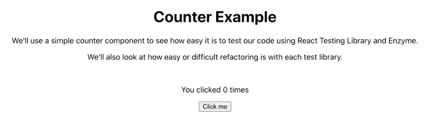
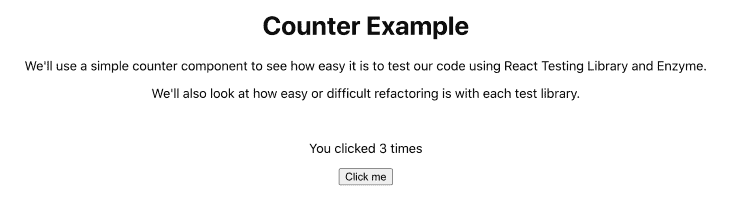
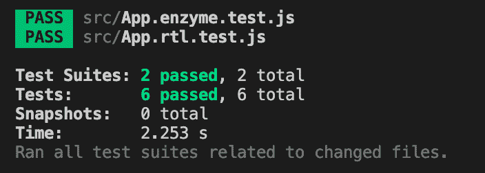
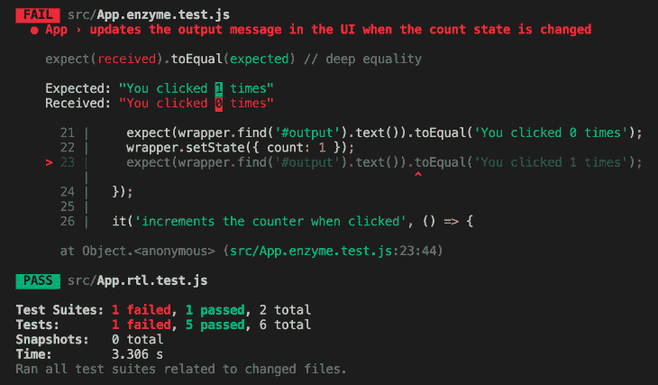
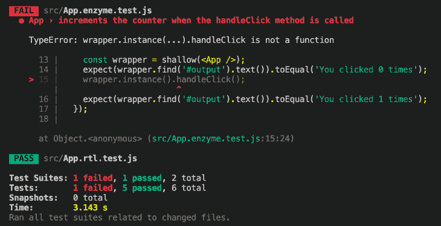
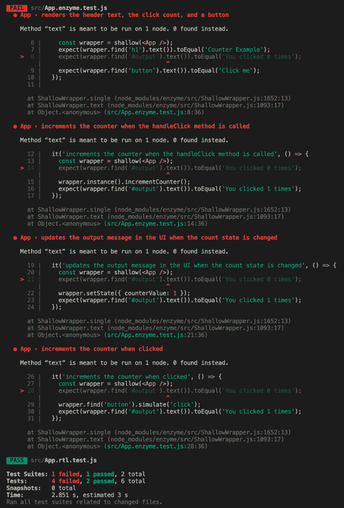

# React 测试库的成功重构

> 原文：<https://blog.logrocket.com/successful-refactoring-react-testing-library/>

不管技术水平如何，很少有开发人员第一次尝试就写出高质量的代码。这就是为什么有经验的开发人员会花时间重构他们的代码，即使他们已经有了一个初步的工作解决方案。随着应用的成长和发展，重构也会随着时间的推移而发生。实现细节可以而且确实会定期更改。

当重构时，有好的测试来防止退化和避免犯简单的错误是很重要的。但是如果你的测试并不像你认为的那样有用呢？如果你不小心编写你的测试，你可能会发现自己陷入了这个陷阱。

在本文中，我们将看看一个简单的 React 组件，并观察我们的测试套件如何响应简单的重构。我们将使用 [React 测试库](https://testing-library.com/docs/react-testing-library/intro/)来突出测试用户如何与应用程序交互的能力。我们还将使用[酶](https://enzymejs.github.io/enzyme/)来探索测试实现细节的陷阱以及这种方法可能带来的麻烦。

## 设置我们的示例应用程序

首先，我们将创建一个简单的计数器应用程序，如下所示。我们的应用程序将包含一些介绍文本，然后是显示按钮被点击次数的消息。下面，我们将包括按钮。



每次用户单击按钮，计数器就会增加，屏幕上的消息文本也会增加。你可以在下图中看到这一点。



很简单，对吧？下面是实现该组件所需的 JavaScript:

```
import React, { Component } from 'react';
import './App.css';

class App extends Component {
  state = {
    count: 0,
  }

  handleClick = () => {
    this.setState(prevState => ({ count: prevState.count + 1 }))
  }

  render() {
    return (
      <main className="App">
        <h1>Counter Example</h1>
        <p>We'll use a simple counter component to see how easy it is to test our code using React Testing Library and Enzyme.</p>
        <p>We'll also look at how easy or difficult refactoring is with each test library.</p>
        <br />
        <p id="output">You clicked {this.state.count} times</p>
        <button onClick={this.handleClick}>
          Click me
        </button>
      </main>
    );
  }
}

export default App;
```

为了确保我们的计数器正常工作，我编写了用 [Jest](https://jestjs.io/) 运行的测试。我们的测试套件包含两个文件:一个使用 [React 测试库](https://testing-library.com/docs/react-testing-library/intro/)编写，另一个使用 [Enzyme](https://enzymejs.github.io/enzyme/) 编写。

React 测试库测试如下所示:

```
import { fireEvent, render, screen } from '@testing-library/react';
import App from './App';

describe('App', () => {
  it('renders the header text, the click count, and a button', () => {
    render(<App />);
    expect(screen.getByText('Counter Example')).toBeInTheDocument();
    expect(screen.getByText('You clicked 0 times')).toBeInTheDocument();
    expect(screen.getByText('Click me')).toBeInTheDocument();
  });

  it('increments the counter when clicked', () => {
    render(<App />);
    expect(screen.getByText('You clicked 0 times')).toBeInTheDocument();
    fireEvent.click(screen.getByText('Click me'));
    expect(screen.getByText('You clicked 1 times')).toBeInTheDocument();
  });
});
```

您可以看到，我们在第一个测试中检查了页面上重要文本的存在，并在第二个测试中测试了单击按钮的行为。这些测试侧重于用户可以看到什么，以及他们如何与应用程序交互。

另一方面，酶测试看起来像这样:

```
import { shallow } from 'enzyme';
import App from './App';

describe('App', () => {
  it('renders the header text, the click count, and a button', () => {
    const wrapper = shallow(<App />);
    expect(wrapper.find('h1').text()).toEqual('Counter Example');
    expect(wrapper.find('#output').text()).toEqual('You clicked 0 times');
    expect(wrapper.find('button').text()).toEqual('Click me');
  });

  it('increments the counter when the handleClick method is called', () => {
    const wrapper = shallow(<App />);
    expect(wrapper.find('#output').text()).toEqual('You clicked 0 times');
    wrapper.instance().handleClick();
    expect(wrapper.find('#output').text()).toEqual('You clicked 1 times');
  });

  it('updates the output message in the UI when the count state is changed', () => {
    const wrapper = shallow(<App />);
    expect(wrapper.find('#output').text()).toEqual('You clicked 0 times');
    wrapper.setState({ count: 1 });
    expect(wrapper.find('#output').text()).toEqual('You clicked 1 times');
  });

  it('increments the counter when clicked', () => {
    const wrapper = shallow(<App />);
    expect(wrapper.find('#output').text()).toEqual('You clicked 0 times');
    wrapper.find('button').simulate('click');
    expect(wrapper.find('#output').text()).toEqual('You clicked 1 times');
  });
});
```

请注意，酶测试采用了不同的方法。这些测试更多地关注实现细节，而不是关注最终用户体验。

例如，它们通过段落的`id`属性定位输出消息。在一些测试中，他们甚至直接操纵组件的状态值`count`并直接调用按钮的`handleClick`方法。

这些都不是用户可以做的事情(当然，除非他们是一个开发人员，在玩他们浏览器的开发工具！).

如果我们运行这些测试，我们将看到所有六个测试都通过了。他们甚至给了我们 100%的代码覆盖率。不错！



为了清楚起见，我们通过为单个组件编写两个独立的测试文件，在某种程度上重复了测试覆盖。实际上，一个代码库通常会选择一个测试库或者另一个，或者是反应测试库或者是酶。

库的选择会极大地影响测试策略和测试的编写。但是，并排使用这两个测试库将允许我们在修改应用程序时观察到一些有趣的趋势。

对于那些跟随的人，这个计数器应用程序的所有[代码都可以在 Github](https://github.com/thawkin3/react-testing-refactoring) 上找到。

既然我们已经介绍了这个应用程序，并验证了它的工作原理，我们就可以做一些重构了！值得注意的是，所有这些重构只会改变实现细节——应用的实际功能和行为将保持不变。

## 重构 1:更改组件的状态属性名

我们的第一次重构会将组件的状态属性`count`更改为`counterValue`。通过这个简单的命名更改，我们的源代码现在看起来像这样:

```
import React, { Component } from 'react';
import './App.css';

class App extends Component {
  state = {
    counterValue: 0,
  }

  handleClick = () => {
    this.setState(prevState => ({ counterValue: prevState.counterValue + 1 }))
  }

  render() {
    return (
      <main className="App">
        <h1>Counter Example</h1>
        <p>We'll use a simple counter component to see how easy it is to test our code using React Testing Library and Enzyme.</p>
        <p>We'll also look at how easy or difficult refactoring is with each test library.</p>
        <br />
        <p id="output">You clicked {this.state.counterValue} times</p>
        <button onClick={this.handleClick}>
          Click me
        </button>
      </main>
    );
  }
}

export default App;
```

让我们看看运行测试套件时会发生什么:



哦不！我们的一个测试失败了！我们的应用程序出问题了吗？用户界面中的快速手动检查向我们确认了我们的应用程序实际上工作正常。发生了什么事？

如果您查看上面的测试输出，您会看到我们的酶测试文件的第 22 行直接修改了组件状态，使其值为`{ count: 1 }`。这在以前是可行的，但是记得当我们重构我们的属性名时，我们把它从`count`改成了`counterValue`。为了通过测试，我们可以像这样更新我们的测试:

```
it('updates the output message in the UI when the count state is changed', () => {
  const wrapper = shallow(<App />);
  expect(wrapper.find('#output').text()).toEqual('You clicked 0 times');
  wrapper.setState({ counterValue: 1 });
  expect(wrapper.find('#output').text()).toEqual('You clicked 1 times');
});
```

那更好。

## 重构 2:更改按钮的单击处理程序方法名

让我们再做一个简单的改变。在这个重构示例中，我们将把点击处理程序方法从`handleClick`重命名为`incrementCounter`。我们的应用程序代码现在看起来像这样:

```
import React, { Component } from 'react';
import './App.css';

class App extends Component {
  state = {
    counterValue: 0,
  }

  incrementCounter = () => {
    this.setState(prevState => ({ counterValue: prevState.counterValue + 1 }))
  }

  render() {
    return (
      <main className="App">
        <h1>Counter Example</h1>
        <p>We'll use a simple counter component to see how easy it is to test our code using React Testing Library and Enzyme.</p>
        <p>We'll also look at how easy or difficult refactoring is with each test library.</p>
        <br />
        <p id="output">You clicked {this.state.counterValue} times</p>
        <button onClick={this.incrementCounter}>
          Click me
        </button>
      </main>
    );
  }
}

export default App;
```

在做了这个改变之后，我们可以再次运行我们的测试:



又一次测试失败！嗯……但是当我们再次检查 UI 时，我们的应用程序仍然正常工作。听起来熟悉吗？

这一次是我们的酶测试抱怨`handleClick`不是一个函数，这是有道理的，因为我们把那个方法的名字改成了`incrementCounter`。现在我们可以在测试中更新它:

```
it('increments the counter when the handleClick method is called', () => {
  const wrapper = shallow(<App />);
  expect(wrapper.find('#output').text()).toEqual('You clicked 0 times');
  wrapper.instance().incrementCounter();
  expect(wrapper.find('#output').text()).toEqual('You clicked 1 times');
});
```

不出所料，我们的测试又通过了。

## 重构 3:更改 ID 属性值

让我们再看一个例子。保存我们的输出消息的段落元素当前有一个 ID 属性，其值为`output`。我们将把这个值改为`clickCountMessage`。应用程序代码现在看起来像这样:

```
import React, { Component } from 'react';
import './App.css';

class App extends Component {
  state = {
    counterValue: 0,
  }

  incrementCounter = () => {
    this.setState(prevState => ({ counterValue: prevState.counterValue + 1 }))
  }

  render() {
    return (
      <main className="App">
        <h1>Counter Example</h1>
        <p>We'll use a simple counter component to see how easy it is to test our code using React Testing Library and Enzyme.</p>
        <p>We'll also look at how easy or difficult refactoring is with each test library.</p>
        <br />
        <p id="clickCountMessage">You clicked {this.state.counterValue} times</p>
        <button onClick={this.incrementCounter}>
          Click me
        </button>
      </main>
    );
  }
}

export default App;
```

让我们再做一次测试。你能猜到将要发生什么吗？



失败！我们的四个酶测试都失败了，因为它们都依赖于一个可以用`#output` CSS 选择器选择的元素的存在。但是随着我们对元素 ID 的更改，正确的 CSS 选择器现在是`#clickCountMessage`。让我们更新我们的测试来反映这一变化:

```
import { shallow } from 'enzyme';
import App from './App';

describe('App', () => {
  it('renders the header text, the click count, and a button', () => {
    const wrapper = shallow(<App />);
    expect(wrapper.find('h1').text()).toEqual('Counter Example');
    expect(wrapper.find('#clickCountMessage').text()).toEqual('You clicked 0 times');
    expect(wrapper.find('button').text()).toEqual('Click me');
  });

  it('increments the counter when the handleClick method is called', () => {
    const wrapper = shallow(<App />);
    expect(wrapper.find('#clickCountMessage').text()).toEqual('You clicked 0 times');
    wrapper.instance().incrementCounter();
    expect(wrapper.find('#clickCountMessage').text()).toEqual('You clicked 1 times');
  });

  it('updates the clickCountMessage message in the UI when the count state is changed', () => {
    const wrapper = shallow(<App />);
    expect(wrapper.find('#clickCountMessage').text()).toEqual('You clicked 0 times');
    wrapper.setState({ counterValue: 1 });
    expect(wrapper.find('#clickCountMessage').text()).toEqual('You clicked 1 times');
  });

  it('increments the counter when clicked', () => {
    const wrapper = shallow(<App />);
    expect(wrapper.find('#clickCountMessage').text()).toEqual('You clicked 0 times');
    wrapper.find('button').simulate('click');
    expect(wrapper.find('#clickCountMessage').text()).toEqual('You clicked 1 times');
  });
})
```

我们走吧。现在一切都恢复正常了。真是松了一口气！

## 重构中的经验教训

如果你一直在关注，你会在我们所有的测试失败中注意到一些模式。

首先，唯一失败的测试是属于我们的酶测试套件的测试。您会记得，这是因为酶测试侧重于实现细节，而 React 测试库测试侧重于用户体验。

第二，即使我们测试失败了，应用程序仍然运行良好。这降低了我们对测试的信心。当一个测试失败时，我们不得不思考，“是真的有问题，还是我们只是有一个需要更新的测试？”

第三，仅仅因为我们重命名了一个变量或者一个函数，就更新我们的测试是一件非常痛苦的事情。如果我们的测试不关心这些实现细节，那不是很好吗？

好消息是有更好的方法。事实上，这就是 React 测试库背后的核心理念:“你的测试越像你的软件被使用的方式，它们就能给你越多的信心。”

通过编写关注用户能看到什么和做什么的测试，我们可以开发一个更可靠的测试套件。我们节省了花在调试脆弱测试上的时间，并且我们可以自信地成功重构我们的应用程序。

## [LogRocket](https://lp.logrocket.com/blg/react-signup-general) :全面了解您的生产 React 应用

调试 React 应用程序可能很困难，尤其是当用户遇到难以重现的问题时。如果您对监视和跟踪 Redux 状态、自动显示 JavaScript 错误以及跟踪缓慢的网络请求和组件加载时间感兴趣，

[try LogRocket](https://lp.logrocket.com/blg/react-signup-general)

.

[ ](https://lp.logrocket.com/blg/react-signup-general) [](https://lp.logrocket.com/blg/react-signup-general) 

LogRocket 结合了会话回放、产品分析和错误跟踪，使软件团队能够创建理想的 web 和移动产品体验。这对你来说意味着什么？

LogRocket 不是猜测错误发生的原因，也不是要求用户提供截图和日志转储，而是让您回放问题，就像它们发生在您自己的浏览器中一样，以快速了解哪里出错了。

不再有嘈杂的警报。智能错误跟踪允许您对问题进行分类，然后从中学习。获得有影响的用户问题的通知，而不是误报。警报越少，有用的信号越多。

LogRocket Redux 中间件包为您的用户会话增加了一层额外的可见性。LogRocket 记录 Redux 存储中的所有操作和状态。

现代化您调试 React 应用的方式— [开始免费监控](https://lp.logrocket.com/blg/react-signup-general)。