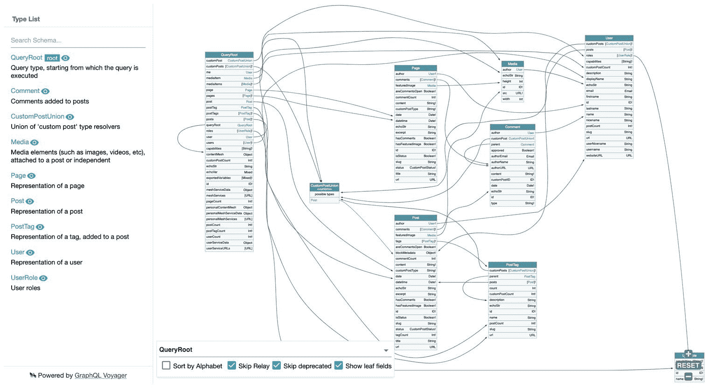
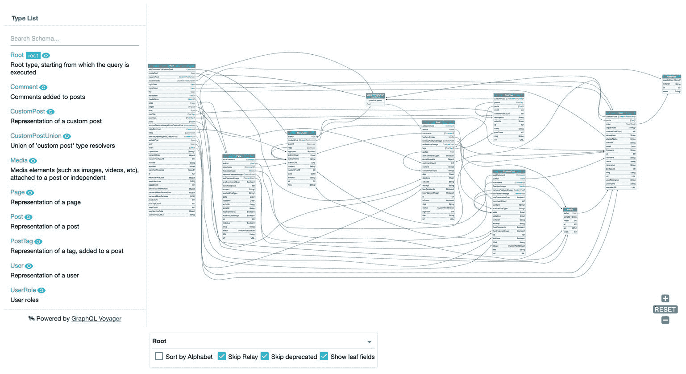
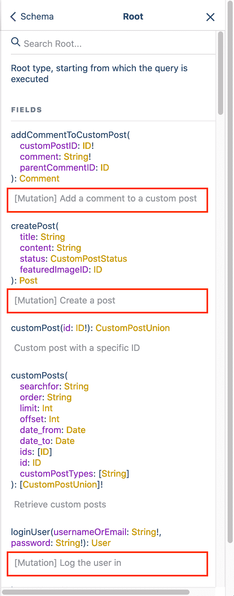

# 支持 GraphQL - LogRocket 博客中的选择性加入嵌套突变

> 原文：<https://blog.logrocket.com/supporting-opt-in-nested-mutations-in-graphql/>

嵌套突变提供了在 GraphQL 中除根类型之外的类型上执行突变的能力。例如，在顶级执行的这个标准变异:

```
mutation {
  updatePost(id: 5, title: "New title") {
    title
  }
}
```

也可以通过类型`Post`上的嵌套变异来执行:

```
mutation {
  post(id: 5) {
    update(title: "New title") {
      title
    }
  }
}
```

正如我在我的文章“[用 JavaScript 和 WordPress](https://blog.logrocket.com/coding-a-graphql-server-in-javascript-vs-wordpress/) 编写 GraphQL 服务器”中所讨论的，嵌套变异不会成为 GraphQL 规范的一部分(尽管[已经请求了它们](https://github.com/graphql/graphql-spec/issues/252)，因为`graphql-js`(参考 GraphQL 服务器实现)不支持它。

如果要支持嵌套突变，规范就需要消除并行解析字段的能力，这种能力太宝贵了，不能去掉。这种权衡是不值得的，这是不幸的，因为嵌套突变[使模式不那么臃肿，更容易理解](https://blog.logrocket.com/coding-a-graphql-server-in-javascript-vs-wordpress/#the-case-for-nested-mutations)。我相信这是一个值得拥有的好处，使嵌套突变成为一个引人注目的特性。

现在，并不是每种编程语言都自然地支持并行解析字段，就像 JavaScript 可以通过承诺提供的那样。在这种情况下，支持嵌套突变不需要像`graphql-js`那样的权衡，并且实现起来是可行的。

支持嵌套变异的 GraphQL 服务器不得使用该特性来替换标准行为，而是提供它作为替代选项:

*   默认情况下，继续使用标准行为
*   仅当显式启用时，才使用嵌套突变

因此，嵌套突变必须成为一个选择加入的特性，以确保开发人员意识到这不是标准的 GraphQL 行为，并且在这个 GraphQL 服务器中工作的查询很可能在其他地方不工作。

被选择加入，*支持这个特性*没有坏处；要么赢，要么没有变化。

WordPress 的 GraphQL API 是用 PHP 实现的。因为它不使用事件驱动的库来并行解析字段，所以它可以支持嵌套突变，没有任何缺点。在本文中，我将描述该服务器如何使用单一代码源来支持 GraphQL 规范*所期望的标准行为和*嵌套变异作为一个选择加入特性。

## `QueryRoot`和`MutationRoot`，或者仅仅是`Root`

对于标准行为，查询和变异通过两种不同的根类型分别处理:`QueryRoot`和`MutationRoot`(这是我喜欢的名字；它们也可以被命名为`Query`和`Mutation`，或者别的什么名字。这种分离使我们能够串行执行来自`MutationRoot`的突变字段，而所有其他字段(来自`QueryRoot`和其他实体的字段)可以并行解析。

在这种安排中，`MutationRoot`是整个 GraphQL 模式中唯一可以包含突变字段的类型。例如，在下面的模式中，突变字段(`createPost`和`updatePost`)只能出现在`MutationRoot`下:

```
type Post {
  id: ID!
  title: String
  content: String
}

type QueryRoot {
  posts: [Post]
  post(id: ID!): Post
}

type MutationRoot {
  createPost(title: String, content: String): Post
  updatePost(id: ID!, title: String, content: String): Post
}

schema {
  query: QueryRoot
  mutation: MutationRoot
}

```

更新帖子的唯一方法是这样的:

```
mutation {
  updatePost(id: 5, title: "New title") {
    title
  }
}
```

但是当引入嵌套变异时，这种情况就改变了，因为那时每个单一类型都可以在查询的任何级别(不仅仅是顶部)执行变异(不仅仅是根类型)。

例如，如果将一个突变字段`update`添加到`Post`中:

```
type Post {
  # previous fields
  # ...
  update(title: String, content: String): Post
}
```

我们也可以这样更新帖子:

```
mutation {
  post(id: 5) {
    title
    update(title: "New title") {
      newTitle: title
    }
  }
}
```

> **注意**:请注意字段`Root.updatePost`是如何被改编为`Post.update`的，它不再需要接收`ID`参数，使得模式更简单。

我们还可以对另一个变异的结果执行一个变异，如下面的查询所示，其中变异`Post.update`应用于由变异`Root.createPost`创建的对象:

```
mutation {
  createPost(title: "First title") {
    id
    update(title: "Second title", content: "Some content") {
      title
      content
    }
  }
}
```

在这个上下文中，类型`Post`现在包含查询和突变字段(比如前者的`title`和后者的`update`)。我相信这是无可避免的，原因我会在下面解释。

比方说，我们想要复制保持两个独立类型来处理查询和变异的想法，就像通过`QueryRoot`和`MutationRoot`所做的那样，对于所有其他类型也是如此。目标是让所有查询和变异都通过它们自己的独立分支来执行，以便并行解析查询字段，串行解析变异字段，如下所示:

*   `QueryRoot`=>`Post`=>=`Comment`=>等。对于查询
*   `MutationRoot`=>`MutationPost`=>=`MutationComment`=>等。对于突变

然后，我们将`Post`类型分成实体`Post`(仅处理查询)和`MutationPost`(处理突变)。然而，下面查询中的字段`post`应该返回类型`MutationPost`而不是`Post`，以便将字段`update`应用于其结果:

```
mutation {
  post(id: 5) {
    update(title: "New title") {
      newTitle: title
    }
  }
}
```

然后，我们需要复制每一个返回`Post`(比如`Root.post`)的字段，为变异分支(比如`MutationRoot.post`)返回`MutationPost`:

```
type QueryRoot {
  posts: [Post]
  post(id: ID!): Post
}

type MutationRoot {
  posts: [MutationPost]
  post(id: ID!): MutationPost
}
```

结果，模式会变得臃肿和难以管理，违背了引入嵌套突变来简化模式的目的。

然而，更糟糕的是:这种解决方案甚至不起作用，因为类型`MutationPost`可以解析字段`update`，但不能解析字段`title`:

```
mutation {
  post(id: 5) {
    title
    update(title: "New title") {
      newTitle: title
    }
  }
}
```

然后，类型`Post`必须包含查询和突变字段。

现在，既然查询和突变字段都在同一类型下并存，那么`MutationRoot`类型不再有意义，我们可以将`QueryRoot`和`MutationRoot`合并成一个类型`Root`，处理查询和突变字段:

```
type Post {
  id: ID!
  title: String
  content: String
  update(title: String, content: String): Post
}

type Root {
  posts: [Post]
  post(id: ID!): Post
  createPost(title: String, content: String): Post
  updatePost(id: ID!, title: String, content: String): Post
}

schema {
  query: Root
  mutation: Root
}
```

在这种情况下，模式变得更简单了。它可以变得更精简，因为我们可以从根类型中删除重复的字段:因为我们有了`Post.update`，我们不再需要`Root.updatePost`，它可以从模式中取出。

## 通过操作类型验证突变

现在，您可能会抱怨:因为它们与查询字段混合在一起，所以突变可以在任何级别添加到查询中，并且可以在任何时候执行。

例如，[这个查询](https://newapi.getpop.org/graphiql/?mutation_scheme=nested&query=query%20%7B%0A%20%20post(id%3A%201459)%20%7B%0A%20%20%20%20title%0A%20%20%7D%0A%7D):

```
query {
  post(id: 1459) {
    title
  }
}
```

可能会变成[这个查询](https://newapi.getpop.org/graphiql/?mutation_scheme=nested&query=query%20%7B%0A%20%20post(id%3A%201459)%20%7B%0A%20%20%20%20title%0A%20%20%20%20addComment(comment%3A%20%22Hi%20there%22)%20%7B%0A%20%20%20%20%20%20id%0A%20%20%20%20%20%20content%0A%20%20%20%20%7D%0A%20%20%7D%0A%7D):

```
query {
  post(id: 1459) {
    title
    addComment(comment: "Hi there") {
      id
      content
    }
  }
}
```

然后，当我们原本打算执行一个查询时，我们可能正在执行一个变异。

然而，我们仍然可以使用操作类型`query`和`mutation`来验证我们的意图。然后，上面的查询会产生一个错误，表明变异`addComment`不能被执行，因为查询正在使用操作类型`query`:

```
{
  "errors": [
    {
      "message": "Use the operation type 'mutation' to execute mutations",
      "extensions": {
        "type": "Post",
        "id": 1459,
        "field": "addComment(comment:\"Hi there\")"
      }
    }
  ],
  "data": {
    "post": {
      "title": "A lovely tango, not with leo"
    }
  }
}
```

[这个查询](https://newapi.getpop.org/graphiql/?mutation_scheme=nested&query=%23%20%23%20Uncomment%20this%20mutation%20to%20log%20the%20user%20in%0A%23%20mutation%20%7B%0A%23%20%20%20loginUser(%0A%23%20%20%20%20%20usernameOrEmail%3A%22test%22%2C%0A%23%20%20%20%20%20password%3A%22pass%22%0A%23%20%20%20)%20%7B%0A%23%20%20%20%20%20id%0A%23%20%20%20%20%20name%0A%23%20%20%20%7D%0A%23%20%7D%0Amutation%20%7B%0A%20%20post(id%3A%201459)%20%7B%0A%20%20%20%20title%0A%20%20%20%20addComment(comment%3A%20%22Hi%20there%22)%20%7B%0A%20%20%20%20%20%20id%0A%20%20%20%20%20%20content%0A%20%20%20%20%7D%0A%20%20%7D%0A%7D)反而会工作得很好:

```
mutation {
  post(id: 1459) {
    title
    addComment(comment: "Hi there") {
      id
      content
    }
  }
}
```

请注意，我们使用的是操作类型`mutation`，尽管在顶层不再有变异(只有`post`查询字段)。没关系——因为我们已经移除了`MutationRoot`(替换为`Root`)，对默认行为的期望不再适用。

## 对两种解决方案使用同一个代码源

如前所述，服务器必须支持两种行为:

1.  默认情况下，标准行为
2.  嵌套突变，作为选择加入

因此，默认情况下，它将公开类型`QueryRoot`和`MutationRoot`，并切换到为嵌套突变公开单个`Root`类型。

当提供解析器时，我们不想要求开发人员提供两个解析器，每个解决方案一个。用来解析`Root`字段的同一个解析器最好也能解析来自`QueryRoot`和`MutationRoot`的字段。为了处理这个问题，服务器宁愿遵循[代码优先的方法](https://blog.logrocket.com/code-first-vs-schema-first-development-graphql/)，因为它可以动态地为任一解决方案调整模式。

在[graph QL by PoP](https://graphql-by-pop.com/)——PHP 中一个 CMS 不可知的服务器，WordPress 的 GraphQL API 基于此——我们可以通过参数`?mutation_scheme`和值`standard`、`nested`或`lean_nested`在端点中定制这种行为(其中来自根的重复突变字段，如`Root.updatePost`被删除)。

例如，[标准端点](https://newapi.getpop.org/graphql-interactive/)如下所示:



Schema with standard behavior.

而[的嵌套突变终点](https://newapi.getpop.org/graphql-interactive/?mutation_scheme=nested)看起来是这样的:



Schema with nested mutations. Notice how the root type for queries went from `QueryRoot` to `Root` and there are many more fields, belonging to mutations.

服务器使用一个名为`FieldResolver`的对象来解析字段，使用一个名为`MutationResolver`的对象来执行实际的变异。同一个`MutationResolver`对象可以被实现不同字段的不同`FieldResolvers`引用，所以代码只实现一次，并在许多地方使用，遵循[实体](https://en.wikipedia.org/wiki/SOLID)方法。

如果`FieldResolver`通过函数`resolveFieldMutationResolverClass`为一个字段声明了一个`MutationResolver`对象，我们就知道这个字段是否是一个突变。

例如，字段`Root.replyComment`提供对象`[AddCommentToCustomPostMutationResolver](https://github.com/PoPSchema/comment-mutations/blob/a5e1b03a8ca3f7723d990ba6d63c19b7f32c8c8d/src%2FFieldResolvers%2FRootFieldResolver.php#L65)`。同样的对象[也被`Comment.reply`的](https://github.com/PoPSchema/comment-mutations/blob/a5e1b03a8ca3f7723d990ba6d63c19b7f32c8c8d/src%2FFieldResolvers%2FCommentFieldResolver.php#L96)使用。

此外，在对`FieldResolver`进行编码时，根字段仅在`Root`类型中添加的[。对于标准的 GraphQL 行为，服务器可以检索这个配置，并自动将这些字段添加到`MutationRoot`或`QueryRoot`中，这取决于](https://github.com/PoPSchema/comment-mutations/blob/a5e1b03a8ca3f7723d990ba6d63c19b7f32c8c8d/src%2FFieldResolvers%2FRootFieldResolver.php#L21)[是突变](https://github.com/GraphQLByPoP/graphql-server/blob/ece4d883a7e720ebb51f07b84efa94c0bbaa243c/src%2FTypeResolvers%2FMutationRootTypeResolver.php#L42)还是[而不是](https://github.com/GraphQLByPoP/graphql-server/blob/a26eed6e6fa9facc7c56e35b666113d834529d4a/src%2FTypeResolvers%2FQueryRootTypeResolver.php#L42)。

因此，由于我们使用单一来源的代码来支持标准行为和嵌套突变，我们能够毫不费力地执行带有嵌套突变的查询。

在[这个查询](https://newapi.getpop.org/graphiql/?mutation_scheme=nested&query=%23mutation%20%7B%0A%23%20%20loginUser(%0A%23%20%20%20%20usernameOrEmail%3A%22test%22%2C%0A%23%20%20%20%20password%3A%22pass%22%0A%23%20%20)%20%7B%0A%23%20%20%20%20id%0A%23%20%20%20%20name%0A%23%20%20%7D%0A%23%7D%0Amutation%20%7B%0A%20%20post(id%3A%201459)%20%7B%0A%20%20%20%20title%0A%20%20%20%20addComment(comment%3A%20%22Nice%20tango!%22)%20%7B%0A%20%20%20%20%20%20id%0A%20%20%20%20%20%20content%0A%20%20%20%20%20%20reply(comment%3A%20%22Can%20you%20dance%20like%20that%3F%22)%20%7B%0A%20%20%20%20%20%20%20%20id%0A%20%20%20%20%20%20%20%20content%0A%20%20%20%20%20%20%7D%0A%20%20%20%20%7D%0A%20%20%7D%0A%7D)中，我们通过`Root.post`获得帖子实体，然后对其执行变异`Post.addComment`，获得创建的评论对象。最后，我们对后一个对象执行变异`Comment.reply`:

```
mutation {
  post(id: 1459) {
    title
    addComment(comment: "Nice tango!") {
      id
      content
      reply(comment: "Can you dance like that?") {
        id
        content
      }
    }
  }
}
```

产生这种反应:

```
{
  "data": {
    "post": {
      "title": "A lovely tango, not with leo",
      "addComment": {
        "id": 117,
        "content": "<p>Nice tango!</p>\n",
        "reply": {
          "id": 118,
          "content": "<p>Can you dance like that?</p>\n"
        }
      }
    }
  }
}
```

如果我们想在几个对象上执行一个变异，使用默认行为，我们需要复制这个字段，以便传递一个`ids`参数(来指示要应用变异的几个对象)而不是`id`。

例如，如果有一个字段`MutationRoot.likePost`可以“喜欢”一篇文章，那么该字段必须复制到`MutationRoot.likePosts`中，以便同时“喜欢”几篇文章:

```
type MutationRoot {
  likePost(id: ID!): Post
  likePosts(ids: [ID!]!): [Post]
}
```

但是，使用嵌套突变，可以一次突变几个字段，而无需任何重复。例如，[这个查询](https://newapi.getpop.org/graphiql/?mutation_scheme=nested&query=%23mutation%20%7B%0A%23%20%20loginUser(%0A%23%20%20%20%20usernameOrEmail%3A%22test%22%2C%0A%23%20%20%20%20password%3A%22pass%22%0A%23%20%20)%20%7B%0A%23%20%20%20%20id%0A%23%20%20%20%20name%0A%23%20%20%7D%0A%23%7D%0Amutation%20%7B%0A%20%20posts(limit%3A%203)%20%7B%0A%20%20%20%20title%0A%20%20%20%20addComment(comment%3A%20%22First%20comment%20on%20several%20posts%22)%20%7B%0A%20%20%20%20%20%20id%0A%20%20%20%20%20%20content%0A%20%20%20%20%20%20reply(comment%3A%20%22Response%20to%20my%20own%20parent%20comment%22)%20%7B%0A%20%20%20%20%20%20%20%20id%0A%20%20%20%20%20%20%20%20content%0A%20%20%20%20%20%20%7D%0A%20%20%20%20%7D%0A%20%20%7D%0A%7D)将相同的评论添加到几个帖子中:

```
mutation {
  posts(limit: 3) {
    title
    addComment(comment: "First comment on several posts") {
      id
      content
      reply(comment: "Response to my own parent comment") {
        id
        content
      }
    }
  }
}
```

会产生这样的反应:

```
{
  "data": {
    "posts": [
      {
        "title": "Scheduled by Leo",
        "addComment": {
          "id": 126,
          "content": "<p>First comment on several posts</p>\n",
          "reply": {
            "id": 129,
            "content": "<p>Response to my own parent comment</p>\n"
          }
        }
      },
      {
        "title": "COPE with WordPress: Post demo containing plenty of blocks",
        "addComment": {
          "id": 127,
          "content": "<p>First comment on several posts</p>\n",
          "reply": {
            "id": 130,
            "content": "<p>Response to my own parent comment</p>\n"
          }
        }
      },
      {
        "title": "A lovely tango, not with leo",
        "addComment": {
          "id": 128,
          "content": "<p>First comment on several posts</p>\n",
          "reply": {
            "id": 131,
            "content": "<p>Response to my own parent comment</p>\n"
          }
        }
      }
    ]
  }
}
```

太棒了。

## 可视化模式中的突变字段

由于一个类型现在包含查询和变异字段，我们可能想要清楚地可视化哪个是哪个——例如，在使用 GraphiQL 时的文档上。

不幸的是，因为在进行自省时，type `__Field`上没有可用的`isMutation`标志，所以我使用的解决方案有点粗糙，并不完全令人满意。在这里，我们在字段的描述前面加上标签`"[Mutation] "`:



Description for type in GraphiQL docs.

为了做得更好，并像处理元数据一样处理这些数据(事实就是这样)，GraphQL API for WordPress 在类型`__Field`中添加了一个额外的字段`extensions`(从模式中隐藏)来检索定制的扩展数据，正如在[自省查询](https://newapi.getpop.org/graphiql/?mutation_scheme=nested&query=query%20%7B%0A%20%20__schema%20%7B%0A%20%20%20%20queryType%20%7B%0A%20%20%20%20%20%20fields%20%7B%0A%20%20%20%20%20%20%20%20name%0A%20%20%20%20%20%20%20%20extensions%0A%20%20%20%20%20%20%7D%0A%20%20%20%20%7D%0A%20%20%7D%0A%7D)中所做的那样:

```
query {
  __schema {
    queryType {
      fields {
        name
        # This field is not currently part of the spec
        extensions
      }
    }
  }
}
```

这将产生这些结果(注意带有`isMutation: true`的条目):

```
{
  "data": {
    "__schema": {
      "queryType": {
        "fields": [
          {
            "name": "addCommentToCustomPost",
            "extensions": {
              "isMutation": true
            }
          },
          {
            "name": "createPost",
            "extensions": {
              "isMutation": true
            }
          },
          {
            "name": "customPost",
            "extensions": []
          },
          {
            "name": "customPosts",
            "extensions": []
          },
          {
            "name": "loginUser",
            "extensions": {
              "isMutation": true
            }
          }
        ]
      }
    }
  }
}
```

## 结论

由于我的 GraphQL 服务器支持嵌套突变，我发现很难从顶层开始执行突变。

该模式变得更苗条、更整洁，不再需要`MutationRoot`打包除了突变之外毫无共同之处的字段，也不再需要复制字段来一次对几个对象执行突变。

我还可以像浏览数据模型中定义的关系一样执行嵌套操作，GraphQL 支持查询。

* * *

### 更多来自 LogRocket 的精彩文章:

* * *

嵌套突变是一个奇妙的特性。不幸的是，由于`graphql-js`不支持它们，它们(很可能)永远不会成为规范的一部分。但是这不应该阻止 GraphQL 服务器提供这个特性，允许开发人员决定是否在他们的应用程序中启用它。

## 监控生产中失败和缓慢的 GraphQL 请求

虽然 GraphQL 有一些调试请求和响应的特性，但确保 GraphQL 可靠地为您的生产应用程序提供资源是一件比较困难的事情。如果您对确保对后端或第三方服务的网络请求成功感兴趣，

[try LogRocket](https://lp.logrocket.com/blg/graphql-signup)

.

[](https://lp.logrocket.com/blg/graphql-signup)[https://logrocket.com/signup/](https://lp.logrocket.com/blg/graphql-signup)

LogRocket 就像是网络和移动应用的 DVR，记录下你网站上发生的每一件事。您可以汇总并报告有问题的 GraphQL 请求，以快速了解根本原因，而不是猜测问题发生的原因。此外，您可以跟踪 Apollo 客户机状态并检查 GraphQL 查询的键值对。

LogRocket 检测您的应用程序以记录基线性能计时，如页面加载时间、到达第一个字节的时间、慢速网络请求，还记录 Redux、NgRx 和 Vuex 操作/状态。

[Start monitoring for free](https://lp.logrocket.com/blg/graphql-signup)

.