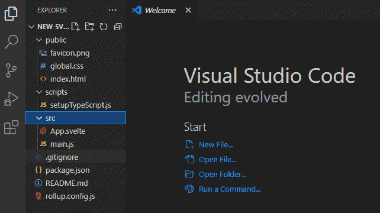
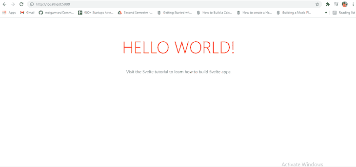
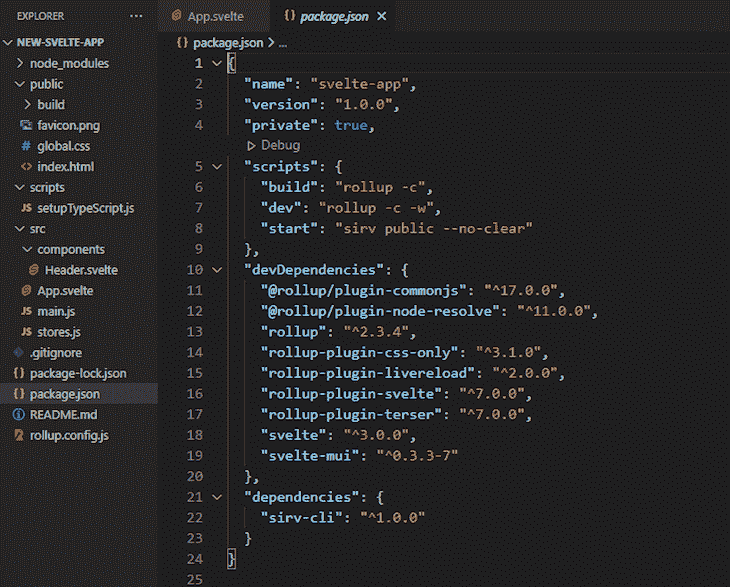
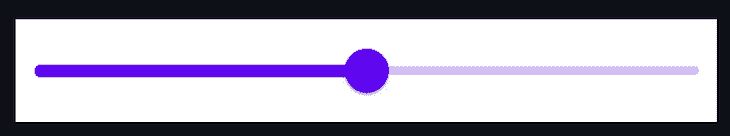
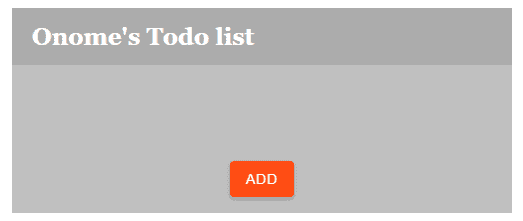
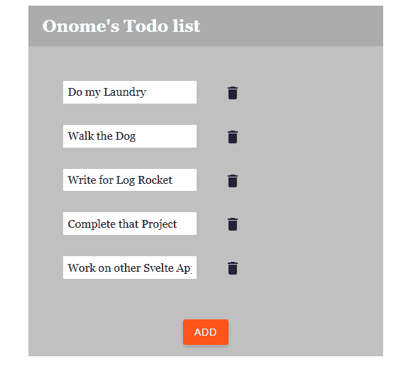

# 苗条的材料用户界面:先进的材料设计组件

> 原文：<https://blog.logrocket.com/svelte-material-ui-advanced-material-design-components/>

在过去的几年里，最主流的 JavaScript 框架和库包括 React、Angular 和 Vue 然而，自 2016 年 11 月发布以来，Svelte 的人气一直在增长。

Svelte 以其反应性而闻名，是构建高速 web 应用程序的强大工具，它通过编译代码并将其转换为纯 JavaScript 来更新 DOM。

在本教程中，我们将探索 Svelte Material UI (SMUI)，这是一个用于构建定制和高级 UI 组件的助手库，其灵感来自于 [Google 的 Material Design](https://material.io/develop/web) 。要跟随本教程，您需要:

*   熟悉 HTML、CSS 和 JavaScript
*   代码编辑器，即 Visual Studio 代码
*   安装在计算机上的 Node.js

接下来，你可以访问我的[Git](https://github.com/Nomzy-kush/Svelte-Todo-App)[H](https://github.com/Nomzy-kush/Svelte-Todo-App)[ub](https://github.com/Nomzy-kush/Svelte-Todo-App)repo 上的源代码。我们开始吧！

## 苗条身材入门

为了开始使用 svelet，首先，我们需要安装一个名为`degit`的 svelet 包，允许我们从[svelet Material UI Git](https://github.com/hperrin/svelte-material-ui)[H](https://github.com/hperrin/svelte-material-ui)[ub](https://github.com/hperrin/svelte-material-ui)repo 中克隆最新的提交。我们将使用`degit`从 [Svelte GitHub](https://github.com/sveltejs) repo 中获取一个新应用程序的启动模板。在您的终端中运行以下命令:

```
npm install -g degit

```

若要创建新的应用程序，请在应用程序目录的命令行中运行以下命令。请确保为您的项目添加一个唯一的名称:

```
degit sveltejs/template your-project-name

```

接下来，`CD`进入新的文件目录并运行`code .`，这将在 VS 代码中打开您的应用程序文件夹:



我们从[Sveltejs/template repository](https://github.com/sveltejs/template)获得了上面截图中的文件。请注意，苗条的应用程序遵循与其他 JavaScript 框架相似的结构。

在应用程序目录的终端中，运行以下命令来安装所需的依赖项:

```
npm install

```

接下来，我们将获得节点模块和控制依赖关系的`package-lock.json`文件。要在浏览器上本地打开您的应用程序，请在终端中运行以下命令:

```
npm run dev

```

现在，您的苗条应用程序应该在您的浏览器中的本地服务器上打开，如下图所示:



## 向你的苗条项目添加苗条的材料用户界面

要在我们的 Svelte 项目中使用 SMUI，首先，我们必须在终端中运行以下命令来安装它:

```
npm install --save-dev svelte-mui

```

依赖项将被安装在我们的`package.json`文件中，如下图所示:



Svelte Material UI 是一个轻量级 UI 组件的集合，我们可以轻松地将它导入到我们的 svelet 应用程序中，包括像复选框、菜单、图标、浮动标签、表单字段和单选按钮这样的 UI 元素的组件。

举个例子，假设我们需要一个 slider 组件在我们的应用程序中。我们可以在应用程序终端中运行以下命令:

```
npm install --save-dev @smui/slider

```

为了将滑块组件导入到我们的应用程序中，我们将复制下面的代码并粘贴到我们的`script`标签中:

```
import {MDCSlider} from '@material/slider';

```

接下来，我们将用下面的代码调用 HTML 中的连续滑块:

```
<div class="mdc-slider">
<input class="mdc-slider__input" type="range" min="0" max="100" value="50" name="volume" aria-label="Continuous slider demo">
<div class="mdc-slider__track">
    <div class="mdc-slider__track--inactive"></div>
    div class="mdc-slider__track--active">
      <div class="mdc-slider__track--active_fill"></div>
    </div>
  </div>
  <div class="mdc-slider__thumb">
    <div class="mdc-slider__thumb-knob"></div>
  </div>
</div>

```

滑块将出现在我们的应用程序中，如下图所示:



## 建立一个简单的待办事项列表

让我们使用来自 Svelte Material UI 的预构建组件来构建一个简单的待办事项列表应用程序。

我们的应用程序将有一个添加新任务的按钮，用户可以使用文本字段来定义。我们还将添加一个删除按钮，用于在事件完成后删除它们。为此，我们将从 SMUI 导入`Add`按钮、`Text`字段和`Delete`按钮组件。

### 入门指南

首先，让我们在我们的`src/components`文件夹中创建一个名为`Header.svelte`的新文件，它将包含应用程序标题的 UI:

```
<script>

</script>
<style>
    .header {
        display: flex;
        justify-content: space-between;
        align-items: center;
        padding: 15px 20px;
        color: #fff;`
        font-weight: bold;
        font-size: 1.5em;
        background: rgba(0, 0, 0, 0.1);
    }
</style>

<div class="header">
    <span>Onome's Todo list</span>
</div>

```

在您的`App.svelte`文件中，运行下面的代码来导入您的`script`标签中的组件:

```
import Header from "./components/Header.svelte";

```

现在，调用 HTML 中的标题，如下所示:

```
<Header />

```

## 导入`Add`按钮

接下来，我们将从 SMUI 导入`Add`按钮，这将为用户在待办事项列表中添加新任务创建一个新的文本字段。要导入`button`组件，首先，在您的终端中运行以下命令:

```
npm install @material/button

```

用下面的代码导入您的`script`标记中的`button`组件:

```
import { Button } from 'svelte-mui/src';

```

现在，在您的`script`标签中导入下面的代码，赋予`Add`按钮添加新任务作为文本字段的能力:

```
<script>
import { Button } from 'svelte-mui/src'
    let tasks = [];
    const addTasks = () => {
        tasks = [...tasks, '']
    }
</script>
<div>
<Button on:click={addTasks} raised color="#ff4d14">Add
    </Button>
</div>

```

如果您在终端中运行`npm run dev`，您的应用程序将如下图所示:



## 导入`Text`字段

要导入 [SMUI](https://sveltematerialui.com/demo/textfield) `Text`字段组件，首先，在应用程序的终端运行以下命令:

```
npm install --save-dev @smui/textfield

```

现在，您可以使用以下代码将`Text`字段组件导入到您的应用程序中:

```
import {MDCTextField} from '@material/textfield';

```

要获得您的`Text`字段，请将下面的代码复制并粘贴到您的 HTML 中:

```
<label class="mdc-text-field mdc-text-field--outlined">
                <span class="mdc-notched-outline">
                  <span class="mdc-notched-outline__leading"></span>
                  <span class="mdc-notched-outline__notch">
                        <span class="mdc-floating-label" id="my-label-id"></span>
                  </span>
                  <span class="mdc-notched-outline__trailing"></span>
                </span>
                <input type="text" class="mdc-text-field__input" aria-labelledby="my-label-id">
          </label>

```

## 导入`Delete`按钮

最后，我们将创建一个`Delete`按钮，它使用一个包装了 SMUI `button`组件的垃圾桶图标。点击后，该按钮将使用`slice()`功能从待办事项列表中删除一个任务。

首先，在您的终端中运行以下命令:

```
npm install @material/icon-button

```

现在，用以下代码将图标和`button`组件导入到您的应用程序中:

```
import {MDCRipple} from '@material/ripple';

```

让我们从[谷歌字体材料图标](https://fonts.google.com/icons?selected=Material+Icons)中检索垃圾桶图标；首先，我们将使用下面的代码在应用程序中导入材质图标:

```
<head>
        <link rel="stylesheet" href="https://fonts.googleapis.com/icon?family=Material+Icons">
 </head>

```

要导入您选择的图标，只需在您的应用程序中添加其 HTML 代码。在本例中，我们使用了[删除](https://fonts.google.com/icons?selected=Material+Icons&icon.query=delete)图标。接下来，我们将为`delete`按钮编写脚本，使其在点击事件被触发时移除任务:

```
<script>
    import { Button } from 'svelte-mui/src'
    let tasks = [];
    const removeTask = (index) => {
        tasks = [...tasks.slice(0, index), ...tasks.slice(index+1)];
     }
</script>
<div>
{#each tasks as task, index }
<Button on:click={()=>removeTask(index)} > <span class="material-icons" >
        delete
        </span> </Button>
{/each}
</div>

```

## 部署您的苗条应用程序

您可以像部署任何其他 web 应用程序一样部署您的苗条应用程序。但是，在部署到 [Netlify](https://www.netlify.com/) 或您选择的任何其他站点之前，您必须在您的终端上运行`npm run build`。我们最终的应用程序如下图所示:



你也可以在这里看到部署的 app [。](https://inspiring-jennings-ae09a3.netlify.app/)

# 结论

作为一个相对较新的 JavaScript 前端编译器，Svelte 仍然是一项正在进行中的工作。然而，它已经证明了自己是有效的和容易理解的，这部分归功于第三方包和组件库。这篇文章展示了苗条的材质 UI [如何利用材质 UI 组件](https://blog.logrocket.com/the-material-ui-grid-system/)，为创建更快的应用程序提供实用程序，这些应用程序具有更吸引人和更容易理解的 UI。

如有疑问，欢迎在下方评论！