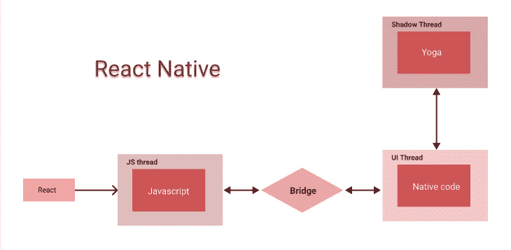
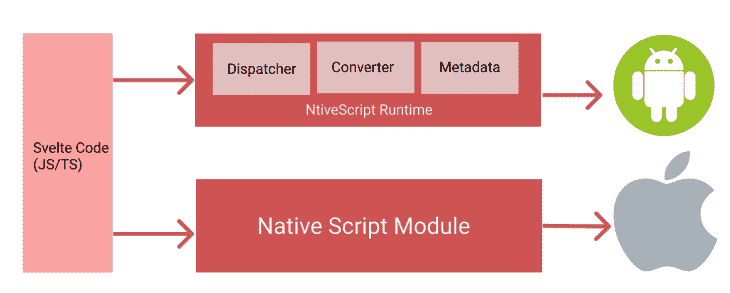

# 苗条的本土与反应本土:比较指南

> 原文：<https://blog.logrocket.com/svelte-native-vs-react-native/>

总会有新的、最新的和最好的框架来构建应用程序，但是在决定跳到任何新的框架之前，首先要确定它是否适合您的项目，最终是否值得切换。

在今天的文章中，我们将比较 React Native 和街区的新成员，苗条的 Native。

首先，让我们了解一下这两者及其提供的内容。

## 什么是苗条的土著？

Svelte Native 基于 Svelte，它允许 Svelte 开发者构建原生的 Android 和 iOS 应用程序。它最初于 2021 年 11 月由流行的 JavaScript 模块捆绑器 [Rollup](https://github.com/rollup/rollup) 的创造者 [Rich Harris](https://twitter.com/rich_harris) 发布。

## 为什么要用 Svelte Native？

难道我们还没有足够多的 JavaScript 库和框架吗？为什么用另一个？好吧，Svelte 是为了流畅、互动、简单和高效而设计的。Svelte 是你已经知道并喜欢的框架的对立面，你将在本文中进一步了解它。

苗条的原生是原生脚本和苗条的优点的结合。

根据 Svelte Native 网站的说法，这是一个“由 Svelte 支持的移动应用框架，使你能够使用你已经知道的网络框架来构建移动应用。”

## 什么是 React Native？

[React Native](https://reactnative.dev/) 是一个基于 [React](https://reactjs.org/) 的跨平台移动应用开发框架，允许你构建原生 Android 和 iOS 应用。它是顶级移动应用程序开发框架之一，[由脸书为其内部开发设计和开发](https://youtu.be/KVZ-P-ZI6W4)。然而，它在 2015 年成为了一个开源项目。

> [React Native](https://github.com/facebook/react-native) 将原生开发的最佳部分与 React 相结合，React 是用于构建用户界面的最佳 JavaScript 库。

在 React Native 之前，开发人员使用的是用 HTML、CSS 和 JavaScript 等 web 技术构建的混合移动应用程序。即使他们可以访问本地 API，UI 也主要利用了您的移动设备 web 视图。

这在性能、速度和应用商店打击方面造成了许多问题。进入 React Native，它允许 JavaScript 代码使用一个桥与本机代码对话，使应用程序更快、性能更好。在本文的下一节中，您将看到关于这一点的更多细节。

那么，如果苗条和反应自然的人完成同样的任务，他们有什么不同呢？我会深入研究的。首先，我将解释它们的内部工作原理。先说 React Native。

## 如何反应本土作品

React Native 在应用程序和目标设备(Android/iOS)之间创建了一个本机桥，允许 JavaScript 代码与本机代码进行对话，反之亦然。它通过创建三个线程来解释不同级别的 JavaScript 代码:一个 UI 线程、一个 shadow 线程和一个 JavaScript 线程。

### React Native 中的 UI 线程

它运行你的应用程序，并且是唯一可以访问你的用户界面的线程。因此，它可以旋转新的甚至更新你的用户界面。

### 阴影线

这会计算您用 React 创建的 UI 布局，并将它们发送到 UI 线程中的本机代码。React Native 利用 [Yoga](https://yogalayout.com/) 将 JavaScript UI 代码转换成主机平台能够理解的布局系统。

### JavaScript 线程

JavaScript 线程处理您的 JavaScript UI 布局，并将它们发送到影子线程进行计算，然后将它们发送到 UI 线程。



然而，React Native 的设计带来了一些挑战。对于有几个动画的应用程序，每秒钟有许多帧在 UI 上堆积，[性能可能是一个问题](https://reactnative.dev/docs/performance)。React 原生团队一直在研究[结构](https://reactnative.dev/docs/fabric-renderer)来解决这个问题，因为它将允许你的 React 原生代码直接与你的设备原生代码对话。

最终，这将消除使用 React Native bridge 带来的瓶颈。在由[Emil SJ lander](https://github.com/EmilSjolander)所做的演示中，您可以了解更多关于 React Native bridge 以及 React Native 如何工作的信息。

现在，让我们来看看苗条的土著。

## 与苗条的土著一起工作

Svelte Native 利用 [NativeScript](https://nativescript.org/) ，允许你用 JavaScript 开发原生应用，并让 JavaScript 代码直接访问设备原生代码。它没有包装器，这意味着您可以访问所有支持的设备 API。



## 苗条的本地人对反应本地人

### React Native 中的 JSX 支持

JSX 是一种 JavaScript 语法，允许你同时编写 HTML 和 JavaScript。React Native 支持 JSX，因为每个改用 React Native 的 React 开发者都已经熟悉了 JSX。

然而，斯维尔特并不支持 JSX。Svelte Native 允许你把`view`组件写成 HTML，直接映射到设备的本机`view`组件。

### 双向数据绑定

双向数据绑定允许不同组件的数据因另一个组件的数据变化而实时更新。Svelte 允许你在 HTML 和/或组件中使用`bind:value` [指令](https://svelte.dev/tutorial/text-inputs)来绑定数据。

```
<script>
  let name = 'Eze';
</script>
<input bind:value={name}>
<h1>Hello {name}!</h1>

```

但是，React Native 没有这个功能。但是，您可以始终设置值和更改处理程序，以实现与 React 的双向数据绑定，如下面的[段代码](https://codesandbox.io/s/pensive-dew-ixf4n?file=/src/App.js)所示:

```
import React, { useState } from 'react';
function App() {
  const [value, setValue] = useState("");
  const changeEventHandler = (e) => {
    setValue(e.currentTarget.value);
  };
  return (
    <>
    <p>Hello {value}</p>
      <input onChange={changeEventHandler}  value={value} />
    </>
  );
}
export default App;

```

### 平台相关代码

当我自己写苗条的原生代码时，我注意到我写的苗条代码比 JavaScript 多。当然，这是因为 Svelte 认为自己是自己的 web 框架，而不是 JavaScript 框架，不像 React，尽管大多数语法由更普通的 HTML 和 JavaScript 组成。

例如，React 中的循环如下所示:

```
import React from 'react';
function App() {
  const numbers = [1,2,3,4,5,6];
  return (
    <>
    {numbers.map((num)=><p>num</p>)}
    </>
  );
}
export default App;

```

它本质上与你用普通 JS 编写的代码是一样的。但是在 Svelte 中，这是不同的——你必须学习写循环的新方法。该循环使用看起来像 [mustache 语法](https://mustache.github.io/mustache.5.html)的模板标签:

```
<script>
  let numbers = [1,2,3,4,5];
</script>

<div>
  {#each numbers as num }
    <p>{num}</p>
  {/each}
</div>

```

就是这么简单！但是它不是纯 JavaScript，所以只要您不打算在另一个项目中重用这段代码，就可以了。

### 苗条土著和反应土著的社区采用

与苗条的土著相比，React Native 有一个庞大的社区。在撰写本文时，React Native 在 GitHub 上有超过 [100k 颗星星，而为 Svelte Native 提供支持的 NativeScript 有](https://github.com/facebook/react-native/stargazers) [20k+颗星星](https://github.com/NativeScript/NativeScript/stargazers)。

如果开发人员遇到错误，使用 React Native 比使用 Svelte Native 更容易获得帮助，因为可能有许多开发人员遇到了相同的问题并分享了他们的解决方案。

### 学习曲线和发展速度

与苗条的本地人相比，反应本地人有一个陡峭的学习曲线。任何懂 JavaScript 的开发人员现在都可以开始使用 Svelte Native，因为它的语法简单、简短且易于理解。

React Native 需要 React 的知识，这并不容易立即投入，因为你需要了解 JSX 如何工作以及生命周期挂钩如何工作。

开发速度在很大程度上取决于开发人员以及他们知道如何使用这个工具——反应还是苗条。如果想从使用 React Native 过渡到 Svelte Native 呢？从 React 原生开发人员过渡到专注于原生开发人员并不困难，但是如果你从原生开发人员过渡到 React 原生开发人员，可能需要更多的时间来学习。

### 反应原生与苗条原生设置

设置 React Native for development 在很大程度上取决于您使用的工具。如果您使用 React Native CLI，设置 React Native 会更具挑战性，因为您需要设置 Xcode 或 Android SDK 来编译和运行仿真器。然而，使用 [Expo](https://expo.dev/) 可以简化设置过程，因为它可以实时编译您的代码。你也可以很容易地看到世博测试 app 的变化。

对于 Svelte Native，您需要设置 Android SDK 来运行 NativeScript，因为目前没有工具允许您像 Expo 一样对 React Native 进行测试。开发人员曾经使用[预览应用](https://svelte-native.technology/docs)进行测试，但是它已经被弃用，不再维护。希望以后会有。

## 结论

两个手机 app 开发框架都很神奇。一如既往，没有正确的答案，哪一个最适合你。如果你计划开始一个新的移动应用项目，并且你熟悉 JavaScript 并且想要快速构建，从 Svelte Native 开始。

但是，如果您是 React 开发人员，您可能更喜欢使用 React Native 进行构建，因为它最适合 React 堆栈。最后一点:在撰写本文时，Svelte Native 仍处于测试阶段，随着时间的推移，预计会有一些限制和持续改进。感谢阅读！

## [LogRocket](https://lp.logrocket.com/blg/react-native-signup) :即时重现 React 原生应用中的问题。

[](https://lp.logrocket.com/blg/react-native-signup)

[LogRocket](https://lp.logrocket.com/blg/react-native-signup) 是一款 React 原生监控解决方案，可帮助您即时重现问题、确定 bug 的优先级并了解 React 原生应用的性能。

LogRocket 还可以向你展示用户是如何与你的应用程序互动的，从而帮助你提高转化率和产品使用率。LogRocket 的产品分析功能揭示了用户不完成特定流程或不采用新功能的原因。

开始主动监控您的 React 原生应用— [免费试用 LogRocket】。](https://lp.logrocket.com/blg/react-native-signup)