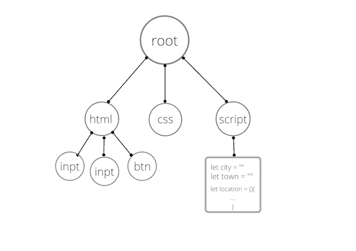
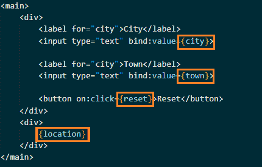
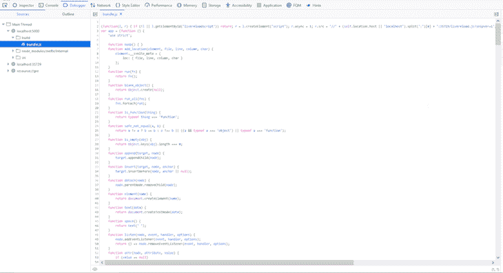

# Svelte vs. Vue:比较框架内部结构

> 原文：<https://blog.logrocket.com/svelte-vs-vue-comparing-framework-internals/>

React、Angular 和 Ember 曾一度站在 web 开发的最前沿，竞相成为最好的 JavaScript 框架，后来 Vue 迅速走红，取代了 Ember 的位置。

快进到 2022 年，历史似乎在重演[苗条，一个相对新的框架](https://blog.logrocket.com/building-a-pwa-with-svelte/) [，](https://blog.logrocket.com/building-a-pwa-with-svelte/)正以指数速度流行。我们不禁要问自己，斯维特是否具备成为顶级竞争者的条件。

Svelte 似乎从 Vue 的剧本中吸取了一页，实现并改进了最初让我们喜欢 Vue 的东西，比如高性能、轻量级和熟悉的模板语法以及简单的学习曲线。

在本文中，我们将检查 Svelte 和 Vue 之间的语法差异，比较它们如何在幕后工作。

### 目录

## Vue 的基础知识

Vue 是一个渐进的开源 JavaScript 框架，用于构建用户界面和单页面应用程序。

Vue 被设计成渐进式集成，这意味着你可以将 Vue 添加到现有前端项目的任何部分，而不必重新构建整个项目。Vue 只依赖 JavaScript，不像 Svelte 这样的框架使用编译器。

要用 Vue 构建一个单页面应用程序，您必须使用它的 CLI，这是一个命令行实用工具，用于快速搭建具有不同构建系统的 Vue 样板项目。

Vue 的核心是继承自其竞争对手 Angular 和 React 的一些概念。首先，Vue 利用 Angular 的反应式[双向数据绑定](https://angular.io/guide/two-way-binding)，这在模型和视图之间创建了一个反应式连接。另一个是 React 的虚拟 DOM diffing，它可以防止 Vue 在每次发生变化时都像外科手术一样更新 DOM。

部分受 MVVM 设计模式的启发，Vue 的重点是视图层，或模板。然而，Vue 应用程序中的每个组件实例都被称为一个[view mod](https://012.vuejs.org/guide/#ViewModel)El 或`vm`变量。`vm`是连接视图和模型-视图层的数据绑定系统。

## 苗条的基础

Svelte 是一个用于创建交互式用户界面的开源前端框架。与 Vue 不同，Svelte 是一个编译器，它将声明式状态驱动的组件转换为直接更新 DOM 的命令式 JavaScript 代码。

借助虚拟 DOM diffing 技术，单体框架在运行时编译声明性代码。虽然这种方法高效快速，但它需要浏览器在渲染网页之前执行额外的任务，从而产生影响应用性能的开销。

通过将其声明性代码解析并编译成浏览器在构建时可以使用的 JavaScript 代码，Svelte 避免了这种性能开销，[使其比使用虚拟 DOM 并在运行时编译的框架](https://krausest.github.io/js-framework-benchmark/2022/table_chrome_97.0.4692.71.html)快 2 倍。

## 入门指南

在我们对比这两个框架之前，让我们为每个框架建立一个示例应用程序，以便在整篇文章中引用。首先，创建两个新文件夹，每个框架一个。打开你机器的命令行工具，`cd` *进入各个文件夹，然后在各自的文件夹中运行下面的命令。*

 *### 某视频剪辑软件

以下命令将在您的计算机上安装 Vue CLI:

```
npm install -g @vue/cli
# OR
yarn global add @vue/cli

```

安装完成后，运行以下命令来搭建 Vue 项目:

```
vue create vue-sample-app

```

要运行应用程序，请将`cd`放入`vue-sample-app`文件夹:

```
cd vue-sample-app

```

然后，按如下方式启动开发服务器:

```
npm run serve

```

### 苗条的

使用下面的命令打开一个新的 Svelte 项目:

```
npx degit sveltejs/template

```

运行以下命令安装所需的依赖项:

```
npm install

```

现在，启动一个新的开发服务器:

```
npm run dev

```

虽然我们可以为我们的应用程序的源代码创建单独的组件，并将它们导入到项目中更高级别的组件`App.svelte`和`App.vue`中，但为了简单起见，我们将使用更高级别的组件。

让我们清理`App.svelte`和`App.vue`组件，并将以下代码块放入它们各自的文件中:

```
//VUE

<template>
  <label>City </label>
  <input type="text" v-model="city"/>
  <label>Town </label>
  <input type="text" v-model="town"/>
  <div class="location">Location: {{location}} </div>
  <button v-on:click="handleReset">Reset</button>
</template>
<script>
export default {
  name: 'App',
  data(){
    return{
      city: "",
      town: ""
    }
  },
  methods: {
    handleReset(){
        this.city = ""
        this.town = ""
    }
  },
  computed: {
    location(){
      return this.city + " " + this.town
    }
  }
}
</script>
<style scoped>
#app {
  font-family: Avenir, Helvetica, Arial, sans-serif;
  -webkit-font-smoothing: antialiased;
  -moz-osx-font-smoothing: grayscale;
  text-align: center;
  color: #2c3e50;
  margin-top: 60px;
}
input{
  display: block;
  margin-bottom: 15px;
  width: 200px;
  height: 35px;
}
button{
  width: 60px;
  height: 30px;
}
.location{
  margin-bottom: 10px;
}
</style>
```

```
//SVELTE

<script>
    let city = "";
    let town = "";
    $: location = "Location: " + city + ' ' + town;
    const reset = () => {
        city = "";
        town = "";
    }
</script>
<main>
    <div>
        <label>City</label>
        <input type="text" bind:value={city}>
        <label>Town</label>
        <input type="text" bind:value={town}>
        <button on:click={reset}>Reset</button>
    </div>
    <div>
        {location}
    </div>
</main>
<style>
  main{
    background-color: white;
  }
</style>

```

每个应用程序包含两个反应变量`city`和`town`，两个绑定到反应变量的输入字段，以及一个带有事件处理程序的按钮，该事件处理程序在被触发时重置反应变量。

> 注意:因为我们使用我们的应用程序只是为了比较，所以没有必要设计样式。

## 组件结构和语法比较

您可能已经注意到，Svelte 和 Vue 在模板结构和语法元素方面有很多共同的特性。两者都使用单文件组件，这是一种特殊的文件格式，将组件的模板、逻辑和样式封装在单个`.svelte`或`.vue`文件中。

单文件组件由三部分组成:

*   模板:`<template></template`部分包含组件的普通 HTML 标记
*   脚本:`<script></script>`部分包含组件中的所有 JavaScript 逻辑
*   style:`<style></style>`部分包含一个局部作用于组件的样式

Svelte 没有像 Vue 的`<template>`那样在组件中封装标记的专用模板标签。HTML 标记可以直接在组件内部以任何顺序定义。

### 声明性渲染

两个模板之间最明显的区别是引用声明性数据属性到模板的方法。细长使用单花括号`{ }`:

```
<div>
  {location}
</div>

```

另一方面，Vue 使用了双花括号`{{ }}`，这也被称为 mustache 语法:

```
<div>
  {{location}}
</div>

```

### 数据绑定

为了将数据从模型绑定到模板，Svelte 和 Vue 使用了称为指令的特殊属性。指令的工作是当它的表达式的值改变时，对 DOM 反应性地应用副作用。

`bind`是在 Vue 和 Svelte 中绑定数据的指令。`bind`指令接受由冒号表示的参数，以及将绑定到定义它的元素的数据属性或反应变量。

下面的代码包含了一个来自我们的样本 Svelte 应用程序的输入字段元素。`bind`指令被赋予一个`value`自变量和一个反应变量`city`:

```
&lt;input type="text" bind:value={city}>

```

在上面的代码中，`bind`指令将输入字段值绑定到反应变量`city`。当输入字段的状态改变时，反应变量将相应地更新。

Vue 在其指令中添加了一个`v-`前缀，因此,`bind`指令在 Vue 中的定义如下:

```
v-bind:value

```

在 Vue 应用中，我们用`v-model`替换了`v-bind`指令。在 Vue 中，`v-bind`仅单向绑定数据，而`v-model`创建双向绑定。

现在，假设我们使用`v-bind`将输入字段绑定到模型中的数据属性。只有输入场状态的变化才会触发反应。但是对于`v-model`，数据属性和输入元素状态的变化都会触发反应。

* * *

### 更多来自 LogRocket 的精彩文章:

* * *

### 计算属性

在我们的细长应用程序中，另一个特殊的语法是美元符号`$:`标签，它用于定义一个计算值，方法是将它作为一个顶级赋值或者不在代码块或函数内的赋值的前缀。

计算值或属性是一个反应式声明，它接受反应式变量作为赋值。当反应变量改变时，计算值起反应。基本上，计算值是一个依赖于其他状态的状态。

直接出现在`$:`块中的值将成为反应语句的依赖项。

在我们这个苗条的应用程序中，`location`值是一个根据反应变量`city`和`town`计算出来的值。我们将反应变量分配给计算值，并在模板中引用结果:

```
$: location = "Location: " + city + ' ' + town;

```

无论何时`city`或`town`发生变化，`location`都会相应地重新计算和更新 DOM。

在 Vue 中，计算属性在`component`对象中定义，并被分配命名函数，这些函数根据数据模型返回代码表达式:

```
export default {
  name: 'App',
  data(){
    return{
      city: "",
      town: ""
    }
  },
  computed: {
    location(){
      return this.city + " " + this.town
    }
  }
}

```

在我们的 Vue 示例应用程序的这个摘录中，我们创建了一个计算属性，并在其中定义了一个`location`函数。然后，我们返回了一个连接函数中的`city`和`town`数据属性的表达式。每当这些数据属性改变时，computed 属性将重新计算并更新它在 DOM 中的值。

> 注意:`this`关键字用于引用数据属性。

## 事件

这两个框架使用`on`指令以相似的方式处理事件，该指令接受由冒号表示的参数，就像`bind`指令一样:

```
//Svelte
On:click
```

```
//Vue
v-on:click

```

事件处理程序指令通常会调用一个函数，该函数在被触发时会返回一个表达式。简单地说，我们可以像定义其他函数一样定义这个函数:

```
const reset = () => {
  city = "";
  town = "";
}

```

然而，在 Vue 中，我们必须在组件模型中创建一个`method`属性，就像我们对`computed`属性所做的那样，并为它分配一个函数，该函数将在事件被触发时返回一个表达式:

```
&lt;template>
  <button ="handleReset">Reset</button>
</template>

...

methods: {
  handleReset(){
      this.city = ""
      this.town = ""
  }
}

```

在上面的例子中，我们创建了一个`method`属性，并在`data`函数、`city`和`town`中定义了一个重置反应属性的函数。然后，我们将函数名`handleReset`分配给按钮上的事件处理器指令。

在 Vue 中，表达式和函数名用引号定义或分配给指令:

```
<input type="text" v-model="city"/>

```

像在大多数框架中一样，函数和代码表达式被分配给带有花括号的指令:

```
<input type="text" bind:value={town}>

```

## 反应

反应性是一种编程风格，允许我们声明性地调整以适应变化，但它在 JavaScript 中并不是现成的。如果我们存储两个变量的和，然后重新分配这些变量，原始和不会改变:

```
let a = 10;
let b = 5;
let sum = a + b;
console.log(sum); // sum is 15
b = 15;
console.log(sum); // sum is still 15

```

为了在 JavaScript 中做出反应，我们必须检测其中一个值何时发生变化，跟踪改变它的函数，并触发该函数，以便它可以更新最终值。

大多数 JavaScript 框架都提供了特殊的 API 函数来处理这种逻辑。例如，为了创建反应变量，Vue 使用 option API 中的`data`对象和 Composition API 中的`ref()`方法。另一方面，React 使用`useState()`钩，Angular 使用`detectChanges()`方法。

然而，Svelte 并不使用特殊的 API 来产生反应。默认情况下，反应变量是通过赋值创建的，每个用`let`关键字声明的变量都是自动反应的。

让我们分别看看 Vue 和 Svelte 在运行时和构建时是如何处理反应的。

### 构建时间反应性

为了理解 Svelte 如何在内部处理反应，我们需要首先理解 Svelte 编译器是如何工作的。

当将细长组件编译成命令式 JavaScript 时，编译器会经历一个流水线过程，就像虚拟 DOM 一样。唯一的区别是虚拟 DOM 在运行时操作，而 Svelte 编译器在构建时操作。让我们回顾一下整个过程。

在编译期间，Svelte 实现了一个解析器，它能够解析 HTML 元素、逻辑块和条件，但不能解析组件的`style`和`script`标签中的 CSS 内容或 JavaScript 表达式。

每当解析器遇到`script`标签或花括号内的任何代码表达式，它就会将操作交给 [Acorn JavaScript 解析器](https://github.com/acornjs/acorn)。同样，当解析器遇到`style`标签时，Svelte 会将操作交给 CSS 树来处理解析。

接下来，编译器将把解析后的代码分解成更小的称为标记的部分。然后，编译器从标记列表中创建一个树状结构，称为抽象语法树(AST)。AST 是输入代码的表示:



基于 AST，编译器将生成一个代码输出。在静态分析和呈现阶段，代码输出将被分析并用于生成 JavaScript 代码。

## 苗条静态分析阶段

为了分析所创建的 AST，编译器将创建一个组件实例，它是一个组件类，存储一个瘦组件的信息，如反应变量、编译选项等。这就是所谓的静态分析阶段。

首先，组件类将遍历脚本 AST，并查找组件中声明的所有变量和函数。在我们的例子中，它将发现`city`变量、`town`变量、`reset`函数和`location`计算值。

每当这些变量中的任何一个发生变化，组件类都会将它们标记为`reassigned`。接下来，它将遍历模板 AST 并查找之前收集的变量和函数，将它们标记为`references`:



模板中没有引用的变量不一定是反应性的。此外，模板中引用变量的元素将变量作为依赖项。因此，只要它们在运行时发生变化，这些元素就需要更新。

最后，Svelte 将遍历 CSS AST，将 CSS 选择器更新为组件范围，并警告任何未使用的选择器。

## 苗条渲染阶段

为了生成输出代码，Svelte 将基于一个`compile`选项创建一个渲染器实例。它将为客户端呈现创建一个 DOM 呈现器，或者为服务器端呈现创建一个 SSR 呈现器。

我们的示例应用程序不是 SSR 应用程序，因此 Svelte 将使用 DOM 渲染器来生成运行时代码输出:



要查看运行时代码，打开浏览器的 DevTool，导航到 Firefox 中的 **`source`** 选项卡，或**调试器选项卡**。您应该会在侧边栏中看到一个`build`文件夹。在这个文件夹中有一个`bundle.js`文件，里面存放了编译器生成的所有运行时 JavaScript 代码。

如果您查看`bundle.js`文件，您会注意到它包含了跨越几行的代码块。我们对`$$instance`代码块感兴趣，它是包装我们应用程序上下文的函数:

```
function instance($$self, $$props, $$invalidate) {
    let location;
    let { $$slots: slots = {}, $$scope } = $$props;
    validate_slots('App', slots, []);
    let city = "";
    let town = "";

    const reset = () => {
      $$invalidate(0, city = "");
      $$invalidate(1, town = "");
    };

    const writable_props = [];

    Object.keys($$props).forEach(key => {
            if (!~writable_props.indexOf(key) && key.slice(0, 2) !== '$$' && key !== 'slot') console.warn(`<App> was created with unknown prop '${key}'`);
    });

    function input0_input_handler() {
        city = this.value;
        $$invalidate(0, city);
    }

    function input1_input_handler() {
        town = this.value;
        $$invalidate(1, town);
    }

    $$self.$capture_state = () => ({ city, town, reset, location });

    $$self.$inject_state = $$props => {
        if ('city' in $$props) $$invalidate(0, city = $$props.city);
        if ('town' in $$props) $$invalidate(1, town = $$props.town);
        if ('location' in $$props) $$invalidate(2, location = $$props.location);
    };

    if ($$props && "$$inject" in $$props) {
        $$self.$inject_state($$props.$$inject);
    }

    $$self.$$.update = () => {
        if ($$self.$$.dirty & /*city, town*/ 3) {
                $$invalidate(2, location = "Location: " + city + ' ' + town);
        }
    };

  return [city, town, location, reset, input0_input_handler, input1_input_handler];
}

```

`$$invalidate`方法用于包装`instance`函数不同部分的反应分配，当分配改变时通知 Svelte。

`$$invalidate`方法是一种促进苗条身材反应的内部功能。它将每个值发生变化的变量标记为`dirty`，然后调度更新。Svelte 调用`update`函数来执行检查并确定哪个变量需要更新:

```
$$self.$$.update = () => {
    if ($$self.$$.dirty & /*city, town*/ 3) {
        $$invalidate(2, location = "Location: " + city + ' ' + town);
    }
};

```

在`reset`和`input_handler`函数中调用了`$$invalidate`方法，这是应用程序中发生变化的部分。前者是我们在应用程序中创建的用于重置反应变量的函数，而后者是由 Svelte 创建的用于将输入字段值绑定到反应变量的函数:

```
const reset = () => {
    $$invalidate(0, city = "");
    $$invalidate(1, town = "");
};

```

`input_handler`函数是由我们分配给模板中输入字段的`bind`指令创建的:

```
bind:value = {city}

```

上面的指令将被编译成以下代码:

```
function input0_input_handler(){
    city = this.value; 
}

```

## Vue 运行时反应性

Vue 由三个促进框架功能的核心模块组成，即反应模块、挂载模块和呈现模块。

### 反应模块

反应模块允许我们创建反应 JavaScript 对象，我们可以观察变化。我们可以在代码运行时跟踪依赖于这些对象的代码，这样当反应性对象发生变化时，可以重新运行这些代码。

### 安装模块

安装模块将 HTML 模板编译成呈现函数。呈现函数可能类似于下面的代码:

```
render() {
  return h(
    'h' + this.level, // tag name
    {}, // props/attributes
    this.$slots.default() // array of children
  )
}

```

### 渲染器模块

渲染器模块将组件渲染并更新到网页上。这个过程分为三个不同的阶段。

在呈现阶段，渲染器模块调用 render 函数，它返回一个虚拟 DOM 节点或 VNode，用 JavaScript 对象表示 DOM 元素。例如，`HTML: <div>logRocket</div>`可以由 VNode 表示如下:

```
{
  tag: "div",
  children: [
    {
    text: "logRocket"
    }
  ]
}

```

在挂载阶段，渲染器获取 VNode 并调用 DOM JavaScript 来创建网页。

最后，在修补阶段，呈现器获取旧的和新的 VNodes，比较两者，并且仅更新网页中已经改变的部分。当反应对象改变时，反应模块触发修补阶段。

使用虚拟 DOM，Vue 确保这些功能在一个大的组件树上是可执行的。

为了满足我们之前陈述的核心反应性需求，反应性模块将首先基于`data`函数中的数据属性创建 JavaScript 对象。然后，它将把对象包装在一个`proxy`中，并将其存储为`this.$data`，这意味着我们的示例应用程序中的数据属性`this.city`和`this.town`将变成`this.$data.city`和`this.$data.town`。前者的数据属性是后者的别名。

代理是一个 ES6 JavaScript 对象，它封装了另一个对象，并允许您拦截与该对象的任何交互。接下来，代理将把计算出的属性`location`包装在一个`effect`函数中，每当访问计算出的属性时，该函数就会运行。该效果将运行`location`函数中的表达式，例如，连接`city`和`town`数据属性。

在这个操作过程中，代理将调用一个`handler`函数。使用`handler`函数内的`get`处理程序中的`track`函数，`handler`函数将跟踪并记录当前正在运行的效果。

Vue 知道将数据属性`city`和`town`标记为效果的`dep`，意味着`location`依赖于`city`和`town`，因此它们是`location`的`deps`，依赖关系。

最后，该模块将在`handler`函数中创建一个`set`处理程序，每当`deps`改变时，该处理程序将重新运行效果。在`set`处理程序中有一个`trigger`函数，它将查找依赖于属性的效果，然后启动重新运行过程。

## 结论

尽管 Svelte 带来了额外的好处，但许多开发人员还没有准备好迁移到它，主要是因为它缺乏灵活性和较小的社区支持。

毫无疑问，Svelte 是一个高性能的框架，但是 Vue 已经有多年的时间和大量的支持来实现和改进这些方面。Svelte 是一个相对较新的框架，它仍在试图在生态系统中找到自己的立足点。

希望 Svelte 的创造者 Rich Harris 和 Vercel 之间的合作将推动 Svelte 达到应有的高度。我希望你喜欢这篇文章！

## 像用户一样体验您的 Vue 应用

调试 Vue.js 应用程序可能会很困难，尤其是当用户会话期间有几十个(如果不是几百个)突变时。如果您对监视和跟踪生产中所有用户的 Vue 突变感兴趣，

[try LogRocket](https://lp.logrocket.com/blg/vue-signup)

.

[](https://lp.logrocket.com/blg/vue-signup)[https://logrocket.com/signup/](https://lp.logrocket.com/blg/vue-signup)

LogRocket 就像是网络和移动应用程序的 DVR，记录你的 Vue 应用程序中发生的一切，包括网络请求、JavaScript 错误、性能问题等等。您可以汇总并报告问题发生时应用程序的状态，而不是猜测问题发生的原因。

LogRocket Vuex 插件将 Vuex 突变记录到 LogRocket 控制台，为您提供导致错误的环境，以及出现问题时应用程序的状态。

现代化您调试 Vue 应用的方式- [开始免费监控](https://lp.logrocket.com/blg/vue-signup)。*