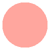
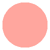
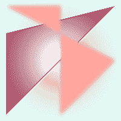

# 使用 SVG 与 Canvas:一个简短的指南

> 原文：<https://blog.logrocket.com/svg-vs-canvas/>

所以，你需要在你的应用程序或网站中添加一些图表？到目前为止，您已经发现有许多不同的方法可以实现这一点，其中大多数都利用了两种主要技术之一:SVG 和 Canvas API。

为了决定哪一个最适合您的需求，我们需要看看 SVG 和 Canvas 的相对优势和劣势，以及它们如何在不同的图表绘制解决方案中发挥作用。

Canvas 和 SVG 都是允许 web 开发人员在屏幕上绘制图像的技术，但是它们有非常不同的 API 和方法。

## What is SVG？

SVG 代表“可缩放矢量图形”,代表了一个标准体，用于声明性地定义图像的属性(如形状本身、填充颜色、笔画颜色等)。

```
<svg width="100" height="100" >
  <circle cx="50" cy="50" r="45" fill="#FFA69E" />
</svg>

```



SVG 图像可以通过添加一个`<svg>`标签与 HTML 代码内联创建，也可以在单独的文件中定义(扩展名为`.svg`)并在 HTML 中引用。

## 什么是画布？

Canvas 是一个较低级别的浏览器标准 API，允许开发人员通过发出一系列命令直接在图像上强制“绘制”:

```
const canvas = document.querySelector('canvas');
const ctx = canvas.getContext('2d');
ctx.fillStyle = '#FFA69E';
ctx.arc(50, 50, 45, 0, 2 * Math.PI);
ctx.fill();

```



画布图像是通过向 HTML 添加一个`<canvas>`元素，然后通过 JavaScript DOM API 操纵该元素来创建的，如上所示。

## SVG 与 Canvas: API 差异

因为 Canvas 是一个比 SVG 更低级的 API，所以它提供了比 SVG 更大的灵活性，但也换来了更大的复杂性。可以在画布上绘制的内容的限制只受到开发人员愿意编写多少代码的限制。只要付出足够的努力，任何 SVG 图像都可以用 Canvas API 来绘制。

相反，因为 SVG 是比 Canvas 更高级的 API，所以它可以创建复杂的图像，而不需要开发人员编写复杂的代码。

在这个例子中，我们只用了 15 行 SVG 代码就对几个多边形应用了光照和模糊效果。生成相同的图像，相应的画布代码会复杂得多:

```
<svg width="200" height="200" >
  <defs>
    <filter id="point-light">
      <feSpecularLighting result="light" specularConstant="1" specularExponent="150" lighting-color="#DDFFF7">
        <fePointLight x="100" y="100" z="200"/>
      </feSpecularLighting>
      <feComposite in="SourceGraphic" in2="light" operator="lighter" />
    </filter>
    <filter id="blur">
      <feGaussianBlur in="SourceGraphic" stdDeviation="3" />
    </filter>
  </defs>
  <polygon points="190,10 10,55 10,190" fill="#AA4465" filter="url(#point-light)"/>
  <polygon points="10,10 190,100 100,190 100,10" fill="#FFA69E" filter="url(#blur)" />
</svg>

```



然而，由于 Canvas 提供了更多的灵活性，并不是每一个可以在 Canvas 上绘制的图像都可以用 SVG 语法精确地表达(除了使用微小的 SVG `<rect>`元素作为“像素”)。

使用 SVG 生成这个图像会有些困难:

```
const canvas = document.querySelector('canvas');
const ctx = canvas.getContext('2d');
function mix(channel1, channel2, proportion, variability) {
  const scaledVariability = variability * 0xFF;
  return channel1 * (1 - proportion) +
    channel2 * proportion -
    scaledVariability / 2 +
    scaledVariability * Math.random();
}
const color1 = {
  r: 0xAA,
  g: 0x44,
  b: 0x65,
};
const color2 = {
  r: 0x86,
  g: 0x16,
  b: 0x57,
};
const variability = 0.2;
for (x = 0; x < Canvas.width; x++) {
  for (y = 0; y < Canvas.height; y++) {
    const proportion = x / (Canvas.width - 1) +
      y / (Canvas.height - 1) / 2;
    const color = {
      r: mix(color1.r, color2.r, proportion, variability),
      g: mix(color1.g, color2.g, proportion, variability),
      b: mix(color1.b, color2.b, proportion, variability),
      a: (0.9 + Math.random() / 10).toFixed(2),
    };
    ctx.fillStyle = `rgba(${color.r}, ${color.g}, ${color.b}, ${color.a})`;
    ctx.fillRect(x, y, 1, 1);
  }
}

```


当使用 SVG 和 Canvas 时，有一些重要的含义需要考虑。上面概述的 SVG 和 Canvas 之间的 API 的基本差异具有您应该考虑的下游影响，例如:

### SVG 元素可以和 HTML 标记一起存在于 DOM 中

这意味着 SVG DOM 元素可以以 web 开发人员熟悉的方式操作，包括集成到 React 或 Vue 等流行框架中。

这样做的一个缺点是，例如，包含数万个节点的复杂 SVG 图表对于浏览器来说可能是资源密集型的，无法高效呈现，从而导致缓慢或抖动的网页。这是因为画布操作直接提交给屏幕，所以绘图操作的数量对性能的影响较小，因为没有在 DOM 中跟踪这些操作的开销。

### 和 HTML 一样，SVG 是声明性的

这意味着浏览器负责将所需的图像翻译成在屏幕上绘制像素的低级命令代码——开发人员不必担心这一点。复杂的图像可以用 SVG 语法简洁地表示。

### SVG 图像可以响应，而画布图像则不能

SVG 可以根据父容器大小或屏幕大小的变化而伸缩，而 Canvas 元素需要定制 JavaScript 来实现这种行为。

## SVG 和 Canvas:哪个对你更好？

考虑到 SVG 和 Canvas 之间的差异，我们可以评估图表项目的需求，并确定哪种技术可能更好地为我们服务。值得提出以下问题:

1.  图表会有很多元素还是非常详细？Canvas 可以更好地显示这些数据，而不会因为有很多 DOM 节点而使浏览器陷入困境。但是如果图表相对简单，SVG 语法可能是一个更简单、更快速的解决方案，可以快速得到一个漂亮的图表。
2.  你的图表需要有几个动画或者在宽度上有反应吗？虽然使用 Canvas 渲染动画或使 Canvas 元素响应宽度变化肯定是可能的，但使用 SVG 和 CSS 实现这些效果可能更简单。
3.  图表需要交互吗？因为 SVG 元素在 DOM 中，所以响应用户动作(比如单击图表的特定元素)就像响应任何其他 DOM 元素上的事件一样简单。画布交互是可能的，但需要一些额外的代码。

## 图表库

因为呈现数据可视化对于网站和应用程序来说是如此常见的用例，所以有大量的库使得用 Canvas 或 SVG 绘制图表变得很容易。对“ [JavaScript 图表库](https://duckduckgo.com/?q=javascript+chart+libraries)”进行快速 DuckDuckGo 搜索，将会出现几十个页面，列出许多不同的可用选项。

一些流行的选项提供了开箱即用的漂亮图表，如 [Chart.js](https://www.chartjs.org/) 或 [Chartist](https://gionkunz.github.io/chartist-js/) 。其他的更复杂，但是允许更多的定制，比如 [Vega-Lite](https://vega.github.io/vega-lite/) 。许多库都是建立在 web 上数据可视化的事实库之上的，比如 [D3.js](https://d3js.org/) ，它提供了完全的灵活性和控制，但代价是学习曲线很陡。

### 在后端呈现图表

用 SVG 和 Canvas 创建图表并不局限于浏览器环境；它们也可以在服务器应用程序中呈现。

对于 SVG，可以使用类似[木偶师](https://developers.google.com/web/tools/puppeteer/)的工具在无头 Chrome 浏览器中渲染 SVG 图像，并根据需要生成截图。对于 Canvas，有一个奇妙的库叫做 [Canvas](https://www.npmjs.com/package/canvas) ，它为 Node.js 提供了一个近乎完整的标准 Canvas API 实现

### 后端画布渲染的一个例子

这个 JavaScript 代码片段编码了一条秘密消息。要查看它是什么，请将这段代码保存在一个名为`index.js`的文件中:

```
const { join } = require('path'),
  { createWriteStream } = require('fs'),
  { createCanvas } = require('canvas');

const canvas = createCanvas(200, 100);
const ctx = canvas.getContext('2d');

ctx.strokeStyle = '#861657';
ctx.lineWidth = 5;
ctx.lineCap = 'round';
ctx.beginPath();
ctx.moveTo(40, 25);
ctx.lineTo(40, 75);
ctx.moveTo(40, 50);
ctx.lineTo(100, 50);
ctx.moveTo(100, 25);
ctx.lineTo(100, 75);
ctx.moveTo(160, 25);
ctx.lineTo(160, 75);
ctx.stroke();

const path = join(__dirname, 'message.png');
const out = createWriteStream(path);
const stream = Canvas.createPNGStream();
stream.pipe(out);
out.on('finish', () => console.log(`Image file created at ${path}.`));

```

然后在`index.js`旁边保存一个名为`package.json`的文件，内容如下:

```
{
  "private": true,
  "dependencies": {
    "canvas": "^2.7.0"
  }
}

```

从保存`index.js`和`package.json`的同一个目录中，运行以下命令(Node.js 必须安装在您的`PATH`上可用):

```
npm install
node index.js

```

如果一切按计划进行，您生成的带有秘密信息的无标题 PNG 图像将被保存到`message.png`。👋

## 结论

SVG 和 Canvas 都是强大而成熟的技术，它们都有强大的库和文档生态系统来帮助您将图表变得生动。而且有些库甚至支持同时渲染到 SVG 或者 Canvas！

不要害怕投入一些时间来评估备选方案，以找到满足您特定项目需求的正确解决方案。在决定使用 SVG 还是 Canvas 时，这里有一些快速的经验法则。

*   您的图表需要响应性或交互性吗？SVG 可能比 Canvas 更简单地提供这些特性。
*   你的图表会非常详细或复杂吗？Canvas 可能比 SVG 提供更好的性能和更强的控制。

祝你好运！

## 使用 [LogRocket](https://lp.logrocket.com/blg/signup) 消除传统错误报告的干扰

[](https://lp.logrocket.com/blg/signup)

[LogRocket](https://lp.logrocket.com/blg/signup) 是一个数字体验分析解决方案，它可以保护您免受数百个假阳性错误警报的影响，只针对几个真正重要的项目。LogRocket 会告诉您应用程序中实际影响用户的最具影响力的 bug 和 UX 问题。

然后，使用具有深层技术遥测的会话重放来确切地查看用户看到了什么以及是什么导致了问题，就像你在他们身后看一样。

LogRocket 自动聚合客户端错误、JS 异常、前端性能指标和用户交互。然后 LogRocket 使用机器学习来告诉你哪些问题正在影响大多数用户，并提供你需要修复它的上下文。

关注重要的 bug—[今天就试试 LogRocket】。](https://lp.logrocket.com/blg/signup-issue-free)