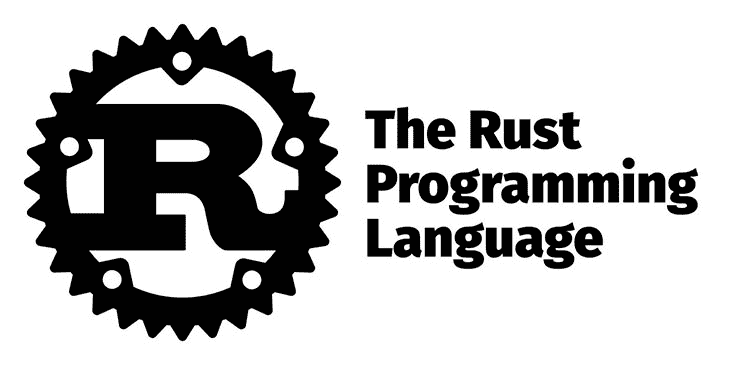

# Swift 与 Rust:比较指南

> 原文：<https://blog.logrocket.com/swift-vs-rust-comparison-guide/>

Rust 和 Swift 有着不同的使用案例，它们有许多相似的特性。这两种语言都是通用的，并且提供了现代编程特性。

虽然苹果开发了 Swift 编程语言来代替 Objective-C，Mozilla 基金会开发了 Rust 来代替 C++编写内存安全的代码，但这些语言在开发人员社区中的受欢迎程度越来越高。

Swift 已经作为 iOS 和 macOS 的 UI 工具找到了一个家，Rust 广泛用于需要低级表达能力的应用程序，如嵌入式系统编程。

本文比较了 Rust 和 Swift 编程语言，让您深入了解它们的用例、相似性和特性。

## 什么是 Swift？


Swift 是一种直观的、命令式的、多范例的通用编程语言。它因其安全性、性能、现代编程特性和实践以及设计模式的简单实现而备受青睐。

Swift 的速度、简洁和表达能力是开发人员选择 Swift 的原因。尽管 Swift 是跨平台的，但 Swift 主要用于构建在 macOS、iOS、iPadOS、tvOS 和 watchOS 上运行的应用程序。

Swift 最终取代了它的前身 Objective-C 语言，因为它的独特功能为开发人员提供了动力。Swift 还用于扩展云服务。

Swift 中有一个简单的“Hello World”程序:

```
print("Hello, World!")

```

`print`函数将指定的文本或变量打印到控制台。

## Swift 的功能

Swift 的特性使开发更加易于管理和灵活，并且可以进行低层次的交互。Swift 提供闭包、元组、泛型、范围循环、函数式编程支持、内置错误处理和对程序控制流的访问。

以下是使 Swift 脱颖而出的一些特性。

### 程序安全

安全是 Swift 设计的口号之一。与它的前身语言不同，Swift 消除了不安全的代码，如预初始化的变量，对数组和整数执行溢出检查，并有一个垃圾收集器，自动执行内存安全和常见的内存错误。

Swift 的安全性是以严格的代价换来的，但当你为 Swift 代码写作时，你会习惯于这种体验并欣赏 Swift 的安全特性。

### 速度

Swift“快如闪电”，因为该语言利用了高性能的 LLVM(低级虚拟机)编译器技术。Swift 代码被编译成机器代码，优化后可以在现代硬件上运行。

Swift 的设计包括从低级原语到结合了速度和灵活性的类和泛型提供速度的特性。

### 表达性

表达能力是开发者喜欢 Swift 的原因之一。该语言为各种操作提供了四种类型的表达式(前缀、中缀、主表达式和后缀)。

像泛型、函数式编程函数、简单的错误处理等特性使得 Swift 比大多数现代编程语言更容易使用。

## 使用 Swift 的优势

Swift 的优雅具有许多优势。让我们谈谈开发人员喜爱 Swift 的一些原因。

* * *

### 更多来自 LogRocket 的精彩文章:

* * *

第一，Swift 的表现力很强，它的表现力让开发变得更容易更快。由于 Swift 速度快，性能高，并确保程序安全，所以它是构建应用程序的好选择。

Swift 并不占用大量的计算机内存资源；Swift 是用于自动内存管理的垃圾收集。

除了 Swift 与其前身语言(Objective-C)和 C++的互操作性之外，Swift 还是一种支持跨平台的通用语言。

## 使用 Swift 的缺点

Swift 是构建苹果产品和设备的默认语言，使用 Swift 的缺点之一是对第三方工具、ide 和环境的支持有限。

此外，由于 Swift 主要以苹果的产品和操作系统闻名，因此 Swift 开发人员和社区的数量有限。

## 什么是铁锈？



Rust 是一种富于表现力的通用多范例编程语言，具有类型安全、内存安全和并发特性。

在许多调查中，Rust 是最受欢迎的编程语言。Rust 拥有丰富的类型系统，支持函数式和面向对象范式的编程，并使用借用检查器来确保编译时的程序内存安全。

Mozilla 开发 Rust 是为了解决 C++的技术债务。Rust 用于 C++曾经是首选语言的大多数领域，如系统编程、服务器端编程、云开发，以及与硬件和速度的底层交互至关重要的用例。

Rust 中有一个简单的“Hello World”程序:

```
fn main() {
    println!(“Hello, world!”);
}

```

`println`宏将指定的文本或变量写入控制台。

## 铁锈的特征

Rust 提供了 move 语义、无数据跟踪的线程、高效的 C 互操作性以及更多特性。

### 内存安全

内存安全是 Rust 的主要特点。与 Swift 和 Go 等大多数使用垃圾收集器和 C/C++进行快速内存管理(使用 RAII 等算法进行内存管理)的语言不同，Rust 使用借出检查器来确保程序使用内存的安全性。在执行程序之前，编译时没有悬空指针。

Rust 的内存管理模型使得这种语言成为速度最快的内存安全语言之一，适合各种用例。

### 表现力和灵活性

Rust 支持丰富的类型系统、多种数据类型，并支持以函数式和面向对象的范式进行编程，增加了开发人员的表达能力和灵活性。

Rust 还支持泛型和现代编程语言中的许多其他特性。

## 使用铁锈的优势

Rust 与 C 和 C++一样快——它的内存安全性和现代编程特性，像泛型一样，使这种语言成为构建需要高性能的应用程序的理想语言。

铁锈是通用的。您可以将 Rust 用于许多应用程序，从命令行应用程序到 GUI、游戏和游戏引擎、web 应用程序(通过 web assembly 的服务器端和前端)、网络和嵌入式系统。

## 使用铁锈的缺点

Rust 是一种相对较新的语言，开发人员有限，因为 Rust 需要学习。这种语言中有许多新概念。Rust 是最早实现借用检查器的语言之一，由于大多数开发人员使用垃圾收集语言，习惯 Rust 中的内存管理是一项任务。

由于 Rust 在程序执行前使用借用检查器来加强内存管理，因此对于更大范围的程序来说，借用检查的过程可能会更长，这使得 Rust 编译起来很慢。

## Swift 和 Rust 的异同比较

Swift 和 Rust 在功能和设计上有许多相似之处。这两种语言都旨在构建安全的程序，并使用不同的算法/架构来实现程序安全(Rust 及其借用检查器，Swift 及其垃圾收集器)。

两种语言也很有表现力。它们通过 Swift 的类和 Rust 的结构支持多种编程范例和设计模式中的泛型和编程。

尽管如此，这两种语言在某些方面是不同的，这解释了为什么开发人员在不同的领域使用它们。

下面是构成这两种语言的指标的比较表。

Swift 是一种高级语言，与 Rust 不同，由于它的低级表达能力，这是系统应用程序所需要的。

实际上，没有这些语言竞争的领域。Rust 几乎不支持构建 iOS、macOS 和其他 Apple OS 应用程序，大多数开发人员使用 Swift 的唯一目的是构建移动应用程序，不像 Rust，开发人员正在积极探索该语言的用例，系统编程是重中之重。

## 结论

本教程向您介绍了 Swift 和 Rust 编程语言，它们的特性、用例、优缺点以及异同。

如果您正在探索将 Swift 和 Rust 用于全栈应用，您可以将 Swift 用于应用的 UI(前端),将 Rust 用于后端，因为 Rust 生态系统中有许多全栈支持的框架。

## [log rocket](https://lp.logrocket.com/blg/rust-signup):Rust 应用的 web 前端的全面可见性

调试 Rust 应用程序可能很困难，尤其是当用户遇到难以重现的问题时。如果您对监控和跟踪 Rust 应用程序的性能、自动显示错误、跟踪缓慢的网络请求和加载时间感兴趣，

[try LogRocket](https://lp.logrocket.com/blg/rust-signup)

.

[](https://lp.logrocket.com/blg/rust-signup)

LogRocket 就像是网络和移动应用程序的 DVR，记录你的 Rust 应用程序上发生的一切。您可以汇总并报告问题发生时应用程序的状态，而不是猜测问题发生的原因。LogRocket 还可以监控应用的性能，报告客户端 CPU 负载、客户端内存使用等指标。

现代化调试 Rust 应用的方式— [开始免费监控](https://lp.logrocket.com/blg/rust-signup)。