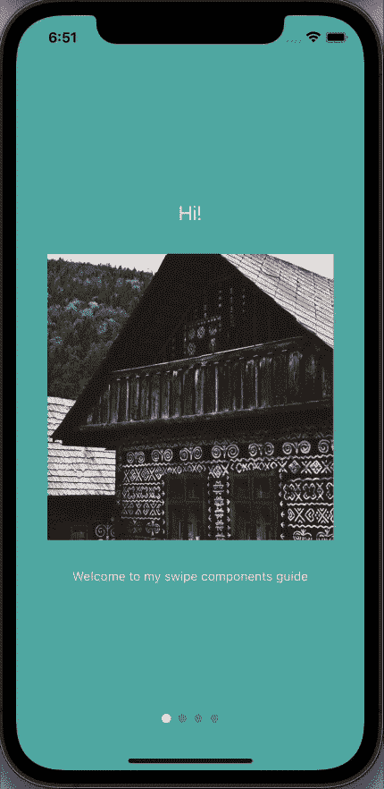
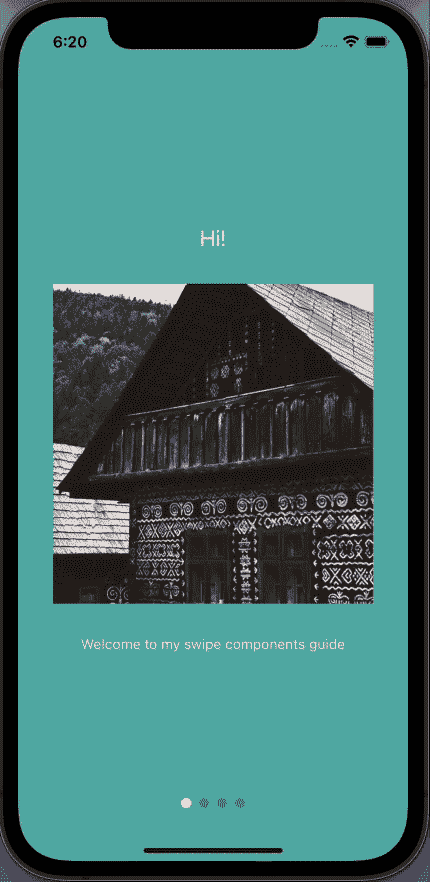
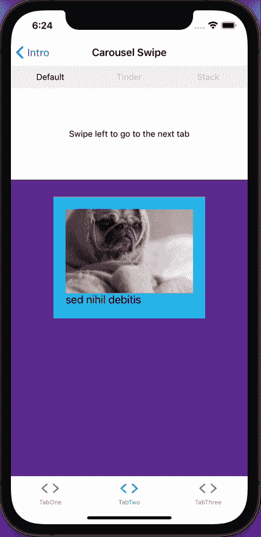
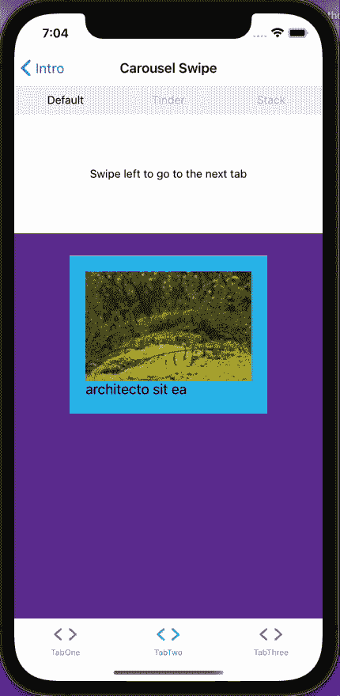
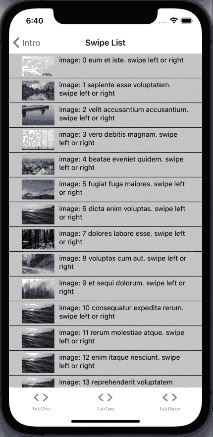

# 在 React Native 中实现 swiper 组件

> 原文：<https://blog.logrocket.com/swiper-components-react-native/>

如今，我们在任何事情上都使用滑动手势。在我们的屏幕上留下肮脏的污迹感觉很直观。无论你是在寻找约会，浏览外卖，还是查看银行余额——无论你在手机上做什么，你都知道套路:刷，刷，点击！

在本教程中，我们将使用 Expo 为各种用例构建五个不同的 React Native swiper 组件。我们将讨论以下内容:

如果您想继续，我已经为我们讨论的每个组件创建了一个分支:

这里先睹为快，看看我们会做些什么。一如既往，你可以在我的 [GitHub](https://github.com/claysimps/RN-swiper-components) 上找到完整的代码。



## 创建世博项目

初始化您的项目并选择`tabs (TypeScript)`(如果您想使用 JavaScript，可以从代码示例中删除类型定义):

```
expo init RN-swiper-components && cd RN-swiper-components

```

现在您只需要启动您喜欢的 IDE，我们就可以开始了。如果您使用的是 VS 代码，您可以用以下方式打开项目:

```
code . 

```

## 构建介绍屏幕



( [GitHub 分支](https://github.com/claysimps/RN-swiper-components/tree/intro-swipe))

第一印象很重要，所以让我们创建一个让用户大吃一惊的介绍屏幕。React Native App Intro Slider 是一个易于使用的应用程序介绍库，使用 React Native FlatList:

```
expo install react-native-app-intro-slider 

```

我们的介绍幻灯片使用了四张随机图片。你可以添加你自己的并重命名它们，或者在这里下载例子[，然后将它们添加到`assets/images`。](https://github.com/claysimps/RN-swiper-components/tree/master/assets/images)

在您的`screens`文件夹中，创建一个名为`Intro.tsx`的文件，并添加以下内容:

```
// Intro.tsx
import { StackNavigationProp } from "@react-navigation/stack";
import React, { useRef } from "react";
import {
  View,
  SafeAreaView,
  Text,
  Image,
  StyleSheet,
  StatusBar,
  Pressable,
} from "react-native";
import AppIntroSlider from "react-native-app-intro-slider";
import { RootStackParamList } from "../types";
const data = [
  {
    title: "Hi!",
    text: "Welcome to my swipe components guide",
    image: require("../assets/images/1.jpg"),
    bg: "#59b2ab",
  },
  {
    title: "Coming up...",
    text: "Lot's of cool libraries!",
    image: require("../assets/images/2.jpg"),
    bg: "#febe29",
  },
  {
    title: "Guess what!?",
    text: "This is the first swipe component!",
    image: require("../assets/images/3.jpg"),
    bg: "#22bcb5",
  },
  {
    title: "Time to gimme your data",
    text: "Joking!",
    image: require("../assets/images/4.jpg"),
    bg: "#febe29",
  },
];
type Item = typeof data[0];
type RenderPaginationProps = {
  data: any[];
  activeIndex: number;
  slider: AppIntroSlider | null;
  onIntroCompleted: () => void;
};
type IntroNavigationProps = StackNavigationProp<RootStackParamList, "Intro">;
interface IntroProps {
  navigation: IntroNavigationProps;
}
const styles = StyleSheet.create({
  slide: {
    flex: 1,
    alignItems: "center",
    justifyContent: "center",
    backgroundColor: "blue",
  },
  image: {
    width: 320,
    height: 320,
    marginVertical: 32,
  },
  text: {
    color: "rgba(255, 255, 255, 0.8)",
    textAlign: "center",
  },
  title: {
    fontSize: 22,
    color: "white",
    textAlign: "center",
  },
  paginationContainer: {
    position: "absolute",
    bottom: 16,
    left: 16,
    right: 16,
  },
  paginationDots: {
    height: 16,
    margin: 16,
    flexDirection: "row",
    justifyContent: "center",
    alignItems: "center",
  },
  dot: {
    width: 10,
    height: 10,
    borderRadius: 5,
    marginHorizontal: 4,
  },
  buttonContainer: {
    flexDirection: "row",
    marginHorizontal: 24,
  },
  button: {
    flex: 1,
    paddingVertical: 20,
    marginHorizontal: 8,
    borderRadius: 24,
    backgroundColor: "#1cb278",
  },
  buttonText: {
    color: "white",
    fontWeight: "600",
    textAlign: "center",
  },
});
const renderItem = ({ item }: { item: Item }) => (
  <View
    style={[
      styles.slide,
      {
        backgroundColor: item.bg,
      },
    ]}>
    <Text style={styles.title}>{item.title}</Text>
    <Image source={item.image} style={styles.image} />
    <Text style={styles.text}>{item.text}</Text>
  </View>
);
const RenderPagination = ({
  activeIndex,
  slider,
  data,
  onIntroCompleted,
}: RenderPaginationProps) => {
  const handleIntroCompleted = () => {
    onIntroCompleted();
  };
  return (
    <View style={styles.paginationContainer}>
      <SafeAreaView>
        <View style={styles.paginationDots}>
          {data.length > 1 &&
            data.map((_, i) => (
              <Pressable
                key={i}
                style={[
                  styles.dot,
                  i === activeIndex
                    ? { backgroundColor: "white" }
                    : { backgroundColor: "rgba(0, 0, 0, 0.2)" },
                ]}
                onPress={() => slider?.goToSlide(i, true)}
              />
            ))}
        </View>
        {activeIndex === data.length - 1 && (
          <View style={styles.buttonContainer}>
            <Pressable
              onPress={handleIntroCompleted}
              style={[styles.button, { backgroundColor: "#023e3f" }]}>
              <Text style={styles.buttonText}>Log in</Text>
            </Pressable>
            <Pressable onPress={handleIntroCompleted} style={styles.button}>
              <Text style={styles.buttonText}>Sign up</Text>
            </Pressable>
          </View>
        )}
      </SafeAreaView>
    </View>
  );
};
export const Intro = ({ navigation }: IntroProps) => {
  const sliderEl = useRef(null);
  const keyExtractor = (item: Item) => item.title;
  const onIntroCompleted = () => {
    navigation.navigate("Root");
  };
  return (
    <View style={{ flex: 1 }}>
      <StatusBar translucent backgroundColor="transparent" />
      <AppIntroSlider
        keyExtractor={keyExtractor}
        renderItem={renderItem}
        renderPagination={(activeIndex) => (
          <RenderPagination
            data={data}
            activeIndex={activeIndex}
            slider={sliderEl.current}
            onIntroCompleted={onIntroCompleted}
          />
        )}
        data={data}
        ref={sliderEl}
      />
    </View>
  );
};

```

所有神奇的事情都发生在这里，所以让我们深入挖掘。`renderItem`从`data`中取出一个物品并将其渲染到列表中:

```
<AppIntroSlider
        keyExtractor={keyExtractor} 
        renderItem={renderItem}
        renderPagination={(activeIndex) => (
          <RenderPagination
            data={data}
            activeIndex={activeIndex}
            slider={sliderEl.current}
            onIntroCompleted={onIntroCompleted}
          />
        )}
        data={data}
        ref={sliderEl}
      />

```

`renderPagination`使用相同的`data`数组来跟踪列表中的当前项目。我们提供来自可变的`useRef`对象的`activeIndex`和当前值，以及一个回调函数。

`renderPagination`功能包含幻灯片末尾的注册和登录按钮的逻辑，并在屏幕底部提供小导航点。这个教程是关于滑动的，但是值得注意的是点是可以点击的。

当`activeIndex`与数组长度匹配时，显示按钮:

```
 {activeIndex === data.length - 1 && (
         ...
        )}

```

为了确保 intro 屏幕显示为第一个屏幕，打开导航文件夹中的`index.tsx`并粘贴以下内容:

```
import {
  NavigationContainer,
  DefaultTheme,
  DarkTheme,
} from "@react-navigation/native";
import { createStackNavigator } from "@react-navigation/stack";
import * as React from "react";
import { ColorSchemeName } from "react-native";
import { Intro } from "../screens/Intro";
import NotFoundScreen from "../screens/NotFoundScreen";
import { RootStackParamList } from "../types";
import BottomTabNavigator from "./BottomTabNavigator";
import LinkingConfiguration from "./LinkingConfiguration";
export default function Navigation({
  colorScheme,
}: {
  colorScheme: ColorSchemeName;
}) {
  return (
    <NavigationContainer
      linking={LinkingConfiguration}
      theme={colorScheme === "dark" ? DarkTheme : DefaultTheme}>
      <RootNavigator />
    </NavigationContainer>
  );
}

const Stack = createStackNavigator<RootStackParamList>();
function RootNavigator() {
  return (
    <Stack.Navigator screenOptions={{ headerShown: false }}>
      <Stack.Screen name="Intro" component={Intro} />
      <Stack.Screen name="Root" component={BottomTabNavigator} />
      <Stack.Screen
        name="NotFound"
        component={NotFoundScreen}
        options={{ title: "Oops!" }}
      />
    </Stack.Navigator>
  );
}

```

打开根项目文件夹中的`types.tsx`，编辑`RootStackParamList`，如下所示(如果使用 JavaScript，请跳过这一步):

```
export type RootStackParamList = {
  Intro: undefined;
  Root: undefined;
  NotFound: undefined;
};

```

现在重启你的应用程序，你就有了你的介绍幻灯片。此时，您可以实现您的注册/登录逻辑并导航到相关屏幕。但我们是来刷卡的，不是来打字的。所以向前向上到下一个组件！

## `FlatList`



( [GitHub 分支](https://github.com/claysimps/RN-swiper-components/tree/FlatList))

许多 swiper 库都使用它，所以这是一个开始了解我们的方位的好地方。

在 components 文件夹中，创建一个名为`FlatList.tsx`的文件，并粘贴以下内容:

```
import React from "react";
import {
  SafeAreaView,
  View,
  FlatList,
  StyleSheet,
  Text,
  Image,
} from "react-native";
import { DATA } from "../utils";
type ItemProps = typeof DATA[0];
const Item = ({ title, image, id }: ItemProps) => (
  <View key={id} style={styles.item}>
    <Image style={styles.image} source={{ uri: image }} />
    <Text style={styles.title}>{title}</Text>
  </View>
);
export const FlatListComponent = () => {
  const renderItem = ({ item }: { item: ItemProps }) => (
    <Item id={item.id} image={item.image} title={item.title} />
  );
  return (
    <SafeAreaView style={styles.container}>
      <FlatList
        data={DATA}
        renderItem={renderItem}
        keyExtractor={(item) => item.id}
        horizontal
      />
    </SafeAreaView>
  );
};
const styles = StyleSheet.create({
  container: {
    flex: 1,
  },
  item: {
    backgroundColor: "#2dbded",
    padding: 20,
    marginVertical: 8,
    marginHorizontal: 16,
    height: 200,
    width: 150,
  },
  title: {
    fontSize: 18,
  },
  image: {
    flex: 1,
  },
});

```

FlatList 有一个名为`horizontal`的属性，它将我们的标准可滚动`FlatList`变成了一个可滑动(左/右)的组件:

```
<FlatList
        data={DATA}
        renderItem={renderItem}
        keyExtractor={(item) => item.id}
        horizontal
      />

```

## `DATA`

为了提供跨组件的熟悉性，我创建了一个模拟数据函数来为其余组件提供数据。回到你的终端，安装 [Faker](https://github.com/marak/Faker.js/) :

```
expo install faker && yarn add -D @types/faker

```

在项目文件夹的根目录下，创建一个名为`utils`的文件夹，然后添加以下两个文件:

`index.ts`:

```
export { DATA } from "./GenerateImages";

```

`GenerateImages.tsx`:

```
import faker from "faker";
const generateImage = () => ({
  id: faker.datatype.uuid(),
  title: faker.lorem.words(3),
  image: "https://picsum.photos/200/300?random",
});
const generateImages = (numberOfImages: number) =>
  Array.from({ length: numberOfImages }, () => generateImage());
export const DATA = generateImages(20);

```

Faker 提供随机数据——在我们的例子中，三个单词代表我们的`title`和一个随机的`id`。`generateImages`函数生成了一个包含 20 个对象的数组供我们玩。每个对象都有一个`id`、`title`和`image`属性。

让我们看看我们有什么。转到屏幕文件夹中的`TabOneScreen.tsx`，添加以下内容:

```
import * as React from "react";
import { StyleSheet } from "react-native";
import { FlatListComponent } from "../components/FlatList";
import { View } from "../components/Themed";
export default function TabOneScreen() {
  return (
    <View style={styles.container}>
      <FlatListComponent />
    </View>
  );
}
const styles = StyleSheet.create({
  container: {
    flex: 1,
  },
});

```

## `material-top-tabs`



( [GitHub 分支](https://github.com/claysimps/RN-swiper-components/tree/Top-Tabs))

[React 导航](https://blog.logrocket.com/a-complete-guide-to-react-navigation-5/)是我们初始化项目时配置的。它有一个很棒的顶部标签组件，方便了标签之间的平滑滑动体验。要安装`[material-top-tabs](https://www.npmjs.com/package/@react-navigation/material-top-tabs)`:

```
expo install @react-navigation/material-top-tabs [email protected]^2.16.0

```

在 components 文件夹中创建一个名为`TopTabsBar.tsx`的新文件:

```
import { MaterialTopTabBarProps } from "@react-navigation/material-top-tabs";
import React, { FC } from "react";
import { Pressable, View } from "react-native";
import Animated from "react-native-reanimated";

interface TopTabsBarProps extends MaterialTopTabBarProps {}

export const TopTabsBar = ({
  state,
  descriptors,
  navigation,
  position,
}: TopTabsBarProps) => (
  <View
    style={{
      flexDirection: "row",
    }}>
    {state.routes.map((route, index) => {
      const { options } = descriptors[route.key];
      const label = options.title !== undefined ? options.title : route.name;
      const isFocused = state.index === index;
      const onPress = () => {
        const event = navigation.emit({
          type: "tabPress",
          target: route.key,
          canPreventDefault: true,
        });
        if (!isFocused && !event.defaultPrevented) {
          navigation.navigate(route.name);
        }
      };
      const onLongPress = () => {
        navigation.emit({
          type: "tabLongPress",
          target: route.key,
        });
      };
      const inputRange = state.routes.map((_: any, i: number) => i);
      const opacity = Animated.interpolateNode(position, {
        inputRange,
        outputRange: inputRange.map((i: number) => (i === index ? 1 : 0.2)),
      });
      return (
        <Pressable
          style={{
            flex: 1,
            padding: 10,
          }}
          key={index}
          onPress={onPress}
          onLongPress={onLongPress}>
          <Animated.Text style={{ opacity, textAlign: "center" }}>
            {label}
          </Animated.Text>
        </Pressable>
      );
    })}
  </View>
);

```

请注意未选中屏幕标题的不透明度是如何降低的。当您滑动时，不透明度逐渐变化的效果是通过动画制作`Text`组件不透明度的样式来创建的——将活跃索引从`1`(完全不透明度)变为`0.2`。

现在，我们将创建两个占位符屏幕来测试我们的`TopTabBar`组件。在屏幕文件夹中，创建以下两个文件:

`Carousel.tsx`:

```
import * as React from "react";
import { StyleSheet, Text } from "react-native";
import { View } from "../components/Themed";
export const Carousel = () => {
  return (
    <View style={styles.container}>
      <View style={styles.separator} />
      <Text>Swipe left to go to the next tab</Text>
    </View>
  );
};
const styles = StyleSheet.create({
  container: {
    flex: 1,
  },
  separator: {
    marginVertical: 5,
    height: 30,
    width: "80%",
  },
});

```

`SwipeList.tsx`:

```
import * as React from "react";
import { StyleSheet, Text } from "react-native";
import { View } from "../components/Themed";
export const SwipeList = () => {
  return (
    <View style={styles.container}>
      <View style={styles.separator} />
      <Text style={styles.text}>Swipe right to go back to the first tab</Text>
    </View>
  );
};
const styles = StyleSheet.create({
  container: {
    flex: 1,
  },
  separator: {
    marginVertical: 5,
    height: 30,
    width: "80%",
  },
  text: {
    textAlign: "center",
  },
});

```

在导航文件夹中，创建一个名为`TopTabNavigator.tsx`的文件:

```
import React from "react";
import { createMaterialTopTabNavigator } from "@react-navigation/material-top-tabs";
import { TopTabsBar } from "../components/TopTabsBar";
import { Carousel } from "../screens/Carousel";
import { SwipeList } from "../screens/SwipeList";
export type TopTabParamList = {
  Carousel: undefined;
  SwipeList: undefined;
};
const { Navigator, Screen } = createMaterialTopTabNavigator<TopTabParamList>();
export const TopTabNavigator = () => (
  <Navigator
    tabBar={(props) => <TopTabsBar {...props} />}
    initialRouteName="Carousel">
    <Screen
      name="Carousel"
      component={Carousel}
      options={{ title: "Carousel" }}
    />
    <Screen
      name="SwipeList"
      component={SwipeList}
      options={{ title: "Swipe List" }}
    />
  </Navigator>
);

```

用以下内容更新`types.tsx`:

```
export type RootStackParamList = {
  Intro: undefined;
  Root: undefined;
  NotFound: undefined;
};
export type BottomTabParamList = {
  TabOne: undefined;
  TabTwo: undefined;
};
export type TabOneParamList = {
  TabOneScreen: undefined;
};
export type TabTwoParamList = {
  TopTabNavigator: undefined;
};

```

要在`TabTwo`上显示我们的`TopTabNavigator`，编辑`BottomTabNavigator.tsx`，如下所示:

```
import { Ionicons } from "@expo/vector-icons";
import { createBottomTabNavigator } from "@react-navigation/bottom-tabs";
import { createStackNavigator } from "@react-navigation/stack";
import * as React from "react";
import Colors from "../constants/Colors";
import useColorScheme from "../hooks/useColorScheme";
import TabOneScreen from "../screens/TabOneScreen";
import TabTwoScreen from "../screens/TabTwoScreen";
import { BottomTabParamList, TabOneParamList, TabTwoParamList } from "../types";
import { TopTabNavigator } from "./TopTabNavigator";
const BottomTab = createBottomTabNavigator<BottomTabParamList>();
export default function BottomTabNavigator() {
  const colorScheme = useColorScheme();
  return (
    <BottomTab.Navigator
      initialRouteName="TabOne"
      tabBarOptions={{ activeTintColor: Colors[colorScheme].tint }}>
      <BottomTab.Screen
        name="TabOne"
        component={TabOneNavigator}
        options={{
          tabBarIcon: ({ color }) => (
            <TabBarIcon name="ios-code" color={color} />
          ),
        }}
      />
      <BottomTab.Screen
        name="TabTwo"
        component={TabTwoNavigator}
        options={{
          tabBarIcon: ({ color }) => (
            <TabBarIcon name="ios-code" color={color} />
          ),
        }}
      />
    </BottomTab.Navigator>
  );
}

function TabBarIcon(props: {
  name: React.ComponentProps<typeof Ionicons>["name"];
  color: string;
}) {
  return <Ionicons size={30} style={{ marginBottom: -3 }} {...props} />;
}

const TabOneStack = createStackNavigator<TabOneParamList>();
function TabOneNavigator() {
  return (
    <TabOneStack.Navigator>
      <TabOneStack.Screen
        name="TabOneScreen"
        component={TabOneScreen}
        options={{ headerTitle: "Swipe-able FlatList" }}
      />
    </TabOneStack.Navigator>
  );
}
const TabTwoStack = createStackNavigator<TabTwoParamList>();
function TabTwoNavigator() {
  return (
    <TabTwoStack.Navigator>
      <TabTwoStack.Screen
        name="TopTabNavigator"
        component={TopTabNavigator}
      />
    </TabTwoStack.Navigator>
  );
}

```

## `react-native-snap-carousel`


( [GitHub 分支](https://github.com/claysimps/RN-swiper-components/tree/carousel))

凭借 8.6K GitHub stars 和每月超过 50 万的下载量，`[react-native-snap-carousel](https://github.com/meliorence/react-native-snap-carousel)`是一个非常受欢迎的库。它有三种内置布局——默认、堆栈和 tinder——我们将一一探究。但是如果这还不够，您可以创建自己的自定义插值。

我们将创建三个屏幕，然后在之前创建的 top tabs 组件中呈现它们。如果这是你一直在等待的，不要再等了:

```
expo install react-native-snap-carousel && yarn add -D @types/react-native-snap-carousel

```

当我们创建`FlatList`组件时，我们构建了一个名为`Item`的组件。由于它返回一张带有标题和图像的卡片，现在可能是重构代码并创建一个可重用的`Card`组件的好时机。

创建`components/Card.tsx`:

```
import React from "react";
import { View, Text, StyleSheet, Image } from "react-native";
import { DATA } from "../utils";
export type CardProps = typeof DATA[0];
export const Card = ({ title, image, id }: CardProps) => (
  <View key={id} style={styles.container}>
    <View key={id} style={styles.item}>
      <Image style={styles.image} source={{ uri: image }} />
      <Text style={styles.title}>{title}</Text>
    </View>
  </View>
);
const styles = StyleSheet.create({
  container: {
    flex: 1,
    alignItems: "center",
  },
  item: {
    backgroundColor: "#2dbded",
    padding: 20,
    marginVertical: 8,
    marginHorizontal: 16,
    height: 200,
    width: 250,
  },
  title: {
    fontSize: 18,
  },
  image: {
    flex: 1,
  },
});

```

编辑`FlatList.tsx`以使用新的`Card`组件:

```
import React from "react";
import { SafeAreaView, FlatList, StyleSheet } from "react-native";
import { DATA } from "../utils";
import { CardProps, Card } from "./Card";
export const FlatListComponent = () => {
  const renderItem = ({ item }: { item: CardProps }) => (
    <Card id={item.id} image={item.image} title={item.title} />
  );
  return (
    <SafeAreaView style={styles.container}>
      <FlatList
        data={DATA}
        renderItem={renderItem}
        keyExtractor={(item) => item.id}
        horizontal
      />
    </SafeAreaView>
  );
};
const styles = StyleSheet.create({
  container: {
    flex: 1,
  },
});

```

现在我们将创建一个可重用的`Carousel`组件和三个屏幕来显示不同的内置布局。在 components 文件夹中，创建一个名为`Carousel.tsx`的文件，并添加以下内容:

```
import React, { useState, useRef } from "react";
import { View } from "react-native";
import Carousel from "react-native-snap-carousel";
import { DATA } from "../utils";
import { CardProps, Card } from "./Card";
type LayoutProps = { layout?: "default" | "stack" | "tinder" | undefined };
export const CarouselComponent = ({ layout }: LayoutProps) => {
  const [_, setActiveIndex] = useState<number>(0);
  const carouselEl = useRef(null);
  const handleSnapToItem = (index: number) => {
    setActiveIndex(index);
  };
  const renderItem = ({ item, index }: { item: CardProps; index: number }) => (
    <Card key={index} id={item.id} image={item.image} title={item.title} />
  );
  return (
    <View style={{ flex: 1, alignItems: "center" }}>
      <View
        style={{
          paddingTop: 20,
        }}>
        <Carousel
          layout={layout}
          ref={carouselEl}
          data={DATA}
          sliderWidth={300}
          itemWidth={300}
          renderItem={renderItem}
          onSnapToItem={(index) => handleSnapToItem(index)}
          layoutCardOffset={18}
          inactiveSlideScale={0.94}
          inactiveSlideOpacity={0.7}
          initialNumToRender={3}
        />
      </View>
    </View>
  );
};

```

`Carousel`组件使用了我们之前创建的相同的`Card`组件，所以看起来应该很熟悉。如果你想像在`Intro`幻灯片中那样添加分页，这很简单:

```
// #1 Add activeIndex to useState
 const [activeIndex, setActiveIndex] = useState<number>(0);
// #2 create pagination function
const pagination = () => (
    <Pagination
      dotsLength={DATA.length}
      activeDotIndex={activeIndex}
      containerStyle={{ backgroundColor: "rgba(0, 0, 0, 0.75)" }}
      dotStyle={{
        width: 10,
        height: 10,
        borderRadius: 5,
        marginHorizontal: 8,
        backgroundColor: "rgba(255, 255, 255, 0.92)",
      }}
      inactiveDotStyle={
        {
          // Define styles for inactive dots here
        }
      }
      inactiveDotOpacity={0.4}
      inactiveDotScale={0.6}
    />
  );

// #3 Return it below your Carousel component. 

return (
    <View style={{ flex: 1, alignItems: "center" }}>
      <View
        style={{
          paddingTop: 20,
        }}>
        <Carousel
          {...}
        />
        {pagination()}
      </View>
    </View>
  );

```

现在`Carousel`组件都设置好了，是时候消耗它了。在 screens 文件夹中创建三个新文件，并添加以下代码:

`DefaultCarousel.tsx`:

```
import * as React from "react";
import { StyleSheet, Text } from "react-native";
import { CarouselComponent } from "../components/Carousel";
import { View } from "../components/Themed";
export const DefaultCarousel = () => {
  return (
    <View style={styles.container}>
      <View style={styles.separator}>
        <Text style={styles.text}>Swipe left to go to the next tab</Text>
      </View>
      <CarouselComponent layout="default" />
    </View>
  );
};
const styles = StyleSheet.create({
  container: {
    flex: 1,
    alignItems: "center",
    backgroundColor: "rebeccapurple",
  },
  separator: {
    width: "100%",
    height: 150,
    justifyContent: "center",
  },
  text: {
    textAlign: "center",
  },
});

```

`StackCarousel.tsx`:

```
import * as React from "react";
import { StyleSheet, Text } from "react-native";
import { CarouselComponent } from "../components/Carousel";
import { View } from "../components/Themed";
export const StackCarousel = () => {
  return (
    <View style={styles.container}>
      <View style={styles.separator}>
        <Text style={styles.text}>Swipe right to go to go back</Text>
      </View>
      <CarouselComponent layout="stack" />
    </View>
  );
};
const styles = StyleSheet.create({
  container: {
    flex: 1,
    alignItems: "center",
    backgroundColor: "rebeccapurple",
  },
  separator: {
    width: "100%",
    height: 150,
    justifyContent: "center",
  },
  text: {
    textAlign: "center",
  },
});

```

`TinderCarousel.tsx`:

```
import React from "react";
import { StyleSheet, Text } from "react-native";
import { CarouselComponent } from "../components/Carousel";
import { View } from "../components/Themed";
export const TinderCarousel = () => {
  return (
    <View style={styles.container}>
      <View style={styles.separator}>
        <Text style={styles.text}>Swipe left or right</Text>
      </View>
      <CarouselComponent layout="tinder" />
    </View>
  );
};
const styles = StyleSheet.create({
  container: {
    flex: 1,
    alignItems: "center",
    backgroundColor: "rebeccapurple",
  },
  separator: {
    width: "100%",
    height: 150,
    justifyContent: "center",
  },
  text: {
    textAlign: "center",
  },
});

```

转到导航文件夹中的`TopTabNavigator`,将其编辑为:

```
import React from "react";
import { createMaterialTopTabNavigator } from "@react-navigation/material-top-tabs";
import { TopTabsBar } from "../components/TopTabsBar";
import { DefaultCarousel } from "../screens/DefaultCarousel";
import { TinderCarousel } from "../screens/TinderCarousel";
import { StackCarousel } from "../screens/StackCarousel";
export type TopTabParamList = {
  Default: undefined;
  Tinder: undefined;
  Stack: undefined;
};
const { Navigator, Screen } = createMaterialTopTabNavigator<TopTabParamList>();
export const TopTabNavigator = () => (
  <Navigator
    tabBar={(props) => <TopTabsBar {...props} />}
    initialRouteName="Default">
    <Screen
      name="Default"
      component={DefaultCarousel}
      options={{ title: "Default " }}
    />
    <Screen
      name="Tinder"
      component={TinderCarousel}
      options={{ title: "Tinder" }}
    />
    <Screen
      name="Stack"
      component={StackCarousel}
      options={{ title: "Stack" }}
    />
  </Navigator>
);

```

转到`BottomTabNavigator`，用以下内容更新它:

```
import { Ionicons } from "@expo/vector-icons";
import { createBottomTabNavigator } from "@react-navigation/bottom-tabs";
import { createStackNavigator } from "@react-navigation/stack";
import * as React from "react";
import Colors from "../constants/Colors";
import useColorScheme from "../hooks/useColorScheme";
import TabOneScreen from "../screens/TabOneScreen";
import { BottomTabParamList, TabOneParamList, TabTwoParamList } from "../types";
import { TopTabNavigator } from "./TopTabNavigator";
const BottomTab = createBottomTabNavigator<BottomTabParamList>();
export default function BottomTabNavigator() {
  const colorScheme = useColorScheme();
  return (
    <BottomTab.Navigator
      initialRouteName="TabOne"
      tabBarOptions={{ activeTintColor: Colors[colorScheme].tint }}>
      <BottomTab.Screen
        name="TabOne"
        component={TabOneNavigator}
        options={{
          tabBarIcon: ({ color }) => (
            <TabBarIcon name="ios-code" color={color} />
          ),
        }}
      />
      <BottomTab.Screen
        name="TabTwo"
        component={TabTwoNavigator}
        options={{
          tabBarIcon: ({ color }) => (
            <TabBarIcon name="ios-code" color={color} />
          ),
        }}
      />
    </BottomTab.Navigator>
  );
}
function TabBarIcon(props: {
  name: React.ComponentProps<typeof Ionicons>["name"];
  color: string;
}) {
  return <Ionicons size={30} style={{ marginBottom: -3 }} {...props} />;
}
const TabOneStack = createStackNavigator<TabOneParamList>();
function TabOneNavigator() {
  return (
    <TabOneStack.Navigator>
      <TabOneStack.Screen
        name="TabOneScreen"
        component={TabOneScreen}
        options={{ headerTitle: "Swipe-able FlatList" }}
      />
    </TabOneStack.Navigator>
  );
}
const TabTwoStack = createStackNavigator<TabTwoParamList>();
function TabTwoNavigator() {
  return (
    <TabTwoStack.Navigator>
      <TabTwoStack.Screen
        name="TopTabNavigator"
        component={TopTabNavigator}
        options={{ headerTitle: "Carousel Swipe" }}
      />
    </TabTwoStack.Navigator>
  );
}

```

## `react-native-swipe-list-view`



( [GitHub 分支](https://github.com/claysimps/RN-swiper-components/tree/swipe-able-list))

如果你正在构建一个带有可滑动列表的应用，这个库就是为你准备的。`[react-native-snap-carousel](https://github.com/meliorence/react-native-snap-carousel)`是一个垂直的`ListView`，带有动画的可滑动行。

事不宜迟，让我们安装它并开始行动:

```
expo install react-native-swipe-list-view

```

下一段你需要垃圾桶的图像。从 [GitHub](https://github.com/claysimps/RN-swiper-components/blob/master/assets/images/trash.png) 下载并添加到`assets/images`。

在 components 文件夹中，创建一个名为`SwipeList.tsx`的文件，并添加以下内容:

```
import React, { useState } from "react";
import {
  Image,
  StyleSheet,
  Text,
  TouchableHighlight,
  View,
  TouchableOpacity,
  Alert,
} from "react-native";
import Animated from "react-native-reanimated";
import { SwipeListView } from "react-native-swipe-list-view";
import { DATA } from "../utils";
const initialList = DATA.map((data, index) => ({ ...data, key: `${index}` }));
const rowSwipeAnimatedValues: any = {};
initialList.forEach((_, i) => {
  rowSwipeAnimatedValues[`${i}`] = new Animated.Value(0);
});
type Item = typeof initialList[0];
const renderItem = ({ item }: { item: Item }) => (
  <TouchableHighlight
    onPress={() => console.log("You touched me")}
    style={styles.rowFront}
    underlayColor={"#AAA"}>
    <View style={styles.item}>
      <Image style={styles.image} source={{ uri: item.image }} />
      <Text style={styles.text}>
        image: {item.key} {item.title}. swipe left or right
      </Text>
    </View>
  </TouchableHighlight>
);
export const SwipeList = () => {
  const [listData, setListData] = useState(initialList);
  const closeRow = (rowMap: any, rowKey: string) => {
    console.log("this is the rowMap: ", rowMap);
    if (rowMap[rowKey]) {
      rowMap[rowKey].closeRow();
    }
  };
  const deleteRow = (rowMap: Map<string, Object>, rowKey: string) => {
    closeRow(rowMap, rowKey);
    const newData = [...listData];
    const prevIndex = listData.findIndex((item) => item.key === rowKey);
    newData.splice(prevIndex, 1);
    setListData(newData);
  };
  const alertRow = (rowMap: Map<string, Object>, rowKey: string) => {
    closeRow(rowMap, rowKey);
    const indexOfFilm: number = listData.findIndex(
      (item) => item.key === rowKey
    );
    Alert.alert("do something else with this item:", listData[indexOfFilm].key);
  };
  const onRowDidOpen = (rowKey: string) => {
    console.log("This row opened", rowKey);
  };
  const onSwipeValueChange = ({
    key,
    value,
  }: {
    key: string;
    value: number;
  }) => {
    rowSwipeAnimatedValues[key].setValue(Math.abs(value));
  };
  const renderHiddenItem = ({ item }: { item: Item }, rowMap: any) => (
    <View style={styles.rowBack}>
      <TouchableOpacity onPress={() => alertRow(rowMap, item.key)}>
        <Text>Click</Text>
      </TouchableOpacity>
      <TouchableOpacity
        style={[styles.backRightBtn, styles.backRightBtnLeft]}
        onPress={() => closeRow(rowMap, item.key)}>
        <Text style={styles.backTextWhite}>Close</Text>
      </TouchableOpacity>
      <TouchableOpacity
        style={[styles.backRightBtn, styles.backRightBtnRight]}
        onPress={() => deleteRow(rowMap, item.key)}>
        <Animated.View
          style={[
            styles.trash,
            {
              transform: [
                {
                  scale: rowSwipeAnimatedValues[item.key].interpolate({
                    inputRange: [45, 90],
                    outputRange: [0, 1],
                    extrapolate: "clamp",
                  }),
                },
              ],
            },
          ]}>
          <Image
            source={require("../assets/images/trash.png")}
            style={styles.trash}
          />
        </Animated.View>
      </TouchableOpacity>
    </View>
  );
  return (
    <View style={styles.container}>
      <SwipeListView
        data={listData}
        renderItem={renderItem}
        renderHiddenItem={renderHiddenItem}
        leftOpenValue={75}
        rightOpenValue={-150}
        previewRowKey={"0"}
        previewOpenValue={-40}
        previewOpenDelay={3000}
        onRowDidOpen={onRowDidOpen}
        onSwipeValueChange={onSwipeValueChange}
      />
    </View>
  );
};
const styles = StyleSheet.create({
  container: {
    backgroundColor: "white",
    flex: 1,
  },
  backTextWhite: {
    color: "#FFF",
  },
  rowFront: {
    alignItems: "center",
    backgroundColor: "#CCC",
    borderBottomColor: "black",
    borderBottomWidth: 1,
    justifyContent: "center",
    height: 50,
  },
  rowBack: {
    alignItems: "center",
    backgroundColor: "#DDD",
    flex: 1,
    flexDirection: "row",
    justifyContent: "space-between",
    paddingLeft: 15,
  },
  backRightBtn: {
    alignItems: "center",
    bottom: 0,
    justifyContent: "center",
    position: "absolute",
    top: 0,
    width: 75,
  },
  backRightBtnLeft: {
    backgroundColor: "blue",
    right: 75,
  },
  backRightBtnRight: {
    backgroundColor: "red",
    right: 0,
  },
  trash: {
    height: 25,
    width: 25,
  },
  item: {
    padding: 10,
    marginVertical: 8,
    marginHorizontal: 16,
    flexDirection: "row",
  },
  image: {
    flex: 1,
    alignContent: "flex-start",
    height: 40,
    width: 50,
  },
  text: {
    flex: 4,
    paddingLeft: 10,
  },
});

```

哇，代码真多！我们来分解一下。

首先，我们向原始的`DATA`数组对象添加了一个新的`key`属性。这是因为 React 原生滚动列表视图要求您的`DATA`数组对象包含一个键属性。否则，您必须向`SwipeListView`传递一个`keyExtractor`:

```
const initialList = DATA.map((data, index) => ({ ...data, key: `${index}` }));

```

我们初始化了`rowSwipeAnimatedValues`，并为我们的`initialList`数组对象中的每个对象创建了一个新的动画值:

```
const rowSwipeAnimatedValues: any = {};
initialList.forEach((_, i) => {
  rowSwipeAnimatedValues[`${i}`] = new Animated.Value(0);

```

我们使用`initialList`来初始化传递给`SwipeListView`组件(`data={listData}`)的状态。

`closeRow`、`deleteRow`、`alertRow`是`renderHiddenItem`的辅助功能。这是 React 本机滚动列表视图的核心部分。

向右滑动显示该行左侧的一个按钮。您可以通过`onPress` prop 对它做任何事情，但是对于本教程，它会为该行打开一个警告。如果你向左滑动，你会看到两个隐藏的按钮:一个**关闭**按钮关闭暴露的按钮，一个动画垃圾桶会随着你的滑动而变大。这种效果是通过将`Image`包裹在动画`View`中实现的:

```
<Animated.View
          style={[
            styles.trash,
            {
              transform: [
                {
                  scale: rowSwipeAnimatedValues[item.key].interpolate({
                    inputRange: [45, 90],
                    outputRange: [0, 1],
                    extrapolate: "clamp",
                  }),
                },
              ],
            },
          ]}>
          <Image
            source={require("../assets/images/trash.png")}
            style={styles.trash}
          />
        </Animated.View>

```

现在我们已经构建了组件，是时候让你的屏幕变得漂亮整洁了。再走几步，你就可以回到你的滑动、滑动、点击程序了。

在屏幕文件夹中，创建一个名为`SwipeListView.tsx`的文件，并将其粘贴到:

```
import React from "react";
import { StyleSheet, View } from "react-native";
import { SwipeList } from "../components/SwipeList";
export const SwipeListViewScreen = () => {
  return (
    <View style={styles.container}>
      <SwipeList />
    </View>
  );
};
const styles = StyleSheet.create({
  container: {
    backgroundColor: "white",
    flex: 1,
  },
});

```

将`BottomTabNavigator.tsx`改为:

```
import { Ionicons } from "@expo/vector-icons";
import { createBottomTabNavigator } from "@react-navigation/bottom-tabs";
import { createStackNavigator } from "@react-navigation/stack";
import * as React from "react";
import Colors from "../constants/Colors";
import useColorScheme from "../hooks/useColorScheme";
import { SwipeListViewScreen } from "../screens/SwipeListView";
import TabOneScreen from "../screens/TabOneScreen";
import {
  BottomTabParamList,
  TabOneParamList,
  TabTwoParamList,
} from "../types";
import { TopTabNavigator } from "./TopTabNavigator";
export type TabThreeParamList = {
  SwipeListView: undefined;
};
const BottomTab = createBottomTabNavigator<BottomTabParamList>();
export default function BottomTabNavigator() {
  const colorScheme = useColorScheme();
  return (
    <BottomTab.Navigator
      initialRouteName="TabOne"
      tabBarOptions={{ activeTintColor: Colors[colorScheme].tint }}>
      <BottomTab.Screen
        name="TabOne"
        component={TabOneNavigator}
        options={{
          tabBarIcon: ({ color }) => (
            <TabBarIcon name="ios-code" color={color} />
          ),
        }}
      />
      <BottomTab.Screen
        name="TabTwo"
        component={TabTwoNavigator}
        options={{
          tabBarIcon: ({ color }) => (
            <TabBarIcon name="ios-code" color={color} />
          ),
        }}
      />
      <BottomTab.Screen
        name="TabThree"
        component={TabThreeNavigator}
        options={{
          tabBarIcon: ({ color }) => (
            <TabBarIcon name="ios-code" color={color} />
          ),
        }}
      />
    </BottomTab.Navigator>
  );
}
function TabBarIcon(props: {
  name: React.ComponentProps<typeof Ionicons>["name"];
  color: string;
}) {
  return <Ionicons size={30} style={{ marginBottom: -3 }} {...props} />;
}
const TabOneStack = createStackNavigator<TabOneParamList>();
function TabOneNavigator() {
  return (
    <TabOneStack.Navigator>
      <TabOneStack.Screen
        name="TabOneScreen"
        component={TabOneScreen}
        options={{ headerTitle: "Swipe-able FlatList" }}
      />
    </TabOneStack.Navigator>
  );
}
const TabTwoStack = createStackNavigator<TabTwoParamList>();
function TabTwoNavigator() {
  return (
    <TabTwoStack.Navigator>
      <TabTwoStack.Screen
        name="TopTabNavigator"
        component={TopTabNavigator}
        options={{ headerTitle: "Carousel Swipe" }}
      />
    </TabTwoStack.Navigator>
  );
}
const TabThreeStack = createStackNavigator<TabThreeParamList>();
function TabThreeNavigator() {
  return (
    <TabThreeStack.Navigator>
      <TabThreeStack.Screen
        name="SwipeListView"
        component={SwipeListViewScreen}
        options={{ headerTitle: "Swipe List" }}
      />
    </TabThreeStack.Navigator>
  );
}

```

## 结论

我们已经介绍了 React 原生应用程序简介滑块、React 原生的平面列表组件、React 导航材料顶部标签、React 原生快照转盘和 React 原生滑动列表视图。到目前为止，您应该对使用 React Native FlatList 的库创建动画 swiper 组件感到非常舒服。

## [LogRocket](https://lp.logrocket.com/blg/react-native-signup) :即时重现 React 原生应用中的问题。

[](https://lp.logrocket.com/blg/react-native-signup)

[LogRocket](https://lp.logrocket.com/blg/react-native-signup) 是一款 React 原生监控解决方案，可帮助您即时重现问题、确定 bug 的优先级并了解 React 原生应用的性能。

LogRocket 还可以向你展示用户是如何与你的应用程序互动的，从而帮助你提高转化率和产品使用率。LogRocket 的产品分析功能揭示了用户不完成特定流程或不采用新功能的原因。

开始主动监控您的 React 原生应用— [免费试用 LogRocket】。](https://lp.logrocket.com/blg/react-native-signup)