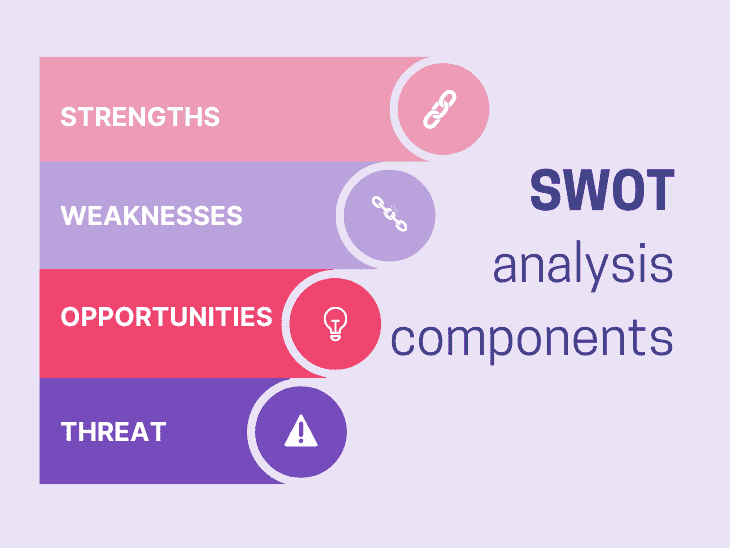
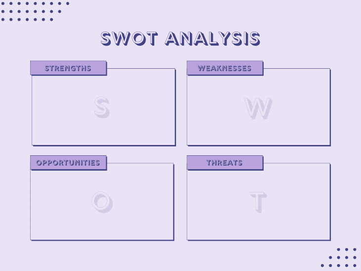
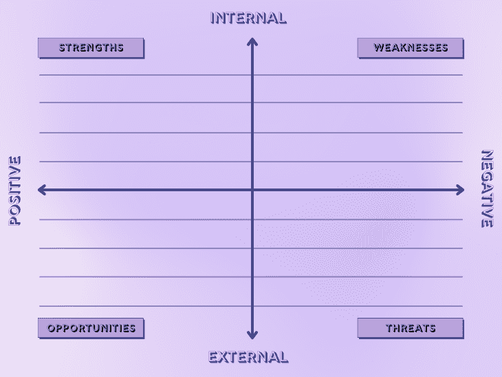

# SWOT 分析模板和操作方法(带示例)

> 原文：<https://blog.logrocket.com/product-management/swot-analysis-template-how-to-examples/>

每个组织都有一个共同的愿望，那就是扩展他们的业务，其成功依赖于适当的研究和评估。

SWOT 分析是一个很好的工具，可以帮助你确定你在市场中的位置，识别增长机会，并评估如何克服前进道路上的潜在障碍。

* * *

## 目录

* * *

## 什么是 SWOT 分析？

SWOT 分析是一种评估公司四个关键组成部分的方法:

SWOT 分析的主要目的是提高对影响商业决策和战略的变量的认识。换句话说，你正在检查影响你公司的内部和外部因素。

内部因素在你的控制之内，而外部因素通常不在你的控制之内。在这两种情况下，这些变量将确定最佳的行动方案。

SWOT 分析经常被企业、非营利组织使用，在较小的程度上，也被个人用于自我评估。

SWOT 分析用于项目、货物和活动。例如，首席信息官可以利用 SWOT 来帮助制作战略业务规划或竞争研究的模板。

## 何时使用 SWOT 分析

在决定采取任何坚定的行动来评估新项目、修改内部政策、寻找转向的可能性或在计划执行过程中改变计划之前，您可能会考虑使用 SWOT 分析。

有时候，做一个总体的 SWOT 分析来评估你的公司目前的环境并做出任何必要的运营改进是有意义的。

这项研究可以突出您的公司运营最佳的关键领域以及流程需要改进的地方。

企业和个人通常使用 SWOT 分析来:

*   调查新计划的潜在途径
*   为特定问题寻找独特的解决方案
*   帮助你做出更明智的决定，为你的努力选择最佳的行动方案
*   通过判断你是处在十字路口还是转折点，来确定哪些领域的改变是可行的
*   不断修改和完善计划

避免漫不经心地思考你公司的运营，希望它们都能和谐地一起工作。花时间做一份全面的 SWOT 分析可以帮助你对你的公司有一个全面的了解。从那里，你可以找出如何加强或消除公司的不足，同时最大限度地发挥其优势。

## 谁参与了 SWOT 分析？

SWOT 分析无疑应该包括公司所有者，但是通常也包括其他团队成员是有益的。询问一系列团队成员的意见，然后在公开论坛上讨论他们的贡献。由于团队的全面知识，您将能够从各个角度有效地评估您的公司。

SWOT 分析也适用于项目层面。在这种情况下，负责制定决策和发展战略的团队成员和项目经理经常采用 SWOT 分析。

## 如何进行 SWOT 分析

SWOT 分析的最大优势之一是它的简单性。你真正需要的是一个记录想法的机制和正面审视你的公司的勇气。

进行 SWOT 分析时，您需要检查:

1.  [优势](#strengths)
2.  [弱点](#weaknesses)
3.  [机遇](#opportunities)
4.  [威胁](#threats)

SWOT 分析从一个 2×2 的网格开始，如下图所示:

当你开始分析时，在头脑风暴时，在适当的象限写下想法。如果您是亲自进行，您可以简单地使用带有便利贴的白板。如果你是远程操作，你可以考虑使用软件，比如米罗或 T2 或菲格玛。

### 1.强项

你的优势可以是你的团队或企业擅长的事情。请记住，优势是内在的，所以你必须向内寻找。优势是你可以控制和利用的东西。

下面是一些你在这个阶段可能会问的头脑风暴问题的例子:

*   我们擅长什么？
*   我们业务的哪些方面得到了客户或合作伙伴的称赞？
*   与我们的竞争对手相比，我们在哪些领域更胜一筹？
*   我们公司、其商品或服务的什么[与众不同？](https://blog.logrocket.com/product-management/what-is-product-differentiation-definition-strategies-examples/)
*   我们有什么资源？(专有技术、知识产权、资本)

下面是一些你在 SWOT 分析中可能发现的优势的例子:

*   我们提供一流的客户服务
*   我们提供其他公司无法提供的功能
*   我们网站的流量超过了 75%的竞争对手
*   我们的社交媒体营销战略正在经历巨大的互动

### 2.弱点

弱点是你的团队或企业需要改进的地方。

与优势相似，这一部分需要自省。它包括你发现的内部问题。你可以经常改变，对自己的弱点获得更多的控制。

下面是一些你在这个阶段可能会问的头脑风暴问题的例子:

*   我们能做得更好吗？
*   我们的客户或合作伙伴的不满是什么？
*   我们在哪些方面落后于对手？
*   我们在哪些方面存在知识或资源缺口？

下面是一些你在 SWOT 分析中可能发现的弱点的例子:

*   我们的程序是无效的
*   我们的客户发现使用我们的产品很有挑战性
*   我们收到的有机流量比我们的竞争对手少
*   我们缺乏发展所需的资源

### 3.机会

机会是你可以马上用来做生意的方法和工具。

* * *

订阅我们的产品管理简讯
将此类文章发送到您的收件箱

* * *

机会不在你的控制范围内，因为它们不是你公司的一部分，而是在市场上。如果你知道机会在哪里，你只能朝着机会的方向前进。

下面是一些你在这个阶段可能会问的头脑风暴问题的例子:

*   有哪些我们可以利用的新趋势？
*   我们的哪些优势对潜在合作伙伴有用？
*   我们可能进入哪些互补市场？
*   有没有竞争比较少的地区？

以下是您在 SWOT 分析中可能发现的一些机会示例:

*   市场上没有人这样做。我们能调整我们的产品吗？
*   我们的产品/服务满足了他们业务中可能存在的需求
*   加拿大没有人卖我们的商品。我们能成长吗？
*   我们最近跨过了一个重要的门槛。我们能得到任何有利的报道吗？

### 4.威胁

威胁是企业可能面临的潜在问题或挑战。

同样，威胁是外部因素，所以它们是发生在您业务之外的事情。它们是不可控制的，但是你可以积极地为它们做计划。

下面是一些你在这个阶段可能会问的头脑风暴问题的例子:

*   我们的对手在做什么？
*   我们怎么会暴露自己的缺点呢？
*   我们缺乏处理哪些市场发展的能力？
*   哪些政治或经济问题可能会对我们公司产生影响？

以下是您在 SWOT 分析中可能发现的一些威胁示例:

*   我们的主要竞争对手正在推出一种功能相当的产品
*   国会正在讨论的一项法律将会影响到我们公司
*   新冠肺炎影响了我们的供应链
*   我们缺乏与对手竞争所需的营销支出

## SWOT 分析后怎么办？

下一步是重新组织洞察力，找到潜在的战略选项，做出决策，并将其纳入您的战略计划。

使用 SWOT 框架中的组件回答以下问题:

*   我们如何利用我们的优势来充分利用我们最大的机会？
*   我们如何利用自己的优势来克服最大的威胁？
*   为了加强我们的弱点，提高我们抓住机遇的能力，我们必须做些什么？
*   我们怎样才能减少我们的弱点，从而更容易战胜我们的威胁？

通过回答这些问题，你揭示了潜在的战略选择。然后，您可以分析和评估最佳行动方案。

决策是战略的本质，这项研究旨在帮助你减少可供进一步考虑的选项。您应该创建并监控一个行动计划，以确保以下步骤不会失去动力。更新您的战略计划，建立长期和短期目标，并创建一个涉及整个团队的行动计划。

## SWOT 分析模板

SWOT 分析模板允许您简洁地描述和收集进行 SWOT 分析所需的所有相关信息。图表的每一部分都突出了 SWOT 分析的一个组成部分。

图表的上半部分强调内部因素，而下半部分表示外部因素。图表的左侧和右侧分别表示正的和负的因子。

要使用此 [SWOT 分析模板](https://docs.google.com/presentation/d/1L8sv1NCCklvVlLcnudL3gqsEwm_2TiAYjFrQt6VJn0I/edit#slide=id.p)，请点击此[链接](https://docs.google.com/presentation/d/1L8sv1NCCklvVlLcnudL3gqsEwm_2TiAYjFrQt6VJn0I/edit?usp=sharing)并从主菜单栏中选择**文件>制作副本**:

## 结论

成功的企业关注内部和外部。他们在观察周围环境的同时反思自己。

在你做出任何战略决策之前，你必须首先分析你的现状。SWOT 分析提供了这种深入理解的直接途径。

SWOT 技术帮助你在评估你的情况后决定如何继续，并提供实现目标的有效策略的见解。

*精选图片来源:[icon scout](https://iconscout.com/icon/box-738)*

## [LogRocket](https://lp.logrocket.com/blg/pm-signup) 产生产品见解，从而导致有意义的行动

[LogRocket](https://lp.logrocket.com/blg/pm-signup) 确定用户体验中的摩擦点，以便您能够做出明智的产品和设计变更决策，从而实现您的目标。

使用 LogRocket，您可以[了解影响您产品的问题的范围](https://logrocket.com/for/analytics-for-web-applications)，并优先考虑需要做出的更改。LogRocket 简化了工作流程，允许工程和设计团队使用与您相同的[数据进行工作](https://logrocket.com/for/web-analytics-solutions)，消除了对需要做什么的困惑。

让你的团队步调一致——今天就试试 [LogRocket](https://lp.logrocket.com/blg/pm-signup) 。

[Advait Lad Follow](https://blog.logrocket.com/author/advaitlad/) Graduate Student @ UC Berkeley (Product Management) | Product enthusiast who loves to talk about features and workflows that drive people toward products.