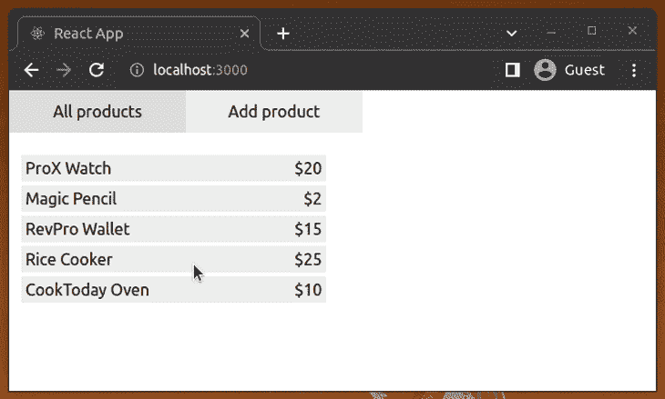
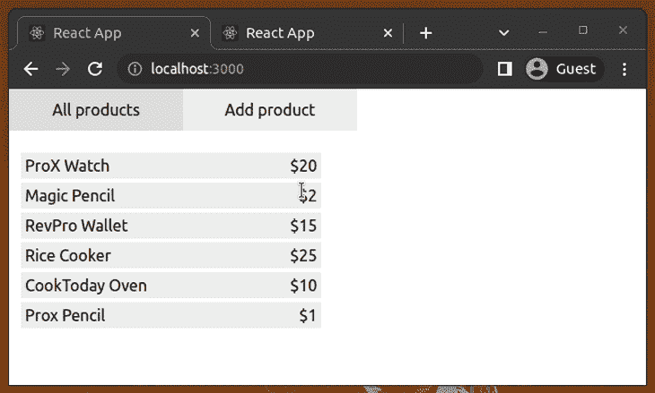
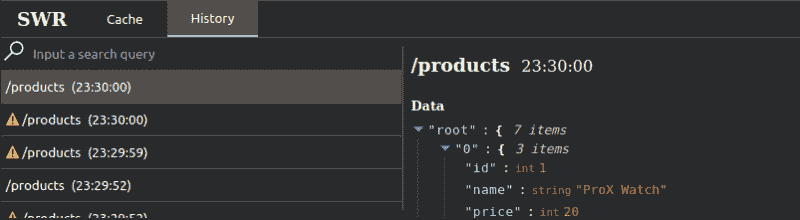
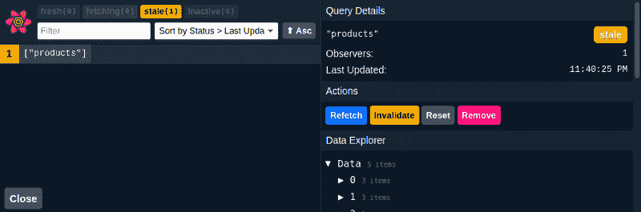

# 缓存冲突:SWR vs. TanStack 对 React 的查询

> 原文：<https://blog.logrocket.com/swr-vs-tanstack-query-react/>

大多数 React 应用程序与远程数据源通信，以持久化和检索数据记录。如今，Web 应用程序开发团队倾向于使用 REST 和类似 GraphQL 的通信模式来实现他们的远程数据源接口。然后，前端开发团队必须通过他们的 React 应用程序向各种库发出网络请求，以在客户端和服务器端之间同步数据。

对于与 RESTful 服务的通信，最简单的方法是使用组件中的[内置 Fetch API 或类似 Axios](https://blog.logrocket.com/axios-vs-fetch-best-http-requests/) 的库来装载类似状态的事件。然后，您必须编写额外的逻辑来实现加载状态 UI 增强。最后，为了通过数据缓存、重复数据删除 API 查询和预取使您的应用程序更加用户友好和优化，您可能需要编写比客户端业务逻辑更多的代码！

这就是像 SWR 和 TanStack Query(以前的 React Query)这样的库可以通过缓存、预取、查询重复数据删除和各种其他可用性功能来帮助您将数据源的状态与 React 应用程序的状态同步的地方。

在本文中，我将通过一个实际的示例项目来比较 SWR 和 TanStack 查询库的特性。以下是我们将要介绍的内容:

## SWR 的反应是什么？

[SWR](https://github.com/vercel/swr) 是一个开源的、轻量级的、支持类型脚本的库，它提供了几个钩子用于在 React 和缓存中获取数据。缩写“SWR”代表重新验证时的状态，这是 HTTP [RFC 5861](https://tools.ietf.org/html/rfc5861) 中的通用缓存原则。

React SWR 于 2019 年通过其 v0.1.2 公开发布首次发布。

### 突出显示的功能

该库提供了以下突出的功能:

| 特征 | 描述 |
| --- | --- |
| 轻巧的尺寸和高性能 | 根据 BundlePhobia 的说法，SWR 图书馆压缩后大约重 4.2 千字节。SWR 开发团队通过树摇动捆绑策略关注性能和轻量级 |
| 最小的、可配置的、可重用的 API | SWR also focuses on offering a minimal, developer-friendly API for React developers that provides performance-friendly features. You can implement most of the things you need with a single Hook, `useSWR`.尽管 API 很小，但它允许您使用全局配置和许多挂钩选项来调整缓存系统和行为。 |
| 面向开发人员和用户的内置功能 | SWR 支持分页请求，并提供了`useSWRInfinite`钩子来实现无限加载。它还可以与 React Suspense API、SSG 和 SSR 配合使用，并提供预取、焦点重新验证和网络状态重新获取，如应用程序用户的可用性增强。 |

## 使用反应 SWR

现在，我们已经对 SWR 在 React 中优化数据获取的特性有了一个概述，让我们用 SWR 创建一个示例应用程序，并对其进行评估，以找到与 TanStack Query 的比较点。

我们可以通过在客户端延迟承诺来模拟 API 后端，以尝试 SWR，但这种方法并不能提供真正的数据获取体验。让我们用 Node.js 创建一个简单的 RESTful API。我们可以用 [`json-server`包](https://github.com/typicode/json-server)在几秒钟内创建一个 RESTful API 服务器。

首先，全局安装`json-server`包:

```
npm install -g json-server
# --- or ---
yarn global add json-server

```

接下来，将以下内容添加到名为`db.json`的新文件中:

```
{
  "products": [
    {
      "id": 1,
      "name": "ProX Watch",
      "price": 20
    },
    {
      "id": 2,
      "name": "Magic Pencil",
      "price": 2
    },
    {
      "id": 3,
      "name": "RevPro Wallet",
      "price": 15
    },
    {
      "id": 4,
      "name": "Rice Cooker",
      "price": 25
    },
    {
      "id": 5,
      "name": "CookToday Oven",
      "price": 10
    }
  ]
}

```

接下来，运行以下命令来启动基于`db.json`文件的 RESTful CRUD 服务器:

```
json-server --watch --port=5000 --delay=1000 db.json

```

现在，我们可以通过 [`http://localhost:5000/products`](http://localhost:5000/products) 访问我们的 CRUD API。如果你愿意，你可以用邮差测试一下。在我们的示例中，我们添加了 1000 毫秒的延迟来模拟网络延迟。

让我们创建一个新的 React 应用程序，并通过 SWR 获取数据。如果你已经是 SWR 的用户或者你以前用过 SWR，你可以在下面的[这个 GitHub 库](https://github.com/codezri/react-swr-example)和[中查看完整的项目。](#tanstack-query)

像往常一样创建一个新的 React 应用程序:

```
npx create-react-app react-swr-example
cd react-swr-example

```

### 安装软件包

接下来，使用以下命令安装`swr`包:

```
npm install swr
# --- or ---
yarn add swr

```

我们将在本教程中使用 Axios，所以也用下面的命令安装它。您可以使用任何 HTTP 请求库或内置的`fetch`，因为 SWR 只希望得到承诺。

```
npm install axios
# --- or --- 
yarn add axios

```

### 实现数据提取器和自定义挂钩

我们将通过创建一个简单的产品管理应用程序来评估 SWR，该应用程序列出了一些产品，并允许您添加新产品。首先，我们需要将本地模拟 API 的基本 URL 存储在`.env`文件中。创建一个名为`.env`的新文件，并添加以下内容:

```
REACT_APP_API_BASE_URL = "http://localhost:5000"

```

接下来，通过将以下内容添加到`index.js`文件，使用 Axios 全局配置中的基本 URL:

```
import React from 'react';
import ReactDOM from 'react-dom/client';
import axios from 'axios';

import './index.css';
import App from './App';

axios.defaults.baseURL = process.env.REACT_APP_API_BASE_URL;

const root = ReactDOM.createRoot(document.getElementById('root'));
root.render(
    <App />
);

```

我们将所有的应用程序组件保存在我们的`App.js`文件中，以保持教程的简单性。清理您的`App.js`文件中的所有内容，并添加以下导入:

```
import React, { useState } from 'react';
import useSWR from 'swr';
import axios from 'axios';

import './App.css';

```

这里，我们从`swr`导入`useSWR`钩子来检索缓存的数据记录，而不是直接调用 Axios 函数。

为了在没有 RESTful URL 参数的情况下获取数据，我们通常需要向`useSWR`钩子提供两个参数:一个惟一的键(通常是 URL)和一个 fetcher 函数，这是一个返回异步数据的 JavaScript 函数。

添加包含提取器的以下代码:

```
function fetcher(url) {
  return axios.get(url).then(res => res.data);
}

async function addProduct(product) {
  let response = await axios.post('/products', product);
  return response.data;
}

```

这里，`fetcher`函数通过 Axios 异步返回数据，而`addProduct`函数类似地发布产品数据并返回新创建的产品。

现在，我们可以在功能组件中使用`useSWR(‘/products’, fetcher)`语句来获取缓存的产品，但是 SWR 开发者建议使用可重用的定制钩子。将以下挂钩添加到`App.js`文件中:

```
function useProducts() {
  const { data, error, mutate } = useSWR('/products', fetcher);
  return {
    products: data,
    isLoading: !data,
    isError: !!error,
    mutate
  };
}

```

我们的`useProducts`自定义钩子输出以下道具:

*   `products`:从 API 取数据后的产品数组；如果 API 中没有可用数据，则变为`undefined`
*   `isLoading`:基于 API 数据加载指标
*   `isError`:表示加载错误的布尔值
*   `mutate`:更新缓存数据的功能，即时反映在 UI 上

### 使用 SWR 获取数据

现在我们可以使用`useProducts`数据钩子从后端数据更新 UI。创建`Products`组件来列出所有可用的产品:

```
function Products() {
  const { products, isLoading, isError } = useProducts();
  if(isError)
    return (
      <div>Unable to fetch products.</div>
    );

  if(isLoading)
    return (
      <div>Loading products...</div>
    );

  return (
    products.map((product) => (
      <div key={product.id} className="product-item">
        <div>{product.name}</div>
        <div>${product.price}</div>
      </div>
    ))
  );
}

```

`Products`组件根据`useProducts`钩子属性进行有条件的渲染。如果你在许多组件中多次使用这个钩子，SWR 将只发起一个 HTTP 请求，根据请求重复数据删除特性，然后，提取的数据将通过`useProducts`钩子与渲染过程的所有组件共享。

### 变更缓存数据和使请求无效

创建一个名为`AddProduct`的组件，并使用以下代码实现一种添加新产品的方法:

```
function AddProduct({ goToList }) {
  const { products, mutate } = useProducts();
  const [product, setProduct] = useState({
    id: products.length + 1,
    name: '',
    price: null
  });
  const [disabled, setDisabled] = useState(true);

  async function handleAdd() {
    goToList();
    mutate(async () => {
      return [...products, await addProduct(product)]
    }, { optimisticData: [...products, product], rollbackOnError: true, revalidate: false } );
  }

  function handleFieldUpdate(e) {
    const element = e.target;
    const value = element.type === 'number' ? parseInt(element.value) : element.value;
    const nextProduct = {...product, [element.name]: value};

    setProduct(nextProduct);
    setDisabled(!nextProduct.name || !nextProduct.price);
  }

  return(
    <div className="product-form">
      <input
        type="text"
        name="name"
        placeholder="Name"
        autoFocus
        onChange={handleFieldUpdate}/>
      <input
        type="number"
        name="price"
        min="1"
        placeholder="Price"
        onChange={handleFieldUpdate}/>
      <button onClick={handleAdd} disabled={disabled}>Add</button>
    </div>
  );
}

```

仔细阅读`mutate`函数调用:

```
mutate(async () => {
  return [...products, await addProduct(product)]
}, {
    optimisticData: [...products, product],
    rollbackOnError: true,
    revalidate: false
    }
);

```

这里，我们要求 SWR 用`optimisticData`选项直接更新渲染产品；然后，我们可以使用`addProduct`函数调用将指定的元素插入数据库。我们还可以从异步函数返回更新的产品列表，因为我们的 SWR 变异需要从异步函数的返回值中获得更新的数据记录。

最后一步，添加导出的`App`组件并完成实现:

```
function App() {
  const [ mode, setMode ] = useState('list');
  return (
    <>
    <div className="menu-bar">
      <div onClick={() => { setMode('list') }}
          className={mode === 'list' ? 'selected' : ''}>All products</div>
      <div onClick={() => { setMode('add') }}
          className={mode === 'add' ? 'selected' : ''}>Add product</div>
    </div>
    <div className="wrapper">
      { mode === 'list' ? <Products/> :
          <AddProduct goToList={() => setMode('list')}/> }
    </div>
    </>
  );
}

export default App;

```

现在运行应用程序:

```
npm start
# --- or --- 
yarn start

```

首先，研究 SWR 如何缓存`ProductList`组件的数据——您将只看到一次加载文本。稍后，您将收到缓存的内容。

看下面的预告:


Caching the product list data with SWR

接下来，注意 SWR 是如何通过在更新和重新获取`AddProduct`组件中的后台数据之前直接操作呈现的内容来提高可用性的。添加一个新产品，可以看到数据记录立即呈现出来，如下所示:



Updating the cached content before the API call

最后，SWR 提供了一些额外的功能，如重新验证焦点和检查网络选项卡，以查看网络呼叫:



Testing the revalidation-on-focus feature

## 什么是 TanStack 查询？

TanStack Query 是另一个开源的、全功能的、支持 TypeScript 的库，它为 React 应用程序中的数据获取和缓存提供了一个 API。它在一个[单独的内部包](https://github.com/TanStack/query/tree/main/packages/query-core)中实现了库的不可知核心逻辑，并专门为 React 提供了 [React 查询](https://github.com/TanStack/query/tree/main/packages/react-query)适配器包。

React 的 TanStack Query 提供了钩子、类和一个官方的、专用的基于 GUI 的开发工具，用于在 React 应用程序中同步客户端状态和服务器状态。类似地，开发团队计划为其他前端库提供官方适配器包，例如，TanStack Vue Query、Svelte Query 等。

TanStack Query 于 2014 年通过其 v0.0.6 公开发行版首次发布，比 React 的首次发布晚了大约一年。

### 突出显示的功能

该库提供了以下突出的功能:

| 特征 | 描述 |
| --- | --- |
| 包含电池的框架式体验 | TanStack Query 为 React 开发人员提供了一种类似框架的体验，它有一个专用的开发人员工具、用于每个特定任务的专用挂钩、用于更好地组织代码的 OOP 类以及基于 JavaScript-props 的事件处理程序。 |
| 详细、可配置和可重用的 API | TanStack Query 致力于提供一个详细的、可配置的、全功能的 API，用于在 React 应用程序中获取和缓存远程数据。为了更好地组织代码，它提供了来自 API 核心的多个钩子和类。 |
| 面向开发人员和用户的内置功能 | TanStack Query supports paginated requests and provides the `useInfiniteQuery` Hook to implement infinite loading.它还为开发人员提供了 React 悬念 API、SSG 和 SSR 支持——预取、焦点重新验证和网络状态重新获取，如应用程序用户的可用性增强。 |

## 使用临时查询

现在，我们已经回顾了 TanStack Query 为 React 中的优化数据获取提供的功能，让我们创建一个示例应用程序并对其进行评估，以找出与 React SWR 的比较点。

如果您已经是一个 TanStack Query 用户，或者您以前尝试过 TanStack Query，那么您可以在[这个 GitHub 库](https://github.com/codezri/react-query-example)中查看完整的项目，并跳到比较部分。

首先，配置模拟 API 服务器，并像我们在 React SWR 小节中所做的那样启动它。现在，创建另一个 React 项目，用 TanStack Query 实现前面的简单产品管理应用程序:

```
npx create-react-app tanstack-query-example
cd tanstack-query-example

```

### 安装软件包

使用以下命令安装`@tanstack/react-query`包:

```
npm install @tanstack/react-query
# --- or ---
yarn add @tanstack/react-query

```

安装 Axios 包，并按照我们在 SWR 部分所做的相同步骤定义基本 URL。准备用 TanStack Query 重写之前的 app 吧！

清除`App.js`文件中的所有内容，并添加以下导入:

```
import React, { useState } from 'react';
import {
  QueryClient,
  QueryClientProvider,
  useQuery,
  useQueryClient,
  useMutation } from '@tanstack/react-query';
import axios from 'axios';

import './App.css';

```

这里，`useQuery`和`useMutation`钩子帮助获取和更新数据(缓存的数据)。我们可以使用`QueryClient`类创建一个类似代理的实例来访问或操作缓存的数据。`useQueryClient`钩子返回所有应用程序组件中当前的`QueryClient`引用。

`QueryClientProvider`组件支持访问整个 React 应用程序的缓存数据，类似于 [React 上下文 API](https://blog.logrocket.com/react-context-api-deep-dive-examples/) 中内置的`Context.Provider`组件。

### 实现数据提取器和自定义挂钩

与 SWR 类似，现在我们可以为 Axios 创建一个包装器，一个将产品插入数据库的函数，以及一个获取缓存产品的自定义挂钩，如下所示:

```
function fetcher(url) {
  return axios.get(url).then(res => res.data);
}

async function addProduct(product) {
  let response = await axios.post('/products', product);
  return response.data;
}

function useProducts() {
  const { data, isLoading, error } = useQuery(['products'], () => fetcher('/products'));
  return {
    products: data,
    isLoading,
    isError: !!error
  };
}

```

与 SWR 不同，在这里，我们有方便的`isLoading`道具用于条件渲染，但在版本 4 中，我们需要向`useQuery`钩子发送基于数组的唯一键和 URL 段，因为钩子用上下文对象调用 fetcher 函数——它不像 SWR 那样直接传递唯一键字符串。

### 使用 TanStack 查询获取数据

我们可以使用来自 SWR 项目的相同的`Products`组件源，因为定制钩子几乎是相同的:

```
function Products() {
  const { products, isLoading, isError } = useProducts();

  if(isError)
    return (
      <div>Unable to fetch products.</div>
    );

  if(isLoading)
    return (
      <div>Loading products...</div>
    );

  return (
    products.map((product) => (
      <div key={product.id} className="product-item">
        <div>{product.name}</div>
        <div>${product.price}</div>
      </div>
    ))
  );
}

```

我们可以在多个组件中使用`useProducts`钩子，而不用担心 RESTful HTTP 请求重复的问题，因为 TanStack Query 也像 SWR 一样对类似的请求进行重复删除。

### 变更缓存数据和使请求无效

创建一个名为`AddProduct`的组件，并使用以下代码实现一种添加新产品的方法:

```
function AddProduct({ goToList }) {
  const { products } = useProducts();
  const queryClient = useQueryClient();
  const mutation = useMutation((product) => addProduct(product), {
    onMutate: async (product) => {
      await queryClient.cancelQueries(['products']);

      const previousValue = queryClient.getQueryData(['products']);
      queryClient.setQueryData(['products'], (old) => [...old, product]);
      return previousValue;
    },
    onError: (err, variables, previousValue) =>
      queryClient.setQueryData(['products'], previousValue),
    onSettled: () => queryClient.invalidateQueries(['products'])
  });

  const [product, setProduct] = useState({
    id: products ? products.length + 1 : 0,
    name: '',
    price: null
  });
  const [disabled, setDisabled] = useState(true);

  async function handleAdd() {
    setTimeout(goToList);
    mutation.mutate(product);
  }

  function handleFieldUpdate(e) {
    const element = e.target;
    const value = element.type === 'number' ? parseInt(element.value) : element.value;
    const nextProduct = {...product, [element.name]: value};

    setProduct(nextProduct);
    setDisabled(!nextProduct.name || !nextProduct.price);
  }

  return(
    <div className="product-form">
      <input
        type="text"
        name="name"
        placeholder="Name"
        autoFocus
        onChange={handleFieldUpdate}/>
      <input
        type="number"
        name="price"
        min="1"
        placeholder="Price"
        onChange={handleFieldUpdate}/>
      <button onClick={handleAdd} disabled={disabled}>Add</button>
    </div>
  );
}

```

TanStack Query 提供了一个全功能的突变 API，它提供了对整个突变生命周期的透明访问。如你所见，我们有`onMutate`、`onError`和`onSettled`回调来实现我们的变异策略。

* * *

### 更多来自 LogRocket 的精彩文章:

* * *

在本例中，我们用新产品对象直接更新缓存数据，然后让 TanStack Query 向`POST`端点发送请求，以在后台更新服务器状态。

SWR 提供的变异策略是一个内置特性，支持有限的定制，但这不是一个障碍，因为 SWR 的固定变异策略解决了几乎所有开发人员的需求。然而，与 SWR 不同，TanStack Query 允许您按照自己的意愿实现变异策略。

让我们为`App`组件创建一个新的查询客户机:

```
const queryClient = new QueryClient();

```

查询客户端实例有助于访问每个应用程序组件中的缓存数据记录。

最后，将导出的`App`组件源添加到您的`App.js`文件中:

```
function App() {
  const [ mode, setMode ] = useState('list');
  return (
    <QueryClientProvider client={queryClient}>
      <div className="menu-bar">
        <div onClick={() => { setMode('list') }}
            className={mode === 'list' ? 'selected' : ''}>All products</div>
        <div onClick={() => { setMode('add') }}
            className={mode === 'add' ? 'selected' : ''}>Add product</div>
      </div>
      <div className="wrapper">
        { mode === 'list' ? <Products/> :
            <AddProduct goToList={() => setMode('list')}/> }
      </div>
    </QueryClientProvider>
  );
}

export default App;

```

我们现在需要通过提供查询客户端引用，用`QueryClientProvider`库组件包装我们的应用程序组件，以使`useQueryClient`在所有子组件中正常运行。

启动 RESTful 模拟服务器并运行应用程序——您将看到我们用 SWR 实现的相同应用程序。尝试打开两个标签页，添加新产品；正如我们所期望的，您将看到焦点上的重新验证特性在起作用。

现在，让我们根据上面的发现比较一下 SWR 和 TanStack 查询库。

## SWR 对坦斯塔克的质疑

### 基本 CRUD 特征

之前，我们尝试了数据检索和操作(获取和变异)来测试两个缓存库中的 CRUD 支持。SWR 和 TanStack Query 都提供了实现示例应用程序所需的特性。

SWR 力求以最小的方式给出每一个特性，这可能会激励开发人员为数据缓存相关的活动编写更少的代码。但是一个最小的 API 设计有时会带来深度定制的限制。与 SWR 相比，TanStack Query 以一种更加可定制的方式提供了基本的抓取和变异功能，而 SWR 则以一种比 TanStack Query 更简单的方式提供了类似的功能。

这两个库都是后端不可知的，具有基于 promise 的 fetcher 函数，因此您可以将 SWR 和 TanStack Query 与 REST、GraphQL 或任何其他您喜欢的通信机制一起使用:Axios、 [Unfetch](https://github.com/developit/unfetch) 、 [graphql-request](https://github.com/prisma-labs/graphql-request) 等。

总的来说，这两个库都应该满足开发人员对基本获取和变异支持的需求。

### 受欢迎程度和开发者支持

开源库通常会变得流行，并在一些情况下获得 GitHub stargazers:

*   当更多的开发人员使用特定的库时
*   当该库提供比一般水平更好的开发人员支持时
*   当他们的仓库维护良好时

这两个图书馆都有许多 GitHub 观星者。这两个库都有很棒的开发人员社区——开发人员通过回答这些库的 GitHub 库上的支持查询来互相帮助。React SWR 没有提供用于调试的官方开发工具，但是一个社区成员创建了一个用于调试的 GUI 开发工具。

与 SWR 相比，TanStack Query 维护了更详细、更有条理、更有支持性的官方文档。然而，这两个库都提供了优秀的示例项目/代码片段，以便开发人员快速理解它们的基本概念。

对于第三方库，专用的 GUI 调试工具不是强制性的。尽管如此，像缓存这样的主题确实很复杂，所以一个用于缓存库的开发工具确实可以节省开发时间。

TanStack Query 附带了一个官方开发工具，但是 swr 的开发人员社区为 SWR 创建了一个非官方的但是使用良好的 swr-devtools。

swr-devtools 是最小的，只显示只读数据，但是它包含了调试所需的关键信息:



The SWR DevTools community GUI displays past queries

与只读的 swr-devtools 不同，TanStack 查询开发工具向您显示缓存的数据，并允许您操作缓存的内容:



The TanStack Query DevTools GUI displays current queries

根据 GitHub 问题跟踪者的消息，swr-devtools 项目正计划在开发者工具面板中增加对缓存操作的支持。

### 内置可用性功能

使用像 SWR 或 TanStack Query 这样的库有三个主要原因:

1.  减少同步服务器状态和反应应用程序状态所需的代码量
2.  通过数据缓存和重复数据删除查询等概念，优化使用远程资源
3.  通过实时体验提高应用程序的可用性

可用性改进是缓存和查询优化的一个重要原因，因此这两个库都提供了以下可用性特性:

*   重新验证焦点
*   网络状态重新获取
*   数据预取
*   基于时间间隔的重新验证

TanStack Query 提供了以下附加可用性功能:

*   滚动恢复，用于在用户再次返回组件时保存无限滚动位置
*   查询取消以停止长时间运行的查询
*   离线突变支持

### 捆绑包大小和性能优化

并非所有用户都有超快的互联网连接或使用高端电脑。因此，保持健康的捆绑包大小和实现性能优化有助于所有用户顺利运行您的应用程序，无论他们的互联网速度和电脑规格如何。为 web 应用程序消耗用户计算机的最佳硬件资源是一个很好的实践。

React SWR 是一个非常轻量级的库:[bundle hobia](https://bundlephobia.com/package/swr@1.3.0)测得它的 gzipped 大小只有 4.2kB，由于其广泛的特性，TanStack 查询有点重，所以它是 [11.4 kB gzipped](https://bundlephobia.com/package/@tanstack/react-query@4.0.10) 。确实是 React 核心库的四倍以上！

这两个库都在内部进行渲染优化、请求重复数据删除和缓存优化。请注意，缓存库不会提高 HTTP 请求处理速度——HTTP 请求性能取决于各种因素，如 HTTP 客户端库性能、浏览器的 JavaScript 引擎实现、网络速度、当前 CPU 负载等。

## SWR vs. TanStack 查询:汇总

我们用一张表来总结一下以上的比较因素。查看下表，并对 SWR 和 TanStack 查询进行对比:

| 比较因素 | 反应 SWR | 转移查询 |
| --- | --- | --- |
| 总体 API 设计 | 为开发人员提供了一个最小的 API，具有一些固定的特性 | 为开发人员提供了一个详细且有些复杂的 API，具有完全可定制的特性 |
| 捆绑尺寸(gzipped) | 4.2 KB | 11.4 KB |
| 知名度、社区支持和文档 | 良好的社区、维护良好的存储库，以及总体良好的演示文档 | 良好的社区、维护良好的存储库，以及包含许多实际示例和完整 API 参考的信息丰富的文档 |
| 基本数据获取和变异功能 | 满足开发人员的需求，但是开发人员必须为某些特性编写额外的代码，并且可能面临深度定制问题 | 通过深度定制支持满足开发人员的需求。试图将它与较小的项目集成的开发人员可能会发现这个 API 比它应该有的要复杂一些 |
| 性能优化 | 支持请求重复数据删除、渲染优化和优化缓存 | 支持请求重复数据删除、渲染优化和优化缓存 |
| 内置可用性功能 | 基于时间间隔的焦点重新验证、网络状态重新获取、数据预取和重新验证 | 焦点的重新验证、网络状态重新获取、数据预取、基于间隔的重新验证、请求取消、离线突变和滚动恢复 |
| 面向开发人员的内置功能 | 提供分页和无限加载功能。开发者社区用 Chrome 和 Firefox 扩展实现了一个开发者工具 GUI。支持将缓存持久化到外部存储位置(即`localStorage`)。 | 提供分页和无限加载功能。它附带了一个支持缓存操作的官方开发工具 GUI。支持将缓存持久化到外部存储位置(即`localStorage`)。 |
| 反应悬念 | 支持 | 支持 |
| 对其他前端库的官方支持 | 没有，类似的社区库可用: [sswr](https://github.com/ConsoleTVs/sswr) | 正在进行中，类似的社区图书馆可用: [vue-query](https://github.com/DamianOsipiuk/vue-query) |

## 结论

在本文中，我们用 SWR 和 TanStack 查询库创建了一个示例 React 应用程序，然后根据开发人员的体验和可用特性对它们进行了比较。

正如我们在这里所概述的，这两个库都有更好的性能，并且各有利弊。React SWR 的目标是提供一个最小的 API，通过维护一个轻量级的库来解决 React 请求处理中的缓存问题。同时，TanStack Query 致力于为同样的问题提供一个功能全面的解决方案。

有时，TanStack Query 看起来像一个框架，从一个开发工具包中提供您需要的一切，就像 Angular——另一方面，SWR 看起来更像 React，因为它只专注于解决一个问题。React 引入了功能组件来降低基于类的组件的复杂性，因此喜欢这种简单性的开发人员可能更喜欢 SWR 而不是 TanStack Query。

喜欢使用详细/健壮的 API 并寻求类似框架的一体化数据缓存解决方案的开发人员可能会选择 TanStack Query 而不是 SWR。TanStack 查询团队计划为 Svelte、SolidJS、Vue.js 和 vanilla JavaScript 应用程序提供官方支持，并为核心的 TanStack 查询库提供适配器库。然而，前端开发者社区已经根据其他前端框架的 TanStack Query 和 React SWR API 实现了几个开源缓存库。

我们的结论？尝试两个库。根据您的 API 偏好选择一个。TanStack Query 有几个独特的特性和深度定制，在撰写本文时 SWR 还不支持。这两个库很可能会变得同样功能齐全和健壮，特别是如果 SWR 承诺在不久的将来实现一些缺失的功能。

然而，从最小 API 设计的角度来看，SWR 已经很完整了，它提供了您所寻求的强制特性，而没有进一步增加包的大小，这正是 TanStack Query 所能做到的。

## [LogRocket](https://lp.logrocket.com/blg/react-signup-general) :全面了解您的生产 React 应用

调试 React 应用程序可能很困难，尤其是当用户遇到难以重现的问题时。如果您对监视和跟踪 Redux 状态、自动显示 JavaScript 错误以及跟踪缓慢的网络请求和组件加载时间感兴趣，

[try LogRocket](https://lp.logrocket.com/blg/react-signup-general)

.

[ ](https://lp.logrocket.com/blg/react-signup-general) [](https://lp.logrocket.com/blg/react-signup-general) 

LogRocket 结合了会话回放、产品分析和错误跟踪，使软件团队能够创建理想的 web 和移动产品体验。这对你来说意味着什么？

LogRocket 不是猜测错误发生的原因，也不是要求用户提供截图和日志转储，而是让您回放问题，就像它们发生在您自己的浏览器中一样，以快速了解哪里出错了。

不再有嘈杂的警报。智能错误跟踪允许您对问题进行分类，然后从中学习。获得有影响的用户问题的通知，而不是误报。警报越少，有用的信号越多。

LogRocket Redux 中间件包为您的用户会话增加了一层额外的可见性。LogRocket 记录 Redux 存储中的所有操作和状态。

现代化您调试 React 应用的方式— [开始免费监控](https://lp.logrocket.com/blg/react-signup-general)。