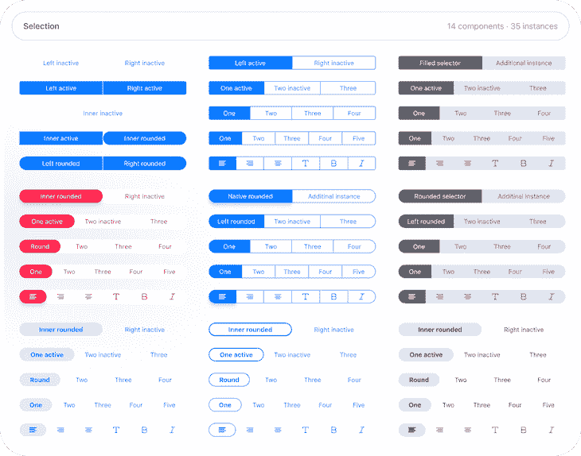
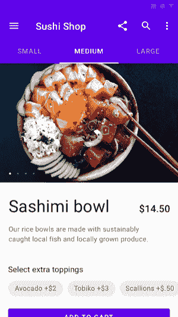

# 用 React Native - LogRocket Blog 为 iOS 和 Android 构建一个选项卡控件组件

> 原文：<https://blog.logrocket.com/tab-control-component-ios-android-react-native/>

选项卡控件是移动应用程序的重要组件。它使用户能够在屏幕之间导航，或者通过在视图之间切换来访问屏幕内容的不同部分。

作为一名移动应用开发者，你通常会在 iOS 上使用一个[分段控件](https://developer.apple.com/design/human-interface-guidelines/ios/controls/segmented-controls/)。



iOS segmented control designs by Roman Kamushken.

在 Android 上，你通常会根据[材料设计准则](https://material.io/components/tabs/)使用[标签布局](https://material.io/develop/android/components/tab-layout/)。



Example of a Material Design tab.

本文的目标是开发一个 React 本地组件，在 iOS 上呈现一个分段控件，在 Android 上呈现一个选项卡组件。说到实现，我重用状态管理和数据流的代码，因为它们是独立于平台的。

特定于平台的代码——例如，由于不同的 UI 模式——在 React 本机机制的帮助下使用，如[平台](https://reactnative.dev/docs/platform-specific-code#platform-module)模块，以区分 iOS 和 Android(以及 [web](https://necolas.github.io/react-native-web/docs/?path=/docs/overview-getting-started--page) )。我对组件的要求是:

*   Android 组件符合材料设计准则
*   iOS 组件设计强烈倾向于 iOS 13 的分段控制设计。我的模板是 iOS 13 上的苹果地图
*   我不试图为不同的操作系统版本实现不同的设计(例如，没有为使用 iOS 12 的用户提供分段控制的 iOS 12 设计)

## 演示应用程序

下面的动画 gif 演示了作为本文主题的选项卡控件。


我想把重点放在开发这样一个组件的重要方面。出于这个原因，我把这个例子分解成了要点。

关于分段控制，我实现了一个版本，使用交互概念的运动动画来可视化活动标签之间的转换。在上面的动画 gif 中，你可以看到这个 UX 图案的样子。

你可以在[我的 GitHub 项目](https://github.com/doppelmutzi/expo-snack-RN-tab-control)中找到代码，也可以通过我的[世博小吃](https://snack.expo.io/@doppelmutzi/tab-control-(segmented-control-on-ios-and-tab-layout-on-android))快速访问。

## `TabControl` —接口和实现

组件的接口看起来像这样。

```
<TabControl
  values={["Giannis", "LeBron", "Luka"]}
  onChange={value => {
    if (value === "Giannis") {
      setImgSource(sourceUriGiannis);
    } else if (value === "LeBron") {
      setImgSource(sourceUriLeBron);
    } else {
      setImgSource(sourceUriLuka);
    }
  }}
  renderSeparators={showSeparatorsIos}
/>
```

您必须传入一个呈现为标签的数组`values`。当用户点击一个选项卡时，就会调用`onChange` prop。回调函数获取活动选项卡的标签。在演示项目中，我使用该值来设置图像源(`setImgSource`)，以便在用户按 tab 键时改变背景图像。

让我们深入研究一下`TabControl`组件的实现细节。

```
import {
  // ...
  Platform
} from "react-native";
import iosTabControlStyles from "./iOSTabControlStyles";
import androidTabControlStyles from "./androidTabControlStyles";
const isIos = Platform.OS === "ios";
const wrapperStyles = StyleSheet.create({
  outerGapStyle: isIos ? { padding: theme.spacing.s } : { padding: 0 }
});
const tabControlStyles = isIos ? iosTabControlStyles : androidTabControlStyles;
const TabControl = ({ values, onChange, renderSeparators }) => {
  const [selectedIndex, setSelectedIndex] = useState(0);
  const handleIndexChange = index => {
    setSelectedIndex(index);
    onChange(values[index]);
  };
  return (
    <View style={wrapperStyles.outerGapStyle}>
      <SegmentedControl
        values={values}
        selectedIndex={selectedIndex}
        onIndexChange={handleIndexChange}
        renderSeparators={renderSeparators}
      />
    </View>
  );
};

```

我利用 React Native 的平台 API 在两个移动平台上不同地呈现组件。我创建了一个布尔变量(`isIos`)来执行整个组件的平台检查。

```
import iosTabControlStyles from "./iOSTabControlStyles";
import androidTabControlStyles from "./androidTabControlStyles";
const isIos = Platform.OS === "ios";
const wrapperStyles = StyleSheet.create({
  outerGapStyle: isIos ? { padding: theme.spacing.s } : { padding: 0 }
});
const tabControlStyles = isIos ? iosTabControlStyles : androidTabControlStyles;

```

使用`wrapperStyles`对象，您可以看到我是如何定义不同的样式属性的。在 Android 上，组件应该横跨整个视口宽度，但在 iOS 上，左右两侧应该有一个小间隙。

根据平台的不同，`iOSTabControlStyles`或`androidTabControlStyles`被分配给`tabControlStyles`。该对象保存实际的样式，可以从整个组件的不同部分进行访问。这个概念背后的思想是两个导入的样式对象有相同的“接口”再来看看安卓风格(`androidTabControlStyles.js`)。

```
import { StyleSheet } from "react-native";
import theme from "../theme";
const { tabsContainerColor, borderColor, activeTextColor } = theme.color;
export const androidTabBarHeight = 40;
const fontStyles = {
  fontFamily: theme.fontFamily.normal,
  fontSize: theme.fontSize.l,
  color: activeTextColor
};
const gap = theme.spacing.s;
export default StyleSheet.create({
  tabsContainerStyle: {
    backgroundColor: tabsContainerColor,
    height: androidTabBarHeight
  },
  tabStyle: {
    flex: 1,
    paddingVertical: gap,
    paddingHorizontal: 2 * gap
  },
  tabTextStyle: { ...fontStyles, alignSelf: "center" },
  activeTabStyle: {
    borderBottomWidth: theme.spacing.xs,
    borderBottomColor: borderColor
  },
  activeTabTextStyle: {
    ...fontStyles
  },
  firstTabStyle: {},
  lastTabStyle: {}
});

```

颜色、间距或字体的具体值在导入的`theme.js`文件中定义。例如，`theme.fontSize.l`指定大字体大小。

iOS 的样式表对象具有相同的结构(`iOSTabControlStyles.js`)。当然，价值观不同。以下道具类型显示了“接口”

```
  import { ViewPropTypes } from "react-native";
  // ...
  const styleShape = PropType.shape({
    tabsContainerStyle: ViewPropTypes.styles,
    tabStyle: ViewPropTypes.styles,
    tabTextStyle: ViewPropTypes.styles,
    activeTabStyle: ViewPropTypes.styles,
    activeTabTextStyle: ViewPropTypes.styles,
    firstTabStyle: ViewPropTypes.styles,
    lastTabStyle: ViewPropTypes.styles
  });

```

`TabControl`组件假设这些属性存在于样式表对象中。为了清楚起见，我将跳过 iOS 样式表对象的细节。

`TabControl`是存储所选索引的有状态组件(`selectedIndex`)。此外，它还定义了一个函数(`handleIndexChange`)来更改选中的索引，并调用传递的`onChange`回调函数——在我们的例子中，是更改背景图像。

```
const TabControl = ({ values, onChange, renderSeparators }) => {
  const [selectedIndex, setSelectedIndex] = useState(0);
  const handleIndexChange = index => {
    setSelectedIndex(index);
    onChange(values[index]);
  };
  return (
    <View style={wrapperStyles.outerGapStyle}>
      <SegmentedControl
        values={values}
        selectedIndex={selectedIndex}
        onIndexChange={handleIndexChange}
        renderSeparators={renderSeparators}
      />
    </View>
  );
};

```

该组件在具有上述水平填充的容器内呈现一个`SegmentedControl`组件。`values`和`renderSeparators`，一个控制分隔符是否应该在 iOS 上呈现的布尔标志，作为 props 与 press handler 和活动选项卡的索引一起传递。

## `SegmentedControl` —在平台无关的容器中呈现标签

`SegmentedControl`负责为`tabValues`数组的每个条目渲染一个`Tab`组件。

* * *

### 更多来自 LogRocket 的精彩文章:

* * *

```
function SegmentedControl({
  values: tabValues,
  selectedIndex,
  onIndexChange,
  renderSeparators,
}) {
  return (
    <Container
      style={tabControlStyles}
      numberValues={tabValues.length}
      activeTabIndex={selectedIndex}
    >
      {tabValues.map((tabValue, index) => (
        <Tab
          label={tabValue}
          onPress={() => {
            onIndexChange(index);
          }}
          isActive={selectedIndex === index}
          isFirst={index === 0}
          isLast={index === tabValues.length - 1}
          renderLeftSeparator={
            renderSeparators && shouldRenderLeftSeparator(index, selectedIndex)
          }
          key={tabValue}
        />
      ))}
    </Container>
  );
}
```

选项卡标签和选项卡按压回调函数被传递给`Tab`组件。`isActive`、`isFirst`和`isLast`告诉`Tab`组件正确的上下文以不同的方式呈现标签(例如，Android 上活动标签的下边框)。上下文由当前索引和选定索引决定。

`renderLeftSeperators`代表一个布尔标志，决定是否应该呈现标签左侧的分隔符(这是实现决定)。

我将跳过函数`shouldRenderLeftSeparator`的实现细节。简而言之，如果标签不是第一个或活动标签，或者如果前一个标签构成了活动标签，则为 iOS 平台上的所有标签呈现标签的分隔符。

## `Container`—iOS 上带运动动画的水平布局组件

`Container`组件在 iOS 和 Android 上呈现不同。当然，`children`道具构成了`Tab`组件图。`numberValues`和`activeTabIndex`用于计算动画的新状态。

```
function Container({
  children,
  numberValues,
  style,
  activeTabIndex
}) {
  const { tabStyle, activeTabStyle, tabsContainerStyle } = style;
  const margin = theme.spacing.s;
  const [moveAnimation] = useState(new Animated.Value(0));
  const [containerWidth, setContainerWidth] = useState(0);
  useEffect(() => {
    const leftVal = (containerWidth / numberValues) * activeTabIndex;
    Animated.timing(moveAnimation, {
      toValue: leftVal,
      duration: 250
      // not supported by native animated module
      // useNativeDriver: true
    }).start();
  }, [containerWidth, activeTabIndex]);
  return isIos ? (
    <View
      style={[
        {
          marginHorizontal: margin,
          flexDirection: "row",
          position: "relative"
        },
        tabsContainerStyle
      ]}
      onLayout={event => {
        setContainerWidth(event.nativeEvent.layout.width);
      }}
    >
      <Animated.View
        style={{
          // works too
          // width: `${100 / numberValues}%`,
          width: containerWidth / numberValues,
          left: moveAnimation,
          top: iosTabVerticalSpacing,
          bottom: iosTabVerticalSpacing,
          position: "absolute",
          ...tabStyle,
          ...activeTabStyle
        }}
      ></Animated.View>
      {children}
    </View>
  ) : (
    <View
      style={[
        { marginHorizontal: margin, flexDirection: "row" },
        tabsContainerStyle
      ]}
    >
      {children}
    </View>
  );
}

```

容易的部分是安卓版(三元运算符的第二种表达)。这只是一小段 JSX 代码，它将`children`包装在一个`View`标签中，并在左右两边留出一些空白(`marginHorizontal`)。

与 W3C/web 版本的 Flexbox 相比，默认方向是`column`，所以需要`flexDirection: "row"`并排显示选项卡。

`tabsContainerStyle`是从传递的`style`属性中析构出来的，定义了容器组件的背景色和高度(`androidTabControlStyles.js`)。

```
return isIos ? (
    // iOS version / animation code
  ) : (
    // Android version
    <View
      style={[
        { marginHorizontal: margin, flexDirection: "row" },
        tabsContainerStyle
      ]}
    >
      {children}
    </View>
  )

```

iOS 版本更复杂。

```
// ...
  const [moveAnimation] = useState(new Animated.Value(0));
  const [containerWidth, setContainerWidth] = useState(0);
  useEffect(() => {
    const leftVal = (containerWidth / numberValues) * activeTabIndex;
    Animated.timing(moveAnimation, {
      toValue: leftVal,
      duration: 250
      // not supported by native animated module
      // useNativeDriver: true
    }).start();
  }, [containerWidth, activeTabIndex]);
  return isIos ? (
    <View
      style={[
        {
          marginHorizontal: margin,
          flexDirection: "row",
          position: "relative"
        },
        tabsContainerStyle
      ]}
      onLayout={event => {
        setContainerWidth(event.nativeEvent.layout.width);
      }}
    >
      <Animated.View
        style={{
          width: containerWidth / numberValues,
          left: moveAnimation,
          top: iosTabVerticalSpacing,
          bottom: iosTabVerticalSpacing,
          position: "absolute",
          ...tabStyle,
          ...activeTabStyle
        }}
      ></Animated.View>
      {children}
    </View>
  ) : (
    // Android version
  )

```

我决定使用两个状态对象来管理动画。`containerWidth`保存容器对象的宽度。`setContainerWidth`在分配给`View`的`onLayout`道具的回调函数中被调用。`event.nativeEvent.layout.width`返回组件的实际宽度。

分配给`style`道具的数组看起来非常类似于上面描述的 Android 版本。唯一的区别是`position: "relative"`，因为活动选项卡动画(`Animated.View`)的实现使用绝对定位。

```
<View style={[
    {
      marginHorizontal: margin,
      flexDirection: "row",
      position: "relative"
    },
    tabsContainerStyle
  ]}
  onLayout={event => {
    setContainerWidth(event.nativeEvent.layout.width);
  }}>
  <Animated.View>
    // ...
  </Animated.View>
  {children}
</View>

```

[动画](https://reactnative.dev/docs/animated)是 React Native 的动画库。`Animated.View`是绝对定位在相对定位的父组件中的增强`View`组件。

它没有任何子元素，因为唯一的目的是有一个带背景色和圆角的样式化组件，通过更新`left`属性在水平轴上显示动画。

`width`是根据制表符的数量(`numberValues`)和容器的宽度(`containerWidth`)动态计算的。`top`和`bottom`用来增加一些垂直间距。

```
<Animated.View
  style={{
    width: containerWidth / numberValues,
    left: moveAnimation,
    top: iosTabVerticalSpacing,
    bottom: iosTabVerticalSpacing,
    position: "absolute",
    ...tabStyle,
    ...activeTabStyle
  }}>
</Animated.View>
{children}

```

最后，我们还要看一下`useEffect`钩子，在这里`left`道具的值被计算出来，然后被动画(`Animated.timing()`)使用。

```
useEffect(() => {
  const leftVal = (containerWidth / numberValues) * activeTabIndex;
  Animated.timing(moveAnimation, {
    toValue: leftVal,
    duration: 250
  }).start();
}, [containerWidth, activeTabIndex]);

```

可以看到，`useEffect`的依赖数组包含了`containerWidth`和`activeTabIndex` ( `numberValues`不变)。只要其中一个值发生变化，动画就会更新，并且活动选项卡指示器组件会在 250 毫秒内沿水平轴移动到新位置。

## `Tab` —平台无关的抽象

接下来是`Tab`组件，它为两个操作系统呈现一个`Text`组件及其相关样式(`tabTextStyle`)。

```
function Tab({
  label,
  onPress,
  isActive,
  isFirst,
  isLast,
  renderLeftSeparator
}) {
  const {
    tabStyle,
    tabTextStyle,
    activeTabStyle,
    activeTabTextStyle,
    firstTabStyle,
    lastTabStyle
  } = tabControlStyles;
  return (
    <OsSpecificTab
      isActive={isActive}
      onPress={onPress}
      style={[
        tabStyle,
        !isIos && isActive && activeTabStyle,
        isFirst && firstTabStyle,
        isLast && lastTabStyle
      ]}
      renderLeftSeparator={renderLeftSeparator}
    >
      <Text style={[tabTextStyle, isActive && activeTabTextStyle]}>
        {label}
      </Text>
    </OsSpecificTab>
  );
}
const OsSpecificTab = (props) => {
  return isIos ? <IosTab {...props} /> : <AndroidTab {...props} />;
};

```

如果选项卡处于活动状态，则添加附加样式(`activeTabTextStyle`)。容器组件`OsSpecificTab`用`onPress`处理程序和该选项卡是否活动的提示来调用(`isActive`)。

一个数组被分配给`style`属性。如果制表符代表第一个或最后一个制表符，则其他样式被插入到该数组中。仅适用于 Android 版本，当选项卡处于活动状态时(`activeTabStyle`)会添加样式，以呈现底部边框作为视觉指示器

如上所述，iOS 的 active 选项卡的实现是不同的，因此，该信息与组件树的这一层无关。

`OsSpecificTab`非常简单:它只是渲染一个`IosTab`或`AndroidTab`组件，并为其分配所有道具。

## `AndroidTab`和`IosTab` —依赖于平台的实现

最后，让我们看看实际的选项卡实现。`AnroidTab`的实现利用了`[TouchableNativeFeedback](https://reactnative.dev/docs/touchablenativefeedback)`，这是一个 Android 专用的 API，用于添加原生外观。

代替奇怪的彩色背景，我们给`background`道具分配了一个波纹效果。`child`容器是一个普通的被样式化的`View`组件(`tabControlStyle`)。

```
const AndroidTab = ({ children, style: tabControlStyle, onPress }) => (
  <TouchableNativeFeedback
    onPress={onPress}
    background={TouchableNativeFeedback.Ripple(theme.color.ripple, true)}>
    <View style={tabControlStyle}>{children}</View>
  </TouchableNativeFeedback>
);

```

`IosTab`看起来有点不一样。

```
const IosTab = ({
  children,
  style: tabControlStyle,
  onPress,
  renderLeftSeparator
}) => (
  <View style={{ flex: 1, flexDirection: "row", alignItems: "center" }}>
    {renderLeftSeparator && (
      <View
        style={{
          height: "50%",
          width: 1,
          backgroundColor: theme.color.separator
        }}
      ></View>
    )}
    <TouchableWithoutFeedback onPress={onPress}>
      <View style={tabControlStyle}>{children}</View>
    </TouchableWithoutFeedback>
  </View>
);

```

基于布尔标志`renderLeftSeparator`的值，垂直分隔符元素呈现在`TouchableWithoutFeedback`组件的左侧(垂直居中，容器高度的 50%)。和 Android 标签一样，`children`道具被一个普通的`View`组件包装，这个组件被设计了样式。

## 为原生用户体验做出更大贡献

除了像`[TouchableHighlight](https://reactnative.dev/docs/touchablehighlight)`或`TouchableNativeFeedback`这样的东西(用于 Android 上的连锁反应)，还有更多改进原生外观和感觉的可能性。例如，通过 [Expo Haptics](https://docs.expo.io/versions/latest/sdk/haptics/#hapticsnotificationasynctype) ，可以为 iOS 和 Android 添加触觉反馈。

在我的应用程序中，我只需在`SegmentedControl`组件的`onPress`回调中添加一行。就这样——很酷，是吧？

```
import * as Haptics from "expo-haptics";
// ...
<Tab
  label={tabValue}
  onPress={() => {
    onIndexChange(index);
    Haptics.notificationAsync(Haptics.NotificationFeedbackType.Success);
  }}
  // ...
  >
// ...

```

但是，等等——可能还有更酷的事情。和苹果地图一样，你也可以左右滑动来改变活跃标签。使用[react-native-gesture-handler](https://software-mansion.github.io/react-native-gesture-handler/)，可以扩展我们的组件，使其在 iOS 上具有滑动功能。因此，我必须扩展一下`Container`组件。

```
import { PanGestureHandler } from "react-native-gesture-handler";
// ...
function Container({
  children,
  numberValues,
  style,
  activeTabIndex,
  onIndexChange // this callback is passed by SegmentedControl
}) {
  // ...
  useEffect(() => {
    // ...
  }, [containerWidth, activeTabIndex]);
  const onGestureEvent = evt => {
    const tabWidth = containerWidth / numberValues;
    let index = Math.floor(evt.nativeEvent.x / tabWidth);
    if (index > numberValues - 1) index = numberValues - 1;
    else if (index < 0) index = 0;
    if (index !== activeTabIndex) {
      onIndexChange(index);
    }
  };
  return isIos ? (
    <PanGestureHandler onGestureEvent={onGestureEvent}>
      <View style={[
          {
            marginHorizontal: margin,
            flexDirection: "row",
            position: "relative"
          },
          tabsContainerStyle
        ]}
        onLayout={event => {
          setContainerWidth(event.nativeEvent.layout.width);
        }}>
        // ...
      </View>
    </PanGestureHandler>
  ) : (
    // Android
  );
}

```

我们将 iOS 版本的 JSX 代码(即三元运算符的第一个表达式)包装在一个`PanGestureHandler`中。每当用户执行滑动手势时，就会调用`onGestureEvent`函数。

在这个函数中，我们计算新的索引并调用`onIndexChange`回调。回调函数需要通过`SegmentedControl`来传递。在以前的版本中，这是不需要的，因为索引仅通过点击来改变，因此，`activeTabIndex`就足够了。

```
const tabWidth = containerWidth / numberValues;
let index = Math.floor(evt.nativeEvent.x / tabWidth);

```

我们利用了`PanGestureHandler` 的 [x 属性，该属性构成了手指相对于我们的`Container`组件的当前位置的坐标。有了这些信息和标签宽度，我们就可以计算新的索引。](https://software-mansion.github.io/react-native-gesture-handler/docs/handler-pan.html#x)

## 技术障碍和可能的进一步发展

我还没有成功结合“iOS 变种 2 和 3”(看看上面的动画 gif)。正如你在苹果地图上看到的，切换标签时有一个运动动画，点击时有一个缩放动画(即标签缩小了一点)。

欢迎你用我的 [GitHub 项目](https://github.com/doppelmutzi/react-native-tab-control)来试试。使用基于绝对定位的方法，我遇到了一个分层问题(`z-index`)，即选项卡没有定位在选项卡标签的下面。下面是带有缩放动画的 iOS 变体的代码。如果你有如何结合这两种变体的想法，请在评论部分告诉我。

```
const IosScaleTab = ({
  isActive,
  children,
  style: tabControlStyle,
  onPress,
  renderLeftSeparator
}) => {
  const scaleValue = new Animated.Value(0);
  const activeTabScale = scaleValue.interpolate({
    inputRange: [0, 0.5, 1],
    outputRange: [1, 0.97, 0.95]
  });
  const transformStyle = { transform: [{ scale: activeTabScale }] };
  const animatedViewStyle = [isActive ? transformStyle : {}, tabControlStyle];
  const timingProps = {
    toValue: 1,
    duration: 50,
    easing: Easing.linear,
    useNativeDriver: true
  };
  return (
    <View style={{ flex: 1, flexDirection: "row", alignItems: "center" }}>
      {renderLeftSeparator && (
        <View
          style={{
            height: "50%",
            width: 1,
            backgroundColor: theme.color.separator
          }}
        ></View>
      )}
      <TouchableWithoutFeedback
        onPressIn={() => {
          Animated.timing(scaleValue, timingProps).start();
          onPress();
        }}
        onPressOut={() => {
          Animated.timing(scaleValue, {
            ...timingProps,
            toValue: 0
          }).start();
        }}
      >
        <Animated.View style={animatedViewStyle}>{children}</Animated.View>
      </TouchableWithoutFeedback>
    </View>
  );
};

```

同样，这个动画是用`Animated` API 实现的。在`interpolate`函数的帮助下，我们在 50 毫秒的时间内将`transform`样式属性的`scale`值从 100%更改为 95%(参见`outputRange`)。

这些动画样式(`transformStyle`)仅在选项卡激活时应用。我使用`Easing.linear`作为由三个值组成的`inputRange`的缓和函数。

整个动画以`TouchableWithoutFeedback`组件的`onPressIn`道具拉开序幕。如果用户停止按下按钮，就会调用`onPressOut`回调函数，该函数会将活动标签的大小动画化回原来的大小。

从`timingProps`对象可以看出，对于这个动画，可以利用本地驱动程序(`useNativeDriver: true`)来提高性能。不幸的是，这在我们的运动动画中是不可能的，因为`left`属性是随时间变化的。

## 现有库

在这篇文章的准备过程中，我搜索了现有的 React 本地库，这些库提供了类似 Android 的选项卡和/或类似 iOS 的分段控件。[这篇文章](https://www.codeinwp.com/blog/react-native-component-libraries/)很好地概述了 2020 年的组件库。

[NativeBase.io](https://docs.nativebase.io/Components.html#tabs-def-headref) 根据 Material Design guidelines 提供了一个 tab 组件，在 Android 和 iOS 上看起来差不多。Android 版本看起来像我上面的实现。如果你的项目的目标是拥有一个原生的 iOS 外观和感觉，那么这个组件没有为你提供一个合适的 iOS 版本。

UI Kitten 提供了一个标签视图组件，可以用于 Android。它使您能够使用带图标和不带图标的标签。还是那句话，iOS 没有优化版本。

一个漂亮的选项卡视图组件也可以从 [React Native 社区](https://github.com/react-native-community/react-native-tab-view)获得。同样，该组件是根据 Android 材料设计准则设计的，在两种操作系统上看起来都很相似。

在我的研究中，我还没有找到一个基于 iOS 13 设计的分段控制实现的例子。以下组件灵感来自 iOS 12。

直到最近，React 原生团队还为 iOS 提供了一个[分段控制组件。但是，此组件已被弃用。相反，他们推荐使用](https://reactnative.dev/docs/segmentedcontrolios)[@ react-native-community/segmented-control](https://github.com/react-native-community/segmented-control)。

在撰写本文时，该组件仅提供了一种 iOS 12 设计。 [Nachos UI 套件](https://avocode.com/nachos-ui/docs/#!/Showcase/SegmentedControlButton)提供了一个基本的分段控制组件。以下 GitHub 项目已经实现了分段控制组件，但其中一些项目似乎不再维护:

## 结论

如你所见，更复杂的部分是这个组件的 iOS 版本。由于我主要是 iOS 用户，我可能会错过一些 Android 版本的设计概念。如果为了更好的 Android 用户体验还有更多工作要做，请在评论区告诉我。

当然，与本机实现相比，这种方法有一些缺点。为每个操作系统版本实现和维护不同的设计非常困难(例如，iOS 12 和 iOS 13 上的分段控件的外观和感觉是不同的)。我觉得没这个必要。但是，最后还是要看项目！

如果我基于本文描述的概念在 GitHub 上开发一个库，你觉得有用吗？让我知道你的想法。

## [LogRocket](https://lp.logrocket.com/blg/react-native-signup) :即时重现 React 原生应用中的问题。

[](https://lp.logrocket.com/blg/react-native-signup)

[LogRocket](https://lp.logrocket.com/blg/react-native-signup) 是一款 React 原生监控解决方案，可帮助您即时重现问题、确定 bug 的优先级并了解 React 原生应用的性能。

LogRocket 还可以向你展示用户是如何与你的应用程序互动的，从而帮助你提高转化率和产品使用率。LogRocket 的产品分析功能揭示了用户不完成特定流程或不采用新功能的原因。

开始主动监控您的 React 原生应用— [免费试用 LogRocket】。](https://lp.logrocket.com/blg/react-native-signup)