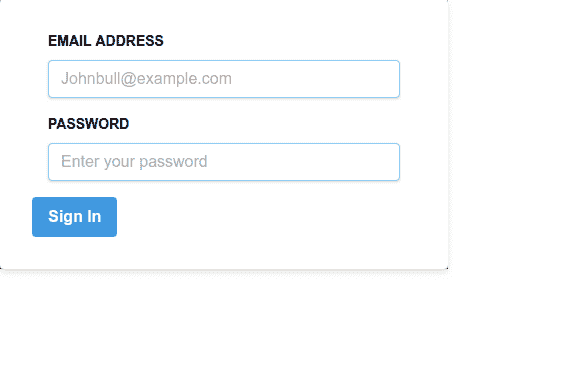

# 如何在 React 中使用 Tailwind CSS 配置创建 React App - LogRocket 博客

> 原文：<https://blog.logrocket.com/tailwind-css-configure-create-react-app/>

***编者按**:这篇顺风 CSS 和 React 教程最后一次更新是在 2021 年 2 月 19 日，以反映最新的顺风 CSS 版本带来的变化，[顺风 CSS v2.0](https://blog.tailwindcss.com/tailwindcss-v2) 。此处描述的说明和配置已相应更新。*

最近，我尝试在 React 项目中使用 Tailwind CSS，该项目由 [Create React App (CRA)](https://facebook.github.io/create-react-app/) 样板文件引导，在将 [Tailwind CSS](https://tailwindcss.com/) 设置为 CRA 抽象配置时遇到了困难。

要进行定制配置，你必须`eject`创建 React 应用程序，以获得修改配置的完全权限，这也意味着更加繁琐的设置——如果出现任何问题，你只能靠自己了。我修改了一下，在谷歌上搜索了几次后，我找到了一个更好的方法来完成这件事。

在本教程中，我们将演示如何让 Tailwind CSS 在 React 项目中工作，而不必弹出 Create React 应用程序。

要跟随本教程，您应该已经

[https://www.youtube.com/embed/pnDsP3BbXPg](https://www.youtube.com/embed/pnDsP3BbXPg)

视频

## 在 React 样板项目中使用 Tailwind CSS

首先，打开您的终端并键入以下命令来创建一个新项目。

```
#using NPX
npx create-react-app tailwindreact-app

#using NPM
npm init react-app tailwindreact-app

#using yarn 
yarn create react-app tailwindreact-app

```

是 React 的官方构建工具，用于搭建新的 React 项目。它利用了 [webpack](https://webpack.js.org/) 和 [babel](https://babeljs.io/) ，减少了配置和设置项目构建流程的麻烦，让您可以专注于编写支持应用的代码。

将`cd`添加到您的应用程序目录:

```
cd tailwindreact-app

```

接下来，安装 Tailwind 及其依赖项:

```
#using npm
npm install -D [email protected]:@tailwindcss/postcss7-compat @tailwindcss/postcss7-compat [email protected]^7 [email protected]^9

#using Yarn
yarn add [email protected]:@tailwindcss/postcss7-compat @tailwindcss/postcss7-compat [email protected]^7 [email protected]^9 -D 

```

Create React App 还不支持 PostCSS 8，所以我们会安装兼容[顺风 CSS v2](https://tailwindcss.com/docs/installation#post-css-7-compatibility-build) 的 [PostCSS 7](https://tailwindcss.com/docs/installation#post-css-7-compatibility-build) 版本。

如 PostCSS [文档](https://github.com/postcss/postcss)中所述:

> PostCSS 是一个用 JS 插件转换样式的工具。这些插件可以 lint 你的 CSS，支持变量和混合，transpile 未来的 CSS 语法，内联图像，等等。

Autoprefixer 是一个 PostCSS 插件，它解析你的 CSS 并在你编译的 CSS 规则中添加/删除不必要的厂商前缀。它可以帮助你为动画，过渡，变换，网格，flex，flexbox 等添加前缀。

## 如何配置 CRACO

由于 Create React App 默认情况下不允许覆盖 PostCSS 配置，我们需要安装 [CRACO](https://github.com/gsoft-inc/craco) 来配置 Tailwind。

```
#using npm
npm install @craco/craco

#using Yarn
yarn add @craco/craco

```

CRACO 是 Create React App configuration override 的缩写，是一个简单易懂的 Create React App 配置层。它提供了`create-react-app`和定制的所有好处，并通过在应用程序的根目录添加一个`craco.config.js`文件来定制您的 eslint、babel 和 PostCSS 配置，从而消除了“弹出”应用程序的需要。

首先，手动或使用以下命令在您的基本目录中创建一个 CRACO 配置文件:

```
touch craco.config.js

```

接下来，将`tailwindcss`和`autoprefixer`作为 PostCSS 插件添加到 CRACO 配置文件中:

```
// craco.config.js
module.exports = {
  style: {
    postcss: {
      plugins: [
        require('tailwindcss'),
        require('autoprefixer'),
      ],
    },
  },
}

```

配置您的应用程序使用`craco`来运行开发和构建脚本。

打开您的`package.json`文件，将`"scripts"`的内容替换为:

```
  "start": "craco start",
  "build": "craco build",
  "test": "craco test",
  "eject": "react-scripts eject"

```

您的脚本文件应该如下所示:

```
  "scripts": {
    "start": "craco start",
    "build": "craco build",
    "test": "craco test",
    "eject": "react-scripts eject"
}

```

创建默认配置脚手架:

```
npx tailwindcss init

```

该命令在项目的基本目录中创建一个`tailwind.config.js`。该文件包含了 Tailwind 的所有默认配置。我们还可以添加一个可选的`--full`标志来生成一个配置文件，其中包含 Tailwind 自带的所有默认设置。

您将得到一个与 Tailwind 内部使用的默认配置文件相匹配的文件。

## 在你的 CSS 中包含顺风

在你的`src`文件夹中创建一个名为`styles`的文件夹。这是你所有风格的存放地。

在该文件夹中，创建一个`tailwind.css`和一个`index.css`文件。

`index.css`文件是我们导入 tailwind 的基本样式和配置的地方。`tailwind.css`将包含`index.css`的编译输出。

## 顺风 CSS 组件、实用工具和基本样式

将以下内容添加到您的`index.css`文件中。

```
//index.css
@tailwind base;

@tailwind components;

@tailwind utilities;

```

`@tailwind`是一个顺风指令，用于注入默认`base styles`、`components`、`utilities`和定制配置。

`@tailwind base`* *注入顺风的[基础样式](https://unpkg.com/tailwindcss@2.0.3/dist/base.css)，是`[Normalize.css](https://necolas.github.io/normalize.css/)`和一些附加基础样式的组合。

注入任何组件(小的可重用样式，如按钮、表单元素等。)由你的 tailwind 配置文件中定义的插件注册的类。

在组件导入下面，您可以添加任何自定义组件类——您希望在默认实用程序之前加载这些类，以便实用程序仍然可以覆盖它们。

这里有一个例子:

```
.btn { ... }
.form-input { ... }

```

注入所有基于你的配置文件生成的 Tailwind 的工具类(包括默认的和你的工具)。

在 utilities import 下面，您可以添加任何您需要的定制实用程序，这些实用程序不是 Tailwind 自带的。

示例:

```
.bg-pattern-graph-paper { ... }

.skew-45 { ... }

```

Tailwind 在构建时交换所有这些指令，并用生成的 CSS 替换它们。

## 配置您的应用程序以构建您的 CSS 文件

要配置您的应用程序在每次运行`npm start`或`yarn start`命令时使用 CRACO 构建您的样式，请打开您的`package.json`文件并用以下内容替换`"scripts"`的内容:

```
  "scripts": {
    "build:style": "tailwind build src/styles/index.css -o src/styles/tailwind.css",
    "start": "craco start",
    "build": "craco build",
    "test": "craco test",
    "eject": "react-scripts eject"
  },

```

要将您的 CSS 导入应用程序，请打开您的`index.js`文件并导入您的顺风样式:

```
import './styles/tailwind.css';

```

删除项目根目录中的`index.css`和`app.css`文件，并分别删除`Index.js`和`App.js`文件中相应的导入语句。

您的`index.js`文件应该如下所示:

```
// index.js
import React from 'react';
import ReactDOM from 'react-dom';
import App from './App';
import reportWebVitals from './reportWebVitals';

```

删除后，它应变成:

```
//index.js
import React from 'react';
import ReactDOM from 'react-dom';
import './styles/tailwind.css';
import App from './App';
import reportWebVitals from './reportWebVitals';

```

您的`App.js`文件在删除前应该是这样的:

```
//App.js
import logo from './logo.svg';
import './App.css';

```

删除后，它应变成:

```
//App.js
import logo from './logo.svg';

```

这些更改将导致类似如下的输出:


Output in your browser after deleting your index.css and app.css

## 测试你的顺风 CSS 配置

为了测试我们的配置是否正常工作，让我们创建一个简单的登录表单。

打开您的`App.js`文件，用以下内容替换返回函数之间的内容:

```
    <section className="App h-screen w-full flex justify-center items-center bg-green-500">
      <div className="w-full max-w-md bg-gray-800" >
        <form action="" className=" bg-white shadow-md rounded px-8 py-8 pt-8">
          <div className="px-4 pb-4">
            <label htmlFor="email" className="text-sm block font-bold  pb-2">EMAIL ADDRESS</label>
            <input type="email" name="email" id="" className="shadow appearance-none border rounded w-full py-2 px-3 text-gray-700 leading-tight focus:outline-none focus:shadow-outline border-blue-300 " placeholder="[email protected]" />
          </div>
          <div className="px-4 pb-4">
            <label htmlFor="password" className="text-sm block font-bold pb-2">PASSWORD</label>
            <input type="password" name="email" id="" className="shadow appearance-none border rounded w-full py-2 px-3 text-gray-700 leading-tight focus:outline-none focus:shadow-outline border-blue-300" placeholder="Enter your password" />
          </div>
          <div>
            <button className="bg-blue-500 hover:bg-blue-700 text-white font-bold py-2 px-4 rounded focus:outline-none focus:shadow-outline" type="button">Sign In</button>
          </div>
        </form>
      </div>
    </section>

```

我们用`w-full`给出了`100%`的 paren `section`宽度。我们还用`h-screen`给了它一个`100vh`的垂直高度。然后我们给元素一个显示属性`flex`，用`justify-center`和`items-center`把它垂直和水平对齐到中心。

我们用`w-full`给孩子`div`一个`100%`的宽度，用`max-w-md`设置中等屏幕和更大屏幕的最大宽度。

我们给了这个表单一个带有`bg-white`的白色背景和一个边框半径来实现带有`border`的弯曲边框。`px-8`和`py-8`分别向`x-axis`和`y-axis`添加一个`8px`的填充，而`pt-8`向表单顶部添加一个`8px`的填充。

我们用`text-sm`给标签元素加了一个`.875rem`的`font-size`，给元素加了一个`block`的`display`，用`font-bold`把`font-weight`设为值`700`。

在 input 元素上，我们用`shadow`给元素添加了一些方框阴影，并使用`.appearance-none`来重置 input 元素上任何特定于浏览器的样式。

我们添加了一个带有`leading-tight`的`1.25`的`line-height`，并使用伪类`focus`删除了带有`focus:outline-none`的聚焦输入元素的特定于浏览器的轮廓，并添加了一点带有`focus:shadow-outline`的方框阴影。

您应该会得到类似如下的结果:



在 [CodeSandbox](https://codesandbox.io/s/tailwind-cra-b1pr9?from-embed) 上查看一个可编辑的例子。

## 结论

在这篇文章中，我们回顾了如何配置 Create React 应用程序来使用 Tailwind CSS。顺风有牛逼的[文档](https://tailwindcss.com/docs/installation/)。查看更多信息。你也可以在 [GitHub](https://github.com/Jolaolu/react-tailwind) 上访问本教程中使用的代码。

## [LogRocket](https://lp.logrocket.com/blg/react-signup-general) :全面了解您的生产 React 应用

调试 React 应用程序可能很困难，尤其是当用户遇到难以重现的问题时。如果您对监视和跟踪 Redux 状态、自动显示 JavaScript 错误以及跟踪缓慢的网络请求和组件加载时间感兴趣，

[try LogRocket](https://lp.logrocket.com/blg/react-signup-general)

.

[ ](https://lp.logrocket.com/blg/react-signup-general) [](https://lp.logrocket.com/blg/react-signup-general) 

LogRocket 结合了会话回放、产品分析和错误跟踪，使软件团队能够创建理想的 web 和移动产品体验。这对你来说意味着什么？

LogRocket 不是猜测错误发生的原因，也不是要求用户提供截图和日志转储，而是让您回放问题，就像它们发生在您自己的浏览器中一样，以快速了解哪里出错了。

不再有嘈杂的警报。智能错误跟踪允许您对问题进行分类，然后从中学习。获得有影响的用户问题的通知，而不是误报。警报越少，有用的信号越多。

LogRocket Redux 中间件包为您的用户会话增加了一层额外的可见性。LogRocket 记录 Redux 存储中的所有操作和状态。

现代化您调试 React 应用的方式— [开始免费监控](https://lp.logrocket.com/blg/react-signup-general)。