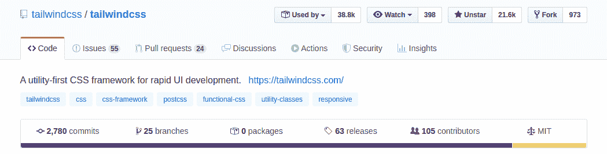
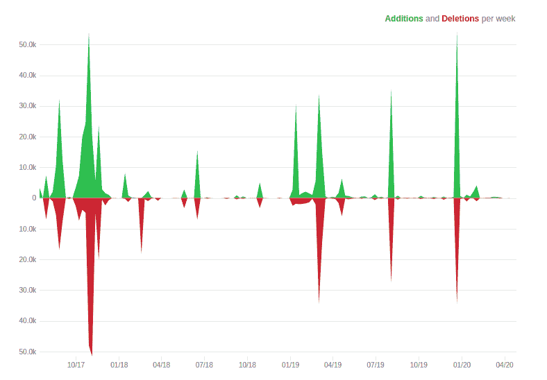
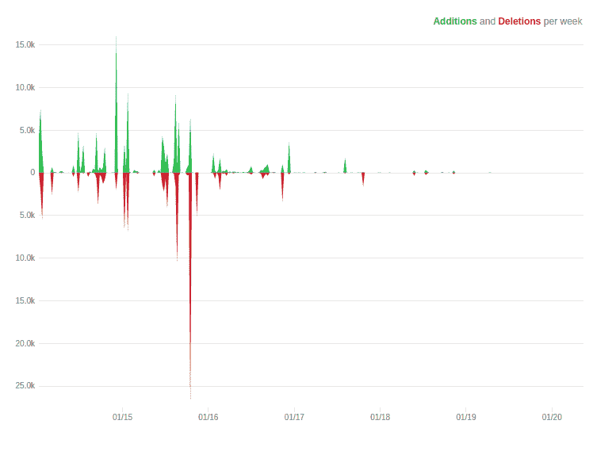

# 顺风 CSS 与超光速粒子

> 原文：<https://blog.logrocket.com/tailwindcss-vs-tachyons/>

前端开发包括设计网页的标记、风格和行为。CSS 知识是构建网站所需的最重要的技能之一，但也不是最容易掌握的技能。

> CSS 很容易。这就像骑自行车，它着火了，地面着火了，一切都着火了，因为这是地狱。

CSS 框架的开发是为了在解决跨浏览器兼容性问题的同时，使 web 内容的样式化更容易、更高效。CSS 框架已经成为一种规范，并且会一直存在下去。

在这篇文章中，我们将看看两个最流行的实用优先 CSS 框架的优缺点——TailwindCSS 和 T2 超光速粒子。

## 什么是效用至上的 CSS？

对于被认为是实用程序优先的库，这意味着它不提供预配置的样式和组件来构建，而是提供一组称为实用程序/助手类的非个性化构建块来帮助您设计组件的样式。这有助于创建自定义设计，而不必覆盖不需要的样式。

实用优先的 CSS 框架通常被称为功能性或原子性 CSS。

## 先决条件

本教程假设读者具备以下条件:

## 什么是超光速粒子？

根据[文档](https://tachyons.io/):

> 超光速粒子/ˈtæki.ɒn/或超光速粒子是一种假设的粒子，总是比光移动得更快。这个词来自希腊语αχύς或 tachys，意思是“迅速，快速，快速，迅速”。

然而，Tachyons CSS 是一个功能性的 CSS 框架，为人类设计和创建快速加载、高度可读、100%响应的界面，尽可能少使用定制的 CSS。

## 什么是顺风？

根据其[官方文件](https://tailwindcss.com/docs/what-is-tailwind):

> Tailwind CSS 是一个高度可定制的低级 CSS 框架，它为您提供了构建定制设计所需的所有构件，而没有您必须努力克服的任何恼人的固执己见的风格。

## 安装和使用

顺风粒子和超光速粒子可以通过软件包管理器安装或使用 CDN 构建在项目中使用。

### 安装和使用顺风

只需通过 CDN 引入最新的默认配置版本，就可以开始在项目中使用 Tailwind:

```
<link href="https://unpkg.com/[email protected]^1.0/dist/tailwind.min.css" rel="stylesheet">
```

注意:Tailwind CSS 的许多特性在 CDN 版本中是不可用的。为了充分利用 Tailwind，你真的应该使用一个包管理器来安装它。

## 使用包管理器

要使用纱线卷装管理器安装 Tailwind，请在终端中键入以下命令:

```
yarn add tailwindcss
```

接下来，继续创建默认配置脚手架，这有助于使用安装`tailwindcss`包时附带的 Tailwind CLI 实用程序定制您的 Tailwind 安装:

```
npx tailwind init --full
```

这个命令在你的项目的基本目录中创建一个`tailwind.js`文件，这个文件包含了 Tailwind 的所有默认配置。

接下来，创建一个`tailwind.css`文件，我们将在其中导入 Tailwind 的基本样式和配置，键入以下命令:

```
touch tailwind.css
```

使用`@tailwind`指令将 Tailwind 的`base`、`components`和`utilities`样式注入你的 CSS 中，将以下内容放入你的`tailwind.css`文件中:

```
@tailwind base;

@tailwind components;

@tailwind utilities;
```

使用 Tailwind CLI 实用工具编译和构建从 tailwind.css 文件生成的样式，运行以下命令:

```
npx tailwindcss build tailwind.css -o styles.css
```

然后继续将您的`styles.css`文件导入到您的应用程序中。或者在 JavaScript 文件中，如下所示:

```
import 'styles.css';
```

或者作为 HTML 中的链接，如下所示:

```
<link href="tailwind.css" rel="stylesheet">
```

## 安装和使用超光速粒子

要在您的项目中添加 CDN 版本，请复制下面的代码行，并将其粘贴到您想要在其中包含超光速粒子的 HTML 文件的头部:

```
<link rel="stylesheet" href="https://unpkg.com/[email protected]/css/tachyons.min.css">
```

## 使用包管理器

要使用 Yarn package manager 安装 Tachyons，请在终端中键入以下命令:

```
yarn add tachyons
```

接下来，创建一个`tachyons.css`文件，如下所示:

```
touch tachyons.css
```

复制超光速粒子缩小版的内容。该文件位于您的`tachyons.css`文件的`node_modules/tachyons/css/tachyons.min.css`处:

```
cp node_modules/tachyons/css/tachyons.min.css tachyons.css
```

然后，继续将您的`tachyons.css`文件导入您的应用程序。在您的 JavaScript 文件中:

```
import 'tachyons.css';
```

或者作为 HTML 中的链接:

```
<link href="tachyons.css" rel="stylesheet">
```

或者，我们可以通过获取所有源文件并在本地构建来安装超光速粒子。

首先，克隆源存储库:

```
git clone [email protected]:tachyons-css/tachyons.git
```

接下来，将目录更改为克隆的项目:

```
cd tachyons
```

然后继续安装必要的包并构建样式:

```
npm install && npm start
```

你应该会在`/css`目录中看到一个未缩小的和一个缩小的 CSS 文件。

## 易用性

虽然这两个库都是为了实现相似的目标，并且使用起来很简单。安装超光速粒子的过程并不简单无缝。

文档是帮助使用库的另一个因素。Tailwind 的文档非常丰富和广泛，它在向用户介绍和加入这个库方面做得很好。另一方面，对于超光速粒子，人们可能会在阅读文档后感到困惑，因为它采用了温和的方法来装载，并介绍了库的新用户。

## 社区

尽管它在超光速粒子推出近一年后推出，但 Tailwind 已经在 [GitHub](https://github.com/tailwindcss/tailwindcss) 上积累了 21.8k 颗星星，并被[38749 个储存库](https://github.com/tailwindcss/tailwindcss/network/dependents?package_id=UGFja2FnZS0zNzMwOTM5OA%3D%3D)使用，有超过 100 名贡献者，它在 NPM 上也有**73791**的每周下载量。





超光速粒子在 [GitHub](https://github.com/tachyons-css/tachyons) 上有 9.7k 颗星，有 64 个贡献者，在 NPM 上有**26384**[周下载量。](https://www.npmjs.com/package/tachyons#modify-the-source)




两个库 GitHub 的代码频率也显示了 Tailwind CSS 正在积极地工作，从而确保它与最新的标准和改进保持同步。

Tailwind 还设法围绕该工具建立了一个社区，提供了诸如[截屏](https://tailwindcss.com/screencasts/)和[其他资产](https://tailwindcss.com/resources)等资源来帮助使用该框架。顺风也被像 [Algolia](https://www.algolia.com/doc/) 和 [Mozilla](https://send.firefox.com/) 这样的大公司采用，并被用来建立像 [RightMessage](https://rightmessage.com/) 和 [PingPing](https://pingping.io/) 这样的新创业公司。

Tachyons 也收集了一些资源和教程来帮助开发这个框架，它也被一些相当大的公司使用，如 [Font Awesome](https://fontawesome.com/) 、 [NPM](https://www.npmjs.com/) 和[雨果](https://gohugo.io/)。超光速粒子也有支持者和赞助者，他们捐款支持该框架的开发。

## 尺寸和性能

当开发人员探索一个框架时，大小是他们考虑的最重要的事情之一，这也是超光速粒子擅长的一个比较。

超光速粒子的原始文件大小为 *111.7kb* ，但在缩小和压缩后为 *14kb* 。

使用默认配置，Tailwind CSS 以 78.0kb minified 和 gzipped 格式输入，原始大小为 783.5kb，并提供了一些[文件缩减策略:](https://tailwindcss.com/docs/controlling-file-size)

| 框架 | 原始尺寸 | 缩小的 | Gzip | 面包 |
| --- | --- | --- | --- | --- |
| 让我们来看看 | 111.7kb | 71.8kb | 13.4kb | 7.5kb |
| 顺风 | 783.5kb | 603.3kb | 78.0kb | 22.6kb |

使用 [CSS Stats](https://cssstats.com/) 工具，我们可以看到更多关于两个框架的缩小文件。

顺风使用 14，445 条规则和 14，505 个选择器，而超光速粒子有 2，113 条规则和 2，349 个选择器，这意味着顺风有更多的默认规则，而超光速粒子包含的规则比顺风少，也没有顺风灵活。

你可以看到更多关于[顺风](https://cssstats.com/stats/?url=https%3A%2F%2Funpkg.com%2Ftailwindcss%40%5E1.0%2Fdist%2Ftailwind.min.css)和[超光速粒子](https://cssstats.com/stats/?link=https%3A%2F%2Funpkg.com%2Ftachyons%404.10.0%2Fcss%2Ftachyons.min.css)的统计细节。

## 开发者体验

### 插件

与 Tachyons 相比，Tailwind 的一个优势是它的配置使用了 JavaScript。这给了你 JavaScript 的所有能力，并使得用第三方[插件](https://tailwindcss.com/docs/plugins/)或构建你自己的[实用程序](https://tailwindcss.com/docs/adding-new-utilities)、定制[变体](https://tailwindcss.com/docs/pseudo-class-variants)和作为插件的组件来扩展 Tailwind 的能力变得容易。

### 组件和命名

大多数现代的工作流程遵循 [DRY 原则](https://en.wikipedia.org/wiki/Don%27t_repeat_yourself)(不要重复自己)，这已经看到了对基于组件的架构的严重依赖，其中你将重复出现的代码片段提取到一个组件中。Tailwind 的基本原则之一是，您可以将可重用的实用程序类提取到一个 CSS 组件中(大型 CSS 类)。而从一组实用类中创建一个新的类被认为是超光速粒子反模式，你往往倾向于重复类。

在顺风中，一个按钮会被写成这样:

```
<button class="m-10 bg-red-300 text-white px-4 py-2 text-xs shadow-lg "> Call Phone </button>
```


像这样的超光速粒子:

```
<button class="ma4 bg-light-red white ph4 pv2 f6 shadow"> Message </button>
```


When there are multiple buttons that have this same combination of utility-classes, the recommended approach with Tailwind is to create an abstraction through the `@apply` directive, which is used for extracting components classes in your CSS file.

```
.red-btn{
  @apply m-10 bg-red-300 text-white px-4 py-2 text-xs shadow-lg
}
```

然后现在可以将`red-btn`类应用于按钮:

```
<button class-"red-btn"> Message </button>
```

对于超光速粒子，你必须重写每个按钮上的实用程序类。

Tailwind 还使用非常人性化的方法来命名类，这种方法更加明确，也更容易理解，而 Tachyons 使用非常缩写和非常短的类，尽管它有一个[详细版](https://github.com/tachyons-css/tachyons-verbose)供喜欢使用详细类名的人使用:

> Tailwind 实际上是一个基于一组插件和一个主题生成功能性 CSS 的引擎。你可以很容易地编写插件，使用超光速粒子的命名约定生成类，将它与包含超光速粒子默认值的主题文件配对，然后就产生了超光速粒子。

这使得 Tailwind 不仅仅是一组预烤的实用程序类，它是一个创建你喜欢的风格的函数式 CSS 的框架。

* * *

### 更多来自 LogRocket 的精彩文章:

* * *

## 结论

在这篇文章中，我们已经看了一些在 Tailwind 和 Tachyons 中脱颖而出的特性，我们已经看到尽管 Tachyons 具有较小的文件大小，但它以大小换取了[可定制性](https://tailwindcss.com/docs/configuration)，因为 Tailwind 更具可定制性，甚至具有更好的默认字体和色阶。

这两个框架几乎是相似的，只有一些基本的区别，主要是意识形态上的，比如定制选项、创建组件的方法和命名。

如果 CSS 2019 调查的[状态的结果是什么的话，我们可以看到对于一个仍处于版本 1 的框架来说，Tailwind 有更好的满意度和](https://2019.stateofcss.com)[相当不错的统计数据](https://2019.stateofcss.com/technologies/css-frameworks/)。

在这个比较中，Tailwind 独占鳌头，因为它提供了更好的开发人员体验，提供了定制选项，并且拥有更多资源。它甚至可以很好地帮助新接触实用优先/原子 CSS 架构的人。它应该是构建健壮的设计系统甚至任何类型的快速原型的首选。

看看这个由[约翰·波拉切克](http://johnpolacek.com/)编写的[材料集](https://johnpolacek.github.io/the-case-for-atomic-css/)，学习更多的原子/函数 CSS。这个由[做你喜欢的事情](https://github.com/dwyl/home)制作的[知识库](https://github.com/dwyl/learn-tachyons)也提供了一个学习超光速粒子的奇妙教程。Tailwind 的[文档](https://tailwindcss.com/docs)和[截屏](https://tailwindcss.com/screencasts/)足以让你入门。

你更喜欢哪一个，为什么？请在评论区告诉我你的想法，或者如果你想让我写一些其他的比较，请告诉我。

## 你的前端是否占用了用户的 CPU？

随着 web 前端变得越来越复杂，资源贪婪的特性对浏览器的要求越来越高。如果您对监控和跟踪生产环境中所有用户的客户端 CPU 使用情况、内存使用情况等感兴趣，

[try LogRocket](https://lp.logrocket.com/blg/css-signup)

.

[](https://lp.logrocket.com/blg/css-signup)[https://logrocket.com/signup/](https://lp.logrocket.com/blg/css-signup)

LogRocket 就像是网络和移动应用的 DVR，记录你的网络应用或网站上发生的一切。您可以汇总和报告关键的前端性能指标，重放用户会话和应用程序状态，记录网络请求，并自动显示所有错误，而不是猜测问题发生的原因。

现代化您调试 web 和移动应用的方式— [开始免费监控](https://lp.logrocket.com/blg/css-signup)。