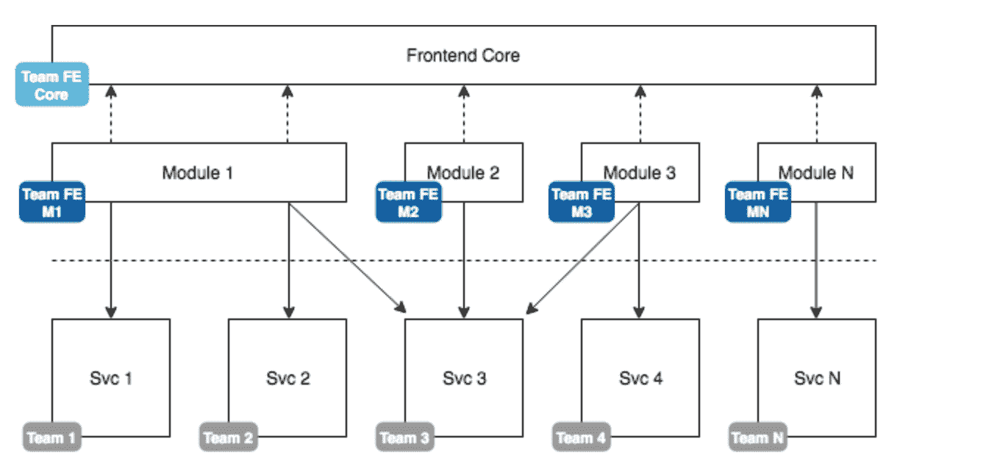
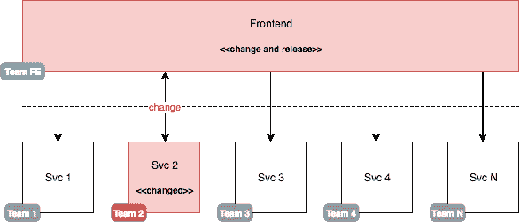
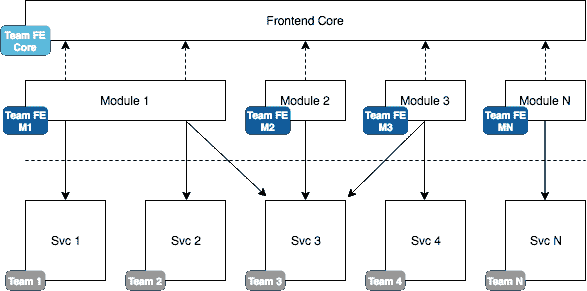
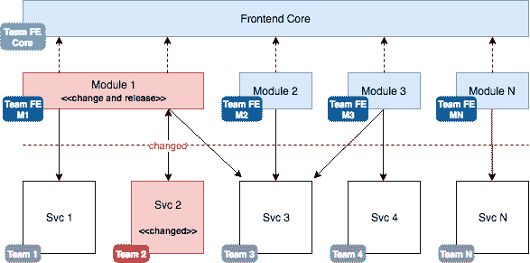
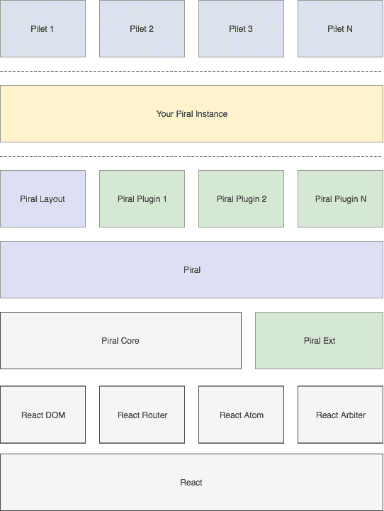
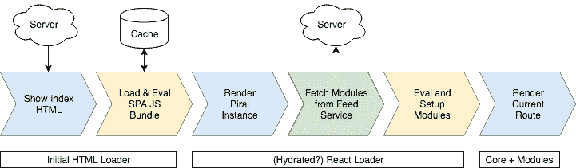

# 驯服前端 monolith - LogRocket 博客

> 原文：<https://blog.logrocket.com/taming-the-front-end-monolith-dbaede402c39/>



虽然较大的后端系统通常按照职责划分成我们称之为(微)服务的部分，但是使用这些服务的客户机仍然是一个整体。就调试和一致性而言，这显然提供了一些优势，否则，这种知识的集中似乎是低效和不可维护的。在这篇文章中，我将尝试用一个特别适合我称之为“类门户应用程序”的解决方案来解决这个问题。

类似门户的应用程序是为用户提供一组通常不相关的功能的客户端。这一组就是我所说的模块。这些模块共享某种理念(例如，在工作空间领域，UX 原则等等)，并且可以提供彼此之间的集成点。

一个(坦率地说，相当大的)类似门户的应用程序的例子是 Microsoft Office。这里的模块是 Word、Excel 等……，它们共享一个通用的设计，都在办公应用空间中。Word 丰富的文本编辑体验可以在许多其他模块中找到，而 Excel 对表格的处理也可以很容易地重用。

一般来说，提供某种插件系统(例如，Visual Studio 代码)的应用程序可以被视为类似门户的应用程序。最后，这完全取决于“基础层”(应用程序本身)为运行时集成的不同模块提供了什么样的功能。

[](https://logrocket.com/signup/)

### 问题描述

前端整体是一个常见的问题，尤其是在企业应用程序中。虽然目前后端架构通常被设计成模块化的，但是前端仍然是在单个代码库中开发的。换句话说，虽然后端在职责和知识方面被很好地分割了，但是前端仍然是一个巨大的整体，需要关于整个后端的知识。更糟糕的是，单个后端服务的变化可能需要一个新版本的前端变化。


Original monolithic frontend accessing multiple backend services

结果，前端成为瓶颈，因为它最终变得太难维护，太快过时，并且有太多的组件。

在上图中，我们可以很容易地在前端和服务之间插入 API 网关或其他层。最终，这样的细节不会改变大局。

这种架构存在问题有多种原因。对我个人来说，这种架构不是最佳的最重要的原因之一是依赖性问题。后端的任何更改都会直接传播到客户端。

让我们再次看看我们的图表，看看这个问题:



Service change propagation impact on a monolithic frontend

如果我们消费的后端服务中有一个(突破性的)变更，我们需要将这个变更传播到客户端。这意味着反映相同的变更(可能在多个组件中，这可能或多或少有些乏味)并创建另一个版本。更糟糕的是，在多环境开发中(例如，有一个 stage 和一个 production environment ),我们的客户端现在可能只与 stage 兼容，但在相应的后端服务投入生产之前，它不能用于生产。

这种方法的另一个问题是知识的集中。前端团队要么需要很大，要么只由超级明星组成，他们可以处理整个后端知识。这个团队需要做的最后一件事是与各种后端团队保持联系，以确保任何更改都反映在客户端。

### 解决方案架构

理想情况下，我们的前端遵循与后端相似的方法。当我们按照职责划分服务时，我们应该按照用户功能划分前端。这看起来就像下面的架构图显示的一样简单:



Modularized frontend with independent modules accessing only relevant backend services

我们创建的前端模块可能依赖于任何数量的后端服务。虽然在服务消费方面可能会有重叠，但通常我们是通过在 UI 方面公开特定服务的功能来驱动的。前端模块由前端核心(“门户”)在运行时使用。

作为这种架构的结果，后端服务的改变具有小得多的影响:



Service changes only impact the modules consuming the particular service

拥有多个环境并不重要，因为核心层和所有其他模块都不会受到影响。因此，服务可以保留在阶段中，而所有其他模块仍然可以看到新的功能和其他更新。一旦服务部署到生产环境中，我们只需在生产环境中部署相应的前端模块。整个过程是由特性标志推动的，我们将在本文后面看到。

在这样的架构中，职责也非常明确，前端核心只负责应用程序的技术/非功能方面。在这里，我们将负责认证、API 请求、模块间的通信、通知和对话管理、websocket 连接、缓存和应用程序的整体设计(也称为布局)。

这些模块特别关注功能方面。一个模块负责允许用户做特定的事情。在这里(使用给定的布局),我们将指定页面内容的呈现，或者我们需要与哪种 API /服务对话来获取特定于领域的数据。

### 参考实现

对于这样的实现，我们需要多个细节。还有其他一些细节可能很方便，但不是实现这种架构所必需的。让我们先来看看我们确实需要什么:

1.  前端模块的规范(显然它们都需要相同的形状)
2.  允许下载可用模块的后端服务
3.  能够在运行时下载/使用模块的前端应用程序
4.  模块可以用来显示数据的前端 API

就第一点而言，我们需要两个规范，一个用于客户端使用的 API，另一个用于确保我们的后端服务可以成功读取和公开模块。这里我们将只关注 API 方面的内容。

一个自然的选择是假设每个模块都有一个声明，可以这样键入:

```
interface ModuleMetadata {
  /**
   * The name of the module, i.e., the package id.
   */
  name: string;
  /**
   * The version of the module. Should be semantically versioned.
   */
  version: string;
  /**
   * The functional content of the module.
   */
  content: string;
}
```

我们还可以在这里包括更多内容(例如，依赖关系、散列等)。最值得注意的是，`content`字段将包含需要评估的(JavaScript)代码。(关于 JavaScript 需要如何构建的详细信息，请参见下文。)

关于上面列出的第二点(允许下载可用模块的后端服务)，我们可以编写一个简单的服务，例如，消费 NPM 包的 feed(像官方的*npmjs.org*feed)，并通过将 *package.json* 的(部分)与在 *main* 字段中引用的 JavaScript 绑定来组合找到的包。

* * *

### 更多来自 LogRocket 的精彩文章:

* * *

我们需要记住的是:

*   提供的 JS 不应该由多个文件组成，而是已经被捆绑
*   给定的包需要以(UMD)库的形式公开
*   该库必须包含一个函数(可以是`main`、`install`、`setup`、…)，该函数用作核心层的设置点
*   捆绑包不应包含任何重复的依赖关系，即，对核心层中已经可用的内容使用对等依赖关系(例如，如果我们创建 React SPA，则使用 React)

捆绑模块可能简单到:

```
const React = require('react');

// Note: left JSX for readability, normally this already
// uses React.createElement and is properly minified.
const MyPage = props => (
  <div>Hello from my page!</div>
);

module.exports = {
  setup(app) {
    // Sample API, may look completely different
    app.registerPage('/my-route', MyPage);
  },
};
```

在我们的应用程序中评估这样一个模块(以字符串的形式出现)可以使用如下函数来完成(为了可读性，使用了 TypeScript 注释):

```
function evalModule(name: string, content: string, dependencies: DependencyMap = {}) {
  const mod = {
    exports: {},
  };
  const require = (moduleName: string) => dependencies[moduleName] || 
    console.error(`Cannot find module "${moduleName}" (required by ${name})`, dependencies);

  try {
    const importer = new Function('module', 'exports', 'require', content);
    importer(mod, mod.exports, require);
  } catch (e) {
    console.error(`Error while evaluating module "${name}".`, e);
  }

  return mod.exports;
}
```

如前所述，这些模块也可以在预先评估的情况下缓存或发送。给定的`evalModule`函数支持 UMD 模块，但不支持源地图(即零)。考虑到这些源地图不会泄漏到产品中，我们可以接受，否则，其他技术似乎是必要的。

一般来说，运行时下载是非常重要的。运行时间可能意味着两件事:

*   我们的服务器端渲染知道这个架构，自动消费/更新这些模块；在向用户提供页面时已经集成了它们
*   我们的服务器端呈现服务于单页面应用程序(SPA ),它从后端的另一个服务中获取模块

这两种方法并不排斥。理想情况下，这两种方法都可以实现。然而，为了简单起见，我们在这里将集中讨论 SPA 方法。

对于 SPA 来说，模块的下载可以简单到对一些后端 API 进行`fetch`调用。这样我们就有了上面列出的第四个需求，即我们应该有一个合适的前端 API。我们已经在上面给出的示例模块中看到了这样的 API(以`app`参数的形式)。显然，有两种方法可以创建这样的集成点:

*   提供一个 API，并使用 API 中提供的方法执行所有设置步骤
*   仅向对象提供信息，并依赖调用方法的结果

后者更具描述性和“纯粹性”，然而，从长远来看是有限的。如果一个模块想在运行时添加(或删除)功能，该怎么办？根据用户输入，可以显示本来不应该是路由过程的一部分的某些东西(例如，某个页面)。由于前一种方法更有效，我们将采用这种方法。

对于每个导入的模块，我们只需创建一个对象来保存模块要访问的所有函数。这是我们传递的对象。我们为每个模块创建一个专用对象来保护 API，并且不允许一个模块的任何更改影响另一个模块。

我在 React 中以一个名为 [React Arbiter](https://github.com/FlorianRappl/react-arbiter) 的小库的形式绘制了整个过程。它允许在运行时“召回”模块，并提供进一步的工具，例如，将注册的组件放置在“静态字段”中，以确保没有任何东西破坏我们的应用程序。

模块化前端为我们提供的优势之一是可以对模块进行特征标记。这样，只有可以执行的代码才会被下载。此外，由于我们的前端是从这些模块中隐式构建的，因此不会显示任何被阻止的功能。根据定义，我们的前端是一致的。

### 示例项目

在 [GitHub](https://github.com/FlorianRappl/portal-sample) 上有一个示例项目。该示例显示了四件事:

*   从服务器加载模块(这里称为*小部件*)
*   (一个非常幼稚的实现)模块的特征标记
*   不同模块之间的相互作用
*   门户的框架无关实现(能够显示 React、Angular 等的模块)

请记住，给定的存储库仅用于演示目的。没有真正的设计，API 不可伸缩，不同模块的开发过程并不顺利。

尽管如此，这篇文章的基本思想当然也包含在这个玩具项目中。通过编辑 *features.json* 文件可以切换特性标志，我们可以看到数据是如何从一个模块流向另一个模块的。最后，这个项目也是试验新颖 API 或高级主题(如服务器端呈现)的良好起点。

### 盒子里的一切——皮拉尔

如果我们喜欢这里展示的概念，但我们不愿意(或不能)投入时间来实现所有不同的部分，我们可以退回到最近发布的开源解决方案: [Piral](https://github.com/smapiot/piral) 为我们提供了本文描述的所有前端部分。

Piral 的堆栈实际上非常简单。`piral-core`库与一些重要的 React 库(DOM、router 和 React 本身)有对等依赖关系。用于状态管理的`react-atom`被设置。模块管理留给前面提到的`react-arbiter`库。

在`piral-core`之上可能会放置其他的包，比如一个更加固执己见的版本，它以`piral-ext`的形式包含了一组 API 扩展和标准设计(例如，用于仪表板、错误屏幕等等)。长期愿景是不仅提供一些可供选择的布局，还提供可能对门户层有帮助的插件(例如，提供 PWA 功能、身份验证提供者等)。



Building blocks of an app using Piral (“Piral Instance”)

有了 Piral，我们要么采用(或创建)一个标准模板，要么只是推出我们自己的页面设计。这很简单，就像这样写:

```
import * as React from 'react';
import { render } from 'react-dom';
import { createInstance } from 'piral-core';

const App = createInstance({
  requestModules: () => fetch('https://feed.piral.io/sample'),
});

const Layout = props => (
  // ...
);

render((
  <App>
    {content => <Layout>{content}</Layout>}
  </App>
), document.querySelector('#app'));
```

其中`Layout`是我们创建的布局组件。对于任何严肃的实现，我们都需要一个适当的模块提要，比如上面看到的样例提要。皮拉尔称这些模块为*堆*。

使用给定的代码，我们将结束一个非常接近下图所示的加载过程:



Initial rendering pipeline for an app using Piral

Piral 允许我们水合原始 HTML 页面，以避免一些重新渲染。我们可以用它来设计一个在初始 HTML 视图和基于 React 的呈现之间持久的加载器呈现(也就是说，不会改变或丢弃任何东西)。

除了前面描述的需求，Piral 还给出了一些好的概念，比如扩展插槽(本质上是一种在另一个模块中呈现/处理来自一个模块的内容的机制)、共享数据、事件调度等等。

### 结论

模块化我们的客户端是必要的，以跟上不断变化的后端，并有效地将知识分配给多个个人或团队。模块化前端有其自身的挑战(如部署、工具、调试)，这就是依赖现有工具和库如此重要的原因。

最后，这个想法非常简单，编写在运行时加载/评估的松散耦合的库，而不需要对应用程序本身进行任何重新部署。

你认为给定的方法有好处吗？你在哪里看到它的光芒，你会做出什么不同？在评论里告诉我们吧！

## [LogRocket](https://lp.logrocket.com/blg/react-signup-general) :全面了解您的生产 React 应用

调试 React 应用程序可能很困难，尤其是当用户遇到难以重现的问题时。如果您对监视和跟踪 Redux 状态、自动显示 JavaScript 错误以及跟踪缓慢的网络请求和组件加载时间感兴趣，

[try LogRocket](https://lp.logrocket.com/blg/react-signup-general)

.

[ ](https://lp.logrocket.com/blg/react-signup-general) [](https://lp.logrocket.com/blg/react-signup-general) 

LogRocket 结合了会话回放、产品分析和错误跟踪，使软件团队能够创建理想的 web 和移动产品体验。这对你来说意味着什么？

LogRocket 不是猜测错误发生的原因，也不是要求用户提供截图和日志转储，而是让您回放问题，就像它们发生在您自己的浏览器中一样，以快速了解哪里出错了。

不再有嘈杂的警报。智能错误跟踪允许您对问题进行分类，然后从中学习。获得有影响的用户问题的通知，而不是误报。警报越少，有用的信号越多。

LogRocket Redux 中间件包为您的用户会话增加了一层额外的可见性。LogRocket 记录 Redux 存储中的所有操作和状态。

现代化您调试 React 应用的方式— [开始免费监控](https://lp.logrocket.com/blg/react-signup-general)。