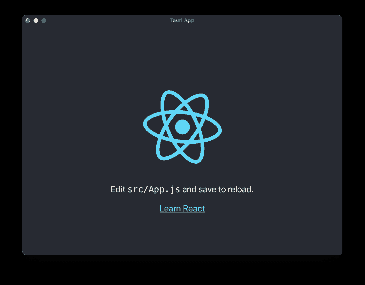

# Tauri vs. Electron:比较、操作和迁移指南

> 原文：<https://blog.logrocket.com/tauri-electron-comparison-migration-guide/>

九年前，Electron 团队引入了一个框架，允许我们用基本的 HTML、CSS 和 JavaScript 知识快速构建桌面应用程序，从而彻底改变了我们创建桌面应用程序的方式。除了有效的批评，Electron 完成了工作，我们已经看到许多公司使用它，包括 Slack、WhatsApp(桌面)，甚至是开发人员社区最喜欢的文本编辑器 VS Code。然而，最近 Tauri 作为电子的替代品被引入。

在本文中，我们将探索 Tauri，一个新的闪亮的桌面应用程序框架。我们将了解如何开始使用它，它是如何工作的，它与 electronic 的比较，以及将现有的 electronic 项目迁移到 Tauri 会是什么样子。

以下是我们将详细介绍的内容:

## Tauri 是什么？

Tauri 是一个相对较新的框架，允许您通过利用基本的 web 技术以及 Rust 编程语言来快速创建跨平台的应用程序。

Tauri 构建于 Rust 之上，设计上安全且高性能，兼容任何前端框架，并允许您为所有主要桌面平台创建可执行的应用程序，包括 macOS、Windows 和 Linux 操作系统。

### Tauri 是如何工作的

每个 Tauri 应用程序都包含一个核心进程，作为应用程序的入口点，并且是唯一可以完全访问操作系统的组件。然而，核心进程并不呈现实际的应用程序界面；相反，它启动使用操作系统提供的 WebView 库的子流程，使得使用 web 技术构建 Tauri 应用成为可能。

与使用 Chromium 引擎打包和呈现应用程序而不考虑底层操作系统的 Electron 不同，Tauri 使用操作系统的 WebView 库。Tauri 方法的优势在于 WebView 库不包含在最终的可执行文件中，而是在运行时动态链接，这大大降低了捆绑应用的大小和性能。

### Tauri pros

如前所述，Tauri 应用程序比电子应用程序轻得多，因为它们采用了 webview 方法。事实上，一个用 Electron 构建的重量超过 52MB 的示例应用程序，在 3MB 周围，用 Tauri 构建时会轻得多。

Tauri 框架的其他一些主要优势包括:

*   更好的性能:在性能、启动时间和内存消耗方面，Tauri 应用也优于 Electron 应用
*   自我更新:Tauri 包含一个自我更新特性，您可以快速地将它集成到您的应用程序中，而无需依赖任何第三方库
*   跨平台:当然，您可以为所有主流桌面操作系统生成可执行文件

### Tauri 的主要缺点

*   浏览器兼容性:Tauri 的一个主要缺点是你必须担心浏览器的兼容性。有些 web APIs 适用于 macOS WebView，但可能不适用于 Windows，反之亦然。此外，web 元素(如输入、按钮等)的设计会因操作系统 WebView 的不同而略有不同。你需要记住这些不同之处
*   资源和生态系统:Tauri 仍然很新，它的资源和生态系统也是如此。不像你可以快速找到插件和 StackOverflow 对大多数电子问题的答案，Tauri 还没有。然而，这无疑将在未来改变
*   铁锈知识:当与 Tauri 一起工作时，你在大多数情况下不需要铁锈。然而，当你深入到更高级的东西时，你可能不得不学习它，例如，如果 Tauri 的 JavaScript 插件不支持 Rust，你就不得不用 Rust 进行更高级的操作系统调用

## 创建 Tauri 应用程序

在开始创建 Tauri 应用程序之前，您必须首先安装一些必备的依赖项/包，最主要的是 Windows 上的 Microsoft Visual Studio c++ build tools 和 WebView 2，macOS 的 CLang 和 Xcode 开发依赖项，以及 Rust without OS。你可以在他们的[先决条件页面](https://tauri.app/v1/guides/getting-started/prerequisites)上找到如何设置所有这些的说明(也包括不同 Linux 发行版的说明)。

安装完所有必备组件后，您可以使用以下组件创建一个新的 Tauri 应用程序:

```
npm create tauri-app
```

运行该命令将要求您选择应用程序名称、窗口名称和首选方法，即，您是否更喜欢使用基本的 HTML、CSS 和 JavaScript 或其他 JavaScript 框架，如 React、Vue 和 Svelte。为了这个教程，我们将使用**create-react-app**>**create-react-app(JavaScript)**的方法。

该过程完成后，您可以使用以下命令运行该应用程序:

```
npm run tauri dev
```

第一次运行这个命令需要几秒钟的时间，完成后，您应该会看到新的桌面应用程序在一个新窗口中弹出，如下图所示:



当然，还支持热重载，这意味着我们可以对代码进行更改，这些更改会立即反映在我们的应用程序中。

### 文件结构

如果在您喜欢的文本编辑器中打开新的应用程序文件夹，您应该会看到以下文件和目录:


`/public`和`/src`目录是 React 的默认目录。这里相当新的是`/src-tauri`文件夹。让我们快速浏览一下这个目录中的重要文件:

*   这个 rust 文件是我们的 Tauri 应用程序的入口点；它基本上包含了引导我们应用程序的代码。在这里，我们还可以包含自定义的 Rust 函数，我们可以通过 JavaScript 直接调用这些函数，我们将在后面看到
*   `Cargo.toml` —这个文件类似于 PWA `manifest.json`，包含我们的应用程序的元数据
*   `target/` —运行构建命令后，该文件夹将包含我们的应用程序可执行文件
*   tauri.conf.json —该文件允许您配置和自定义 tauri 应用程序的各个方面，例如应用程序的名称和允许的 API 列表

### 生锈？

是的。除了运行普通的 web 相关(HTML、CSS 和 JavaScript)代码，Tauri 还提供了一个有用的特性，叫做**命令**。它基本上允许您创建定制的 Rust 函数，并通过 JavaScript 调用它们。如果您需要处理繁重的处理任务，或者在性能更高的 Rust 代码中进行操作系统调用，这将非常有用。

为了开始使用这个特性，我们需要在用`#[tauri::command]`注释的同时在`src-tauri/src/main.rs`文件中定义我们的函数。这里有一个例子:

```
#[tauri::command]
fn sample_command() {
  println!("Rust code invoked from JavaScript!");
}
```

之后，我们将提供我们在 builder 函数中创建的所有命令的列表，如下所示:

```
fn main() {
  tauri::Builder::default()
    // Commands list here 👇
    .invoke_handler(tauri::generate_handler![sample_command])
    .run(tauri::generate_context!())
    .expect("error while running tauri application");
}
```

有了这些，我们的`main.rs`文件的完整代码应该是这样的；

```
#![cfg_attr(
  all(not(debug_assertions), target_os = "windows"),
  windows_subsystem = "windows"
)]

#[tauri::command]
fn sample_command() {
  println!("Rust code invoked from JavaScript!");
}

fn main() {
  tauri::Builder::default()
  // Commands list here 
  .invoke_handler(tauri::generate_handler![sample_command])
    .run(tauri::generate_context!())
    .expect("error while running tauri application");
}
```

现在，我们可以简单地通过使用 Tauri 的内置`invoke()`函数调用这个函数，如下所示:

```
import { invoke } from "@tauri-apps/api/tauri";
invoke("sample_command");
```

在我们的项目中运行这段代码后，我们应该会看到输出“Rust code invoked from JavaScript！”印在我们的控制台上。

命令特性允许您做更多的事情，比如传递参数、运行异步信任函数、管理状态等等。关于 [Tauri 命令功能的更多信息可以在这里找到](https://tauri.app/v1/guides/features/command)。

### 桌面 API

Tauri 包括访问桌面功能的方法，比如文件系统、剪贴板、对话框、shell 等等，您可以在应用程序中的任何地方轻松地导入和使用这些功能。下面是一个如何使用剪贴板的`writeText()`方法复制文本的例子:

```
import { writeText } from "@tauri-apps/api/clipboard";

const copyToClipboard = async () => {
  await writeText("Sample Text");
};
```

如果您也熟悉 Rust 编程语言，您可以编写自定义的 Rust 方法，调用操作系统函数并通过 JavaScript 调用它们，就像我们前面所做的那样。

### 构建应用程序

将 Tauri 项目打包成一个独立的桌面应用程序相当简单，但是首先，您需要将`tauri.config.json`文件中的`tauri.bundle.identifier`从`com.tauri.dev`更改为您喜欢的惟一标识符。之后，您可以通过运行以下命令继续操作:

```
npm run tauri build
```

运行`build`命令，Tauri 将自动检测你的操作系统，并相应地生成独立的可执行应用。

## 从电子迁移

将现有电子项目的基本用户界面迁移到 Tauri 应该相当简单。当您需要开始使用桌面 API、窗口和菜单时，复杂性就会出现。但是，让我们快速比较一下差异，以便简化迁移过程。

一个电子项目的入口点是主脚本文件(例如，`main.js`)，它通常包含一个`BrowserWindow()`函数，负责加载静态 web 页面并将其呈现为桌面应用程序。并且在这个相同的功能中，你还能够自定义桌面的默认选项，比如它的默认大小、位置、可选样式，以及自定义事件。

在 Tauri 的例子中，虽然 app 入口点是`src/main.rs file`，但是上面提到的所有等效定制都可以在`[tauri.conf.json](https://tauri.app/v1/api/config)`文件中完成。

为了跨应用程序异步通信，Electron 包括一个用于发出和处理定制事件的`ipcMain`模块。Tauri 中的对应模块是[事件模块](https://tauri.app/v1/api/js/modules/event/#listen)，它使用起来也非常简单。

最后，桌面 API 的使用和集成在两个库中也是相似的，并且可以从各自的文档页面中快速提取出来。

* * *

### 更多来自 LogRocket 的精彩文章:

* * *

## 结论

这篇文章介绍了 Tauri 的基本原理，它与 Electron 的工作原理相比是如何工作的，如何开始使用它，以及如何迁移现有的 Electron 项目的指南。

Tauri 仍处于早期阶段，但它已经提供了许多令人惊叹的功能，甚至更多功能正在开发中，例如支持为所有主流移动操作系统捆绑二进制文件。

你认为 Tauri 会是一个电子杀手吗？下面听听大家的想法。

感谢阅读！

## 使用 [LogRocket](https://lp.logrocket.com/blg/signup) 消除传统错误报告的干扰

[](https://lp.logrocket.com/blg/signup)

[LogRocket](https://lp.logrocket.com/blg/signup) 是一个数字体验分析解决方案，它可以保护您免受数百个假阳性错误警报的影响，只针对几个真正重要的项目。LogRocket 会告诉您应用程序中实际影响用户的最具影响力的 bug 和 UX 问题。

然后，使用具有深层技术遥测的会话重放来确切地查看用户看到了什么以及是什么导致了问题，就像你在他们身后看一样。

LogRocket 自动聚合客户端错误、JS 异常、前端性能指标和用户交互。然后 LogRocket 使用机器学习来告诉你哪些问题正在影响大多数用户，并提供你需要修复它的上下文。

关注重要的 bug—[今天就试试 LogRocket】。](https://lp.logrocket.com/blg/signup-issue-free)