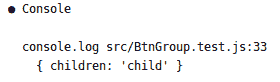
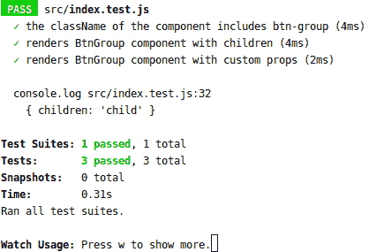
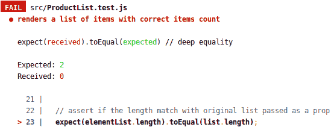
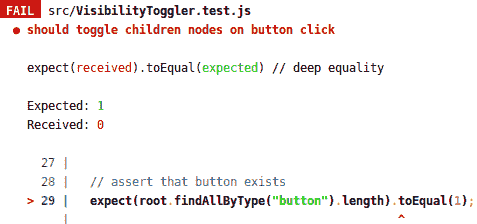
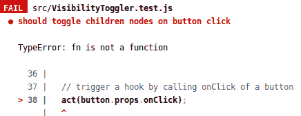
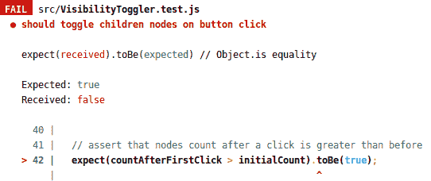
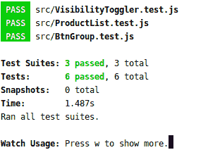

# 带有 React 测试呈现器的 TDD

> 原文：<https://blog.logrocket.com/tdd-with-react-test-renderer/>

众所周知，酶已经成为 React 组件测试的事实标准，但是还有其他好的选择。

例如:React 测试渲染器。

我个人喜欢测试渲染器，因为它的工作方式:它将 React 组件渲染成易于使用和理解的纯 JavaScript 对象。

React 测试渲染器的另一个优点是它由脸书的核心团队维护，并且总是最新的。

React 测试渲染器有很棒的文档，我就不赘述了。相反，我想用一个测试驱动开发(TDD)方法的例子来说明一些最常见的用例。

## 设置

测试渲染器有一个非常简单的设置过程——只需安装 lib，您就可以开始了:

```
npm install --save-dev react-test-renderer
```

通常，我们需要一个组件来开始编写测试，但是 React Test Renderer 使我们能够在组件实现之前编写测试。

> **注意:**这样做的原因是，当你测试函数时，TDD 的工作就像一种魅力，所以考虑到大多数 React 组件都是纯功能组件，TDD 在这里应用得非常好，特别是与 React 测试渲染器一起。
> 
> 有时，在复杂逻辑的情况下，从测试开始编写组件甚至更快，因为您需要更少的迭代和调试。

让我们考虑一个简单组件的要求:

*   它需要一个类`btn-group`
*   它应该能够呈现它的孩子

## 测试`className`

首先，我们需要测试一个空组件的类(就像我们遵循 TDD 一样):

```
import React from "react";
  // [ 1 ] import the React Test Renderer
  import { create } from "react-test-renderer";

  const BtnGroup = () => null;

  test("the className of the component includes btn-group", () => {
    // [ 2 ] boilerplate code
    const root = create(<BtnGroup />).root;

    // [ 3 ] query for element
    const element = root.findByType("div");

    // [ 4 ] assert that className to include btn-group
    expect(element.props.className.includes("btn-group")).toBe(true);
  });
```

测试有三个步骤:测试实例创建、元素查询和断言。

现在让我们跳过更深入的解释，专注于修复测试。起初，它会打破(如预期的那样):

```
No instances found with node type: "undefined"
```

这意味着我们需要添加某种类型的节点。在我们的例子中，类型应该是`<div>`:

```
const BtnGroup = () => <div />;
```

一旦我们更改了代码，文件监视器再次运行测试，我们会收到一条更新的消息:

```
expect(received).toEqual(expected) // deep equality

Expected: "btn-group"
Received: undefined
```

我们已经断言。为了通过第一个测试，我们现在需要做的就是添加一个`className`道具:

```
const BtnGroup = () => <div className="btn-group" />;
```

这一改变之后，我们将看到有益的绿色信息:


一旦测试通过，我们就可以放慢速度，一行一行地重新检查测试代码。下面是代码:

```
import React from "react";
  // [ 1 ] import the React Test Renderer
  import { create } from "react-test-renderer";

  const BtnGroup = () => null;

  test("the className of the component includes btn-group", () => {
    // [ 2 ] boilerplate code
    const root = create(<BtnGroup />).root;

    // [ 3 ] query for element
    const element = root.findByType("div");

    // [ 4 ] assert that className to include btn-group
    expect(element.props.className.includes("btn-group")).toBe(true);
  });
```

[ 1 ]测试渲染器只有一种创建组件的方法，即`create`方法，所以只需导入并使用它。

[ 2 ]创建组件时，获取测试实例是 React 测试呈现器的标准样板代码。

[ 3 ]在测试渲染器中查询元素主要有两种方式:按类型和按属性。当周围没有其他容器时，我更喜欢按类型查询，就像当前的例子一样。稍后我们将讨论其他方法。

[ 4 ]这个断言是不言自明的；只要检查一下`className` prop 值是否包含`btn-group`就可以了。

## 测试儿童

让我们继续向已有的`BtnGroup`组件添加功能，因为我们知道我们需要满足以下要求:

它应该能够呈现它的孩子。

测试`children`道具非常简单。我们只需要确保传递的值与呈现的结果相匹配:

```
import React from "react";
import { create } from "react-test-renderer";

const BtnGroup = () => <div className="btn-group" />;

test("renders BtnGroup component with children", () => {
  // [ 6 ] child text
  const text = "child";

  // boilerplate code, already mentioned in [ 2 - 3 ] above
  const instance = create(<BtnGroup>{text}</BtnGroup>).root;

  // query for element
  const element = instance.findByType("div");

  // assert child to match text passed
  expect(element.props.children).toEqual(text);
  });
```

[ 6 ]我们传递给组件的值和我们用来断言它的值应该是相同的。

由于我们使用的是 TDD，您可能认为测试会在这里中断。然而，React 支持将子组件传递给开箱即用的组件，因此我们的测试将是绿色的。

如果您想知道测试是否成功运行，您可以用 console.log 打印元素值。

输出如下所示:



## 测试任何道具

让我们继续为我们的组件添加要求:它应该呈现任何通过的道具。

这里有一个测试:

```
import React from "react";
  import { create } from "react-test-renderer";

  // the component is still not updated as we use TDD
  const BtnGroup = () => <div className="btn-group" />;

  test("renders BtnGroup component with custom props", () => {
    // generate some custom props
    const props = { id: "awesome-button-id", className: "mb-3", children: "child" };

    // boilerplate code
    const instance = create(<BtnGroup {...props} />).root;

    // get element by component name
    const element = instance.findByType("div");

    // assert if an additional className was added to existing one
    expect(element.props.className).toEqual("btn-group mb-3");
    // assert "id" prop to match passed one
    expect(element.props.id).toEqual(props.id);
    // assert "children" to match passed
    expect(element.props.children).toEqual(children);
  });
```

测试的代码看起来已经很熟悉了；我们只是检查传递的属性值是否匹配。

现在，测试将中断并发出以下消息:

```
Expected: "btn-group mb-3"
Received: "btn-group"
```

现在发生的是，我们需要真正开始传递道具。否则，`btn-group`将一直存在:

```
const BtnGroup = props => <div className="btn-group" {...props} />;
```

这就是测试派上用场的地方。我们有另一条消息告诉我们,`className`的情况很特殊:

```
Expected: "btn-group mb-3"
Received: "mb-3"
```

现在，传递的道具替换了我们组件已经有的道具；在我们的例子中，`btn-group`被替换为`mb-3`。

我们应该修改组件的代码来解决这个问题，这样它就能以不同的方式处理`className`:

```
const BtnGroup = ({className = "", ...rest}) =>
    <div {...rest} className={`btn-group ${className}`} />;
```

这里的技巧是析构道具，这样需要特殊处理的物品就有了它们的名字，所有其他道具都合并到一个`rest`对象中。

同样，`children` prop 不需要特殊的方法，尽管它们现在作为一个常规的 prop 被传递，而不是在组件的主体中。

现在，测试应该又变绿了。所有以前编写的测试也将是绿色的:



> **注意:**我在这里留了一个`console.log`来展示你如何随时检查输出。

如您所见，我们所做的所有断言——就目前而言——只是检查字符串是否匹配。但是如果需要检查项目的数量，我们可以在测试渲染器中使用这个方便的方法:`testInstance.findAllByType()`。

让我们看看它是如何工作的。

## 测试项目数量

为了演示如何在 React 测试渲染器中计数项目，我们应该有一些组件来渲染数组或列表。因此，要求是组件应该呈现一个具有正确项目计数的列表。

为了遵循 TDD，我们将从一个呈现空`ul`标签的空功能组件开始:

```
const ProductList = ({ list }) => <ul />;
```

我们可以写一个测试:

```
import React from "react";
  import { create } from "react-test-renderer";

  test("renders a list of items with correct items count", () => {
    // prepare the list for testing
    const list = [{ id: 1, text: "first item" }, { id: 2, text: "second item" }];

    // boilerplate code
    const root = create(<ProductList list={list} />).root;

    // [ 7 ] get list items
    const elementList = root.findAllByType("li");

    // assert if the length match with original list passed as a prop
    expect(elementList.length).toEqual(list.length);
  });
```

该测试的目标是检查渲染节点的数量是否等于传递的项目的数量。

最初，测试将中断，并显示以下消息:



为了修复测试，我们应该在容器中呈现带有`li`标签的列表项:

```
const ProductList = ({ list }) => <ul>
    {list.map(li => <li key={li.id}>{li.text}</li>)}
</ul>;
```

现在测试是绿色的，我们可以讨论代码了。

[ 7 ]为了专门查询类型为`li`的节点，我使用了返回所有标签为`li`的元素的`testInstance.findAllByType()`方法。

也有一些其他的方法来搜索多个项目:`testInstance.findAll()`和`testInstance.findAllByProps()`。当您需要检查总数时，第一种方法很有用，而当您想要计算特定属性时，第二种方法很方便，例如，所有具有特定`className`的节点。

## 测试文本

在大多数情况下，只测试项目数量是不够的，您还需要测试用户可以阅读的实际文本。

React 测试渲染器中没有用于此目的的特定功能，但是如果您考虑到文本只能在儿童中找到，那么编写该功能非常容易。

```
import React from "react";
  import { create } from "react-test-renderer";

  test("renders all items with correct text", () => {
    // [ 8 ] prepare the list for testing
    const list = [{ id: 1, text: "first item" }, { id: 2, text: 33 }];

    // boilerplate code
    const root = create(<ProductList list={list} />).root;

    // get list items
    const elementList = root.findAllByType("li");

    // [ 10 ] Iterate over all items and search for text occurence in children
    elementList.forEach((el, index) => {
        // [ 11 ] convert text to string
        expect(el.children.includes(`${list[index].text}`)).toBe(true);
    });
  });
```

有了[ 8 ]中所有条目的列表，我们可以迭代组件的节点，并确保找到每个文本[ 10 ]。

只要组件内部没有任何过滤或排序逻辑，并且只是按原样呈现一个列表，这个测试就会立即显示为绿色，因此我们不必在测试中更改任何代码行。

这里唯一需要添加的是，无论传递的值类型是什么，呈现的文本总是一个字符串。

## 测试事件处理程序和挂钩

由于 Hooks API，一些功能组件不仅仅依赖于 props，还拥有自己的状态管理。考虑一个具有以下要求的 toggler 组件的经典示例:

*   应该呈现一个按钮
*   应该在按钮点击时切换孩子

这意味着单击时子视图的可见性会改变。

这里有一个你可以编写的测试的例子:

```
import React from "react";
import { create, act } from "react-test-renderer"

// let component to be a fragment for start
const VisibilityToggler = () => <></>;

test("should toggle children nodes on button click", () => {
  const root = create(
    <VisibilityToggler>
      <div>awecome content</div>
    </VisibilityToggler>
  ).root;

  // helper to get nodes other than "button"
  const getChildrenCount = () =>
    root.findAll(node => node.type !== "button").length;

  // assert that button exists
  expect(root.findAllByType("button").length).toEqual(1);

  // query for a button
  const button = root.findAllByType("button")[0];

  // remember initial nodes count (before toggle)
  const initialCount = getChildrenCount();

  // trigger a hook by calling onClick of a button
  act(button.props.onClick);
  const countAfterFirstClick = getChildrenCount();

  // assert that nodes count after a click is greater than before
  expect(countAfterFirstClick > initialCount).toBe(true);

  // trigger another click
  act(button.props.onClick);
  const countAfterSecondClick = getChildrenCount();

  // check that nodes were toggled off and the count of rendered nodes match initial
  expect(countAfterSecondClick === initialCount).toBe(true);
});
```

这个测试看起来很庞大，所以我们不要试图马上修复它。首先，让我们讨论一下代码。

[ 12 ]这里发生了一件新的事情:`act()`方法被用来包装事件处理程序调用。

为什么我们要？我们应该如何记住这样做？第二个答案很简单:不需要记住，因为 React 测试渲染器会检查代码，并打印一个带有原因的警告。

当编写 UI 测试时，像呈现、用户事件或数据获取这样的任务可以被认为是与用户界面交互的“单元”。

React 提供了一个名为`act()`的助手，确保在您从文档中做出任何断言之前，与这些“单元”相关的所有更新都已被处理并应用到 DOM。

换句话说，`act()`方法“等待”React 更新，并使异步代码看起来同步，非常类似于 ES7 的`await`。

在这个阶段，测试找不到按钮并中断:



要解决这个问题，让我们添加一个按钮:

```
const VisibilityToggler = () => <><button /></>;
```

按钮存在，但是没有找到`onClick`方法:



不要忘记添加一个按钮:

```
const VisibilityToggler = () => <><button /></>;
```

这是添加`onClick`处理程序后您将收到的下一条消息:



最后，我们准备添加一些带有钩子的状态管理:

```
const VisibilityToggler = ({ children }) => {
  const [isVisible, setVisibility] = useState(false);
  const toggle = () => setVisibility(!isVisible);
  return (
    <>
      <button onClick={toggle}>toggle</button>
      {isVisible && children}
    </>
  );
};
```

现在点击一个按钮将状态变量`isVisible`切换到相反的值(`true`或`false`)，这反过来导致在`true`的情况下渲染`children`，在`false`的情况下跳过渲染`children`。

所有测试现在都应该是绿色的。您可以在此处找到该示例的完整源代码:



## 结论

尽管 React Test Renderer 通常与快照测试相关联，但它仍然可以用于针对您的组件做出特定的断言，对于大多数常见的用例来说，这已经足够准确了。

我个人喜欢它，因为它有一个干净的 API，它很简单，并且很容易与 TDD 一起使用。希望你也喜欢！

## 使用 LogRocket 消除传统反应错误报告的噪音

[LogRocket](https://lp.logrocket.com/blg/react-signup-issue-free)

是一款 React analytics 解决方案，可保护您免受数百个误报错误警报的影响，只针对少数真正重要的项目。LogRocket 告诉您 React 应用程序中实际影响用户的最具影响力的 bug 和 UX 问题。

[ ](https://lp.logrocket.com/blg/react-signup-general) [  ](https://lp.logrocket.com/blg/react-signup-general) [LogRocket](https://lp.logrocket.com/blg/react-signup-issue-free)

自动聚合客户端错误、反应错误边界、还原状态、缓慢的组件加载时间、JS 异常、前端性能指标和用户交互。然后，LogRocket 使用机器学习来通知您影响大多数用户的最具影响力的问题，并提供您修复它所需的上下文。

关注重要的 React bug—[今天就试试 LogRocket】。](https://lp.logrocket.com/blg/react-signup-issue-free)