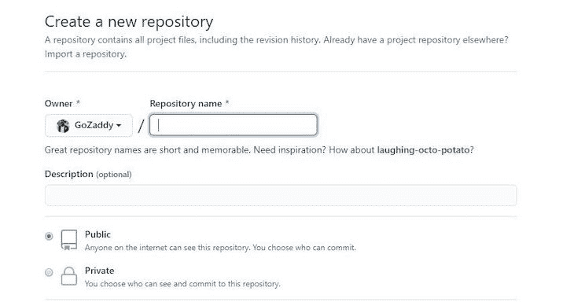
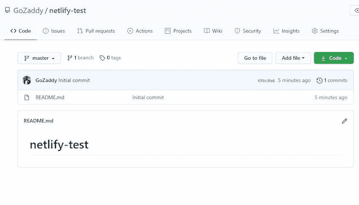
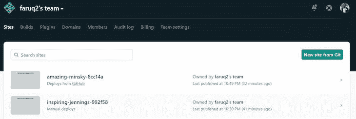
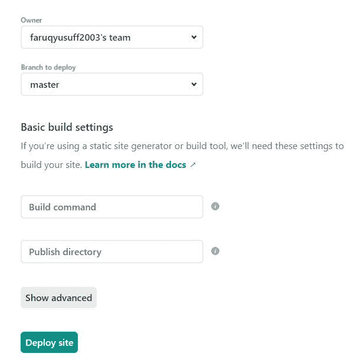
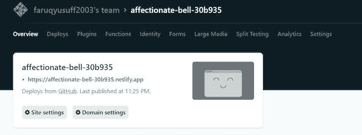
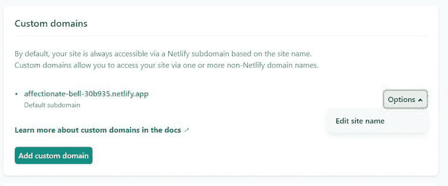
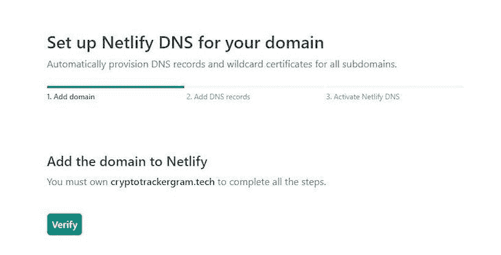
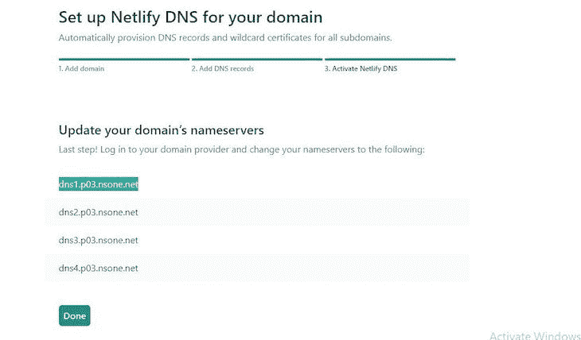

# 教一个 13 岁的孩子如何在 Netlify 上创建网页

> 原文：<https://blog.logrocket.com/teaching-13-year-old-host-webpage-netlify/>

Netlify 是一个 web 开发平台，它帮助开发人员自动完成将静态站点部署到生产环境中的繁琐任务。有了 Netlify，我们可以在自己的域或可定制的 Netlify 域上托管静态站点。

Netlify 的许多特性包括持续集成和持续部署(CI/CD)；即时表单，允许我们整理来自用户的数据，而无需构建自己的后端；分析；网络功能，允许我们在没有服务器的情况下执行后端操作；还有很多。由于 Netlify 的健壮性和易用性，它也常用于构建 JAMstack 应用程序。

在这篇文章中，我们将用最简单的术语解释如何使用 Netlify 托管网页。

### 先决条件

本文不是代码密集型的，所以您不需要太多的编码经验。你需要有一个 GitHub 账户和一个 Netlify 账户。你可以在这里创建一个 Netlify 账户[，在这里](https://app.netlify.com/signup/email)创建一个 GitHub 账户[。](https://www.github.com)

## 构建我们简单的静态网页

我们将主办的网页由一个简单的 CSS HTML 文件组成。我们的 HTML 文件中的代码应该是这样的:

```
<!DOCTYPE html>
<html lang="en">
<head>
    <meta charset="UTF-8">
    <meta name="viewport" content="width=device-width, initial-scale=1.0">
    <title>Document</title>
    <style>
        div {
            text-align: center;

        }
    </style>
</head>
<body>
    <div>
        <h1>Deploying a basic webpage to netlify</h1>
    </div>
</body>
</html>
```

现在我们已经写好了代码，我们需要把它放在 GitHub 库中。

GitHub 存储库基本上是一个包含我们项目源代码的远程文件夹，在本例中，它是我们的 HTML 和 CSS。有了 GitHub 存储库(俗称 repo)中的代码，我们可以与 Netlify 等许多服务进行交互。我们还可以与团队的其他成员合作，为这个单一的代码库做出贡献。

尽管 Git 和 GitHub 是每个开发人员都应该至少具备基本工作能力的基本工具，但我们不会在本文中深入讨论它们。然而，我们将把我们的代码放入 GitHub 库。

首先，我们需要在这里创建一个 GitHub 帐户[。一旦完成，我们需要创建一个新的 GitHub 存储库。我们可以通过点击 GitHub 主页右上角的**加号(+)** 图标，并选择**新资源库**来实现。](https://github.com)



命名存储库，选择 **Public** 以使其成为公共存储库(允许其他人查看)，并通过选中 **Add a README file** 复选框用 README 文件初始化存储库。

我们现在应该有这样的东西:



将文件添加到我们的 GitHub 存储库中最常见的方式是通过命令行中的 Git 命令，但是由于这不是一个只关注 Git/GitHub 的指南，我们将简单地将我们的`index.html`文件拖放到我们的存储库中。

为此，切换**添加文件**下拉菜单并选择**上传文件**。这将把我们带到一个新页面，在这里我们可以简单地放入我们的`index.html`文件:


一旦我们放入我们的文件，我们所要做的就是点击**提交变更**按钮，变更将被添加到我们的 GitHub 库。我们现在应该能够在存储库的主页上查看我们的`index.html`文件了。

现在我们已经在 GitHub 库中有了网页的代码，我们需要在这里创建一个 Netlify 帐户[。](https://app.netlify.com/signup/email)

一旦我们登录并创建了一个新团队，Netlify 仪表板应该类似于以下内容:



现在，我们需要将 GitHub 帐户连接到 Netlify。为此，单击 Git 中的**新站点按钮，并选择 GitHub 作为您的首选 Git 提供者。一旦我们的 GitHub 帐户连接到 Netlify，我们就可以为我们的网页选择存储库。现在，我们应该看到一个类似这样的页面:**



在此页面中，我们可以配置用于部署应用程序的构建设置。由于我们只部署了一个简单的网页，我们不需要在这里做太多。只需将**分支部署**选项设置为 master(或者您的代码所在的任何分支)并点击**部署站点**。

我们现在应该被重定向到我们已部署的网页的仪表板，看起来应该很像这样:



要查看已部署的网页，只需点击以绿色突出显示的链接。

我们现在应该注意到，每当我们从适当的分支向我们的存储库推送新的变更时，这些变更会在几分钟内反映到我们部署的站点上。

### 净下降

在 Netlify 上还有一种更快、更不常见的托管站点的方法，叫做 Netlify Drop。Netlify Drop 是一个 Netlify 服务，它允许开发者通过简单地拖放站点的文件夹来托管他们的站点。

要使用这个，我们需要访问 Netlify Drop 网站[这里](https://app.netlify.com/drop)。一旦我们进入网站，我们只需在提供的空间中放入一个包含静态网站所有文件的文件夹，我们将被重定向到一个类似于本文前面所示的仪表板。然后，我们可以从那里获得指向我们新部署的站点或页面的链接。

### 自定义域

现在我们知道如何在 Netlify 上托管我们的网页，让我们看看如何定制我们的域名。Netlify 通常会给我们一个唯一的 Netlify 域，可以进行定制。为了定制我们当前的域名，我们需要在 Netlify 上导航到我们项目的仪表板页面，然后点击**域设置**。



现在，我们需要切换选项下拉菜单并点击**编辑站点名称。**我们现在应该看到一个输入框，我们可以在其中编辑我们网站的域名。然而，这个域名仍然是一个网络子域，有时我们希望在我们的项目中使用我们自己的域。

要做到这一点，我们需要自己的自定义域名，我们可以从像 [Namecheap](http://namecheap.com) 这样的网站购买。一旦我们有了自定义域，我们需要进入我们项目的 Netlify 域设置页面，点击**添加自定义域**按钮来添加我们的自定义域。

现在，我们应该看到一个输入字段，我们必须在其中键入我们的域名。当 Netlify 要求确认时，键入自定义域并单击**是，添加域**。

我们现在将被重定向回“域设置”页面，在这里我们可以为我们的域设置 Netlify DNS。我们只需点击主域上的**检查 DNS 配置**链接，我们将被重定向到此页面:



点击**验证**并继续最后一步，Netlify 将要求我们更新域名服务器。



您必须在您购买域名的网站提供的仪表板上完成此操作。一旦完成，点击 **Done** ，你将被重定向回主页。现在你只需要等待(这可能需要几分钟，就像我一样，或者几个小时)，你的域名现在应该指向你的网页。

您也可以在您的站点/网页中启用 **HTTPS** ，以确保域名设置页面的安全性。你所要做的就是验证你的 DNS 配置和 **HTTPS** 应该被启用。

## 结论

恭喜你！我们已经成功地使用自定义域名在 Netlify 上托管了我们的简单网页，并通过 HTTPS 对其进行了保护。我建议您也看看使用 Netlify 可以完成的其他令人惊奇的事情。你总能在 [Netlify 的官网](https://netlify.com)上找到你需要的所有信息。

## 使用 [LogRocket](https://lp.logrocket.com/blg/signup) 消除传统错误报告的干扰

[](https://lp.logrocket.com/blg/signup)

[LogRocket](https://lp.logrocket.com/blg/signup) 是一个数字体验分析解决方案，它可以保护您免受数百个假阳性错误警报的影响，只针对几个真正重要的项目。LogRocket 会告诉您应用程序中实际影响用户的最具影响力的 bug 和 UX 问题。

然后，使用具有深层技术遥测的会话重放来确切地查看用户看到了什么以及是什么导致了问题，就像你在他们身后看一样。

LogRocket 自动聚合客户端错误、JS 异常、前端性能指标和用户交互。然后 LogRocket 使用机器学习来告诉你哪些问题正在影响大多数用户，并提供你需要修复它的上下文。

关注重要的 bug—[今天就试试 LogRocket】。](https://lp.logrocket.com/blg/signup-issue-free)