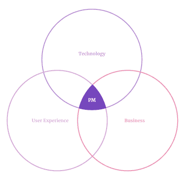
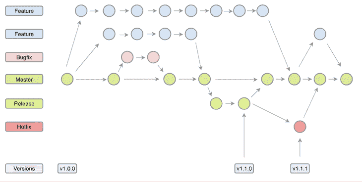
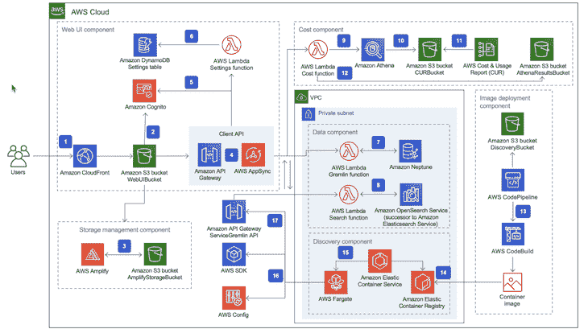

# 产品经理应该具备哪些技术技能？

> 原文：<https://blog.logrocket.com/product-management/technical-skills-product-managers-should-possess/>

“我需要知道如何编码吗？”可能是有抱负的产品经理最常问的问题之一。人们想知道他们需要多高的技术水平才能搞定下一次下午采访。

唉，即使在行业本身，也没有共识。一个阵营认为项目经理只需要与用户产生共鸣，不需要技术能力。其他人认为一个没有技术技能的项目经理就像一个不知道如何建造房子的建筑经理。

此外，不同的设置需要不同的技能组合。这导致了一个有点与众不同的角色的出现:技术产品经理(TPM)。在这种情况下，它应该是不言自明的——是的，你需要有很强的技术能力才能被认为是技术产品经理。

但是对于那些想成为更一般的项目经理角色的人来说呢？是时候报名参加训练营了吗？让我们找出答案。

* * *

## 目录

* * *

## 作为产品经理拥有专业技能的好处

首先，拥有技术技能永远不会有坏处。有些人可能会说，缺乏技术敏锐性可能是有利的，因为项目经理不必陷入细枝末节——他们有更大的关注点。

我想说，只要你有一些常识，不要试图比你的开发团队更聪明，你只能从获得一些技术知识中受益。

毕竟，产品经理在业务、用户体验和技术的交汇处工作。不了解这些元素中的任何一个都会让成为产品经理变得非常困难。

拥有良好的技术理解的一些好处包括:

*   **更深入地了解产品**。你将能够更好地理解你的产品的所有优点和缺点，以及什么是可能的，什么是不可能的
*   **更好地理解权衡**。如果您了解长期的技术后果，您将能够做出更好的决策
*   **与团队更紧密的联系**。如果你不能理解他们的挣扎和问题，与团队建立良好的关系是很难的。真正与团队感同身受的能力大有帮助
*   **提高沟通技巧**。如果团队成员知道你能够理解他们的问题、挑战和异议，他们会更愿意与你讨论

## 产品经理应该具备的技能

让我们直截了当地说:一个项目经理拥有与开发人员相似水平的技术技能是很罕见的——除非他们自己曾经也是开发人员。他们也不应该——毕竟，他们是因为不同的原因被雇佣的。

也就是说，如果你是产品经理，有几个技术概念值得理解:

### 软件开发生命周期

[软件开发生命周期(SDLC)](https://blog.logrocket.com/product-management/what-is-product-development-lifecycle-stages-examples/#pdlc-vs-sdlc-whats-the-difference) 是产品经理需要学习的最重要的技术概念。你必须了解软件实际上是如何制作的；你不能把开发过程当成某种黑箱，你把票给团队，然后拿回一个[完成的特性](https://blog.logrocket.com/product-management/what-is-definition-of-done-agile-examples/)。

理解 SDLC 将有助于您更好地跟踪进度和理解当前状态。它还允许你和团队一起调整生命周期，在期望的质量和速度之间达到完美的平衡。

确保你一步一步地理解每项任务会发生什么。您应该对以下内容有基本的了解:

*   单元测试
*   代码审查
*   Git 工作流
*   质量保证
*   错误修复
*   测试自动化
*   开发/试运行/生产环境

#### 资源

要了解更多信息，请参加 Udemy 的这个关于软件开发生命周期阶段的[一小时课程](https://www.udemy.com/course/sdlc-phases/)。

### 编程基础

作为产品经理，有些编程概念是你必须理解的。其中包括:

不了解编程基础，理解开发人员的工作几乎是不可能的，更不用说与他们进行任何有意义的对话了。

说到编码本身，知道如何编码是有帮助的，但你并不需要它。如果你喜欢编程，无论如何，把它当成一种爱好——它会给你带来巨大的回报。但是不要强迫自己这样做。

作为一名项目经理，其他技能和能力比你的编码能力对你的[表现和职业](https://blog.logrocket.com/product-management/product-manager-career-path/)有更大的影响。

#### 资源

如果你想在不陷入困境的情况下磨练你的编程技能，可以看看 Udemy 的这个[“预编程”课程。](https://www.udemy.com/course/pre-programming-everything-you-need-to-know-before-you-code/)

### Git 工作流

有没有想过，数百人如何在不互相干扰的情况下开发一个产品？

这都要感谢 [Git，一个分布式版本控制系统](https://blog.logrocket.com/git-workflow-strategies-multiple-teams-single-repository/)。Git 允许开发人员创建主代码库的无限“副本”,在这些副本上工作，然后将这些副本与原始代码甚至其他副本相结合。

Source: [Better Programming](https://betterprogramming.pub/a-simple-git-repository-strategy-93a0c7450f23)

学习一些 Git 基础知识将有助于您理解:

*   日常的开发人员行话，如“分支”、“合并”、“提交”等。
*   例如，版本是如何创建的，为什么开发人员推荐 3.4.10 版本而不是 3.5 或 3.4.1 版本
*   像“回滚”这样的事情是如何工作的
*   常见的软件开发挑战，例如维护太多特性分支的问题

#### 资源

Atlassian 有一个强大的 [Git 教程](https://www.atlassian.com/git/tutorials)集合，如果你想使用这个强大的工具学习更多关于工作流管理的知识。

### 结构化查询语言

SQL 代表结构化查询语言，虽然我还没有听到有人用全称。简单地说，SQL 允许你与数据库对话。

虽然它可以用于各种目的，比如添加、删除和修改数据库中的条目，但是 pm 主要使用 SQL 来分析数据。

了解 SQL 可以让您轻松地过滤整个数据库，提取符合特定标准的数据，并对其进行分析。这是[数据驱动产品管理](https://blog.logrocket.com/product-management/how-to-communicate-product-strategy/)的一项基本技能。

尽管有各种分析工具可用，但了解 SQL 仍然是有益的，因为:

*   有时候，查询数据库比使用分析工具更容易
*   SQL 帮助配置这些分析工具
*   工具有其局限性

#### 资源

想重温一下你的 SQL 技能吗？试试这个来自 Udemy 的[完整的 SQL bootcamp。或者，如果你刚刚开始你的 SQL 之旅，W3Schools](https://www.udemy.com/course/the-complete-sql-bootcamp/) 的这个[入门课程是 PMs 的一个很好的起点。](https://www.w3schools.com/sql/sql_intro.asp)

### 开发运维/云基础知识

理解[devo PS](https://blog.logrocket.com/from-front-end-developer-to-a-devops-an-intro-to-ci-cd-7a8a8713fb34/)——尤其是云——有助于你看到软件背后的更大图景。

在过去，我们习惯于构建和发布庞大的单体产品。所有需要的东西都用软件编码成一大块。

现代软件变得越来越分散。有几十个，有时超过 100 个独立的服务合作实现一个结果。

理解现代软件架构的基础不仅会增加你对软件的欣赏，还会极大地提高你的日常流畅性。

像下面这样的短语听起来将不再像外语:

*   “Azure 已关闭”
*   “我们的实例扩展速度不够快”
*   “我们无法连接到 API 网关”
*   “负载平衡器应该可以解决这个问题”
*   “我们需要数据库副本”
*   “我们想使用 ElasticSearch。我们估计每月成本为 3000 美元，WDYT？”
*   “我们不能释放。管道中断了”

Source: [Amazon](https://aws.amazon.com/solutions/implementations/aws-perspective/)

#### 资源

如果你想在云计算/开发运维领域变得更加精通，亚马逊可以满足你。查看其[云从业者认证](https://aws.amazon.com/certification/certified-cloud-practitioner/?ch=tile&tile=getstarted)项目。

### 质量保证

质量保证(QA)比你想象的要复杂得多。毕竟，QA 的报酬不是每年 60-80，000 美元，而仅仅是随机点击应用程序并寻找漏洞。

QA 过程通常从准备测试计划开始，记录非常具体的测试用例，在此基础上构建测试场景，并以一种有组织的、近乎科学的方式运行它们。

更不用说测试自动化了，它包括编程机器人来为我们执行和报告测试。

学习 QA 语言将有助于你理解质量标准是如何在你管理的产品中设定和保持的，并允许你参与这些对话。

#### 资源

国际软件测试资格委员会(ISTQB) 提供了一个很棒的 QA 测试员认证项目。Udemy 还有一个涵盖 QA 测试的[软件测试训练营](https://www.udemy.com/course/testerbootcamp/)。

## 技术化还是非技术化…

你需要技术，句号。好了，我说了。

虽然你不一定要成为程序员或软件架构师，但你需要比基础知识更多的技术专长。你不能只上了五个小时的课就收工了。

虽然对于产品经理来说，技术知识有一个收益递减点，但它比你想象的要远得多。

* * *

订阅我们的产品管理简讯
将此类文章发送到您的收件箱

* * *

最后，如果你对业务、技术和用户体验中的一个关键要素了解的非常少，你怎么能在这些要素的交叉点上工作呢？

*精选图片来源:[icon scout](https://iconscout.com/icon/network-learning-4036243)*

## [LogRocket](https://lp.logrocket.com/blg/pm-signup) 产生产品见解，从而导致有意义的行动

[LogRocket](https://lp.logrocket.com/blg/pm-signup) 确定用户体验中的摩擦点，以便您能够做出明智的产品和设计变更决策，从而实现您的目标。

使用 LogRocket，您可以[了解影响您产品的问题的范围](https://logrocket.com/for/analytics-for-web-applications)，并优先考虑需要做出的更改。LogRocket 简化了工作流程，允许工程和设计团队使用与您相同的[数据进行工作](https://logrocket.com/for/web-analytics-solutions)，消除了对需要做什么的困惑。

让你的团队步调一致——今天就试试 [LogRocket](https://lp.logrocket.com/blg/pm-signup) 。

[Bart Krawczyk Follow](https://blog.logrocket.com/author/bartkrawczyk/) Learning how to build beautiful products without burning myself out (again). Writing about what I discovered along the way.