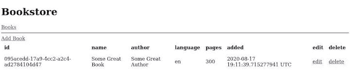

# Rust - LogRocket 博客中的模板渲染

> 原文：<https://blog.logrocket.com/template-rendering-in-rust/>

在本教程中，我们将研究使用模板编写 web 应用程序的老派方法，所有的渲染都发生在服务器端。

模板引擎的 Rust 生态系统惊人地强大，所以我们可以在几个 viablew 选项中进行选择。对于本教程，我选择使用 [Askama](https://github.com/djc/askama/) ，因为它似乎是最成熟的引擎之一。其他选项包括[亚尔特](https://github.com/botika/yarte)、[特拉](https://github.com/Keats/tera)和[旗鱼](https://github.com/Kogia-sima/sailfish)等等。

Askama 基于广泛使用的 [Jinja](https://palletsprojects.com/p/jinja/) 项目，所以如果你以前使用过它，语法会有些熟悉。

此外，Askama 从你的模板中创建实际的 Rust 代码，这意味着模板在编译时被检查，渲染速度快如闪电。这是以能够在运行时动态更改和重新加载模板为代价的。我确信最终会有人实现一些巧妙的解决方法，但是在撰写本文的时候，它并不工作。

Askama 的 API 很简单，而且基于 Jinja，非常强大。

为了查看这个模板练习的效果，我们将使用 warp web 服务器和纯服务器端呈现的模板创建一个简单的具有 CRUD 功能的书店应用程序。

## 设置

为了跟进，您需要一个相当新的 Rust 安装(1.39+)和一个 web 浏览器。

首先，创建一个新的 Rust 项目。

```
cargo new rust-templating-example
cd rust-templating-example

```

接下来，编辑`Cargo.toml`文件并添加您需要的依赖项。

```
tokio = { version = "0.2", features = ["macros", "rt-threaded"] }
warp = "0.2"
thiserror = "1.0"
askama = "0.8"
serde = {version = "1.0", features = ["derive"] }
chrono = { version = "0.4", features = ["serde"] }
uuid = { version = "0.8", features = ["serde", "v4"] }

```

我们需要 warp 和 tokio 用于 web 服务器，Serde 用于反序列化传入的请求负载。如上所述，我们将使用 Askama 进行模板化，我们还将添加 uuid、chrono 和 thiserror 来分别处理唯一的 id、日期和错误。

## 数据存储

为了实现任何类似 CRUD 的功能，我们需要某种形式的数据存储。在这个简单的例子中，我们将选择共享的`Vec`书籍，其形式为:

```
type DB = Arc<RwLock<Vec<Book>>>;

```

只需将书保存在一个共享的`Vec`中，它由一个读/写锁保护，并放入一个`Arc`智能指针，这样你就可以在线程之间传递它。稍后我们将看到如何访问和改变我们的非持久数据存储。

```
let db = DB::default();

```

创建一个简单的扭曲过滤器，将其传递给处理程序。

```
fn with_db(db: DB) -> impl Filter<Extract = (DB,), Error = Infallible> + Clone {
    warp::any().map(move || db.clone())
}

```

接下来，我们来看看什么是`Book`。

```
#[derive(Clone, Debug)]
pub struct Book {
    pub id: String,
    pub name: String,
    pub author: String,
    pub language: String,
    pub pages: i32,
    pub added_at: DateTime<Utc>,
}

```

我们还将为我们的变形处理程序定义一个有用的`WebResult`类型来减少输入。

```
type WebResult<T> = std::result::Result<T, Rejection>;

```

基本设置完成后，让我们定义一个欢迎处理程序来迎接访问者。

这让我们开始创建我们的第一个模板。

```
let welcome_route = warp::path::end().and_then(handler::welcome_handler);

```

## 创建第一个模板

在`handler`模块中，为您希望在欢迎页面上显示给用户的内容创建一个数据结构。

```
use askama::Template;

#[derive(Template)]
#[template(path = "welcome.html")]
struct WelcomeTemplate<'a> {
    title: &'a str,
    body: &'a str,
}

```

在这种情况下，我们将限制自己使用两个硬编码的字符串作为页面的标题和正文。

接下来，让我们看看`welcome.html`文件，默认情况下，它位于`./templates/`文件夹中。

* * *

### 更多来自 LogRocket 的精彩文章:

* * *

```

<div class="entry">
    <h1>{{title}}</h1>
    <div class="body">
        {{body}}
    </div>
</div>


```

因为您不想将页面的顶部和底部复制/粘贴到每个模板中，所以包括`header.html`和`footer.html`文件。

```
<html>
    <head>
        <title>Bookstore</title>
        
    </head>
    <body>
    <div>
        <h1>Bookstore</h1>
    </div>
    
    <hr />

```

标题包括一些 CSS 和一个硬编码的菜单。

```
<style>
    td, th {
        padding: 8px;
    }
    th {
        text-align: left;
    }
</style>

<div class="menu">
    <span class="menuitem">
        <a href = "/books/list">Books</a>
    </span>
</div>

```

最后，页脚:

```
    </body>
</html>

```

如您所见，如果我们将`welcome.html`的内容放在代码片段中，我们会得到一个完整的 HTML 页面。

那么，我们怎样才能真正创造出 HTML 的美好呢？让我们看看`handler`模块中的`welcome_handler`函数。

```
pub async fn welcome_handler() -> WebResult<impl Reply> {
    let template = WelcomeTemplate {
        title: "Welcome",
        body: "To The Bookstore!",
    };
    let res = template
        .render()
        .map_err(|e| reject::custom(TemplateError(e)))?;
    Ok(html(res))
}

```

概括一下，首先我们创建了一个`WelcomeTemplate`结构的实例，并在其上调用了`render()`，它返回了一个`Result`。然后我们处理错误，并简单地将 warp 的`reply::html`函数呈现的结果返回给客户端。

那很容易！

我们还想实现完整的 CRUD 功能，所以接下来让我们看看如何做一些更高级的事情。

## 其他处理者

让我们一次为我们的 warp 服务器定义所有的处理器，这样我们就可以对我们需要实现的东西有一个大概的了解。

```
let books_routes = books
    .and(new)
    .and(warp::get())
    .and_then(handler::new_book_handler)
    .or(books
        .and(new)
        .and(warp::post())
        .and(warp::body::form())
        .and(with_db(db.clone()))
        .and_then(handler::create_book_handler))
    .or(books
        .and(edit)
        .and(warp::get())
        .and(warp::path::param())
        .and(with_db(db.clone()))
        .and_then(handler::edit_book_handler))
    .or(books
        .and(edit)
        .and(warp::post())
        .and(warp::path::param())
        .and(warp::body::form())
        .and(with_db(db.clone()))
        .and_then(handler::do_edit_book_handler))
    .or(books
        .and(delete)
        .and(warp::get())
        .and(warp::path::param())
        .and(with_db(db.clone()))
        .and_then(handler::delete_book_handler))
    .or(books
        .and(list)
        .and(warp::get())
        .and(with_db(db.clone()))
        .and_then(handler::books_list_handler));

```

这需要相当多的处理程序，但是请记住，对于创建和编辑书籍这样的交互式操作，我们需要两个端点:一个用于显示表单，另一个用于处理表单。

这就是`new_book_handler`，它只是一个 GET 端点，和`create_book_handler`，它接收一个`form`体，并且是一个 POST 端点。

将上面定义的基于数据内存的数据存储传递给每个处理程序。处理程序需要访问数据并为编辑和删除端点定义`path::param`,因为它们将接收图书的 ID 进行操作。

让我们从最简单的端点开始:列出书籍。

```
#[derive(Template)]
#[template(path = "book/list.html")]
struct BooklistTemplate<'a> {
    books: &'a Vec<Book>,
}

pub async fn books_list_handler(db: DB) -> WebResult<impl Reply> {
    match db.read() {
        Ok(books) => {
            let template = BooklistTemplate {
                books: &books,
            };
            let res = template
                .render()
                .map_err(|e| reject::custom(TemplateError(e)))?;
            Ok(html(res))
        }
        Err(_) => Err(reject::custom(DBAccessError)),
    }
}

```

如您所见，我们使用了`book/list.html`作为模板，因此我们可以使用文件夹来构建模板。

然后，我们在共享数据存储上获得一个读锁，如果可以的话，只需将 books 向量的引用传递给模板。

如果一个错误发生了，我们把它转换成我们的一个自定义错误，稍后我们会看到，并返回它。

该模板如下所示:

```

<a href="/books/new">Add Book</a>
<table>
    <tr>
        <th>id</th>
        <th>name</th>
        <th>author</th>
        <th>language</th>
        <th>pages</th>
        <th>added</th>
        <th>edit</th>
        <th>delete</th>
    </tr>

    <tr>
        <td>{{ book.id }}</td>
        <td>{{ book.name }}</td>
        <td>{{ book.author }}</td>
        <td>{{ book.language }}</td>
        <td>{{ book.pages }}</td>
        <td>{{ book.added_at }}</td>
        <td><a href="{{"/books/edit/{}"|format(book.id)}}">edit</a></td>
        <td><a href="{{"/books/delete/{}"|format(book.id)}}">delete</a></td>
    <?tr>

</table>


```

同样，我们包含了页眉和页脚，创建了一个添加新书的按钮，并创建了一个表——是的，一个老式的 HTML 表——来显示书籍。

在表头之后，我们遍历了给定的`BooklistTemplate`结构中的`book`,并简单地显示了值。

对于编辑和删除链接，我们使用了`format`函数，通过管道语法将图书 ID 转换成格式字符串。

既然我们能读书，为什么不创造一本书呢？接下来我们来看看`new_book_handler`。

```
#[derive(Template)]
#[template(path = "book/new.html")]
struct NewBookTemplate {}

pub async fn new_book_handler() -> WebResult<impl Reply> {
    let template = NewBookTemplate {};
    let res = template
        .render()
        .map_err(|e| reject::custom(TemplateError(e)))?;
    Ok(html(res))
}

```

这是新的—没有任何内容的模板结构。在这种情况下，我们简单地使用它来定义使用哪个模板。然后，它被实例化和渲染。

模板只是一个表单，其中的`action`指向`POST /books/new`:

```

<h2>Add New Book</h2>
<table>
    <form action="/books/new" method="post">
        <tr>
            <td>Name:</td>
            <td><input type="text" name="name" /></td>
        <tr/>
        <tr>
            <td>Author:</td>
            <td><input type="text" name="author" /></td>
        <tr/>
        <tr>
            <td>Language:</td>
            <td><input type="text" name="language" value="de" /></td>
        <tr/>
        <tr>
            <td>Pages:</td>
            <td><input type="text" name="pages" value="300" /></td>
        <tr/>
        <tr>
            <td colspan="2"><button type="submit">Send</button></td>
        <tr/>
    </form>
</table>


```

一旦表单被填写和发送，它将触发`create_book_handler`，我们接下来会看到:

```
pub async fn create_book_handler(body: BookRequest, db: DB) -> WebResult<impl Reply> {
    let new_book = Book {
        id: Uuid::new_v4().to_string(),
        name: body.name,
        author: body.author,
        language: body.language,
        pages: body.pages,
        added_at: Utc::now(),
    };
    match db.write() {
        Ok(mut books) => {
            books.push(new_book);
        }
        Err(_) => return Err(reject::custom(DBAccessError)),
    };
    books_list_handler(db).await
}

```

这个处理程序没有模板，因为如果操作成功，我们将简单地把用户送回图书列表。

因为我们之前定义了一个`warp::body::form`，所以我们得到了一个容易反序列化的传递给处理程序的`BookRequest`对象。

```
#[derive(Serialize, Deserialize, Debug)]
pub struct BookRequest {
    pub name: String,
    pub author: String,
    pub language: String,
    pub pages: i32,
}

```

基于这个有效载荷，我们可以创建一个新的`Book`，它使用`uuid`生成一个惟一的 ID，使用`chrono`生成当前的 UTC 日期。

然后，我们在“数据库”上获得一个写锁，并将这本书添加到图书列表中。

我们已经成功了一半。让我们继续编辑和删除书籍。

## 编辑和删除

一旦我们有了一些书，我们可能会想要改变它们。毕竟，错误时有发生，拼写错误的作者姓名会很尴尬。因为任何人都会犯错误，拼写错误的作者可能会很尴尬。

为此，我们需要实现两个`edit`处理程序:

```
#[derive(Template)]
#[template(path = "book/edit.html")]
struct EditBookTemplate<'a> {
    book: &'a Book,
}

pub async fn edit_book_handler(id: String, db: DB) -> WebResult<impl Reply> {
    let book = match db.read() {
        Ok(books) => match books.iter().find(|b| b.id == id) {
            Some(book) => book.clone(),
            None => return Err(reject::custom(BookNotFoundError)),
        },
        Err(_) => return Err(reject::custom(DBAccessError)),
    };

    let template = EditBookTemplate { book: &book };
    let res = template
        .render()
        .map_err(|e| reject::custom(TemplateError(e)))?;
    Ok(html(res))
}

```

在这种情况下，我们需要一个新的模板:`EditBookTemplate`。实际上，通常可以创建一个用于创建和编辑的模板，并简单地设置值(如果有的话)。但是这增加了模板的复杂性——在我看来，即使在编译时对它们进行了检查，这也不是一个真正有趣的地方。

对于`edit`表单，我们需要在我们的“数据库”中找到具有给定 ID 的书，否则返回一个错误。如果找到了这本书，对它的引用将被添加到`EditBookTemplate`中，并呈现给用户

用于编辑的模板如下所示:

```

<h2>Edit Book</h2>
<table>
    <form action="{{"/books/edit/{}"|format(book.id)}}" method="post">
        <tr>
            <td>Name:</td>
            <td><input type="text" name="name" value="{{ book.name }}"/></td>
        <tr/>
        <tr>
            <td>Author:</td>
            <td><input type="text" name="author" value="{{ book.author }}"/></td>
        <tr/>
        <tr>
            <td>Language:</td>
            <td><input type="text" name="language" value="{{ book.language }}"/></td>
        <tr/>
        <tr>
            <td>Pages:</td>
            <td><input type="text" name="pages" value="{{ book.pages }}" /></td>
        <tr/>
        <tr>
            <td colspan="2"><button type="submit">Send</button></td>
        <tr/>
    </form>
</table>


```

这与创建新书的表单非常相似，不同之处在于我们设置了每个输入字段的`value`，并将表单动作设置为`POST /books/edit/$bookId`。

一旦表单被发送，我们就被传送到`do_edit_book_handler`，它有一个`BookRequest`，类似于`create_book_handler`，还有一个 ID。

```
pub async fn do_edit_book_handler(id: String, body: BookRequest, db: DB) -> WebResult<impl Reply> {
    match db.write() {
        Ok(mut books) => match books.iter_mut().find(|b| b.id == id) {
            Some(ref mut book) => {
                book.name = body.name;
                book.language = body.language;
                book.author = body.author;
                book.pages = body.pages;
            }
            None => return Err(reject::custom(BookNotFoundError)),
        },
        Err(_) => return Err(reject::custom(DBAccessError)),
    };
    books_list_handler(db).await
}

```

因为我们正在操作数据，所以我们需要再次获得一个写锁，并搜索具有给定 ID 的书。如果它不存在，我们返回一个错误。否则，我们简单地用身体的数据在适当的地方改变这本书。

我们需要实现的最后一个操作是`delete`，相对于`edit`来说比较简单。

```
pub async fn delete_book_handler(id: String, db: DB) -> WebResult<impl Reply> {
    match db.write() {
        Ok(mut books) => {
            let mut delete_idx = None;
            for (i, b) in books.iter().enumerate() {
                if b.id == id {
                    delete_idx = Some(i);
                }
            }
            match delete_idx {
                Some(i) => {
                    books.remove(i);
                }
                None => return Err(reject::custom(BookNotFoundError)),
            }
        }
        Err(_) => return Err(reject::custom(DBAccessError)),
    };
    books_list_handler(db).await
}

```

我们不再需要模板，因为我们只是执行操作并将用户重定向回图书列表。除此之外，这是和以前一样的把戏:获得一个写锁，寻找这本书并删除它，如果没有找到就返回一个错误。

## 基本错误处理

因为这不是一个 JSON API，在这里我们只能返回一个带有错误消息和状态代码的 JSON 对象，所以我们需要创建一个向用户显示错误的模板。

```

<div class="error">
    <h1>Error</h1>
    <div class="body">
        An Error Occurred: <br /><br />
        {{ message }}
    </div>
</div>


```

在这种非常基本的情况下，这可能不是特别有帮助，但至少用户可以往回导航，并了解出了什么问题。

最后，让我们将所有东西连接到一个 warp web 服务器上。

```
    let routes = welcome_route
        .or(books_routes)
        .recover(error::handle_rejection);

    println!("Started on port 8080");
    warp::serve(routes).run(([0, 0, 0, 0], 8080)).await;

```

`error`模块中的`handle_rejection`函数如下所示:

```
#[derive(Error, Debug)]
pub enum Error {
    #[error("error accessing the database")]
    DBAccessError,
    #[error("book not found")]
    BookNotFoundError,
    #[error("templating error: {0}")]
    TemplateError(#[from] askama::Error),
}

#[derive(Template)]
#[template(path = "error.html")]
struct ErrorTemplate {
    message: &'static str,
}

impl warp::reject::Reject for Error {}

pub async fn handle_rejection(err: Rejection) -> std::result::Result<impl Reply, Infallible> {
    let code;
    let message;

    if err.is_not_found() {
        code = StatusCode::NOT_FOUND;
        message = "Not Found";
    } else if let Some(_) = err.find::<warp::filters::body::BodyDeserializeError>() {
        code = StatusCode::BAD_REQUEST;
        message = "Invalid Body";
    } else if let Some(e) = err.find::<Error>() {
        match e {
            Error::DBAccessError => {
                code = StatusCode::BAD_REQUEST;
                message = "there was an error accessing the database";
            }
            _ => {
                eprintln!("unhandled application error: {:?}", err);
                code = StatusCode::INTERNAL_SERVER_ERROR;
                message = "Internal Server Error";
            }
        }
    } else {
        eprintln!("unhandled error: {:?}", err);
        code = StatusCode::INTERNAL_SERVER_ERROR;
        message = "Internal Server Error";
    }

    let template = ErrorTemplate { message };

    match template.render() {
        Ok(v) => Ok(reply::with_status(html(v), code)),
        Err(_) => Ok(reply::with_status(
            html(String::from(message)),
            StatusCode::INTERNAL_SERVER_ERROR,
        )),
    }
}

```

首先，我们定义了一个自定义的`Error`枚举，它实现了 warp 的`Reject`特征，这使我们能够从处理程序中返回它。我们有访问“数据库”的错误案例，找不到书的错误案例，以及呈现模板时的错误案例。

我们还用上面定义的`error.html`模板和一条错误消息定义了`ErrorTemplate`。

接下来，我们检查不同的错误情况，设置一些有用的错误消息和响应代码，最后，呈现`ErrorTemplate`。如果在这里渲染失败，我们只能给用户发送一个没有模板的消息`INTERNAL_SERVER_ERROR`。

就是这样！如果您用`cargo run`启动这个应用程序，并导航到`[http://localhost:8080](http://localhost:8080)`，您将看到一个设计非常棒的、完全由服务器呈现的 UI，您可以与之交互。



你可以在 [GitHub](https://github.com/zupzup/rust-templating-example) 上找到这个例子的完整代码。

## 结论

在本教程中，我们以服务器端呈现的 web 应用程序为例，演示了如何在 Rust 中进行安全、高性能的模板呈现。

模板引擎可以用于广泛的用例。Rust 中的库生态系统给人留下了深刻的印象，并且已经为个别用例提供了许多不同的选项。

## [log rocket](https://lp.logrocket.com/blg/rust-signup):Rust 应用的 web 前端的全面可见性

调试 Rust 应用程序可能很困难，尤其是当用户遇到难以重现的问题时。如果您对监控和跟踪 Rust 应用程序的性能、自动显示错误、跟踪缓慢的网络请求和加载时间感兴趣，

[try LogRocket](https://lp.logrocket.com/blg/rust-signup)

.

[](https://lp.logrocket.com/blg/rust-signup)

LogRocket 就像是网络和移动应用程序的 DVR，记录你的 Rust 应用程序上发生的一切。您可以汇总并报告问题发生时应用程序的状态，而不是猜测问题发生的原因。LogRocket 还可以监控应用的性能，报告客户端 CPU 负载、客户端内存使用等指标。

现代化调试 Rust 应用的方式— [开始免费监控](https://lp.logrocket.com/blg/rust-signup)。