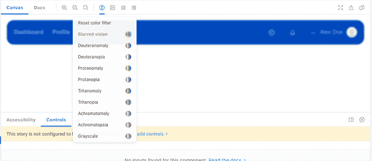
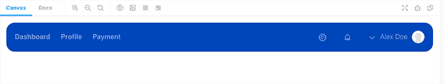
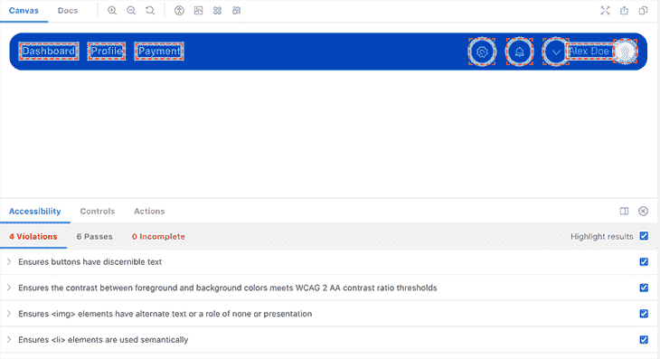

# 用 Storybook - LogRocket 博客测试可访问性

> 原文：<https://blog.logrocket.com/testing-accessibility-storybook/>

构建组件库的一个大挑战是优先考虑可访问性。易访问性通常被看作是那些“最好拥有”的特性之一，不幸的是，我们还远远没有把它看作是开发人员技能的一个重要部分。

我明白了——引入可访问性实践可能很有挑战性，也很耗时。但是有一些神奇的工具可以帮助你和你的团队减少实施的压力，更重要的是，让它持续下去。

在本文中，我们将在以下几个部分探索 Storybook 的可访问性附加组件:

*   如何安装和配置附加组件
*   使用辅助功能插件测试导航组件
*   浏览一些常见的可访问性问题，这些问题可以在 Storybook 的帮助下很容易地进行审核

## 为什么是故事书？

Storybook 在团队中被广泛用于开发一致的 UI。这个开源项目将设计和工程团队聚集在一起，专注于组织一个完美的组件库。

在多个贡献者的帮助下，Storybook 的团队一直在开发新的附加组件，将附加功能扩展到他们的核心用户界面。为了帮助用户构建可访问的应用程序，Storybook 发布了他们的[可访问性插件](https://storybook.js.org/addons/@storybook/addon-a11y)。

这个项目背后的想法是为 Storybook 中的自动化可访问性测试提供支持，以捕获和处理可访问性错误。在整个开发过程中解决这些问题可以让我们花更多的时间用辅助技术进行手工测试，从而提高整个 web 的可访问性标准。

accessibility add-on 对每个故事运行 [deque axe accessibility 测试工具](https://www.deque.com/axe/)。axe 是一个自动化的可访问性测试工具，可以与您选择的框架或浏览器一起使用。

accessibility add-on 提供了一个面板，在这个面板中，我们可以在每个故事的 UI 中可视化 axe 的测试结果。这非常好，因为我们可以在开发过程中测试我们的组件是否符合通用的可访问性标准和指南。

最重要的是，accessibility 附加组件包括一个色盲模拟器，可以复制视觉障碍，如 deuteranomaly、protanomaly 或 tritanopia。


## 将辅助功能附加组件添加到项目中

在安装 Storybook 之前，记住它不能在空项目中运行是很重要的。Storybook 需要检查项目的依赖关系，以便为您提供最佳配置。在我们的例子中，我们将在 React 应用程序中运行它。

为此，我们将首先运行 [Create React App](https://blog.logrocket.com/tag/create-react-app) 来初始化我们的 React 应用程序。如果您心中有一个想要的项目，您可以简单地安装 Storybook:

```
# Add Storybook:
npx sb init

# Starts Storybook in development mode
npm run storybook

```

Storybook 已经附带了一些`essential addons`，但不幸的是，这些不包括辅助功能插件，所以我们也必须安装它:

```
npm install @storybook/addon-a11y

```

最后，我们需要在`.storybook`文件夹中创建或添加一个`main.js`文件，如下所示:

```
// .storybook/main.js
module.exports = {
  addons: ['@storybook/addon-a11y'],
};

```

## 测试我们的组件

让我们来看一个顶部导航组件的例子。



乍一看，组件看起来已经准备好了，但是如果我们进入 accessibility 选项卡，测试告诉我们一些不同的东西。



导航组件缺少某些可访问性需求，因此 axe 列举了四个违规。

accessibility 附加组件带有一个**高亮显示结果**复选框，帮助识别出现故障的组件。这在处理较大的组件时非常有用，因为它将使我们不必在每个组件中单独重新运行这些测试。

*   **确保按钮有可识别的文本** —表示当使用图标作为没有可见标签的按钮时，为屏幕阅读器添加内部文本是很重要的，这可以通过添加`aria-label`来完成
    *   我们的对比度没有达到 [WCAG AA](https://www.w3.org/WAI/standards-guidelines/wcag/) 比率阈值，这使得我们的链接和文本很难跨组件阅读
*   我们的导航条包括一个头像，其图像没有用于替代文本描述的`alt`属性
*   **确保`<li>`元素在语义上被使用** —检测被用作链接的列表元素没有被包装在`<ul>`元素中。强烈建议使用语义 HTML，因为它允许屏幕阅读器和辅助技术用户轻松地浏览页面的标题和部分

正如我前面提到的，accessibility add-on 相当快地检测到所有这些违反可访问性的情况，这对于在开发过程的早期阶段保持对核心可访问性标准的高度关注非常有用。

## 根据您的需求配置 axe

值得一提的是，accessibility add-on 尊重 axe 基于规则的系统，并允许我们根据自己的需要配置可访问性违规。

为了更好地理解您可以覆盖和禁用的规则集，请查看`[axe-core configurationOptions](https://github.com/dequelabs/axe-core/blob/develop/doc/API.md#parameters-1)`。如果你不太熟悉 axe，我强烈推荐你浏览一下[规则描述](https://github.com/dequelabs/axe-core/blob/develop/doc/rule-descriptions.md)——它会让你深入了解哪些规则可以定制，并为你提供关于这样做的最佳场景的进一步研究。

例如，我们可以使用`parameters.a11y.config.rules`在故事级别覆盖一些规则:

```
const Story = {
 title: "Components/Navigation",
 component: Nav,
 parameters: {
   a11y: {
     config: {
       rules: [
         {
    //  Override the result of a rule to return "Needs Review" rather 
    //  than "Violation" if the rule fails. It will show in the
    //  'Incomplete' tab.
           id: "color-contrast",
           reviewOnFail: true,
          },
        ],
      },
    },
  },
};

```

如果我们想忽略全局级别的规则，我们可以在故事书的`preview.js`文件中使用`parameters.a11y.config.rules`:

```
// .storybook/preview.js
export const parameters = {
  a11y: {
    config: {
      rules: [
        {
          id: 'listItem',
          enable: false,
        },
      ],
    },
  },
};

```

包含一条规则被覆盖的原因的注释总是明智的，因为它将帮助您和您的团队理解为什么一些规则在测试期间没有被报告。

## 自动化可访问性测试

在自动化测试中使用 Storybook 是可能的，它支持将您的故事与测试框架集成，如 [Jest](https://jestjs.io/) 。此外，你也可以使用[的 React 测试库](https://testing-library.com/docs/react-testing-library/intro/)。或者，[两个都可以用](https://blog.logrocket.com/testing-apps-with-jest-and-react-testing-library/)。

除此之外，我们还可以使用 [Jest Axe integration](https://github.com/nickcolley/jest-axe) 对我们的每个组件进行可访问性测试。这个项目在 Jest 中引入了一个 axe-matcher，这样你就可以自动搜索违例。

```
const { axe, toHaveNoViolations } = require('jest-axe');

expect.extend(toHaveNoViolations);

/// tests

```

## 结论

最后一点:[其他的可访问性实践](https://blog.logrocket.com/tag/accessibility)，比如针对最常见的辅助技术测试用户界面，以及在你的用户研究中包括残疾，仍然是测试你的应用程序的可访问性的非常受鼓励的方法。这只是解决应用程序中易访问性问题的一种方法，并不能代替我们描述的手动测试。

看到越来越多的开发者工具被引入到[构建可访问的 UI](https://blog.logrocket.com/make-your-react-website-accessible/) 中，这是非常令人兴奋的。尽管增加测试覆盖并不能确保你的组件库是完全可访问的，但这无疑是承认可访问性是一个完美组件库的标准的一步。

## 使用 [LogRocket](https://lp.logrocket.com/blg/signup) 消除传统错误报告的干扰

[](https://lp.logrocket.com/blg/signup)

[LogRocket](https://lp.logrocket.com/blg/signup) 是一个数字体验分析解决方案，它可以保护您免受数百个假阳性错误警报的影响，只针对几个真正重要的项目。LogRocket 会告诉您应用程序中实际影响用户的最具影响力的 bug 和 UX 问题。

然后，使用具有深层技术遥测的会话重放来确切地查看用户看到了什么以及是什么导致了问题，就像你在他们身后看一样。

LogRocket 自动聚合客户端错误、JS 异常、前端性能指标和用户交互。然后 LogRocket 使用机器学习来告诉你哪些问题正在影响大多数用户，并提供你需要修复它的上下文。

关注重要的 bug—[今天就试试 LogRocket】。](https://lp.logrocket.com/blg/signup-issue-free)

## [LogRocket](https://lp.logrocket.com/blg/react-signup-general) :全面了解您的生产 React 应用

调试 React 应用程序可能很困难，尤其是当用户遇到难以重现的问题时。如果您对监视和跟踪 Redux 状态、自动显示 JavaScript 错误以及跟踪缓慢的网络请求和组件加载时间感兴趣，

[try LogRocket](https://lp.logrocket.com/blg/react-signup-general)

.

[ ](https://lp.logrocket.com/blg/react-signup-general) [](https://lp.logrocket.com/blg/react-signup-general) 

LogRocket 结合了会话回放、产品分析和错误跟踪，使软件团队能够创建理想的 web 和移动产品体验。这对你来说意味着什么？

LogRocket 不是猜测错误发生的原因，也不是要求用户提供截图和日志转储，而是让您回放问题，就像它们发生在您自己的浏览器中一样，以快速了解哪里出错了。

不再有嘈杂的警报。智能错误跟踪允许您对问题进行分类，然后从中学习。获得有影响的用户问题的通知，而不是误报。警报越少，有用的信号越多。

LogRocket Redux 中间件包为您的用户会话增加了一层额外的可见性。LogRocket 记录 Redux 存储中的所有操作和状态。

现代化您调试 React 应用的方式— [开始免费监控](https://lp.logrocket.com/blg/react-signup-general)。