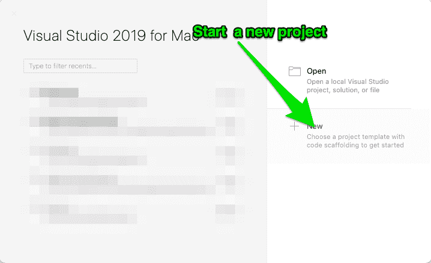
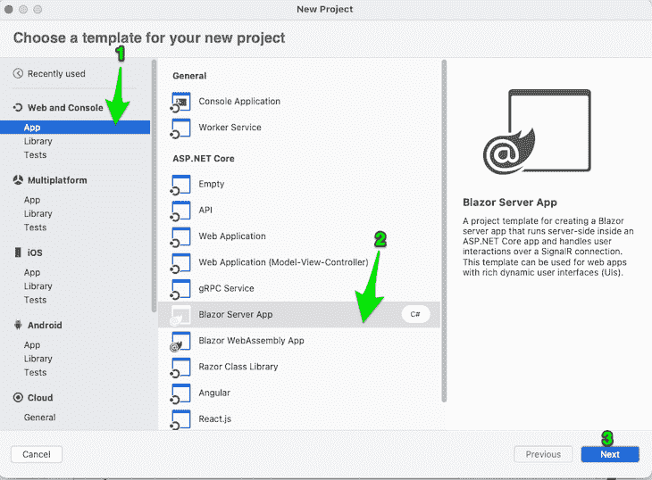
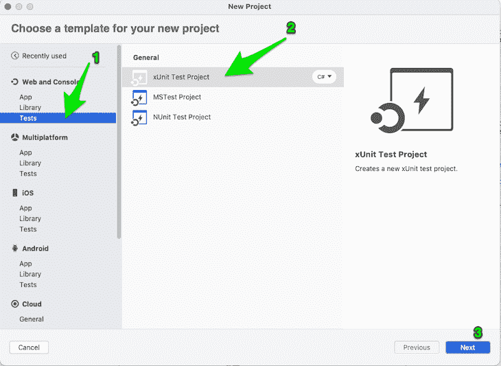
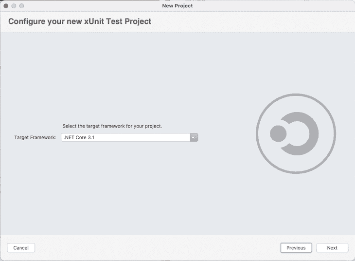
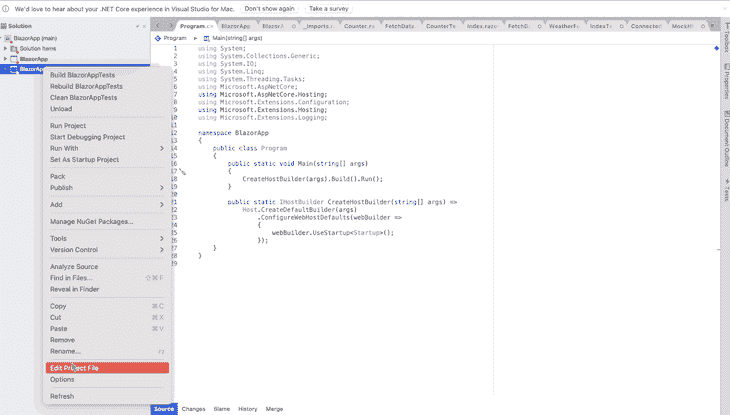
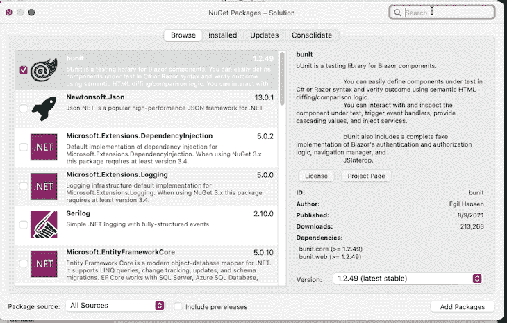
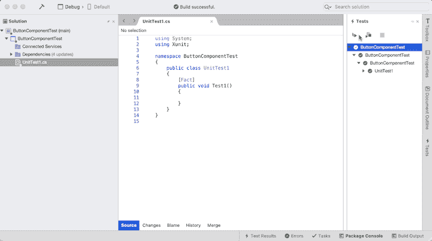

# Blazor 中的测试:一个完整的教程

> 原文：<https://blog.logrocket.com/testing-in-blazor-a-tutorial/>

## 介绍

在 C#开发中引入 Blazor，使开发人员能够在不依赖 React、Vue.js 和 Angular 等传统 JavaScript 框架的情况下，将开发扩展到浏览器中。

虽然在传统的 JavaScript 框架中设置测试更容易，但是 [Blazor](https://blog.logrocket.com/blazor-vs-react/) 需要将一些工具和包放在一起，然后理解如何在应用程序中测试以及测试什么。

这篇文章将介绍如何为一个简单的 Blazor 计数器应用程序设置测试，并将其扩展到包括 C#开发人员可能希望在 Blazor 应用程序中测试的几乎所有内容。

## 设置测试环境

首先，让我们设置演示项目。

### 创建新项目

在 Visual Studio 中，点击**新建**。



从 **Web 和控制台**菜单中，选择**应用**，然后选择 **Blazor 服务器应用**。



在下一页中，继续不进行身份验证，然后设置**项目名称**和**解决方案名称**。点击**创建**。

### 设置测试项目

要设置一个测试项目，从文件菜单下拉菜单中点击**New Solution**；应该会弹出一个模板窗口。

从左侧栏的**网页** **和** **控制台**组中，选择**测试**，选择 **xUnit 测试项目**，然后点击**下一步**。



使用与主项目相同的框架版本，然后点击**下一个**。



最后，为解决方案和项目设置一个名称，并单击 **Create** 。

完成后，您的 Visual Studio 应该有如下所示的侧栏:


### 将主项目链接到测试项目

为了让测试项目能够引用和使用主项目，我们必须在测试项目内部创建一个链接，这样我们就可以从主项目中导入和使用组件、类和接口。

在 Visual Studio 内部，右键点击左边栏的**测试解决方案**，选择**编辑项目文件**，将`<ProjectReference Include="../path/to/main-project/main-project.csproj" />`添加到与 SDK 版本相同的组内。



## 设置测试依赖关系

### 安装 bUnit

从**项目菜单**，点击**管理 NuGet 包**，搜索 **bUnit** ，选择 **bUnit** 和 **bUnit.core** ，点击**添加包**，选择两个解决方案，点击**确定**。



### 安装 xUnit

这个测试项目被引导为 xUnit 项目。默认情况下，它带有 xUnit 包。

### 安装最小起订量

Moq 是一个断言库，用于测试预期结果是否与返回结果匹配。

我们可以像安装 bUnit 一样安装 Moq。只需搜索并选择 **Moq** ，点击**添加包**，选择测试项目，点击 **Ok** 。

## 用 bUnit 测试

xUnit 是一个测试框架，它提供了一个在浏览器之外运行 Blazor 应用程序的接口，并且仍然通过代码与输出进行交互。

* * *

### 更多来自 LogRocket 的精彩文章:

* * *

bUnit 是我们与 Blazor 组件交互的接口。bUnit 提供的接口使得在 Blazor 组件上触发事件、在组件上找到一些元素并做出断言成为可能。

### 测试设置

要用 bUnit 测试 Blazor 应用程序，测试套件必须在测试项目的类中有一个测试用例函数。

测试用例中的代码应该包含以下内容:

*   `Arrange`，设置`TestContext`(渲染 Blazor 组件的虚拟环境)
*   `Act`，将组件渲染到测试上下文中，触发动作，并发出网络请求
*   `Assert`，检查事件是否被触发，是否显示正确的文本。

例如，下面的设置说明了上述步骤:

```
using BlazorApp.Pages;
using Bunit;
using Xunit;

namespace BlazorAppTests
{
    public class CounterTest
    {
        [Fact]
        public void RendersSuccessfully()
        {

            using var ctx = new TestContext();

            // Render Counter component.
            var component = ctx.RenderComponent<Counter>();

            // Assert: first, find the parent_name vital element, then verify its content.
            Assert.Equal("Click me", component.Find($".btn").TextContent);
        }

    }
}

```

从右边栏，点击**测试**，然后点击**运行所有**来运行这个测试。



### 将参数传递给组件

有时，组件需要参数才能正确呈现。bUnit 提供了一个接口来处理这个问题。

首先，让我们修改应用程序解决方案中的`counter`组件，如下所示:

```
@page "/counter/{DefaultCount:int?}"

<h1>Counter</h1>

<p>Current count: <span id="counterVal">@currentCount</span></p>

<button class="btn btn-primary" @onclick="IncrementCount">Click me</button>

@code {
    private int currentCount = 0;

    [Parameter]
    public int DefaultCount { get; set; }

    protected override void OnParametersSet()
    {
        if (DefaultCount != 0)
        {
            currentCount = DefaultCount;
        }
    }

    private void IncrementCount()
    {
        currentCount++;
    }
}

```

首先，注意我们是如何更新路径来接受一个`DefaultCount`参数，一个整数。`?`告诉 Blazor 这个参数是可选的，并不是组件运行所必需的。

接下来，注意 C#代码中的`DefaultCount`属性有一个`[Parameter]`属性。我们已经钩住了`OnParametersSet`生命周期方法，以便在设置参数时通知组件。这确保了我们使用它来更新组件`currentValue`属性，而不是组件从零开始计数。

我们可以在 bUnit 测试用例中呈现这个组件，如下所示:

```
using BlazorApp.Pages;
using Bunit;
using Xunit;

namespace BlazorAppTests
{
    public class CounterTest
    {
        public void RendersSuccessfully()
        {

            using var ctx = new TestContext();

            Action onBtnClickHandler = () => { };

            // Render Counter component.
            var component = ctx.RenderComponent<Counter>(
              parameters =>
                parameters
                      // Add parameters
                  .Add(c => c.DefaultCount, 10)
                  .Add(c => c.OnBtnClick, onBtnClickHandler)
            );

            // Assert: first find the parent_name strong element, then verify its content.
            Assert.Equal("Click me", component.Find($".btn").TextContent);
        }

    }
}

```

在上面测试的第 14 行，我们呈现了组件，然后向调用`(p => );`的组件传递了一个回调。

然后，我们将`Add`方法添加到参数`(p => p.Add(c => c.DefaultCount, 10);`上，以便将参数设置为 10。

我们可以用同样的方式用`p.Add(c => c.onBtnClickHandler, onBtnClickHandler)`传递一个事件回调。这样，我们在`onBtnClickHandler`动作内部实现了计数器增量，而不是在`counter`组件内部。

### 将输入和服务传递给组件

有些组件依赖外部服务运行，有些则依赖外部字段。我们可以在测试环境中通过`Services.AddSingleton`方法用 bUnit 实现这一点。

在演示计数器应用程序中，有一个严重依赖于`WeatherForecastService`服务的`FetchData.razor`文件。让我们试着在 xUnit 测试项目中运行这个文件。

在测试项目中创建一个名为`FetchDataTest.cs`的新文件，并添加如下内容:

```
using System;
using BlazorApp.Data;
using BlazorApp.Pages;
using Bunit;
using Microsoft.Extensions.DependencyInjection;
using Xunit;

namespace BlazorAppTests
{
    public class FetchDataTest
    {
        [Fact]
        public void RendersSuccessfully()
        {

            using var ctx = new TestContext();

            ctx.Services.AddSingleton<WeatherForecastService>(new WeatherForecastService());

            // Render Counter component.
            var component = ctx.RenderComponent<FetchData>();

            Assert.Equal("Weather forecast", component.Find($"h1").TextContent);
        }

    }
}

```

注意我们是如何使用`AddSingleton`接口向我们的测试运行器上下文添加新服务的。当我们运行这个测试文件时，我们应该会得到一个成功的结果。

### 事件

上面，我们看到了如何为测试用例组件中的事件设置回调。让我们看看如何在组件内部的元素上触发事件。

计数器测试文件有一个按钮，单击该按钮可以增加计数器。让我们进行测试，以确保我们可以单击该按钮，并看到页面上更新的计数。

在测试项目的`CounterTest.cs`文件中，将下面的测试用例添加到`CounterTest`测试套件类中:

```
[Fact]
public void ButtonClickAndUpdatesCount()
{
    // Arrange
    using var ctx = new TestContext();
    var component = ctx.RenderComponent<Counter>();

    // Render
    var counterValue = "0";
    Assert.Equal(counterValue, component.Find($"#counterVal").TextContent);

    counterValue = "1";
    var buttonElement = component.Find("button");

    buttonElement.Click();

    Assert.Equal(counterValue, component.Find($"#counterVal").TextContent);
}

```

“排列”部分设置组件。像往常一样，在“呈现”部分，我们首先断言组件从零开始。

然后，我们使用测试上下文组件的`.Find`接口获取对按钮的引用，这将返回元素引用，它也有一些类似于`Click()`方法的 API。

最后，我们断言组件值以确认按钮点击完成了相同的动作。

### 等待异步状态更新

注意，在注入服务之后，我们没有测试任何数据是否被呈现。就像`FetchData.razor`组件一样，一些组件在呈现正确的数据之前需要时间。

我们可以通过`component.waitForState(fn, duration)`方法等待异步状态更新:

```
[Fact]
public void RendersServiceDataSuccessfully()
{

    using var ctx = new TestContext();

    ctx.Services.AddSingleton<WeatherForecastService>(new WeatherForecastService());

    // Render Counter component.
    var component = ctx.RenderComponent<FetchData>();

    component.WaitForState(() => component.Find(".date").TextContent == "Date");

    Assert.Equal("TABLE", component.Find($".table").NodeName);
}

```

上面的例子等待异步数据的加载，直到调用了`WaitForState`中的匿名函数，该函数测试寻找一个具有`date`类的元素。一旦它出现，我们就可以对结果做进一步的断言。

### 验证加价

我们还可以通过`MarkupMatches` bUnit 接口方法验证组件的标记是否遵循相同的模式。

例如，我们可以测试该索引包含一个带有“Hello，World！”文本内容。

首先，在测试项目中创建一个新文件，命名为`IndexTest.cs`，并添加以下内容:

```
using System;
using BlazorApp.Pages;
using Bunit;
using Xunit;

namespace BlazorAppTests
{
    public class IndexTest
    {
        [Fact]
        public void RendersSuccessfully()
        {

            using var ctx = new TestContext();

            // Act
            var component = ctx.RenderComponent<BlazorApp.Pages.Index>();

            // Assert
            Assert.Equal("Hello, world!", component.Find($"h1").TextContent);
        }

    }
}

```

除此之外，我们还可以通过`.Find`(我们已经这样做了)和`FindAll`来验证一个组件是否包含一个元素，后者返回所有匹配查询的特性。这些方法采用类似 CSS 的选择器，这使得遍历节点更加容易。

### 模仿 IJSRuntime

IJSRuntime 是一个接口，它使得从. Net 代码与 JavaScript 交互成为可能。

一些组件可能依赖于它；例如，组件可以使用 jQuery 方法进行 API 调用。

如果我们的项目中有 JavaScript 函数`getPageTitle`,我们可以模拟该函数调用，这样在组件中的任何地方，结果都将是我们在测试用例中指定的结果:

```
using var ctx = new TestContext();

ctx.Services.AddSingleton<WeatherForecastService>(new WeatherForecastService());

var theResult = "some result";
ctx.JSInterop.Setup<string>("getPageTitme").SetResult(theResult);

// Render Counter component.
var component = ctx.RenderComponent<FetchData>();

Assert.Equal(theResult, component.Find($".page-title").TextContent);

```

## 模仿 HttpClient

一些应用程序依赖来自远程服务器的数据才能正常运行。

单元测试策略的一部分是使每个测试用例都是依赖不可知的。如果结果不是静态的，那么依赖 HTTP 客户端来访问远程服务器以让组件呈现功能可能会破坏我们的测试。

我们可以通过模仿 HTTPClient 来消除这个问题，HTTP client 是一个从 Blazor 应用程序内部向外部世界发出 HTTP 请求的库。

根据 bUnit 的文档，默认情况下，bUnit 没有提供这一功能，但是我们可以依靠第三方库来实现这一功能。

首先，添加理查兹·萨莱。测试项目的 MockHttp 包:

```
dotnet add package RichardSzalay.MockHttp --version 6.0.0

```

接下来，在测试项目的根目录下创建一个名为`MockHttpClientBunitHelpers`的文件，并添加以下内容:

```
using Bunit;
using Microsoft.Extensions.DependencyInjection;
using RichardSzalay.MockHttp;
using System;
using System.Net;
using System.Net.Http;
using System.Net.Http.Headers;
using System.Text.Json;

public static class MockHttpClientBunitHelpers
{
    public static MockHttpMessageHandler AddMockHttpClient(this TestServiceProvider services)
    {
        var mockHttpHandler = new MockHttpMessageHandler();
        var httpClient = mockHttpHandler.ToHttpClient();
        httpClient.BaseAddress = new Uri("http://localhost");
        services.AddSingleton<HttpClient>(httpClient);
        return mockHttpHandler;
    }

    public static MockedRequest RespondJson<T>(this MockedRequest request, T content)
    {
        request.Respond(req =>
        {
            var response = new HttpResponseMessage(HttpStatusCode.OK);
            response.Content = new StringContent(JsonSerializer.Serialize(content));
            response.Content.Headers.ContentType = new MediaTypeHeaderValue("application/json");
            return response;
        });
        return request;
    }

    public static MockedRequest RespondJson<T>(this MockedRequest request, Func<T> contentProvider)
    {
        request.Respond(req =>
        {
            var response = new HttpResponseMessage(HttpStatusCode.OK);
            response.Content = new StringContent(JsonSerializer.Serialize(contentProvider()));
            response.Content.Headers.ContentType = new MediaTypeHeaderValue("application/json");
            return response;
        });
        return request;
    }
}

```

现在，创建一个新的测试用例，并添加以下内容:

```
[Fact]
public void FetchResultTest()
{
    var serverTime = "1632114204";
    using var ctx = new TestContext();
    var mock = ctx.Services.AddMockHttpClient();
    mock.When("/getTime").RespondJson<string>(serverTime);

    // Render Counter component.
    var component = ctx.RenderComponent<FetchData>();

    Assert.Equal(serverTime, component.Find($".time").TextContent);

}

```

在这里，我们声明了一个变量，该变量包含我们期望从服务器获得的内容，然后通过 bUnit helper 方法`ctx.Services.AddMockHttpClient`将被模拟的客户端添加到上下文服务中，该方法将查找`MockHttpClientBunitHelpers`并将其注入到上下文中。

然后，我们使用模拟引用来模拟我们期望从路由得到的响应。最后，我们断言组件的一部分具有从模拟请求返回的值。

## 结论

在本文中，我们看到了如何建立一个 Blazor 项目并添加另一个 xUnit 测试项目。我们还将 bUnit 作为测试框架，并讨论了如何使用 bUnit 来测试 Blazor 组件。

除了将 xUnit 作为测试框架之外，bUnit 还可以使用类似的概念和 API 在 nUnit 测试框架中运行。

在本文中，我们将介绍 bUnit 的一般用法。在 [bUnit 文档网站](https://bunit.dev/docs/getting-started/index.html)上可以找到高级用法。

## 使用 [LogRocket](https://lp.logrocket.com/blg/signup) 消除传统错误报告的干扰

[](https://lp.logrocket.com/blg/signup)

[LogRocket](https://lp.logrocket.com/blg/signup) 是一个数字体验分析解决方案，它可以保护您免受数百个假阳性错误警报的影响，只针对几个真正重要的项目。LogRocket 会告诉您应用程序中实际影响用户的最具影响力的 bug 和 UX 问题。

然后，使用具有深层技术遥测的会话重放来确切地查看用户看到了什么以及是什么导致了问题，就像你在他们身后看一样。

LogRocket 自动聚合客户端错误、JS 异常、前端性能指标和用户交互。然后 LogRocket 使用机器学习来告诉你哪些问题正在影响大多数用户，并提供你需要修复它的上下文。

关注重要的 bug—[今天就试试 LogRocket】。](https://lp.logrocket.com/blg/signup-issue-free)