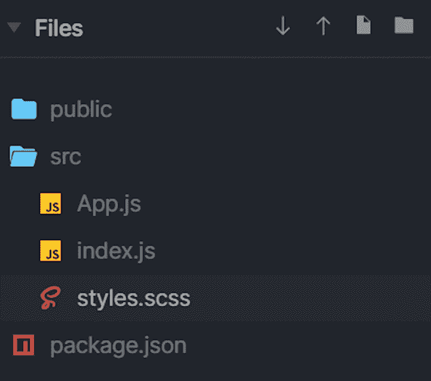
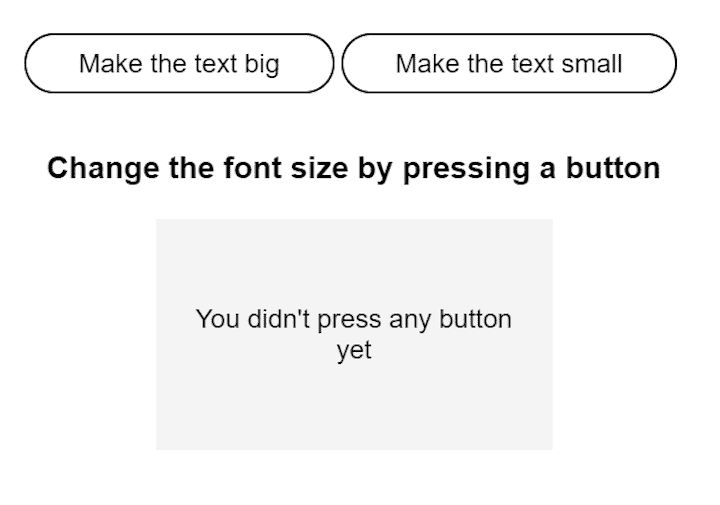
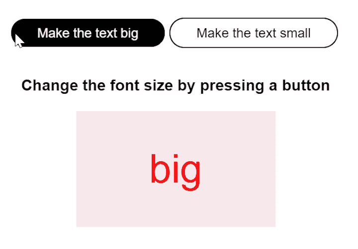
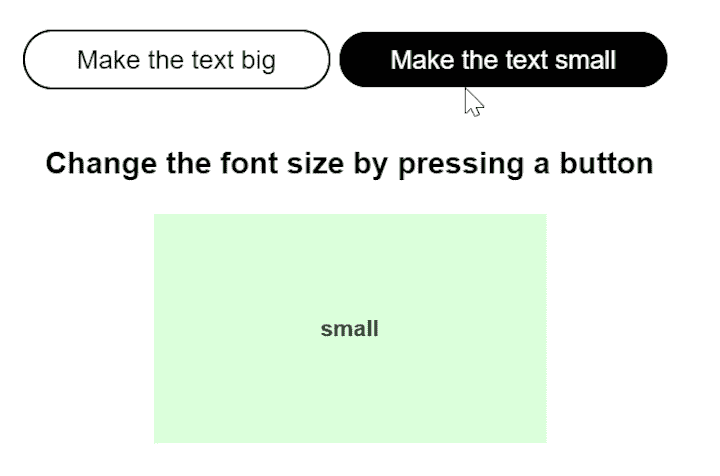
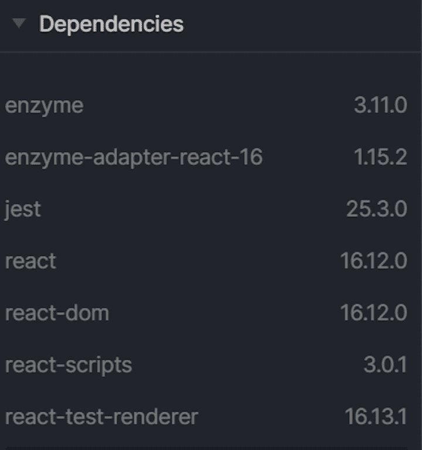
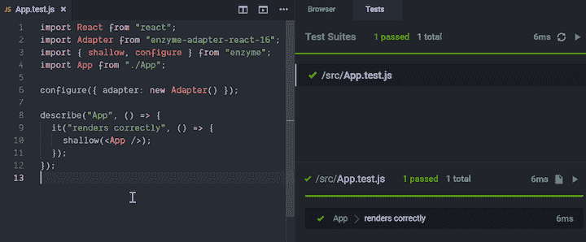
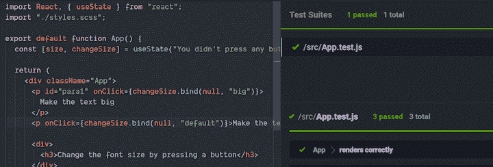
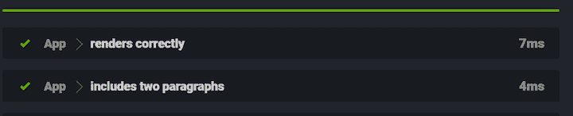
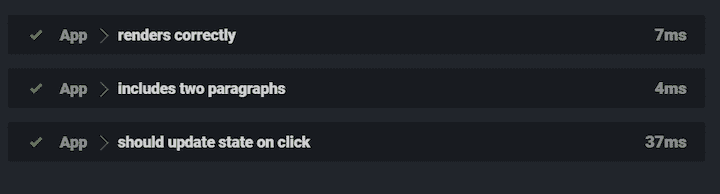

# 测试 React 功能组件的状态变化

> 原文：<https://blog.logrocket.com/testing-state-changes-in-react-functional-components/>

React 使用两种类型的组件:函数式组件和类组件。前者相当于 JavaScript 函数，而后者对应于 JS 类。

功能组件更简单，因为它们是无状态的，React 鼓励使用这种类型。同时，React 创建者建议将功能组件编写为纯函数，这意味着任何状态更改都应该在组件本身之外处理。

您可能会遇到包含影响其呈现的信息的组件，但是您不希望该数据对整个应用程序可用。换句话说，您希望将状态保持在本地，并在该组件中单独管理它。

## 向功能组件添加状态

如果您选择使用类组件，事情非常简单，因为它们有内置的状态。但是，如果因为简单而选择功能组件，那么添加状态的唯一方法就是使用`hooks`。

假设您的应用程序主要由功能组件组成，稍后您意识到在某些组件中需要状态。除了重构代码，你还可以使用一个钩子，比如`useState`。钩子在类组件内部不起作用。

下面是带有`useState`钩子的功能组件和带有内置状态的类组件之间的比较。

功能组件:

```
import React, { useState } from "react";
import "./styles.scss";

export default function App() {
 const [size, changeSize] = useState("You didn't press any button yet");

 return (
   <div className="App">
     <p id="para1" onClick={changeSize.bind(null, "big")}>
       Make the text big
     </p>
     <p onClick={changeSize.bind(null, "small")}>
       Make the text small
     </p>
     <div>
       <h3>Change the font size by pressing a button</h3>
     </div>
     <div id="result" className={`box ${size}`}>
       {size}
     </div>
   </div>
 );
}

```

下面是相同的组件，但是作为一个类编写:

```
import React, { Component } from "react";
import "./styles.scss";

export default class App extends Component {
 constructor(props) {
   super(props);
   this.state = {
     size: "default",
     message: "Default font size"
   };
 }

 changeBig = () => {
   this.setState({ size: "big", message: "big" });
 };

 changeSmall = () => {
   this.setState({ size: "small", message: "small" });
 };

 render() {
   return (
     <div className="App">
       <p onClick={this.changeBig}>Make the text big</p>
       <p onClick={this.changeSmall}>Make the text small</p>

       <div>
         <h3>Change the font size by pressing a button</h3>
       </div>
       <div className={`box ${this.state.size}`}>{this.state.message}</div>
     </div>
   );
 }
}

```

很明显，功能组件更容易编写和处理，因为它有更少的代码行，您可以“挂钩”并根据需要添加状态。

这种方法的挑战在于，您的无状态组件无法自己模拟状态变化。因为钩子是内部的，所以你不能调用它们。所以如果你想测试这个组件的行为，你需要一个触发状态改变的函数。

这个函数必须满足两个额外的要求:它应该作为组件的一个道具可用，并利用一个模拟事件。有了这个，您就可以通过寻找它的副作用来测试状态是否已经被更新，比如呈现组件的道具的更新。

理论已经足够了——让我们在实践中看看吧！我们将用 Jest 和酶测试上面的功能成分。

## 在 React 中构建演示组件



我们将呈现一个组件，当您按下其中一个按钮时，它会改变字体的大小。



在`App.js file`中，添加以下代码。

```
import React, { useState } from "react";
import "./styles.scss";

export default function App() {
 const [size, changeSize] = useState("You didn't press any button yet");

 return (
   <div className="App">
     <p id="para1" onClick={changeSize.bind(null, "big")}>
       Make the text big
     </p>
     <p onClick={changeSize.bind(null, "small")}>Make the text small</p>

     <div>
       <h3>Change the font size by pressing a button</h3>
     </div>
     <div id="result" className={`box ${size}`}>
       {size}
     </div>
   </div>
 );
}

```

然后，在`style.scss file`中，添加这段代码:

```
.App {
 font-family: sans-serif;
 text-align: center;
}

p {
 background-color: transparent;
 color: black;
 border-radius: 2rem;
 padding: 0.5rem 2rem;
 border: 1px solid;
 margin-right: 0.25rem;
 display: inline-block;

 &:hover {
   background-color: black;
   color: white;
 }
}

.box {
 background-color: rgb(245, 244, 244);
 height: 100px;
 width: 200px;
 padding: 20px;
 margin: 20px auto;
 display: flex;
 align-content: center;
 justify-content: center;
 align-items: center;
}

.default {
 font-size: 18px;
 color: blue;
 background-color: rgb(219, 245, 255);
}

.big {
 font-size: 48px;
 color: red;
 background-color: rgb(247, 233, 235);
}

.small {
 font-size: 14px;
 font-weight: bold;
 color: green;
 background-color: rgb(219, 255, 219);
}

```

当您按下第一个按钮时，字体大小会增加。



同理，当你按下第二个按钮时，字体大小减小。



对于这个简单的应用程序，我们希望首先测试组件是否被正确呈现，然后我们将测试类名的变化，这个变化应该在`onClick`事件之后发生。

## 在项目中加入笑话和酶

在编写测试之前，让我们澄清一下为什么我们需要这两个工具。Jest 和 Enzyme 很相似，但它们的用途略有不同。

它们都可以执行单元测试，但是 Jest 是一个全功能的测试框架，这意味着它提供了一个断言库来帮助你测试整个应用程序。

Jest 主要通过快照来测试组件，将呈现组件的输出与保存的 HTML 快照进行比较。当两者一致时，测试通过，但是如果呈现的输出与快照不同，Jest 会引发测试失败。

开玩笑地说，快照测试的问题在于，每当您更改哪怕一行代码时，您都需要重复快照，然后逐行比较 HTML 输出，看看发生了什么变化。Enzyme 通过提供检查组件并返回失败或通过响应的 API 解决了这个问题。

在这个练习中，我们将一起使用 Enzyme 和 Jest 来简化测试。我们将创建一个单独的测试文件，我们将在其中添加我们的配置，但是在实际项目中，将这些分开是一个很好的实践。

我们先把 Jest 和 Enzyme 加为依存。



下一步是为测试创建一个新文件，并将其命名为`App.test.js`。

```
import React from "react";
import Adapter from "enzyme-adapter-react-16";
import { shallow, configure } from "enzyme";
import App from "./App";

configure({ adapter: new Adapter() });

describe("App", () => {
 it("renders correctly", () => {
   shallow(<App />);
 });
});

```

在本练习中，酶测试需要导入才能与 React 一起正常工作。如果我们看一下测试的语法，我们会发现它使用了一些关键字:

*   将一个测试套件分解成多个更小的测试。如果您想进一步划分测试，您可以嵌套多个`describe`语句
*   `it`描述单个测试。换句话说，`it`解释了组件应该做什么。该语句不能嵌套
*   呈现单个组件，不包括其子组件，所以它非常适合呈现独立的组件和执行纯单元测试

现在让我们运行第一个测试，看看组件是否正确呈现。



如果我们将类名改为绿色的小字体并使用`default`会怎么样？让我们看看当我们更改代码并再次运行测试时会发生什么。



即使行为不正确，测试仍然通过，因为我们没有用这种类型的测试来测试行为。

在测试功能之前，让我们再做一个练习，检查呈现的组件是否包含两个段落。

在`App.test.js`文件中，我将代码调整如下:

```
import React from "react";
import Adapter from "enzyme-adapter-react-16";
import { shallow, configure } from "enzyme";
import App from "./App";

configure({ adapter: new Adapter() });

describe("App", () => {
 it("renders correctly", () => {
   shallow(<App />);
 });

 it("includes two paragraphs", () => {
   const wrapper = shallow(<App />);
   expect(wrapper.find("p").length).toEqual(2);
 });
});

```

现在我们检查呈现的组件是否找到了两个段落。事实上，测试通过了。



最后，让我们测试应用程序的实际功能，看看点击时状态是否会改变。我们将为此模拟一个函数，并编写如下测试。

```
it("should update state on click", () => {
   const changeSize = jest.fn();
   const wrapper = mount(<App onClick={changeSize} />);
   const handleClick = jest.spyOn(React, "useState");
   handleClick.mockImplementation(size => [size, changeSize]);

   wrapper.find("#para1").simulate("click");
   expect(changeSize).toBeCalled();
 });

```

这里，我们首先定义一个模拟函数，`changeSize = jest.fn()`。该函数调整组件的状态，并在`handleClick`函数中调用。我们正在使用`jest.spyOn()`函数，其语法如下:

```
jest.spyOn(object, methodName)

```

这个函数创建一个类似于`jest.fn`的模拟函数，同时跟踪对对象的方法(`methodName`)的调用。所以我们正在测试验证调用这个函数是否真的调用了`useState`钩子(函数)。

如果调用了`useState`，当我们模拟点击`#para1`(第一段)时，我们应该得到一个`changeSize`函数的真值。

当我们运行测试时，我们看到这个也通过了。



我希望本指南能让您了解如何测试 React 功能组件。特别是，我希望您带着 Jest 和 Enzyme 作为测试库，更好地理解使用钩子的组件的状态变化。

## 使用 LogRocket 消除传统反应错误报告的噪音

[LogRocket](https://lp.logrocket.com/blg/react-signup-issue-free)

是一款 React analytics 解决方案，可保护您免受数百个误报错误警报的影响，只针对少数真正重要的项目。LogRocket 告诉您 React 应用程序中实际影响用户的最具影响力的 bug 和 UX 问题。

[ ](https://lp.logrocket.com/blg/react-signup-general) [  ](https://lp.logrocket.com/blg/react-signup-general) [LogRocket](https://lp.logrocket.com/blg/react-signup-issue-free)

自动聚合客户端错误、反应错误边界、还原状态、缓慢的组件加载时间、JS 异常、前端性能指标和用户交互。然后，LogRocket 使用机器学习来通知您影响大多数用户的最具影响力的问题，并提供您修复它所需的上下文。

关注重要的 React bug—[今天就试试 LogRocket】。](https://lp.logrocket.com/blg/react-signup-issue-free)