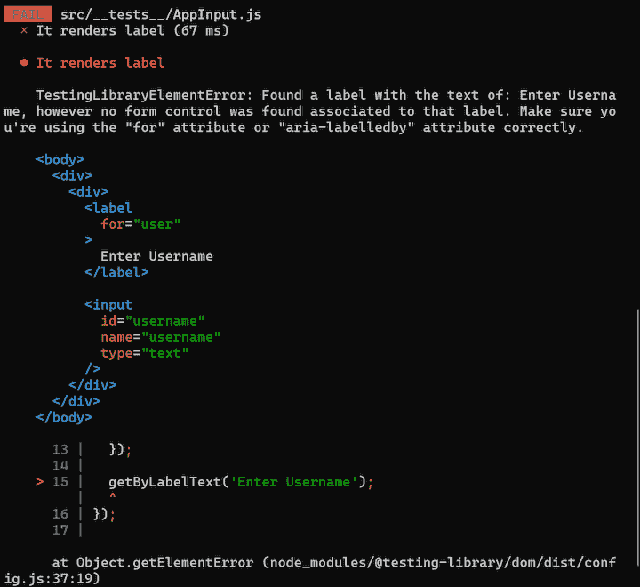
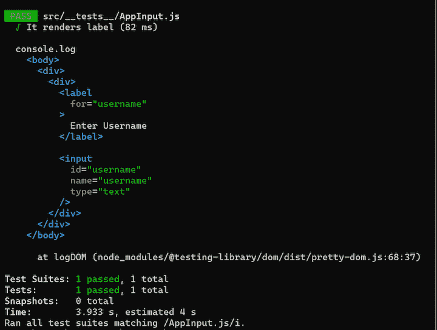

# 用 Vue 测试库测试 Vue 组件

> 原文：<https://blog.logrocket.com/testing-vue-components-with-vue-testing-library/>

测试在任何应用程序的开发中都是至关重要的。在测试阶段偷工减料会导致错误的信心，最终导致一个有缺陷的应用。

在本教程中，我们将演示如何使用 [Vue 测试库](https://www.npmjs.com/package/@testing-library/vue)测试 Vue 组件。虽然我们可以使用无数的其他测试库，但我支持以用户使用的方式测试你的应用程序，这正是 Vue 测试库的目标。

Vue 测试库[测试库](https://testing-library.com/docs/intro)家族的成员，包括 React 测试库、DOM 测试库等等。它建立在 Vue 的官方测试库 Vue Test Utils 和 DOM Testing Library 之上，这使得它能够使用测试库家族的特性。

## **先决条件**

要学习本教程，您应该具备:

*   [节点](https://nodejs.org/en/) > 8.0.0 和 npm > 6 安装在您的机器上
*   [Vue CLI](https://cli.vuejs.org/guide/installation.html) > 4 安装在您的机器上
*   对 Vue 的基本了解
*   对使用 [Jest](https://jestjs.io/) 进行测试的基本理解

## 设置

因为我们将创建和测试单文件组件，所以您需要使用 Vue CLI 创建一个新的 Vue 项目。

运行下面的命令来设置一个新的 Vue 项目。

```
vue create testing-vue-components.

```

我们可以坚持默认的 Vue 配置，因为我们将自己安装任何额外的依赖项。

Vue 测试库可以用于很多测试框架，但是在本教程中我们将使用 Jest。

安装 jest 和 Vue 测试库。

```
npm i --save-dev jest @testing-library/vue

```

由于我们将编写 ES6，我们需要使用 Babel 来为我们处理编译。Vue 已经附带了一个 Babel 配置，所以我们只需要安装`babel-jest`并配置 Jest 来使用 Babel 转换`.js`文件。

```
npm i --save-dev babel-jest

```

同样，因为我们正在编写单文件组件，所以我们需要配置 Jest 来加载`.vue`文件。`vue-jest`包有助于这一点。

```
npm install --save-dev [email protected]

```

最后，更新`package.json`以包含必要的配置。

```
"jest": {
    "moduleFileExtensions": [
      "js",
      "json",
      "vue"
    ],
    "transform": {
      "^.+\\.js$": "babel-jest",
      ".*\\.(vue)$": "vue-jest"
    }
  },

```

## 测试简单组件

当用户加载页面时，他们应该能够看到组件，所以首先要测试的应该是组件的呈现。

考虑这个简单的`Counter`组件，它提供了两个用于计数的按钮并显示计数的数量:

```
// Counter.vue
<template>
  <div>
    <h3>Count: {{ counter }}</h3>
    <div class="button-container">
      <button @click="increment">Add</button>
      <button @click="decrement">Subtract</button>
    </div>
  </div>
</template>

<script>
export default {
  name: 'Counter',
  data() {
    return {
      counter: 0,
    };
  },
  methods: {
    increment() {
      this.counter++;
    },
    decrement() {
      this.counter--;
    },
  },
};
</script>

```

为了测试组件，在`tests`目录中创建一个`Counter.js`文件。

```
import Counter from '../Counter.vue';
import { render } from '@testing-library/vue';
test('It renders correctly', () => {
  const { getByText } = render(Counter);
  getByText('Count: 0');
});

```

`getByText`助手检查文档中是否有带有指定参数的文本。在我们的计数器组件中，`counter`的初始状态被设置为`0`，因此无需点击任何按钮，我们就应该将`Count: 0`呈现到文档中。

用户可能执行的其他操作包括单击两个按钮，所以我们也需要测试这些操作。

```
import Counter from '../Counter.vue';
import { render, fireEvent } from '@testing-library/vue';

test('It correctly responds to button clicks', async () => {
  const { getByText } = render(Counter);
  // Check initial state
  getByText('Count: 0');

  // Get buttons.
  const addButton = getByText('Add');
  const subtractButton = getByText('Subtract');

  // Click the Add button.
  await fireEvent.click(addButton);
  // Counter should be updated.
  getByText('Count: 1');

  // Click the subtract button.
  await fireEvent.click(subtractButton);
  // Counter should be updated.
  getByText('Count: 0');
  // Further clicks
  await fireEvent.click(addButton);
  await fireEvent.click(addButton);
  await fireEvent.click(addButton);
  await fireEvent.click(addButton);
  getByText('Count: 4');
  await fireEvent.click(subtractButton);
  await fireEvent.click(subtractButton);
  getByText('Count: 2');
});

```

使用`getByText`，我们可以像普通用户一样获得按钮并点击它们。

顾名思义，`fireEvent`用于调度元素上的不同事件。我们在这里等待事件，因为 Vue 异步更新 DOM，因此从`fireEvent`调度的所有事件返回一个承诺，该承诺将在下一个 tick 得到解决。

## 测试表单元素

考虑下面的组件。它存储使用 V-model 建立双向数据绑定的内容，并在屏幕上显示用户在输入字段中输入的内容。

```
// Repeater.vue
<template>
  <section>
    <label for="item">Start Typing</label>
    <input type="text" v-model="item" id="item" />
    <div>You typed: {{ item }}</div>
  </section>
</template>
<script>
export default {
  data() {
    return {
      item: '',
    };
  },
};
</script>
<style></style>

```

要像用户使用它一样测试这个组件，我们需要像用户一样思考。用户来到页面，看到“开始输入”标签，并在输入字段中输入内容。用户希望输出显示在输出 div 中。我们的测试应该相应地断言这些。

```
import Repeater from '../Repeater.vue';
import { render, fireEvent } from '@testing-library/vue';

test('User can type and see output on the screen', async () => {
  const { getByLabelText, getByText, debug } = render(Repeater);
  // Get input associated with label.
  const input = getByLabelText('Start Typing');
  // Update the input field.
  await fireEvent.update(input, 'Sample text');
  // Assert that the update is successful.
  getByText('You typed: Sample text');

  // View the current state of the dom.
  debug();
});

```

使用`getByLabelText`方法，我们可以获得与特定标签相关联的输入字段。

* * *

### 更多来自 LogRocket 的精彩文章:

* * *

为了确保 V-model 正常工作，输入到输入字段中的内容应该显示在输出区域中。因此，我们应该用`Sample text`更新输入字段，并断言我们可以在 DOM 上找到它。

一些复杂的表单有验证，这是计算属性。让我们来看看如何用 Vue 测试库来测试它们。

```
// Form.vue

<template>
  <form action="">
    <label for="name">Name</label>
    <input type="text" name="name" id="name" v-model="name" />
    <label for="email">Email</label>
    <input type="email" name="email" id="email" v-model="email" />
    <button type="submit" :disabled="!hasValidFields">Submit</button>
  </form>
</template>
<script>
export default {
  name: 'AppForm',
  data() {
    return {
      name: '',
      email: '',
    };
  },
  computed: {
    hasValidFields() {
      return Boolean(this.email && this.name);
    },
  },
};
</script>
<style></style>

```

这个简单的表单组件通过确保提交按钮不能被点击来验证用户输入，除非两个字段都包含有效值。

像往常一样，为了测试这个组件，我们将像用户一样与它进行交互。

```
import Form from '../Form.vue';
import { render, fireEvent } from '@testing-library/vue';
test('User interaction with form', async () => {
  const { getByLabelText, getByText } = render(Form);
  const nameField = getByLabelText('Name');
  const emailField = getByLabelText('Email');
  const submitBtn = getByText('Submit');
  expect(submitBtn.disabled).toBe(true);
  // Update the name field.
  await fireEvent.update(nameField, 'James John');
  expect(submitBtn.disabled).toBe(true);
  // Add email.
  await fireEvent.update(emailField, '[email protected]');
  expect(submitBtn.disabled).toBe(false);
});

```

正如我们的测试所示，提交按钮应该被禁用，直到所有必填字段都已提供。

## 测试复杂组件

您肯定会遇到依赖外部数据的更复杂的组件，要么通过 props，要么通过 AJAX 请求获取数据。

道具和其他项目(如插槽)可以通过 render 方法的第二个参数传递给正在呈现的组件。

考虑将在整个应用程序中使用的输入组件:

```
// AppInput.vue
<template>
  <div>
    <slot name="label"></slot>
    <input type="text" :name="name" :id="inputId" />
  </div>
</template>
<script>
export default {
  props: {
    name: {
      required: true,
      type: String,
    },
    inputId: {
      required: true,
      type: String,
    },
  },
};
</script>

```

相应的测试是:

```
import AppInput from '../AppInput.vue';
import { render } from '@testing-library/vue';
test('It renders label', () => {
  const { getByLabelText } = render(AppInput, {
    props: {
      name: 'username',
      inputId: 'username',
    },
    slots: {
      label: `<label for="username">Enter Username</label>`,
    },
  });
  // Get input field by label text.
  getByLabelText('Enter Username');
});

```

## 调试测试

偶尔，测试会失败，重要的是要清楚地了解哪里出错了，以避免将来出现类似的错误。这才是 Vue 测试库真正出彩的地方。

```
test('It renders label', () => {
  const { getByLabelText} = render(AppInput, {
    props: {
      name: 'username',
      inputId: 'username',
    },
    slots: {
      // Note wrong attribute value.
      label: `<label for="user">Enter Username</label>`,
    },
  });
  getByLabelText('Enter Username');
});

```

上述测试失败，因为`getByLabelText`找不到标签的相关输入字段。下面是错误消息的样子:



我们还可以查看 DOM 在不同时间点的状态。让我们调试一下`AppInput`组件，看看 DOM 呈现了什么。

```
import AppInput from '../AppInput.vue';
import { render } from '@testing-library/vue';
test('It renders label', () => {
  const { getByLabelText, debug } = render(AppInput, {
    props: {
      name: 'username',
      inputId: 'username',
    },
    slots: {
      label: `<label for="username">Enter Username</label>`,
    },
  });
  getByLabelText('Enter Username');

  // Logs a representation of the dom at this state.
  debug();
});

```

运行该测试将产生以下结果。



## 结论

在本教程中，我们演示了如何使用 Vue 测试库测试不同的组件。我希望我们讨论过的概念能启发你培养更好的测试习惯。最重要的是，我希望本教程能够揭示在用户如何与组件交互的背景下测试组件的好处。

## 像用户一样体验您的 Vue 应用

调试 Vue.js 应用程序可能会很困难，尤其是当用户会话期间有几十个(如果不是几百个)突变时。如果您对监视和跟踪生产中所有用户的 Vue 突变感兴趣，

[try LogRocket](https://lp.logrocket.com/blg/vue-signup)

.

[](https://lp.logrocket.com/blg/vue-signup)[https://logrocket.com/signup/](https://lp.logrocket.com/blg/vue-signup)

LogRocket 就像是网络和移动应用程序的 DVR，记录你的 Vue 应用程序中发生的一切，包括网络请求、JavaScript 错误、性能问题等等。您可以汇总并报告问题发生时应用程序的状态，而不是猜测问题发生的原因。

LogRocket Vuex 插件将 Vuex 突变记录到 LogRocket 控制台，为您提供导致错误的环境，以及出现问题时应用程序的状态。

现代化您调试 Vue 应用的方式- [开始免费监控](https://lp.logrocket.com/blg/vue-signup)。