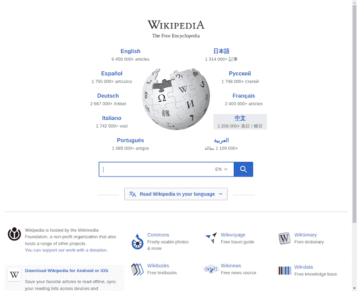
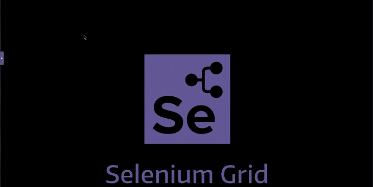
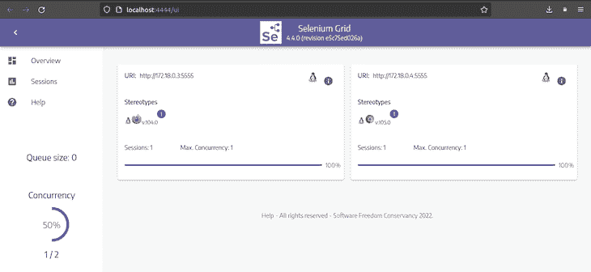

# 用 Selenium 和 Docker 测试网站

> 原文：<https://blog.logrocket.com/testing-website-selenium-docker/>

Selenium 是一个流行的浏览器自动化工具，主要用于测试 web 应用程序的自动化。Selenium 支持大多数操作系统和浏览器，包括 Chrome、Firefox、Edge 等。

Selenium Grid 是一个工具，它使您能够在多台机器上并行运行测试。它通过将客户端发送的命令路由到远程浏览器实例，允许在远程机器上执行浏览器会话脚本。

[Docker](https://www.docker.com/) [，](https://www.docker.com/)正如我在[这篇文章](https://blog.logrocket.com/deploy-react-app-kubernetes-using-docker/)中解释的，是一个开源软件容器化平台，它允许你将应用打包成标准化的、孤立的单元，称为容器。这些容器将应用程序的源代码与在任何环境中运行该代码所需的操作系统库和依赖项结合起来。

在本教程中，您将了解为什么以及如何使用 Selenium 和 Docker 来测试网站。您还将学习如何启动一个 Selenium 网格，它将允许您同时在多个浏览器上测试一个网站。

向前跳:

## 为什么要用硒搭配 Docker？

您应该将 Selenium 与 Docker 一起使用，以避免诸如会话创建、跨浏览器测试和可伸缩性之类的问题。

### 会话创建问题

让我们假设您希望使用 Selenium 来测试一个网站在 Chrome 浏览器上的行为。要做到这一点，你必须下载正确的 Chrome 驱动程序版本，该版本与你机器上安装的 Chrome 浏览器版本兼容。否则，您根本无法运行您的测试。有了 Docker，你只需要运行一个 Docker 命令就可以获取包含你想要的 Chrome 浏览器版本的图片。

### 跨浏览器测试问题

现在，让我们假设您希望测试一个网站在一个只在特定操作系统中受支持的 Chrome 浏览器版本和一个只在另一个操作系统中受支持的 Firefox 浏览器版本上的行为。在这种情况下，您必须在两台独立的机器上安装两种不同的操作系统，仅仅是为了测试网站。使用 Docker，您只需提取特定浏览器的图像，启动 Selenium 网格，并使用单台机器测试网站。

### 可扩展性问题

想同时在多个浏览器版本上测试一个网站怎么办？同样，Docker 通过为您提供配置和启动 Selenium 网格的最简单方法，让您轻松地做到这一点。

## 先决条件

要学习本教程，您将需要以下内容:

## 创建项目根目录

在本节中，您将创建一个目录，并在其中创建一个新的节点项目，并安装所需的依赖项。在接下来的部分中，这个目录将用于存储允许您测试网站的脚本。

打开一个终端窗口，创建一个名为`selenium-docker`的新目录:

```
mkdir selenium-docker

```

导航到目录:

```
cd selenium-docker

```

使用`npm init`命令创建一个具有默认设置的新节点项目:

```
npm init -y

```

现在，使用`npm install`命令安装依赖项`selenium-webdriver`和`jest`:

```
npm install selenium-webdriver jest

```

运行上面的命令后，您已经安装了以下依赖项:

*   `[selenium-webdriver](https://www.selenium.dev/documentation/webdriver/)`:是一个节点模块，允许你控制 Selenium 的一个自动化浏览器实例。您将使用这个模块来控制 Docker 容器中运行的浏览器实例
*   `[jest](https://jestjs.io/)`:是一个专注于简单性的 JavaScript 测试框架。您将使用这个框架和 Selenium 一起测试一个网站

打开您的`package.json`文件，替换`scripts`中`test`属性的内容，如下所示:

```
"scripts": {
    "test": "jest"
}

```

这里，您指定了，当您运行命令`npm run test`时，您想要调用`jest`命令并执行您的测试。

## 对铬进行硒测试

在本节中，您将首先提取一个名为`selenium/standalone-chrome`的 Docker 图像，这将允许您控制一个在容器内运行的 Chrome 浏览器实例。提取图像后，您将创建一个包含该图像的容器。最后，您将编写一个脚本，允许您测试维基百科的主页。

回到您的终端窗口，运行以下 Docker 命令:

```
docker pull selenium/standalone-chrome

```

使用上面的 Docker 命令，您可以获得允许您控制在容器内运行的 Chrome 浏览器实例的图像。

现在使用下面的 Docker 命令创建一个容器，其中包含您刚刚提取的图像:

```
docker run -d -p 4444:4444 -p 7900:7900 --shm-size="2g" selenium/standalone-chrome

```

在这里，您指定了希望 Docker 容器以分离模式运行。

指定模式后，您将容器的端口`4444`和`7900`分别映射到机器的端口`4444`和`7900`。您将能够通过将您的测试指向 URL[http://localhost:4444](http://localhost:4444)来控制 Selenium 浏览器实例，并通过访问 URL[http://localhost:7900](http://localhost:7900)(密码是`secret`)来查看您的容器中发生了什么。

最后，将共享内存大小设置为`2g`，因为运行`selenium/standalone-chrome`映像的容器需要比 Docker 容器分配的默认`64M`更多的共享内存。

容器准备好可以使用了，现在是时候编写脚本来测试 Wikipedia 的主页了。

您将要编写的测试 Wikipedia 主页的脚本将使用 Selenium 来自动执行以下任务:

1.  启动 Chrome 浏览器实例
2.  导航到维基百科的主页
3.  将网页截图保存在您的工作目录中
4.  获取网页的标题

创建一个名为`chrome.test.js`的文件，并向其中添加以下代码:

```
const webdriver = require('selenium-webdriver');
const { Builder, Capabilities } = webdriver
let capabilities = Capabilities.chrome();

```

在上面的代码块中，您需要`selenium-webdriver`模块并将其存储在名为`webdriver`的变量中。每个`webdriver`都提供了对浏览器会话的自动控制。

导入模块后，您使用了一个析构赋值来解包`webdriver`对象的`Builder`和`capabilities`属性。

最后，您使用`capabilities`属性指定您想要使用 Selenium 来自动化 Chrome 浏览器，并将该规范存储在名为`capabilities`的变量中。

在`capabilities`变量下添加以下代码:

```
describe("Test if Wikipedia's home page's title is correct", () => {
    let driver;

    beforeAll(async () => {
        driver = new Builder()
            .usingServer('http://localhost:4444')
            .withCapabilities(capabilities)
            .build();
        await driver.get("https://www.wikipedia.org/");
    }, 30000);

    afterAll(async () => {
        await driver.quit();
    }, 40000);
});

```

在这里，您首先使用 Jest 提供的`describe`函数来编写测试描述。

写完描述后，您创建了一个名为`driver`的变量。然后，您使用 Jest 提供的`beforeAll`函数来指定在测试运行之前需要进行的设置工作。在`beforeAll`函数中，您使用`Builder`属性创建了一个新的`webdriver`，并传递了 URL[http://localhost:4444](http://localhost:4444)和`capabilities`作为参数。然后，您将新的`webdriver`存储在一个名为`driver`的变量中，然后使用`driver.get()`方法导航到维基百科的主页。

最后，您使用 Jest 提供的`afterAll`函数来指定运行测试后需要进行的工作。在`afterAll`函数中，您使用了`driver.quit()`方法来终止浏览器会话。

* * *

### 更多来自 LogRocket 的精彩文章:

* * *

在`afterAll`函数下面添加以下代码:

```
it('test', async () => {
    try {
        await driver.takeScreenshot().then(
            function (image) {
                require('fs').writeFileSync('screenshot.png', image, 'base64');
            }
        );
        let title = (await driver.getTitle()).trim()
        expect(title).toEqual("Wikipedia");
    } catch (err) {
        throw err;
    }
}, 35000);

```

在上面的代码中，您使用 Jest 提供的`it`函数来指定需要在这个测试文件中运行的测试。

首先你使用`driver.takeScreenshot()`方法对网页进行截图，然后你使用`fs`模块将截图保存在你的工作目录下，名字为`screenshot.png`。

拍摄并保存截图后，您使用了`driver.getTitle()`方法来获取网页的标题，并将返回的值保存在一个名为`title`的变量中。

最后，您使用 Jest 提供的`expect`函数来检查网页的标题是否等于“维基百科”。只有当网页的标题等于“维基百科”时，测试才会通过

添加完最后一点代码后，您的`chrome.test.js`文件应该如下所示:

```
const webdriver = require('selenium-webdriver');
const { Builder, Capabilities } = webdriver
let capabilities = Capabilities.chrome();

describe("Test if Wikipedia's home page's title is correct", () => {
    let driver;
    beforeAll(async () => {
        driver = new Builder()
            .usingServer('http://localhost:4444')
            .withCapabilities(capabilities)
            .build();
        await driver.get("https://www.wikipedia.org/");
    }, 30000);

    afterAll(async () => {
        await driver.quit();
    }, 40000);

    it('test', async () => {
        try {
            await driver.takeScreenshot().then(
                function (image) {
                    require('fs').writeFileSync('screenshot.png', image, 'base64');
                }
            );
            let title = (await driver.getTitle()).trim()
            expect(title).toEqual("Wikipedia");
        } catch (err) {
            throw err;
        }
    }, 35000);
});

```

使用以下命令之一运行测试:

```
npm run test

```

或者:

```
npm test

```

您应该会看到类似如下的输出:

```
PASS  ./chrome.test.js (7.399 s)
  Test if Wikipedia's home page's title is correct
    ✓ test (189 ms)

Test Suites: 1 passed, 1 total
Tests:       1 passed, 1 total
Snapshots:   0 total
Time:        7.44 s
Ran all test suites.

```

如果你的输出与上面的类似，这意味着你编写的在 Chrome 浏览器中测试维基百科主页的测试已经通过。

在您的工作目录中，您会发现创建了一个名为`screenshot.png`的图像，如果您打开它，它将如下所示:



## 在 Firefox 上运行 Selenium 测试

在本节中，您将首先提取一个名为`selenium/standalone-firefox`的 Docker 映像，它将允许您控制一个在容器内运行的 Firefox 浏览器实例。提取图像后，您将创建一个包含该图像的容器。最后，您将编写一个脚本，允许您测试 Wikipedia 的搜索栏，然后您将学习如何观察容器内部发生的情况。

回到您的终端窗口，运行以下 Docker 命令:

```
docker pull selenium/standalone-firefox

```

使用上面的 Docker 命令，您获得了允许您控制在容器内运行的 Firefox 浏览器实例的图像。

在使用此映像创建容器之前，您必须停止在上一节中创建的容器:

```
docker stop container_id

```

现在使用下面的 Docker 命令创建一个容器，其中包含您刚刚提取的图像:

```
docker run -d -p 4444:4444 -p 7900:7900 --shm-size="2g" selenium/standalone-firefox

```

这里，您创建了一个带有`selenium/standalone-firefox`图像的 Docker 容器，其配置与您在上一节中使用的配置相同。

容器准备好可以使用了，现在是时候编写脚本来测试 Wikipedia 的搜索栏了。

您将要编写的测试 Wikipedia 搜索栏的脚本将使用 Selenium 来自动执行以下任务:

1.  启动 Firefox 浏览器实例
2.  导航到维基百科的主页
3.  单击搜索栏
4.  在搜索栏中写下主题“编程语言”
5.  提交包含搜索栏元素的表单并导航到新页面
6.  获取在新页面的元素中找到的文章的标题

创建一个名为`firefox.test.js`的文件，并向其中添加以下代码:

```
const webdriver = require('selenium-webdriver');
const { By, until, Builder, Capabilities } = webdriver
let capabilities = Capabilities.firefox();

```

在上面的代码块中，您做了与上一节相同的事情，只是这次您还解包了属性`By`和`until`，并指定您想要使用 Firefox 浏览器。

在`capabilities`变量下添加以下代码:

```
describe('Test if the search bar is working correctly', () => {
  let driver;

  beforeAll(async () => {
    driver = new Builder()
      .usingServer('http://localhost:4444/')
      .withCapabilities(capabilities)
      .build();
    await driver.get("https://www.wikipedia.org/");
    await driver.wait(until.titleMatches(/Wikipedia/i), 5000);
  }, 30000);

  afterAll(async () => {
    await driver.quit();
  }, 40000);
});

```

这里，您使用了 Jest 提供的`describe`函数来编写测试的描述。

在`beforeAll`函数中，首先，您创建了一个新的`webdriver`，就像您在上一节中所做的一样。创建一个新的`webdriver`后，您使用`driver.get()`方法导航到维基百科的主页。最后，您使用了`driver.wait()`方法和`until`属性，让`webdriver`等待进入下一步，直到网页标题与单词“Wikipedia”匹配

在`afterAll`函数中，您做了与上一节相同的事情。

在`afterAll`函数下面添加以下代码:

```
it('test', async () => {
  try {
    const searchBar = await driver.wait(until.elementLocated(By.id('searchInput')), 5000);
    await searchBar.click()
    await searchBar.sendKeys("Programming language")
    await searchBar.submit()
    let span = await driver.wait(until.elementLocated(By.className('mw-page-title-main')), 5000)
    let title = await span.getText()
    expect(title).toEqual("Programming language");
  } catch (err) {
    throw err;
  }
}, 35000);

```

在上面的代码中，您使用 Jest 提供的`it`函数来指定需要在这个测试文件中运行的测试。

首先，您在`until`和`By`属性旁边使用了`driver.wait()`方法，让`webdriver`等待移动到下一步，直到搜索栏元素被定位。一旦定位了这个元素，就将它存储在一个名为`searchBar`的变量中。

找到搜索栏后，您使用`click()`方法模拟在搜索栏元素中单击鼠标，使用`sendKeys()`方法在搜索栏中编写文本，然后使用`submit()`方法提交搜索栏元素所在的表单并导航到新页面。

在新页面中，您使用了`driver.wait()`方法以及`until`和`By`属性，让`webdriver`等待移动到下一步，直到找到新页面中的一个元素。您将找到的元素存储在一个名为`span`的变量中。这个元素是存储文章标题的地方。

一旦元素被存储在一个名为`span`的变量中，您使用`getText()`方法来检索这个元素的文本，然后将文本存储在一个名为`title`的变量中。

最后，您使用 Jest 提供的`expect`函数来检查存储在名为`title`的变量中的值是否等于“编程语言”。只有当存储在变量`title`中的值等于“编程语言”时，测试才会通过

您的`firefox.test.js`文件应该如下所示:

```
const webdriver = require('selenium-webdriver');
const { By, until, Builder, Capabilities } = webdriver
let capabilities = Capabilities.firefox();

describe('Test if the search bar is working correctly', () => {
    let driver;

    beforeAll(async () => {
        driver = new Builder()
            .usingServer('http://localhost:4444/')
            .withCapabilities(capabilities)
            .build();
        await driver.get("https://www.wikipedia.org/");
        await driver.wait(until.titleMatches(/Wikipedia/i), 5000);
    }, 30000);

    afterAll(async () => {
        await driver.quit();
    }, 40000);

    it('test', async () => {
        try {
            const searchBar = await driver.wait(until.elementLocated(By.id('searchInput')), 5000);
            await searchBar.click()
            await searchBar.sendKeys("Programming language")
            await searchBar.submit()
            let span = await driver.wait(until.elementLocated(By.className('mw-page-title-main')), 5000)
            let title = await span.getText()
            expect(title).toEqual("Programming language");
        } catch (err) {
            throw err;
        }
    }, 35000);
});

```

使用以下命令运行测试:

```
npm test firefox.test.js

```

这里需要指定文件名，因为默认情况下，Jest 会运行工作目录中所有扩展名为`.test.js`的文件。

运行该命令后，您将看到如下输出:

```
PASS  ./firefox.test.js (14.673 s)
  Test if the search bar is working correctly
    ✓ test (1563 ms)

Test Suites: 1 passed, 1 total
Tests:       1 passed, 1 total
Snapshots:   0 total
Time:        14.719 s, estimated 18 s
Ran all test suites matching /firefox.test.js/i.

```

如果您得到类似上面的输出，这意味着您编写的测试通过了。请注意，在撰写本文时，这项测试正在通过，但如果维基百科决定在未来改变网站的代码，这可能会发生变化。

要查看容器内部发生了什么，打开 web 浏览器并导航到 URL[http://localhost:7900](http://localhost:7900)，输入密码`secret`，然后再次运行测试。

您应该会看到类似下面的内容:



请注意，在上面的 gif 中，您只能看到包含搜索主题的新页面，因为在初始化名为`span`的变量的代码行下面添加了一行，要求`webdriver`等待几秒钟。

## 在 Chrome 和 Firefox 上并行运行 Selenium 测试

在本节中，您将首先提取 Selenium Docker 图像，这将允许您启动 Selenium 网格并在 Chrome 和 Firefox 浏览器上运行您的测试。拖动图像后，您将使用它们来开始一个网格。最后，您将使用您在上一节中编写的脚本同时在 Chrome 和 Firefox 上测试 Wikipedia 的搜索栏。

Selenium 网格有以下两个主要的不同组件:hub 和 node。

*   hub 是 Selenium 网格中控制网格节点的中心点。它接收测试命令并将它们发送到节点
*   一个节点是 Selenium 网格的工作者，它接收并执行 hub 发送的测试命令。每当需要执行测试时，都会在该节点创建一个新的远程浏览器会话

请注意，您在前面几节中使用的独立 Docker 映像已经附带了一个集线器和节点。

回到您的终端窗口，使用以下命令停止您在上一节中启动的容器:

```
docker stop container_id

```

现在，调出允许您创建中枢的图像:

```
docker pull selenium/hub

```

拉出允许您创建 Chrome 浏览器节点的图像:

```
docker pull selenium/node-chrome

```

然后，提取允许您创建 Firefox 浏览器节点的图像:

```
docker pull selenium/node-firefox

```

在提取所需的 Docker 图像后，您将使用 Docker Compose 来创建 Selenium 网格。

创建一个名为`docker-compose.yml`的 Docker 合成文件，并向其中添加以下代码:

```
version: "3"
services:
  chrome:
    image: selenium/node-chrome
    shm_size: 2gb
    depends_on:
      - selenium-hub
    environment:
      - SE_EVENT_BUS_HOST=selenium-hub
      - SE_EVENT_BUS_PUBLISH_PORT=4442
      - SE_EVENT_BUS_SUBSCRIBE_PORT=4443
  firefox:
    image: selenium/node-firefox
    shm_size: 2gb
    depends_on:
      - selenium-hub
    environment:
      - SE_EVENT_BUS_HOST=selenium-hub
      - SE_EVENT_BUS_PUBLISH_PORT=4442
      - SE_EVENT_BUS_SUBSCRIBE_PORT=4443
  selenium-hub:
    image: selenium/hub
    container_name: selenium-hub
    ports:
      - "4442:4442"
      - "4443:4443"
      - "4444:4444"

```

使用上面的代码，您指定了想要用来启动 Selenium 网格的图像，以及节点容器应该监听哪些端口的事件。您还将集线器容器端口`4442`、`4443`和`4444`映射到您机器上的相同端口。

运行以下命令启动 Selenium 网格:

```
docker compose up

```

在使用网格运行测试之前，用以下内容替换您的`chrome.test.js`文件的所有内容:

```
const webdriver = require('selenium-webdriver');
const { By, until, Builder, Capabilities } = webdriver
let capabilities = Capabilities.chrome();

describe('Test if the search bar is working correctly', () => {
  let driver;

  beforeAll(async () => {
    driver = new Builder()
      .usingServer('http://localhost:4444/')
      .withCapabilities(capabilities)
      .build();
    await driver.get("https://www.wikipedia.org/");
    await driver.wait(until.titleMatches(/Wikipedia/i), 5000);
  }, 30000);

  afterAll(async () => {
    await driver.quit();
  }, 40000);

  it('test', async () => {
    try {
      const searchBar = await driver.wait(until.elementLocated(By.id('searchInput')), 5000);
      await searchBar.click()
      await searchBar.sendKeys("Programming language")
      await searchBar.submit()
      let span = await driver.wait(until.elementLocated(By.className('mw-page-title-main')), 5000)
      let title = await span.getText()
      expect(title).toEqual("Programming language");
    } catch (err) {
      throw err;
    }
  }, 35000);
});

```

这里，您将`firefox.test.js`文件的内容粘贴到了`chrome.test.js`文件中，然后修改了指定浏览器为 Chrome 而不是 Firefox 的那一行。

使用以下命令运行测试:

```
npm test 

```

打开您的浏览器并导航到 URL[http://localhost:4444/ui](http://localhost:4444/ui)，您应该会看到类似于以下内容的内容:



上图显示你在 Chrome 和 Firefox 浏览器中并行运行测试。

返回到您的终端窗口，您应该会看到以下输出:

```
PASS  ./chrome.test.js (18.977 s)
PASS  ./firefox.test.js (23.387 s)

Test Suites: 2 passed, 2 total
Tests:       2 passed, 2 total
Snapshots:   0 total
Time:        23.682 s
Ran all test suites.

```

上面的输出显示你为维基百科的搜索栏编写的测试在 Chrome 和 Firefox 上都通过了。

## 结论

在本教程中，您了解了为什么应该使用 Selenium 和 Docker 来测试网站。然后，您使用这些工具分别在 Chrome 和 Firefox 浏览器上测试一个网站，在这样做的同时，您还学习了如何可视化 Docker 容器内运行的测试。最后，您学习了如何同时在 Chrome 和 Firefox 浏览器上测试网站。

## 使用 [LogRocket](https://lp.logrocket.com/blg/signup) 消除传统错误报告的干扰

[](https://lp.logrocket.com/blg/signup)

[LogRocket](https://lp.logrocket.com/blg/signup) 是一个数字体验分析解决方案，它可以保护您免受数百个假阳性错误警报的影响，只针对几个真正重要的项目。LogRocket 会告诉您应用程序中实际影响用户的最具影响力的 bug 和 UX 问题。

然后，使用具有深层技术遥测的会话重放来确切地查看用户看到了什么以及是什么导致了问题，就像你在他们身后看一样。

LogRocket 自动聚合客户端错误、JS 异常、前端性能指标和用户交互。然后 LogRocket 使用机器学习来告诉你哪些问题正在影响大多数用户，并提供你需要修复它的上下文。

关注重要的 bug—[今天就试试 LogRocket】。](https://lp.logrocket.com/blg/signup-issue-free)