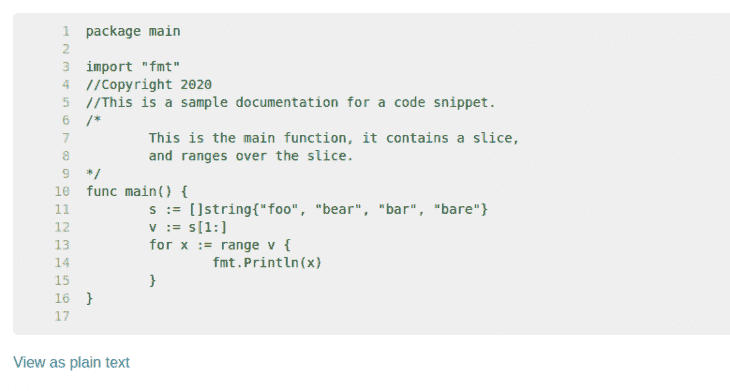

# 更好的 web 开发体验的最佳 Go 工具

> 原文：<https://blog.logrocket.com/the-best-go-tools-for-a-better-web-development-experience/>

软件开发并不一定是笨重或麻烦的。事实上，大多数现代编程语言都有各种工具来确保与之交互的开发人员拥有无缝体验。

在本文中，我们将看看一些最有用的工具，它们在使用 [Go](https://golang.org/) 编码时提供了更好的开发体验。Go 为我们提供了几个惊人的工具，以及一个可以用来编写符合我们需求的定制 Go 工具的包。

## 先决条件

要完成本教程，您需要:

## 理解`Go`命令

要开始使用 Go 工具，我们必须首先了解执行 Go 工具时使用的`go`命令。当您安装任何 Go 发行版时，您将可以访问`go`关键字。

[根据 Go 的创始人之一罗布·派克](https://golang.org/doc/articles/go_command.html)的说法，“新的`go`命令的目的是我们回归这个理想，即除了编写必要的导入语句之外，开发人员无需配置或额外努力就可以编译 Go 程序。”

当使用 Go 工具时，执行命令的语法通常是附加到`go`命令的工具名称，例如`go fix`。要查看所有已知工具的列表，只需在终端中运行`go tools`命令。

## 使用 Go 工具改进工作流程

在这一节中，我们将看看可以改进我们开发工作流程的各种 Go 工具:

### 1\. go vet

用任何编程语言编写代码时，都必然会出现语法、语义或逻辑错误。 [go vet](https://golang.org/cmd/vet/) 工具检查 go 代码的任何语法错误并报告它们。当你和团队一起工作时，这个工具特别方便。

当运行`go vet`命令时，它检查调用它的路径中的代码中的错误。也可以用类似于`go vet home/src/google-clone`的路径调用`go vet`，在这里它会检查指定路径的错误。

go vet 工具最强大的特性之一是它提供了一个我们可以指定的检查列表。当检查被指定时，Vet 工具将只报告我们的代码不遵守指定检查规则的实例。

例如，如果我们运行命令`go vet -tests=true`，Vet 工具将检查该目录的测试文件中的任何错误。要查看可以指定的所有检查的完整列表，请运行`go tool vet help`命令。

### 2.`gofmt`

[`gofmt`](https://golang.org/cmd/gofmt/) 工具是围棋生态系统中最流行的工具之一。它的功能是格式化 Go 源代码。`gofmt`工具更喜欢制表符而不是空格，并用制表符替换代码库中的任何缩进实例。您可以指定几个标志来进一步扩展`gofmt`工具的功能:

```
package main

import "fmt"

func main() {
   s := []string{"foo", "bear", "bar", "bare"}
   v := s[1:len(s)]
   for x, _ := range v {
      fmt.Println(x)
   }
}

```

上面的代码片段覆盖一个切片，并打印出该切片中每个元素的索引。如果我们想格式化它，我们只需运行这个命令:`gofmt -w -s .`

该命令包括`w`标志，它告诉`gofmt`工具覆盖我们文件的默认格式，并且不打印出所做的更改。我们指定的`s`标志让`gofmt`工具检查我们代码中的某些模糊之处并简化它。

当我们运行上面的命令时，我们的代码将被重构，如下所示。

```
func main() {
   s := []string{"foo", "bear", "bar", "bare"}
   v := s[1:]
   for x := range v {
      fmt.Println(x)
   }
}

```

简化了切片和范围表达式。很神奇，对吧？这个工具应该是每个 Go 开发者的朋友。

### 3.戈多克

快速浏览一下你最喜欢的 Go 软件包的源代码，你会发现文档在 Go 生态系统中是多么的重要。GoDoc 工具用于根据代码中的注释生成 Go 源代码的文档。然后，生成的文档可以显示为 HTML(通过使用`-html`标签指定)或纯文本。

```
package main

import "fmt"
//Copyright 2020
//This is a sample documentation for a code snippet.
/*
   This is the main function, it contains a slice,
   and ranges over the slice.
*/
func main() {
   s := []string{"foo", "bear", "bar", "bare"}
   v := s[1:]
   for x := range v {
      fmt.Println(x)
   }
}

```

上面的代码片段是上面讨论的 range 示例的注释版本。如果我们在浏览器上运行`godoc -http=:6060`并访问`localhost:6060`，我们会看到一个类似这样的 HTML 页面，它向我们展示了我们的文档和代码。



GoDoc 还为我们提供了在本地查看 Go 标准库中可用的任何包的文档的功能，并且不需要互联网连接。要查看包的文档，只需将包的名称附加到`godoc`上，然后运行命令。

### 4.去拿

顾名思义，Get 工具用于获取第三方包或依赖项并将其安装到 Go 项目中。`go get`命令接受要安装的包的 URL。

开发者可以创建开源的第三方围棋工具。我们也可以使用`go get`命令安装这些第三方工具，像`go get` `github.com/kisielk/errcheckgithub.com/kisielk/errcheck`一样传入包的 URL。go get 工具是迄今为止最重要和最常用的 go 工具。

## 结论

所有这些 Go 工具都可以与 Git 挂钩结合使用，在提交版本控制之前自动执行它们。[这篇文章](https://blog.logrocket.com/configuring-git-hooks-for-the-win/)是让你开始使用 Git 钩子的很好的指南。

在这篇博文中，我们介绍了如何在编写代码时利用各种 Go 工具来改进我们的开发工作流程和整体体验。要了解更多关于各种 Go 工具的信息，请访问 Go 网站。

## 使用 [LogRocket](https://lp.logrocket.com/blg/signup) 消除传统错误报告的干扰

[](https://lp.logrocket.com/blg/signup)

[LogRocket](https://lp.logrocket.com/blg/signup) 是一个数字体验分析解决方案，它可以保护您免受数百个假阳性错误警报的影响，只针对几个真正重要的项目。LogRocket 会告诉您应用程序中实际影响用户的最具影响力的 bug 和 UX 问题。

然后，使用具有深层技术遥测的会话重放来确切地查看用户看到了什么以及是什么导致了问题，就像你在他们身后看一样。

LogRocket 自动聚合客户端错误、JS 异常、前端性能指标和用户交互。然后 LogRocket 使用机器学习来告诉你哪些问题正在影响大多数用户，并提供你需要修复它的上下文。

关注重要的 bug—[今天就试试 LogRocket】。](https://lp.logrocket.com/blg/signup-issue-free)