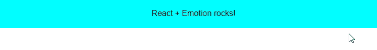
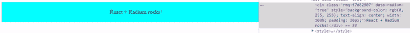
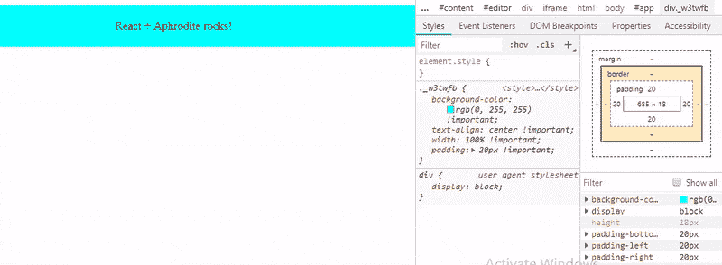
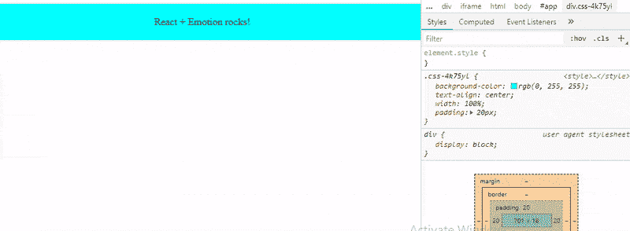
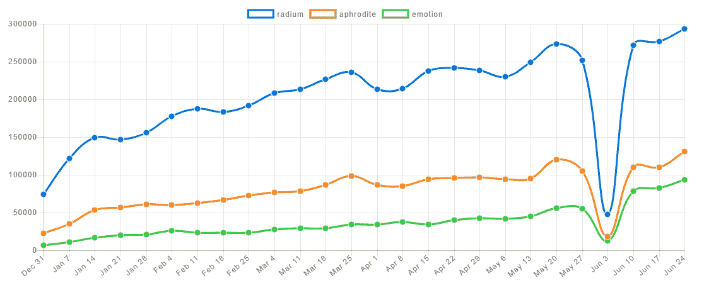

# 最佳 React 内联样式库比较

> 原文：<https://blog.logrocket.com/the-best-react-inline-style-libraries-comparing-radium-aphrodite-emotion-849ef148c473/>

在任何重要的 React 应用程序中，如果管理不当，CSS 样式会成为一个问题。

全局样式定义、`!important`规则无处不在、重用组件时灵活性低都是这些问题的例子。

这导致了使用 CSS 文件的传统方法的替代方法。例如，这里有一个关于[三种造型方法](https://blog.logrocket.com/the-best-styling-in-react-tutorial-youve-ever-seen-676f1284b945)的好帖子。

这篇文章是关于内联样式的。然而，我不会谈论[它们是什么](https://zhenyong.github.io/react/tips/inline-styles.html)或[你是否应该使用它们](https://www.engineyard.com/blog/inline-styles-yes-or-no)。

我将讨论将帮助您在 React 应用程序中使用内联样式的库——这些库允许您使用不直接支持的功能(如媒体查询)。

我来比较一下:

此列表是不考虑以下库的结果:

*   似乎不再被维护了
*   似乎不受欢迎
*   不要将内联样式作为对象或字符串文字使用

然而，和大多数这类文章一样，你可能不同意这个列表，所以请随意发表你最喜欢的库和它的特别之处的评论。

使用其中的每一个库，我将使用以下 CSS 规则来设计 div 元素的样式:

```
background-color: #00ffff;
text-align: center;
width: 100%;
padding: 20px;
:hover {
  color: #ffffff;
  cursor: 'pointer'
}
@media (max-width: 700px) { 
  background-color: #ff0000;
}
```

这将是结果:



在本文的最后，您会发现一个总结了这些库的特性的表格。

让我们从镭开始。

## 镭

在这里介绍的三个库中，[镭](https://github.com/FormidableLabs/radium)是最受欢迎的一个，涉及 [GitHub stars](https://github.com/FormidableLabs/radium) 、 [issues](https://github.com/FormidableLabs/radium/issues) 和 [StackOverflow questions](https://stackoverflow.com/search?q=radium) 。

如果你已经有一些内联样式作为对象文字，你不需要修改它们来使用 Radium。

例如，下面是对应于前面显示的 CSS 规则的样式对象:

```
const styles = {
  panel: {
    backgroundColor: '#00ffff',
    textAlign: 'center',
    width: '100%',
    padding: '20px',
    ':hover': {
      color: '#ffffff',
      cursor: 'pointer'
    },
    '@media (max-width: 700px)': {
      backgroundColor: '#ff0000'
    }
  }
};
```

除了悬停和媒体规则之外，它看起来像一个常规的内联样式，普通的内联样式不支持这些规则。

如果将此样式应用于组件:

```
class App extends Component {
  render() {
    return (
      <div style={styles.panel}>
        React rocks!
      </div>
    );
  }
}
```

并运行应用程序，`div`元素将改变其样式，但它将忽略悬停和媒体规则。实际上，这个警告会显示在控制台中:

```
Warning: Unsupported style property @media (max-width: 700px). Did you mean @media (maxWidth: 700px)?
```

要使用镭，你首先要安装它:

```
npm install --save radium
```

然后导入或要求它:

```
import Radium from 'radium';
// Or const Radium = require('radium');
```

镭是一种[高阶成分(HOC)](https://reactjs.org/docs/higher-order-components.html) 。

它处理 render 方法中指定的组件的`style`属性，添加处理程序来更新交互样式(如 hover)的状态，应用供应商前缀，合并样式等等。

你可以这样使用它:

```
class App extends Component {
// ...
}
export default Radium(App);
// Or App = Radium(App);
```

或者用 [ES7 装饰者](https://medium.com/@jihdeh/es7-decorators-in-reactjs-22f701a678cd):

```
@Radium
class App extends Component {
// ...
}
```

通常这就足够了，但是如果你使用媒体查询、[关键帧](https://github.com/FormidableLabs/radium/tree/master/docs/api#keyframes)或者一些镭插件，你还需要使用 [StyleRoot](https://github.com/FormidableLabs/radium/tree/master/docs/api#styleroot-component) 组件来包装你的应用程序的顶层组件:

```
ReactDOM.render(
    <StyleRoot><App /></StyleRoot>,
    document.getElementById('root')
);
```

现在，如果您运行应用程序，并检查`div`元素，您将看到:

```
<div id="root">
    <div data-radium="true">
        <div class="rmq-f7d82907" data-radium="true"
              style="background-color: rgb(0, 255, 255); text-align: center; width: 100%; padding: 20px;">
            React + Radium rocks!
        </div>
        <style>
            @media (max-width: 700px){ 
                 .rmq-f7d82907{ background-color: #ff0000 !important; }
            }
        </style>
    </div>
</div>
```

注意，对于媒体查询，它在一个`style`元素中创建了一个具有随机名称的新 CSS 类。[根据文档](https://github.com/FormidableLabs/radium/tree/master/docs/guides#media-queries)，它这样做是为了让媒体查询与[服务器端渲染](https://github.com/FormidableLabs/radium/tree/master/docs/api#configmatchmedia)一起正确工作。

悬停效应呢？

当鼠标悬停在元素上时，它的`style`属性会更新以添加指定的悬停样式:



您还可以在`style`属性中指定一组样式。当您需要根据属性值覆盖某些样式时，这很方便，例如:

```
const styles = {
  panel: {
    ...
  },
  alert: {
     backgroundColor: 'red'
  }
};

class App extends Component {
  render() {
    return (
      <div style={[
            styles.panel,
            this.props.alert && styles.alert
        ]}
      >
        React + Radium rocks!
      </div>
    );
  }
}
```

还有一个呈现样式元素的 [`Style`组件](https://github.com/FormidableLabs/radium/tree/master/docs/api#style-component)，例如，它帮助您将 CSS 规则添加到`body`元素或应用于其他元素的范围类。

例如，这个:

```
<div className="local-scope" style={styles.panel}>
    React + Radium <span>rocks!</span>

    <Style
        scopeSelector=".local-scope"
        rules={{
            fontWeight: 'bold',
            span: {
              textTransform: 'uppercase'
          }
        }}
    />
    <Style rules={{
          body: {
              backgroundColor: 'black'
          }
        }}
    />
</div>
```

将呈现:

```
<div class="rmq-f7d82907 local-scope" data-radium="true" style="background-color: rgb(0, 255, 255); text-align: center; width: 100%; padding: 20px;">
    React + Radium <span>rocks!</span>

    <style>
        .local-scope {
            font-weight: bold;
        }
        .local-scope span {
            text-transform: uppercase;
        }
    </style>
    <style>
        body {
            background-color: black;
        }
    </style>
</div>
```

另一方面，Radium 的一个缺点是只支持三种状态:`:hover`、`:foucs`和`:active`，如果您的组件中有不止一个元素使用其中一种状态，[您需要提供一个惟一的密钥道具](https://github.com/FormidableLabs/radium/tree/master/docs/faq#why-does-the-browser-state-of-a-child-element-not-reset-after-unmounting-and-remounting)。

甚至有一个函数允许您查询这些状态， [getState](https://github.com/FormidableLabs/radium/tree/master/docs/api#getstate) :

```
<div style={styles.panel}>
React + Radium rocks!
{ Radium.getState(this.state, null, ':hover') ? (
<span>Yeah!</span>
    )
    : null
  }
</div>
```

然而，这意味着[你必须手动实现伪选择器](https://github.com/FormidableLabs/radium/tree/master/docs/faq#how-do-i-use-pseudo-selectors-like-checked-last-before-or-after)，比如`:checked`、`:last`、`:before`或`:after`。

另一个缺失的功能是对@font-face 的[支持。然而，Radium 作为一个](https://github.com/FormidableLabs/radium/issues/716)[插件](https://github.com/FormidableLabs/radium/tree/master/docs/api#plugins)实现了它几乎所有的功能，你也可以使用插件 API 来实现定制的功能，比如`@font-faces`。

镭插件是一个接受一个`PluginConfig`对象并返回一个`PluginResult`对象的函数，它为每个具有样式属性的渲染元素调用一次。

[这里](https://github.com/FormidableLabs/radium/tree/master/src/plugins)你可以看看镭包含的插件的源代码。在[伊恩·奥博米勒](https://github.com/ianobermiller)的[这个库](https://github.com/ianobermiller/radium-plugin-friendly-pseudos)中，你可以找到另一个插件的例子。

下面是用镭实现的基本例子:

阿佛洛狄忒

## Aphrodite 是另一个流行的用 JavaScript 编写 CSS 的库，但它采用的方法与 Radium 略有不同。

首先，安装它:

同样，您有一个带有应用程序样式的对象:

```
npm install --save aphrodite
```

但是这一次，您必须将这个对象传递给函数`StyleSheet.create`:

```
{
  panel: {
    backgroundColor: '#00ffff',
    textAlign: 'center',
    width: '100%',
    padding: '20px',
    ':hover': {
      color: '#ffffff',
      cursor: 'pointer'
    },
    '@media (max-width: 700px)': {
      backgroundColor: '#ff0000'
    }
  }
}
```

反过来，来自该对象的样式被传递给`css`函数，结果在组件的`className`属性中使用:

```
const styles = StyleSheet.create({
  panel: {
    backgroundColor: '#00ffff',
    textAlign: 'center',
    width: '100%',
    padding: '20px',
    ':hover': {
      color: '#ffffff',
      cursor: 'pointer'
    },
    '@media (max-width: 700px)': {
      backgroundColor: '#ff0000'
    }
  }
});
```

请注意，Aphrodite 使用的是`className`属性，而不是`style`属性。

```
import { StyleSheet, css } from 'aphrodite';

const styles = //...

class App extends Component {
  render() {
    return (
      <div className={css(styles.panel)}>
        React + Aphrodite rocks!
      </div>
    );
  }
}
```

为了理解这一点，如果你打印出`css(styles.panel)`的结果，你将得到一个类名。在我的例子中，我得到了`panel_w3twfb`。

如果您看一下由`StyleSheet.create`返回的对象，您会看到类似这样的内容:

该函数返回一个对象，该对象包装了 CSS 规则并添加了一个`_name`属性，其值与`css`函数返回的值相同。

```
{
  panel: {
    _len:188,
    _name:"panel_w3twfb",
    _definition: {
      backgroundColor:"#00ffff",
      textAlign:"center",
      width:"100%",
      padding:"20px",
      ":hover": {
        color:"#ffffff",
        cursor:"pointer"
      },
      "@media (max-width: 700px)": {
        backgroundColor:"#ff0000"
      }
    }
  }
}
```

使用浏览器的检查工具，您将看到这个`panel_w3twfb`类的定义:

默认情况下，阿芙罗狄蒂追加！对所有 CSS 规则都很重要。如果你不想这样，你唯一需要做的就是导入`aphroidte/no-important`而不是`aphrodite`:

```
.panel_w3twfb {
background-color: rgb(0, 255, 255) !important;
text-align: center !important;
width: 100% !important;
padding: 20px !important;
}
```

此外，当标志`NODE_ENV`被设置为`production`或者如果您在`StyleSheet.create`之前调用`minify(true)`:

```
import { StyleSheet, css } from 'aphrodite/no-important';
```

Aphrodite 将只保留 CSS 类名称中的哈希。在这种情况下，`w3twfb`。

```
import { StyleSheet, css, minify } from 'aphrodite';
minify(true);
const styles = StyleSheet.create({
//...
});
```

但是这个班在哪里？它没有被定义在`div`元素旁边或者文档体中的任何地方。

更多来自 LogRocket 的精彩文章:

* * *

### Aphrodite 在文档的`<head>`元素中创建一个`style`元素来放置它生成的样式:

* * *

但是，您可以用`data-aphrodite`属性创建一个样式元素，Aphrodite 将使用它而不是创建一个。

```
<html lang="en">
  <head>
    ...
    <style type="text/css" data-aphrodite=""></style>
  </head>
  <body>
    ...
  </body>
</html>
```

Aphrodite 将缓冲对样式的写入，以避免许多 DOM 修改。如果您在`componentDidMount`或`componentDidUpdate`中计算元素的尺寸，[文档建议](https://github.com/Khan/aphrodite#style-injection-and-buffering)使用`setTimeout`或`flushToStyleTag`来确保所有样式都被正确注入。

那悬停风格和媒体询问呢？

他们还补充道:



```
.panel_w3twfb:hover {
  color: rgb(255, 255, 255) !important;
  cursor: pointer !important;
}
@media (max-width: 700px) {
  .panel_w3twfb {
    background-color: rgb(255, 0, 0) !important;
  }
}
```

与镭类似，您可以组合多种风格:

也和镭一样，对嵌套的支持有限。例如，[本期](https://github.com/Khan/aphrodite/issues/319)展示了一个类似于 Saas 的类的例子，它包含了两个类，`jump-btn`和`disabled`:

```
const styles = StyleSheet.create({
  panel: {
    ...
  },
  alert: {
     backgroundColor: 'red'
  }
});

class App extends Component {
  render() {
    return (
      <div style={css(
            styles.panel,
            this.props.alert && styles.alert
        )}
      >
        React + Aphrodite rocks!
      </div>
    );
  }
}
```

因为只能嵌套伪选择器和媒体查询，所以必须用 Aphrodite 以如下方式编写:

```
.jump-btn {
  width: 32px;
  height: 32px;
  background: url('jump_btn.png') no-repeat 0 0;
  &.disabled {
    background-position: -32px 0;
  }
  ...
}
```

然而，与镭不同的是，阿佛洛狄忒支持[字型面孔](https://github.com/Khan/aphrodite#font-faces):

```
const styles = StyleSheet.create({
  jumpBtn: {
    width: 32,
    height: 32,
    background: 'background: url('jump_btn.png') no-repeat 0 0',
  },
  disabled: {
    backgroundPosition: '-32px 0',
  }
});
const classes = css(styles.jumpBtn, isDisabled && styles.disabled);
```

本机伪元素前后(注意，内容属性要求字符串值内有双引号或单引号):

```
const raleway = {
    fontFamily: "Raleway",
    fontStyle: "normal",
    fontWeight: "normal",
    src: "local('Raleway'), local('Raleway-Regular'), url(https://fonts.gstatic.com/s/raleway/v12/1Ptug8zYS_SKggPNyCMIT5lu.woff2) format('woff2')"
};
const styles = StyleSheet.create({
  panel: {
    fontFamily: [raleway, 'sans-serif']
    ...
  }
});
```

另一方面，阿芙罗狄蒂不像镭那样提供 API。诚然，它以不同的方式工作，但它可能对某些情况有所帮助(例如，见[这里](https://github.com/Khan/aphrodite/issues/239)和[这里](https://github.com/Khan/aphrodite/issues/306))。

```
const styles = StyleSheet.create({
  panel: {
    ...
    ':after': {
        content: '" Aphrodite!"',
    }
});
```

它提供了一个[扩展机制](https://github.com/Khan/aphrodite#advanced-extensions)，但是目前，它只允许你基于指定的样式生成新的选择器(它是库用来处理媒体查询和伪元素/类的[)。](https://github.com/Khan/aphrodite/blob/master/src/generate.js)

这里你可以看到用阿芙罗狄蒂实现的基本例子:

情绪

最近， [Kent C. Dodds](https://medium.com/@kentcdodds) 弃用了[魅力](https://github.com/paypal/glamorous)(一个图书馆，否则会进入这个名单)而支持[情感](https://github.com/emotion-js/emotion)。他的理由:

## 情感可以做光鲜亮丽所能做的一切

情感比魅力能做的更多

1.  情感比魅力来得快
2.  情感比魅力小
3.  告诉我们这个图书馆的一些情况，对吗？
4.  首先，安装它:

再来一次，从包含应用程序样式的对象开始:

你只需要修改`:hover`伪类的格式。出发地:

```
npm install --save emotion
```

收件人:

```
{
  panel: {
    backgroundColor: '#00ffff',
    textAlign: 'center',
    width: '100%',
    padding: '20px',
    ':hover': {
      color: '#ffffff',
      cursor: 'pointer'
    },
    '@media (max-width: 700px)': {
      backgroundColor: '#ff0000'
    }
  }
}
```

情感类似于阿芙罗狄蒂。两者都使用了`className`属性和一个名为`css`的函数:

```
':hover': {
  ...
}
```

`css`函数返回自动生成的 CSS 类的名称。在我的例子中，它返回了`css-4k75yl`。

```
'&:hover': {
  ...
}
```

呈现的 HTML 如下所示:

```
import { css } from 'emotion';

const styles = {
  panel: {
    // ...
  }
};

class App extends Component {
  render() {
    return (
      <div className={css(styles.panel)}>
        React + Emotion rocks!
      </div>
    );
  }
}
```

您可以在文档的`<head>`元素中找到这个类的定义:

或者，您还可以向 style 对象添加一个[标签属性](https://emotion.sh/docs/labels)，以便向生成的 CSS 类追加一个自定义名称。

```
<div class="css-4k75yl">
  React + Emotion rocks!
</div>
```

例如，下面的定义:

```
<style data-emotion="">
  .css-4k75yl {
      background-color:#00ffff;
      text-align:center;
      width:100%;
      padding:20px;
  }
</style>
<style data-emotion="">
  .css-4k75yl:hover {
      color:#ffffff;cursor:pointer;
  }
</style>
<style data-emotion="">
  @media (max-width:700px) {
      .css-4k75yl {
          background-color:#ff0000;
      }
  }
</style>
```

会产生类名`css-4k75yl-my-name`。

所以这样看来，情感与阿芙罗狄蒂并没有什么不同:

```
const styles = {
  panel: {
    backgroundColor: '#00ffff',
    textAlign: 'center',
    width: '100%',
    padding: '20px',
    '&:hover': {
      color: '#ffffff',
      cursor: 'pointer'
    },
    '@media (max-width: 700px)': {
      backgroundColor: '#ff0000'
    },
    label: 'my-name'
  }
};
```



但是关于这个图书馆，它有比镭和阿佛洛狄忒更多的特征。

例如，有了情感，你还有两种方式来设计组件。

代替对象文字，您将样式指定为一个[标记的模板](https://wesbos.com/tagged-template-literals/):

请注意，语法完全不同。这更像是 CSS:

规则的名称不是大小写混合的

```
const style = css`
  background-color: #00ffff;
  text-align: center;
  width: 100%;
  padding 20px;
  &:hover {
    color: #ffffff;
    cursor: pointer;
  }
  @media (max-width: 700px) {
    background-color: #ff0000;
  }
`;

class App extends React.Component {
  render() {
    return (
      <div className={style}>
        React + Emotion rocks!
      </div>
    );
  }
}
```

不使用引号

*   规则用分号分隔
*   另一方面，您也可以使用[样式函数](https://emotion.sh/docs/styled)来样式化元素或组件。
*   为此，首先，您需要安装`react-emotion`(或者`preact-emotion`，如果您使用 Preact 的话):

然后，调用该函数，首先传递 HTML 标记或 React/Preact 组件，然后传递带有以下样式的对象文字:

或者模板文字:

```
npm install --save react-emotion
```

并像使用其他组件一样使用新样式组件:

```
import styled from 'react-emotion';

const MyDiv = styled('div')({
    backgroundColor: '#00ffff',
    textAlign: 'center',
    width: '100%',
    padding: '20px',
    '&:hover': {
      color: '#ffffff',
      cursor: 'pointer'
    },
    '@media (max-width: 700px)': {
      backgroundColor: '#ff0000'
    }
  }
);
```

当然，道具可以传递给这个组件，你可以根据道具改变它的样式:

```
const MyDiv = styled('div')`
  background-color: #00ffff;
  text-align: center;
  width: 100%;
  padding 20px;
  &:hover {
    color: #ffffff;
    cursor: pointer;
  }
  @media (max-width: 700px) {
    background-color: #ff0000;
  }
`;
```

在样式化组件的[文档页面中，您可以查看更多配置选项。](https://emotion.sh/docs/styled)

```
class App extends Component {
  render() {
    return (
      <MyDiv>
        React + Emotion rocks!
      </MyDiv>
    );
  }
}
```

您也可以组合样式:

```
const MyDiv = styled('div')(props => ({
    backgroundColor: props.bc,
    textAlign: 'center',
    width: '100%',
    padding: '20px',
    '&:hover': {
      color: '#ffffff',
      cursor: 'pointer'
    },
    '@media (max-width: 700px)': {
      backgroundColor: '#ff0000'
    }
}));

class App extends Component {
  render() {
    return (
      <MyDiv bc='#00ffff'>
        React + Emotion rocks!
      </MyDiv>
    );
  }
}
```

和情感将按照它们出现的顺序合并它们(注意类名的变化):

但是，与阿芙罗狄蒂不同的是，在组合多个类名时，Emotion 提供了一些[高级选项](https://emotion.sh/docs/cx)。

```
const styles = {
  panel: {
    ...
  },
  alert: {
     backgroundColor: 'red'
  }
};

class App extends Component {
  render() {
    return (
      <div style={css(
            styles.panel,
            this.props.alert && styles.alert
        )}
      >
        React + Emotion rocks!
      </div>
    );
  }
}
```

也不同于阿芙罗狄蒂(但类似于镭)，情感让你可以轻松指定全球风格:

```
.css-17nr31q {
  background-color: #00ffff;
  text-align: center;
  width: 100%;
  padding: 20px;
  background-color: red;
}
```

Emotion 像其他库一样支持[服务器端渲染](https://emotion.sh/docs/ssr)和[关键帧](https://emotion.sh/docs/keyframes)，但它对[嵌套选择器](https://emotion.sh/docs/nested)有更好的支持，并且一些独特的东西是对[主题](https://emotion.sh/docs/theming)的支持，由库 [emotion-theming](https://github.com/emotion-js/emotion/tree/master/packages/emotion-theming) 提供。

例如，在安装了`emotion-theming`之后:

```
import { injectGlobal } from 'emotion'

injectGlobal`
  body {
    background-color: black;
  }
`
// Or injectGlobal({ body: { backgroundColor: 'black' } });
view raw
```

您可以将背景颜色样式放在主题中，以便在其他组件之间共享:

在这里，您可以看到使用一个对象实现情感的基本示例:

```
npm install --save emotion-theming
```

You can put the background color style in a theme to share it across other components:

```
import styled from 'react-emotion';
import { ThemeProvider } from 'emotion-theming';

const theme = {
  backgroundColor: '#00ffff'
};

const MyDiv = styled('div')(props => ({
  backgroundColor: props.theme.backgroundColor,
  textAlign: 'center',
  width: '100%',
  padding: '20px',
  '&:hover': {
    color: '#ffffff',
    cursor: 'pointer'
  },
  '@media (max-width: 700px)': {
    backgroundColor: '#ff0000'
  },
}));

class App extends Component {
  render() {
    return (
      <ThemeProvider theme={theme}>
        <MyDiv>
          React + Emotion rocks!
        </MyDiv>
      </ThemeProvider>
    );
  }
}
```

在这里，您可以看到它是使用标记模板实现的:

包扎

了解这些图书馆有多受欢迎的一个很好的页面是 [npm 趋势](http://www.npmtrends.com/)。这里是我写这篇文章时的统计数据的快照([这里](http://www.npmtrends.com/radium-vs-aphrodite-vs-emotion)你可以找到最近的):

<canvas class="progressiveMedia-canvas js-progressiveMedia-canvas"></canvas>

下面是这些库的功能总结:

## 评估方面

镭

阿弗罗蒂

| 情感上的 | 许可证(l) | 用它 | 用它 |
| --- | --- | --- | --- |
| 用它 | 最新版本(在撰写本文时) | 0.24 | 2.2.2 |
| 9.2.3 | 大小 | 17.9k(g 压缩) | 19.1 千/6.15(千兆压缩) |
| 14.4k(核心)/5.58k(压缩) | 证明文件 | 9.0/10.0 | 8.5/10.0 |
| 9.0/10.0 | 语法类型 | 对象文字 | 对象文字 |
| 对象文字/模板文字 | CSS 类型 | 样式类(某些情况下) | 班 |
| 班 | 自动修复 | 是 | 是 |
| 是 | 服务器端渲染 | 是 | 是 |
| 是 | 伪类(`:hover`；`nth-child`；等等) | 仅支持`:hover`；`:focus`和`:active` | 是 |
| 是 | 伪元素(`::after`；`::before`等。) | 不 | 是 |
| 是 | 媒体查询 | 是 | 是 |
| 是 | 嵌套 | 是 | 有限的 |
| 是 | 关键帧 | 是 | 是 |
| 是 | @font-face | 不 | 是 |
| 是 | 对主题的本机支持 | 不 | 不 |
| 是 | 应用程序接口 | 是 | 不 |
| 不 | 如果你问我，如果一切都一样，我会说我最喜欢的图书馆是阿芙罗狄蒂。 | 我觉得这个图书馆的平衡性最好。Radium 缺少一些功能，尽管它很灵活并且有很好的文档，但它有太多的功能，有时使用起来有点复杂。如果你问我，如果一切都一样，我会说我最喜欢的图书馆是阿芙罗狄蒂。 | 但是当决定在您的项目中使用什么库时，最重要的事情是考虑与您的项目相关的方面。不要选择表中最有特性或通过的库。 |

最后，也来看看这个[库](https://github.com/MicheleBertoli/css-in-js)，在这里[米歇尔·贝托丽](https://github.com/MicheleBertoli)比较了 React 的更多库，并为每个库实现了一个例子。

使用 LogRocket 消除传统反应错误报告的噪音

是一款 React analytics 解决方案，可保护您免受数百个误报错误警报的影响，只针对少数真正重要的项目。LogRocket 告诉您 React 应用程序中实际影响用户的最具影响力的 bug 和 UX 问题。

自动聚合客户端错误、反应错误边界、还原状态、缓慢的组件加载时间、JS 异常、前端性能指标和用户交互。然后，LogRocket 使用机器学习来通知您影响大多数用户的最具影响力的问题，并提供您修复它所需的上下文。

## 关注重要的 React bug—[今天就试试 LogRocket】。](https://lp.logrocket.com/blg/react-signup-issue-free)

[LogRocket](https://lp.logrocket.com/blg/react-signup-issue-free)

is a React analytics solution that shields you from the hundreds of false-positive errors alerts to just a few truly important items. LogRocket tells you the most impactful bugs and UX issues actually impacting users in your React applications.

[ ](https://lp.logrocket.com/blg/react-signup-general) [  ](https://lp.logrocket.com/blg/react-signup-general) [LogRocket](https://lp.logrocket.com/blg/react-signup-issue-free)

automatically aggregates client side errors, React error boundaries, Redux state, slow component load times, JS exceptions, frontend performance metrics, and user interactions. Then LogRocket uses machine learning to notify you of the most impactful problems affecting the most users and provides the context you need to fix it.

Focus on the React bugs that matter — [try LogRocket today](https://lp.logrocket.com/blg/react-signup-issue-free).