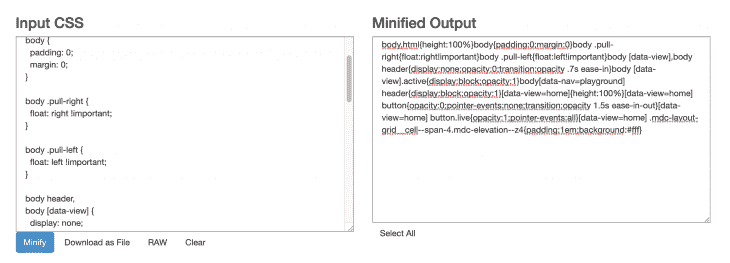
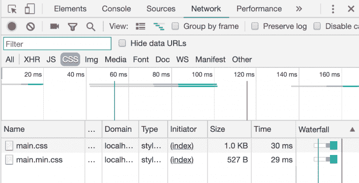
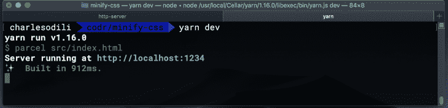
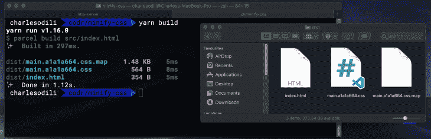
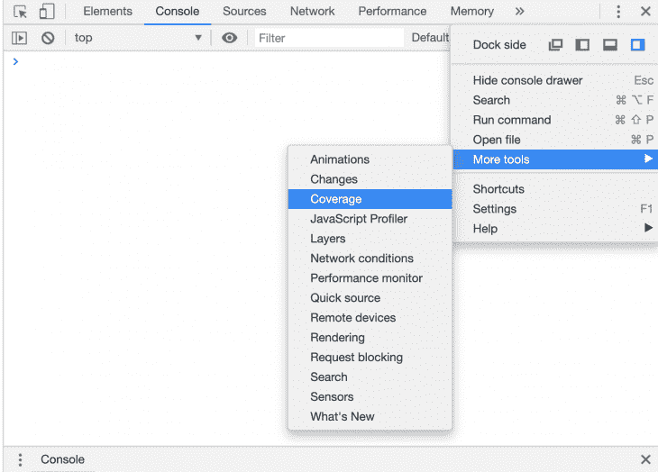
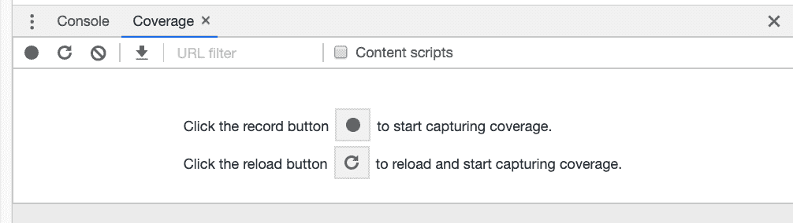
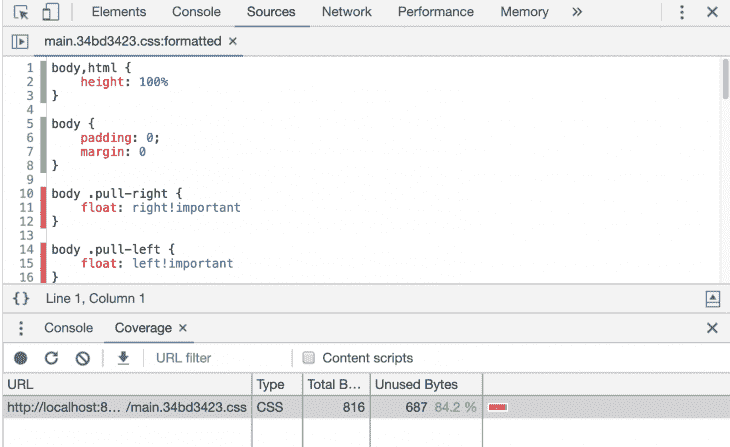
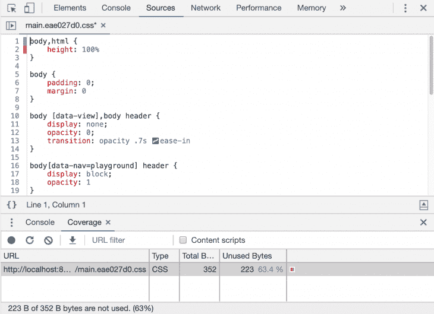
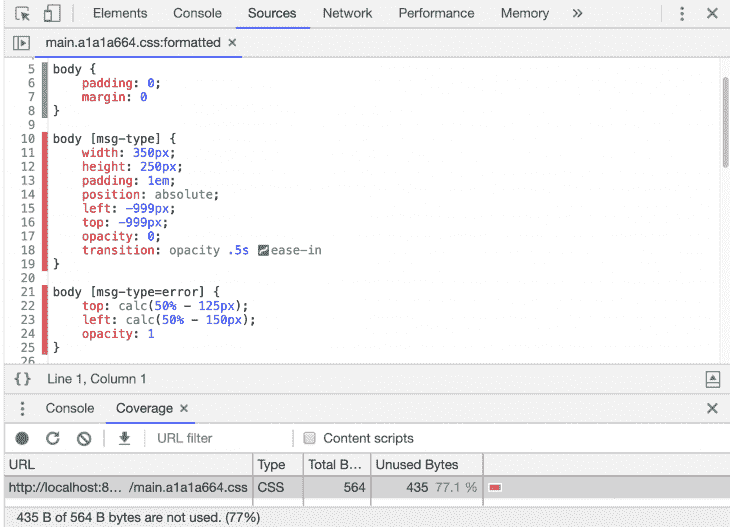

# 缩小 CSS 的最佳实践

> 原文：<https://blog.logrocket.com/the-complete-best-practices-for-minifying-css/>

CSS 是让网页看起来和感觉起来如此的东西:漂亮的布局，流畅的响应设计，刺激我们感官的颜色，帮助我们阅读以创造性方式表达的文本的字体，图像，UI 元素，以及其他以各种形状和大小显示的内容。它负责传达应用程序状态的直观视觉提示，如网络中断、任务完成、无效的信用卡号码输入或游戏角色在死亡后消失在白烟中。

如果没有 CSS，web 要么会完全崩溃，要么会非常无聊。

考虑到需要构建在行为和性能上达到或超过本地应用的网络应用(感谢[spa](https://en.wikipedia.org/wiki/Single-page_application)和 [PWAs](https://developers.google.com/web/progressive-web-apps/) )，我们现在通过网络向应用用户提供更多的功能和代码。

考虑到网络的无处不在，它的低摩擦(通过链接导航，无需安装)，以及它的低准入门槛(在非常便宜的手机上接入互联网)，我们将继续看到更多的人第一次上网，并加入数百万其他现有用户的行列，使用我们今天构建的网络应用。

我们通过网络发布的代码越少，我们为应用程序和用户制造的摩擦就越少。更多的代码可能意味着更多的复杂性、更差的性能和更低的可维护性。

因此，减少 JavaScript 有效负载的问题一直备受关注，包括如何将它们分割成合理的块并缩小它们。直到最近，web 才开始关注由优化不佳的 CSS 引发的问题。

CSS 缩小是一种优化的最佳实践，可以为 web 应用程序用户带来显著的性能提升——即使它最终被证明主要是可感知的。让我们看看如何！

## 什么是 CSS 缩小？

缩小有助于删除代码中不必要的部分，减小文件大小。最终，代码意味着由计算机执行，但这是在人类消费之后或同时进行的，人类需要共同创作、审查、维护、记录、测试、调试和部署代码。

像其他形式的代码一样，CSS 主要是为人类消费而格式化的。因此，我们添加了间距、缩进、注释、命名约定和插装技巧来提高我们的生产率和 CSS 代码的可维护性——浏览器或目标平台实际运行时不需要这些。

CSS 缩小化允许我们去掉这些额外的东西，并应用一些优化，这样我们就可以在目标设备上运行计算机所需要的东西。

## 为什么缩小 CSS？

总的来说，源代码缩减减少了文件大小，并可以加快浏览器下载和执行此类代码的时间。然而，缩小 CSS 至关重要的是 [**CSS 是 web**](https://developers.google.com/web/fundamentals/performance/critical-rendering-path/render-blocking-css) 上的渲染阻塞资源。

这意味着用户可能无法看到网页上的任何内容，直到浏览器构建了 CSSOM(带有 CSS 信息的 [DOM](https://blog.logrocket.com/accessing-the-virtual-dom-using-render-functions-in-vue-js/) )，这只有在它下载并解析了文档引用的所有样式表之后才会发生。

在本文的后面，我们将探索关键 CSS 的概念和围绕它的最佳实践，但是这里要确定的一点是，在 CSS 准备好之前，用户什么也看不到。由于运送未统一或未使用的 CSS 而产生的不必要的大 CSS 文件会给用户带来这种不良体验。

## 缩小与压缩——有什么区别吗？

代码缩减和压缩经常互换使用，可能是因为它们都致力于性能优化，从而减少代码量。但它们是不同的东西，我想澄清一下:

*   **缩小**改变代码内容。它通过去除不需要的空格、字符和格式来减少代码文件的大小，从而减少代码中的字符。它可以通过安全地重命名变量以使用更少的字符来进一步优化代码。
*   **压缩**不一定会改变代码的内容——除非我们考虑像图像这样的二进制文件，这不在本文的讨论范围之内。它通过压缩文件来减小文件大小，然后在请求时将文件提供给浏览器。

这两种技术并不相互排斥，因此它们可以一起使用来向用户交付优化的代码。

了解了所需的背景信息后，让我们来看看如何为您的 web 项目缩小 CSS。我们将探索实现这一点的三种方法，并为我制作的一个示例网站这样做，该网站在一个外部`main.css`文件中包含以下 CSS:

```
html,
body {
  height: 100%;
}
body {
  padding: 0;
  margin: 0;
}
body *.pull-right* {
  float: right !important;
}
body *.pull-left* {
  float: left !important;
}
body header,
body *[data-view]* {
  display: none;
  opacity: 0;
  transition: opacity 0.7s ease-in;
}
body *[data-view].active* {
  display: block;
  opacity: 1;
}
body[*data-nav*='playground'] header {
  display: block;
  opacity: 1;
}
*/* Home */*
[data-view='home'] {
  height: 100%;
}
[*data-view*='home'] button {
  opacity: 0;
  pointer-events: none;
  transition: opacity 1.5s ease-in-out;
}
[*data-view*='home'] button.live {
  opacity: 1;
  pointer-events: all;
}
[*data-view*='home'] *.mdc-layout-grid__cell--span-4.mdc-elevation--z4* {
  padding: 1em;
  background: #fff;
}
```

## 独立在线工具

如果你对缩小 CSS 完全不熟悉，想慢慢来，你可以从这里开始，只有在你更舒服的时候再进行下一步。虽然这种方法可行，但它很麻烦，不适合任何规模的实际项目，尤其是有几个团队成员的项目。

有许多免费简单的在线工具可以快速缩小 CSS。它们包括:

这三个工具都提供了一个简单的用户界面，由一个或多个输入字段组成，并要求您将 CSS 复制并粘贴到输入字段中，然后单击一个按钮来缩小代码。输出也显示在 UI 上，供您复制并粘贴回项目中。



从上面 CSS Minifier 的截图中，我们可以看到右边的 **Minified Output** 部分的 CSS 代码已经去掉了空格、注释和格式。

Minify 做了一些类似的事情，但也可以显示由于缩小过程而节省的文件大小。

在这两种情况下，我们缩小的 CSS 如下所示:

```
body,html{height:100%}body{padding:0;margin:0}body .pull-right{float:right!important}body .pull-left{float:left!important}body [data-view],body header{display:none;opacity:0;transition:opacity .7s ease-in}body [data-view].active{display:block;opacity:1}body[data-nav=playground] header{display:block;opacity:1}[data-view=home]{height:100%}[data-view=home] button{opacity:0;pointer-events:none;transition:opacity 1.5s ease-in-out}[data-view=home] button.live{opacity:1;pointer-events:all}[data-view=home] .mdc-layout-grid__cell--span-4.mdc-elevation--z4{padding:1em;background:#fff}
```

以这种方式缩小 CSS 期望你在线，并假设上述网站的可用性。不太好！

## 命令行工具

许多命令行工具可以实现与上述网站完全相同的功能，但也可以在没有互联网的情况下工作，例如在长途飞行中。

假设您已经在本地机器上安装了 **npm** 或 **yarn** ，并且您的项目被设置为 npm 包(您可以只做`npm init -y`)，继续使用`npm install cssnano --save-dev`或`yarn add install cssnano -D`安装 [cssnano](https://cssnano.co/) 作为开发依赖项。

由于 cssnano 是由[PostC](https://postcss.org/)SS 提供支持的工具生态系统的一部分，您还应该安装 postcss-cli 作为开发依赖项(再次运行上述命令，但是用`postcss-cli`替换`cssnano`)。

接下来，用以下内容创建一个`postcss.config.js`文件，告诉 PostCSS 使用 cssnano 作为插件:

```
module.exports = {
    plugins: [
        require('cssnano')({
            preset: 'default',
        }),
    ],
};
```

然后，您可以编辑您的`package.json`文件，并添加一个脚本条目来使用`postcss`命令缩小 CSS，如下所示:

```
...
"scripts": {
  "minify-css": "postcss src/css/main.css > src/css/main.min.css"
}
...
"devDependencies": {
  "cssnano": "^4.1.10",
  "postcss-cli": "^6.1.2"
}
...
```

`main.min.css`将是`main.css`的缩小版。

通过上面的设置，您可以在命令行上导航到您的项目，并运行下面的命令来缩小 CSS: `npm run minify-css`(或者，如果您使用 yarn，`yarn minify-css`)。

从 HTML 文档本地加载并提供两个 CSS 文件(只是为了在 Chrome DevTools 中比较它们的大小——您可以使用 [http-server](https://www.npmjs.com/package/http-server) 从项目的根目录运行一个本地服务器)显示，缩小的版本大约是原始文件的一半大小。



虽然上面的例子是作为概念的证明或者对于非常简单的项目来说，但是对于任何具有超出基本复杂性的项目来说，像这样手动缩小 CSS 将很快变得繁琐或者毫无成效，因为它将有几个 CSS 文件，包括那些来自 UI 库的文件，如 [Bootstrap](https://getbootstrap.com/) 、 [Materialize](https://materializecss.com/) 、 [Material Design](https://material.io/develop/web/) 等。

事实上，这个过程需要您保存缩小的版本，并手动更新所有对缩小文件版本的样式表引用。很有可能，你已经在使用像 [w](https://webpack.js.org/) [ebpack](https://webpack.js.org/) 、 [Rollup](https://rollupjs.org/guide/en/) 或[package](https://parceljs.org/)这样的构建工具了。这些工具内置了对代码缩减和捆绑的支持，只需要很少或不需要配置就可以利用它们的工作流基础设施。

## 自带捆扎机(自带)

假设 Parcel 是所有包中配置最少的，让我们来研究一下它是如何工作的。通过运行`yarn add parcel-bundler -D`或`npm install parcel-bundler --save-dev`安装捆扎机。

接下来，将以下脚本条目添加到您的`package.json`文件中:

```
"dev": "parcel src/index.html",
"build": "parcel build src/index.html"
```

您的`package.json`文件应该如下所示:

```
{
  ...
  "scripts": {
    "dev": "parcel src/index.html",
    "build": "parcel build src/index.html"
  },
  ...
  "devDependencies": {
    "parcel-bundler": "^1.12.3"
  }
  ...
}
```

`dev`脚本允许我们在开发模式下对`index.html`文件(我们应用程序的入口点)运行`parcel-bunder`，允许我们自由地对链接到 HTML 文件的所有文件进行修改。我们将直接在浏览器中看到更改，而无需刷新浏览器。

默认情况下，它会在项目中添加一个`dist`文件夹，将我们的文件动态编译到该文件夹中，并从那里提供给浏览器。所有这些都是通过用`yarn dev`或`npm run dev`运行开发脚本，然后在浏览器上访问提供的 URL 来实现的。



像我们刚刚看到的`dev`脚本一样，`build`脚本在生产模式下运行 package bundler。这个过程进行代码编译(例如，从 ES6 到 ES5)和缩小，包括缩小目标`index.html`文件中引用的 CSS 文件。然后，它自动将 HTML 文件中的资源链接更新为输出代码(transpiled、minified 和 versioned 副本)。多甜蜜啊！

默认情况下，这个生产版本放在`dist`文件夹中，但是您可以在`package.json`文件的脚本条目中更改它。



虽然上面的过程是特定于 Parcel.js 的，但是使用 webpack 和 Rollup 等其他捆绑器也有类似的方法或插件来实现相同的结果。请务必从以下几点开始:

## 代码覆盖率和未使用的代码

缩减 CSS 本身并不是目标；这只是达到目的的手段，也就是为用户提供他们所关心的体验所需的适量代码。

从 CSS 中去除不必要的空格、字符和格式是朝着正确方向迈出的一步，但是像不必要的空格一样，我们需要弄清楚 CSS 代码本身的哪些部分在应用程序中不是完全必要的。

如果应用程序用户不得不下载包含用于构建应用程序的引导库的所有组件的样式的 CSS(尽管是缩小的 CSS ),而实际上只使用了一小部分引导组件(和 CSS ),那么最终目标并没有真正实现。

代码覆盖率工具可以帮助您识别死代码，即当前页面或应用程序没有使用的代码。这样的代码也应该在缩小过程中被删除，Chrome DevTools 有一个内置的检查器来检测未使用的代码。

打开 DevTools，点击“更多”菜单选项(右上角的三个点)，然后点击**更多工具**，然后点击**覆盖**。



在那里，点击选项**重新加载并开始捕获覆盖范围**。随意浏览应用程序，如果需要，做一些事情来建立使用。



尽情使用该应用程序后，在覆盖率工具的监视下，点击**停止检测覆盖率并显示结果**红色按钮。

您将看到该页面或使用会话的已加载资源和覆盖率指标的列表。您可以立即看到使用的资源条目与未使用的资源条目的百分比，并且单击每个条目还会显示使用的代码部分(标记为绿色)与未使用的代码部分(标记为红色)。



在我们的例子中，Chrome DevTools 检测到我的 HTML 中没有使用`.pull-right`和`.pull-left` CSS 类，所以它将它们标记为未使用的代码。它还报告了 84%的 CSS 未被使用。这不是一个绝对的事实，你很快就会看到，但它给出了一个明确的指示，在缩小过程中，从哪里开始调查区域来清理 CSS。

## 确定和移除未使用的 CSS

我必须首先说[移除未使用的 CSS 代码应该仔细地完成并测试](https://css-tricks.com/heres-the-thing-about-unused-css-tools/)，否则你可能最终移除应用程序瞬态所需的 CSS——例如，CSS 用于显示错误消息，只有当这样的错误发生时才会在 UI 中出现。对于登录用户和未登录用户的 CSS，或者显示订单已经发货的覆盖消息(只有在您成功下订单时才会出现)的 CSS，情况如何？

您可以应用以下技术，开始更安全地移除未使用的 CSS，从而为您最终精简的 CSS 代码节省更多资源。

### 只添加您需要的 CSS 不要更多！

这种技术强调代码分割和捆绑的杠杆作用。就像我们可以通过模块化 JavaScript 并在文件中导入我们需要的模块、文件或函数来进行代码分割一样，我们应该对 CSS 做同样的事情。

这意味着不需要为[材料设计 UI 库](https://material-components.github.io/material-components-web-catalog/#/)加载整个 CSS(例如，通过 CDN)，您应该`import`只为特定页面或视图所需的`BUTTON`和`DIALOG`组件加载 CSS。如果您正在构建组件并采用 CSS-in-JS 方法，我猜您已经有了模块化的 CSS，它是由您的 bundler 以块的形式提供的。

### 用于关键渲染的内联 CSS 预加载其余的！

遵循消除不必要代码的相同哲学——特别是对于 CSS，因为它对用户何时能够看到内容有着巨大的影响——人们可以争辩说，用于*订单* *页面*和*购物车页面*的 CSS 对于刚刚在主页上但尚未登录的用户来说是未使用的 CSS。

我们甚至可以把这个概念推得更远，比如说，主页文件夹下的部分(用户必须向下滚动才能看到的主页部分)的 CSS 对于这样的用户来说是不必要的 CSS。这种额外的 CSS 可能是 2G 用户(大多数新兴市场)或慢速 3G 用户(世界其他地区大多数时间)不得不多等一两秒才能看到你的 web 应用程序上的任何内容的原因，即使你发布了精简代码！

> 为了获得最佳性能，您可能需要考虑将关键的 CSS 直接内联到 HTML 文档中。这消除了关键路径中的额外往返，并且如果做得正确，可以用于提供“一次往返”的关键路径长度，其中只有 HTML 是阻塞资源。
> –[阿迪·奥斯马尼](https://addyosmani.com/)上[危急](https://github.com/addyosmani/critical/blob/master/README.md)

一旦你提取并内联了关键的 CSS，你就可以用 [link-preload](https://alligator.io/html/preload-prefetch/) 预加载其余的 CSS(例如，应用程序的其他路径)。[Critical](https://github.com/addyosmani/critical/blob/master/README.md)(Addy Osmani)是一个你可以尝试提取和内嵌关键 CSS 的工具。

你也可以将这样的关键路径 CSS 放在一个特定的文件中，并将其内联到应用程序的入口点 HTML 中——也就是说，如果你不喜欢在 HTML 文档的样式标签中直接创作 CSS。

### 移除未使用的 CSS

就像 [cssnano](https://cssnano.co/) 插入 PostCSS 来缩小 CSS 代码一样，Purgecss 可以用来移除死的 CSS 代码。您可以将它作为独立的 npm 模块运行，或者将其作为插件添加到您的 bundler 中。为了在我们的示例项目中试用它，我们将安装它:

```
npm install @fullhuman/postcss-purgecss --save-dev
```

如果使用纱线，我们将做到:

```
yarn add @fullhuman/postcss-purgecss -D
```

就像我们对 cssnano 所做的那样，在前面的`postcss.config.js`文件中的 cssnano 的插件条目之后添加一个 Purgecss 的插件条目，这样配置文件看起来如下:

```
module.exports = {
    plugins: [
        require('cssnano')({
            preset: 'default',
        }),
        require('@fullhuman/postcss-purgecss')({
            content: ['./**/*.html']
        }),
    ],
};
```

为生产构建我们的项目并使用 Chrome DevTools 检查它的 CSS 覆盖率，发现我们清除和缩小的 CSS 现在比早期版本少了 352 b(CSS 代码减少了 55%)。

检查新的输出文件，我们可以看到,`.pull-left`和`.pull-right`样式被删除了，因为在构建时我们在 HTML 中没有使用它们作为类名。



同样，在删除这些工具标记为未使用的 CSS 时，要小心谨慎。只有在进一步调查表明它们确实没有必要后，才这样做。

### 仔细设计 CSS 选择器

在我们的示例项目中，我们可能打算使用`.pull-right`和`pull-left`类来样式化应用程序中的瞬态——在屏幕的最左侧或最右侧显示条件错误消息。

正如我们刚刚看到的，Purgecss 帮助我们的 CSS minifier 删除了这些样式，因为它检测到它们没有被使用。也许有一种方法可以有意地设计我们的选择器，使其在抢先的 CSS 死代码删除中存活下来，并在未来的瞬态应用程序状态中需要它们时保留样式。

事实证明，你可以用 [CSS 属性选择器](https://developer.mozilla.org/en-US/docs/Web/CSS/Attribute_selectors)来实现。错误消息元素的 CSS 规则在默认情况下是隐藏的，然后在某个时候是可见的，可以像这样创建:

```
body [msg-type] {
    width: 350px;
    height: 250px;
    padding: 1em;
    position: absolute;
    left: -999px;
    top: -999px;
    opacity: 0;
    transition: opacity .5s ease-in
}
body [msg-type=error] {
    top: calc(50% - 125px);
    left: calc(50% - 150px);
    opacity: 1
}
```

虽然我们目前没有任何与这些选择器匹配的 DOM 元素，并且知道它们将在未来由应用程序按需创建，但 minify 进程仍然保留了这些 CSS 规则，即使它们被标记为未使用——这并不完全正确。

CSS 属性选择器帮助我们挥动魔棒，表示保留了在构建时在 DOM 中不可用的错误消息元素样式规则。



这种设计结构可能并不适用于所有的 CSS minifiers，所以请试验一下，看看这是否适用于您的构建过程设置。

## 总结和结论

我们今天正在构建更复杂的 web 应用程序，这通常意味着向我们的最终用户交付更多的代码。代码精简有助于我们减轻交付给应用程序用户的代码量。

就像我们对 JavaScript 所做的一样，我们需要将 CSS 视为一等公民，有权为了用户的利益参与代码优化。缩小 CSS 是我们至少能做的。我们还可以更进一步，从我们的项目中删除死 CSS。

意识到 CSS 对用户何时看到我们应用程序的任何内容有着巨大的影响，有助于我们优先优化其交付。

最后，采用一个构建过程或确保您现有的构建过程正在优化 CSS 代码就像用 Parcel 设置 cssnano 或使用一些插件和 webpack 或 Rollup 配置一样简单。

## 你的前端是否占用了用户的 CPU？

随着 web 前端变得越来越复杂，资源贪婪的特性对浏览器的要求越来越高。如果您对监控和跟踪生产环境中所有用户的客户端 CPU 使用情况、内存使用情况等感兴趣，

[try LogRocket](https://lp.logrocket.com/blg/css-signup)

.

[](https://lp.logrocket.com/blg/css-signup)[https://logrocket.com/signup/](https://lp.logrocket.com/blg/css-signup)

LogRocket 就像是网络和移动应用的 DVR，记录你的网络应用或网站上发生的一切。您可以汇总和报告关键的前端性能指标，重放用户会话和应用程序状态，记录网络请求，并自动显示所有错误，而不是猜测问题发生的原因。

现代化您调试 web 和移动应用的方式— [开始免费监控](https://lp.logrocket.com/blg/css-signup)。