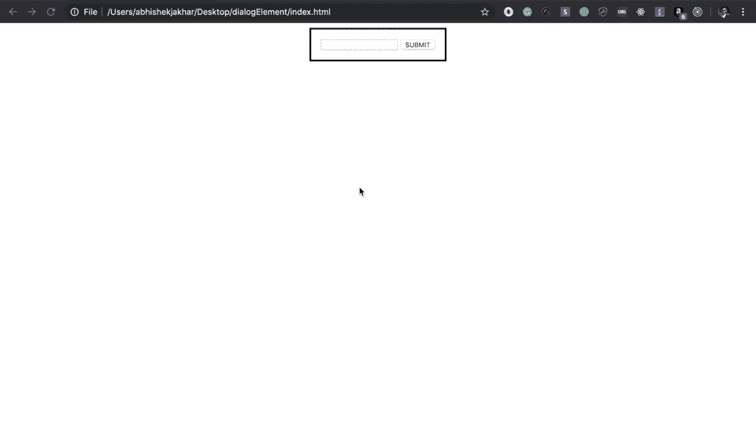
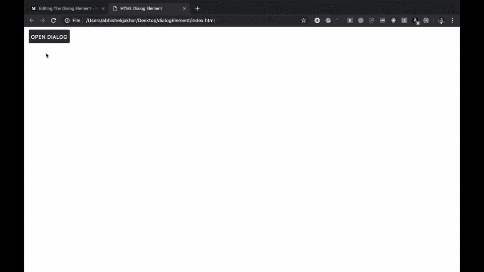
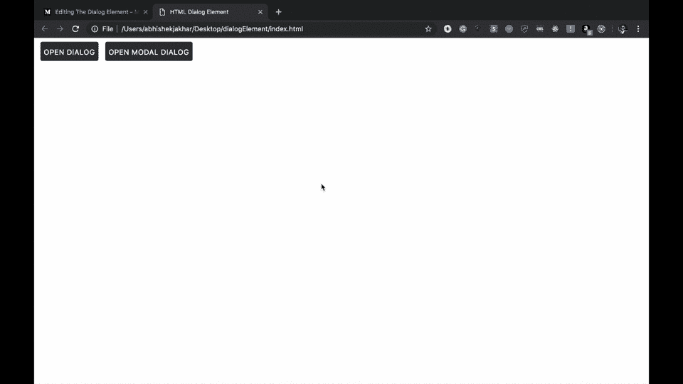
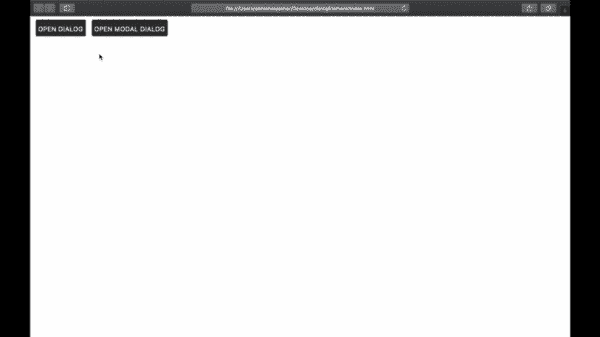
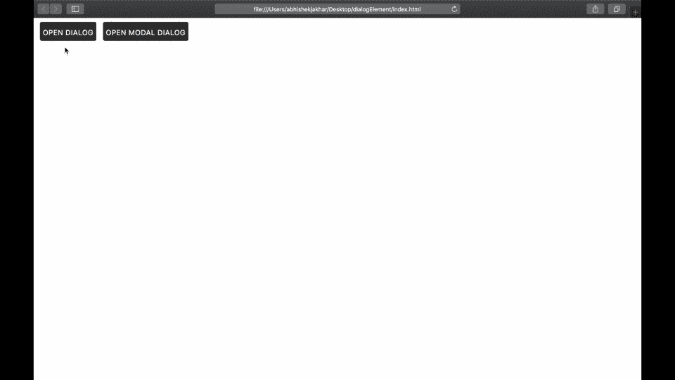

# 对话框元素:创建未来模态窗口的方法

> 原文：<https://blog.logrocket.com/the-dialog-element-the-way-to-create-tomorrows-modal-windows-f1d4ab14380b/>

### 概观

对话框是一种常见的用户界面设计模式，在网站上反复出现——如此频繁，以至于 W3C 提出了一些标准化的 HTML 标记来描述对话框窗口。

用其他 HTML 标记和 CSS 创建的传统对话框已经在大多数前端框架中实现了很长一段时间，这可能仍然是一条路要走，因为 HTML 对话框元素仍然具有有限的浏览器支持。

但是如果前端框架仍然是更好的选择，为什么还要创建标准化的对话框元素呢？

有很多原因，但其中最主要的是屏幕阅读器的可访问性，以及使搜索引擎爬虫和机器学习代理能够解释对话窗口。随着浏览器支持的不断改进，这个标准将成为创建模式窗口的明确选择。

首先，我们将关注对话框元素的 HTML 标记，然后我们将在后面添加一些 JavaScript。

文件夹结构可能如下所示:

***项目
|—****index.html* ***|—****app . js* ***|—**main . CSS***

[](https://logrocket.com/signup/)

### 我们对话窗口背后的 HTML

在*index.html*文件中，让我们创建带有开始和结束标签的对话框元素:

```
<!doctype html>
<html>
  <head>
    <title>HTML Dialog Element</title>
  </head>
  <body>
    <dialog>
    </dialog>
  </body>
  [http://app.js](http://app.js)
</html>
```

Creating a **<dialog>** element.

然而，这还不会在页面上显示任何内容。为了让它出现，我们需要将布尔属性 **open** 添加到对话框元素:

```
<!doctype html>
<html>
  <head>
    <title>HTML Dialog Element</title>
  </head>
  <body>
    <dialog open>
    </dialog>
  </body>
  [http://app.js](http://app.js)
</html> 
```

Adding boolean attribute **open** to the **<dialog>** element to make it appear on the page.

在对话框元素中，我们将创建一个简单的表单，包含类型为`text`的文本输入和类型为`submit`的按钮:

```
<!doctype html>
<html>
  <head>
    <title>HTML Dialog Element</title>
  </head>
  <body>
    <dialog open>
      <form method="dialog">
        <input type="text">
        <button type="submit">SUBMIT</button>
      </form>
    </dialog>
  </body>
  [http://app.js](http://app.js)
</html> 
```

> **注意:**这里我设置了一个**窗体**到**对话框**的**方法**。这是一个新的表单方法，它与父对话框元素协同工作。当按下提交按钮时，**将提交**表格，**关闭**对话框**。**

**

Dialog window disappearing after pressing the submit button.

现在我们将创建一些按钮，允许我们使对话框窗口重新出现。这些将需要 JavaScript 来工作，我们将在后面添加。

```
<!doctype html>
<html>
  <head>
    <title>HTML Dialog Element</title>
  </head>
  <body>
    <dialog open>
      <form method="dialog">
        <input type="text">
        <button type="submit">OK</button>
      </form>
    </dialog>

    <button id="openDialog">Dialog</button>
    <button id="openModalDialog">Modal Dialog</button>
  </body>
  [http://app.js](http://app.js)
</html> 
```

Added two buttons with the **IDs** **“openDialog”** and **“openModalDialog”**.

因此，这里我们创建了两个按钮:一个 ID 为`openDialog`，另一个 ID 为`openModalDialog`。一旦我们添加了一些 JavaScript，第一个按钮将打开对话框，就像我们上面看到的一样。但是，第二个按钮将打开一个对话框窗口，阻止其他页面交互。

这是一种常见的设计模式，因为当对话框窗口打开时，您通常需要用户在继续使用应用程序的其余部分之前执行某种交互。

为了编写 JavaScript，我将从对话框元素中移除**打开属性**，然后添加一个 **ID 属性**，这样我们就可以用 JavaScript 选择它，就像按钮一样。

```
<!doctype html>
<html>
  <head>
    <title>HTML Dialog Element</title>
  </head>
  <body>
    <dialog id="dialogWindow">
      <form method="dialog">
        <input type="text">
        <button type="submit">OK</button>
      </form>
    </dialog>

    <button id="openDialog">Open Dialog</button>
    <button id="openModalDialog">Open Modal Dialog</button>
  </body>
  [http://app.js](http://app.js)
</html> 
```

Replaced **open** attribute of **<dialog>** element with the ID of name **“dialogWindow”**.

### 我们的对话窗口的 JavaScript

在 JavaScript ( *app.js* )文件中，我们将在一个匿名函数中编写基于事件的代码，该代码将在页面加载时执行。

首先，我们将收集页面上的元素，以及变量——**对话窗口**和**两个按钮**。我们将为每个对象创建一个变量，并通过它们的 ID 获取它们。

```
(function() {

  let openDialog = document.getElementById('openDialog');
  let openModalDialog = document.getElementById('openModalDialog');
  let dialogWindow = document.getElementById('dialogWindow');

})(); 
```

Getting the two buttons and dialog window by their IDs.

接下来，我们将创建两个事件侦听器，每个按钮一个。

#### 1.用于正常打开对话窗口的 EventListener

我们将添加一个`EventListener`到`openDialog`按钮，这样当它被点击时，功能`show()`将被执行。`show()`函数在页面上显示对话框元素的方式与我们之前在 HTML 中使用**打开属性**时的方式相同。

```
(function() {

  let openDialog = document.getElementById('openDialog');
  let openModalDialog = document.getElementById('openModalDialog');
  let dialogWindow = document.getElementById('dialogWindow');

  openDialog.addEventListener('click', () => {
    dialogWindow.show();
  })

})(); 
```

EventListener for opening the dialog window normally.



EventListener for opening the dialog window normally.

> **注意:**我已经设计了按钮的样式，这样它们就可以在上面的 GIF 上看到，但这不会以任何方式影响功能。

#### 2.用于将对话框窗口作为模式窗口打开的 EventListener

我们将为打开的模态窗口对话框做和上面一样的事情:添加一个`EventListener`到`openModalDialog`按钮，这样当它被点击时，函数`showModal()`将被执行。

所以在这里，我们使用的不是`show()`函数，而是`showModal()`函数，它仍然会显示对话窗口。但这一次，页面的其余部分将有一个灰色的透明覆盖层，将阻止任何其他鼠标点击。

```
(function() {

  let openDialog = document.getElementById('openDialog');
  let openModalDialog = document.getElementById('openModalDialog');
  let dialogWindow = document.getElementById('dialogWindow');

  openDialog.addEventListener('click', () => {
    dialogWindow.show();
  })

  openModalDialog.addEventListener('click', () => {
    dialogWindow.showModal();
  })
})(); 
```

EventListener for opening the dialog window as a modal window.



Dialog window as a modal window.

### 浏览器支持和聚合填充

聚合填充是一段代码，它实现了特定 web 浏览器本身不支持的功能。通常，他们首先检查浏览器是否支持 API，如果可用就使用它；否则，他们实现自己的逻辑，使其在浏览器上工作。

目前，只有 Chrome 和 Opera 完全支持 HTML 对话框元素，为了在 Firefox 中使用它，用户必须**显式启用**该功能。

但是我们仍然可以在其他浏览器(Safari，IE 等)中使用 HTML 对话框元素。)使用由谷歌 Chrome 维护的 dialog-polyfill。polyfill 将增加对不支持的浏览器的支持；还支持 IE9 及以上版本。

* * *

### 更多来自 LogRocket 的精彩文章:

* * *

有几点需要注意:在我们的 JavaScript ( *app.js* )文件中添加 polyfill 不会以任何方式影响 Chrome 和 Opera 上的 HTML 对话框元素。只会有一个 *app.js* 文件。

此外，如果我们只想在 Chrome 或 Opera 上使用 HTML 对话框元素，我们就不需要 polyfill。但是如果我们想在所有的浏览器上使用它——很可能是这种情况——我们将不得不使用 polyfill，直到其他浏览器完全支持它。

更新后的文件夹结构可能如下所示:

***项目
|—****index.html* ***|—****app . js* ***|—**main . CSS* ***|—****对话框-poly fill . CSS* ***|—*****

#### 使用聚合填料

1.  将 CSS `[dialog-polyfill.css](https://github.com/GoogleChrome/dialog-polyfill/blob/master/dist/dialog-polyfill.css)`包含在文档的头部。

```
<!doctype html>
<html>
  <head>
    <title>HTML Dialog Element</title>
    <link rel="stylesheet" href="dialog-polyfill.css">
    <link rel="stylesheet" href="main.css">
  </head>
  <body>
    <dialog id="dialogWindow">
      <form method="dialog">
        <input type="text">
        <button type="submit">OK</button>
      </form>
    </dialog>

    <button id="openDialog" class="button">Open Dialog</button>
    <button id="openModalDialog" class="button">Open Modal Dialog</button>
  </body>
  [http://app.js](http://app.js)
</html> 
```

Included **dialog-polyfill.css**.

2.在引用`dialogPolyfill`之前，在任何地方包含 JavaScript `[dialog-polyfill.js](https://github.com/GoogleChrome/dialog-polyfill/blob/master/dist/dialog-polyfill.js)`。

```
<!doctype html>
<html>
  <head>
    <title>HTML Dialog Element</title>
    <link rel="stylesheet" href="dialog-polyfill.css">
    <link rel="stylesheet" href="main.css">
  </head>
  <body>
    <dialog id="dialogWindow">
      <form method="dialog">
        <input type="text">
        <button type="submit">OK</button>
      </form>
    </dialog>

    <button id="openDialog" class="button">Open Dialog</button>
    <button id="openModalDialog" class="button">Open Modal Dialog</button>
  </body>
  [http://dialog-polyfill.js](http://dialog-polyfill.js)
  [http://app.js](http://app.js)
</html> 
```

Included **dialog-polyfill.js**

3.在 HTML 文档中创建`<dialog>`元素(上面我们已经创建了一个)。

1.  使用`dialogPolyfill.registerDialog()`函数注册元素，一次传递一个节点。

```
(function() {

    let openDialog = document.getElementById('openDialog');
    let openModalDialog = document.getElementById('openModalDialog');
    let dialogWindow = document.getElementById('dialogWindow');

    dialogPolyfill.registerDialog(dialogWindow);

    openDialog.addEventListener('click', () => {
      dialogWindow.show();
    })

    openModalDialog.addEventListener('click', () => {
      dialogWindow.showModal();
    })
  })(); 
```

Registered dialog polyfill using **dialogPolyfill.registerDialog()** function in app.js.

5.使用你的`<dialog>`元素。



Safari browser **before adding polyfill** (left) vs. **after adding polyfill **(right).

现在我们已经介绍了 HTML 中对话框元素的基本要素。如果你有兴趣了解更多，可以考虑阅读来自 [Mozilla](https://developer.mozilla.org/en-US/docs/Web/HTML/Element/dialog) 和[我可以使用……](https://caniuse.com/#feat=dialog)以及[官方规范](https://html.spec.whatwg.org/multipage/interactive-elements.html#the-dialog-element)的资源。

我希望这篇文章对你有所帮助。我希望听到您的反馈！

**感谢您的阅读！**

## 使用 [LogRocket](https://lp.logrocket.com/blg/signup) 消除传统错误报告的干扰

[](https://lp.logrocket.com/blg/signup)

[LogRocket](https://lp.logrocket.com/blg/signup) 是一个数字体验分析解决方案，它可以保护您免受数百个假阳性错误警报的影响，只针对几个真正重要的项目。LogRocket 会告诉您应用程序中实际影响用户的最具影响力的 bug 和 UX 问题。

然后，使用具有深层技术遥测的会话重放来确切地查看用户看到了什么以及是什么导致了问题，就像你在他们身后看一样。

LogRocket 自动聚合客户端错误、JS 异常、前端性能指标和用户交互。然后 LogRocket 使用机器学习来告诉你哪些问题正在影响大多数用户，并提供你需要修复它的上下文。

关注重要的 bug—[今天就试试 LogRocket】。](https://lp.logrocket.com/blg/signup-issue-free)**