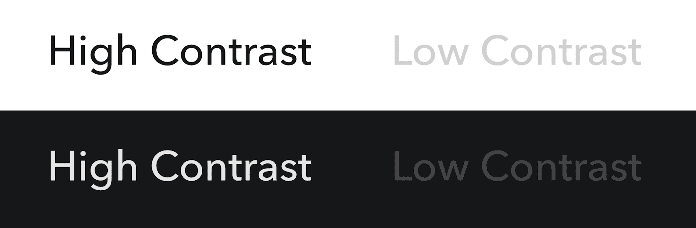
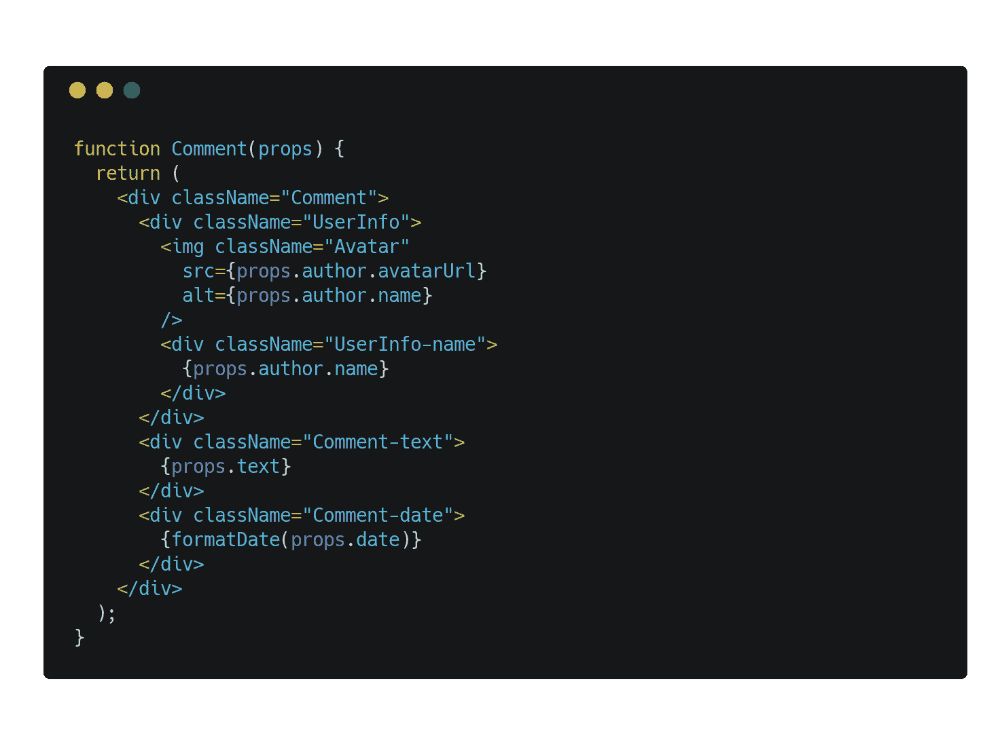
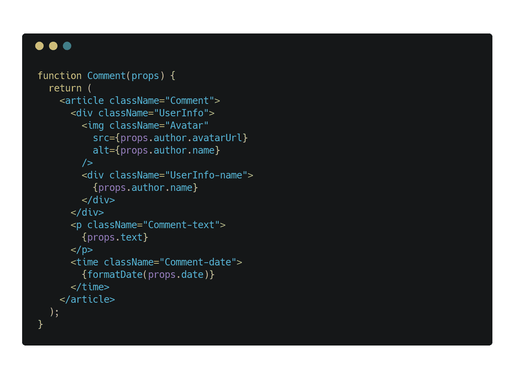

# 保持你的网络应用可访问性的最简单的方法:使用文本日志博客

> 原文：<https://blog.logrocket.com/the-easiest-way-to-keep-your-web-apps-accessible-c2b57506cc2a/>


### 保持你的网络应用可访问性的最简单的方法:使用文本

网络不再仅仅是静态文本文档的集合，其中夹杂着一些图片和 gif。在过去 20 年左右的时间里，我们已经看到 web 融合成大大小小的 web 应用程序的泥浆，每一个都比上一个更加复杂和动态，用 API、脚本和任何人都无法想象的更多数据串在一起。

对于 web 开发人员来说，尽管每天都要涉猎这些技术，但要跟上进度可能会非常困难。在我们不断追求跟上时代的过程中，很多东西都被遗忘了。

最容易忘记的事情之一——但可以说是最重要的事情之一——是可访问性。正如网络本身的发展一样，其用户的数量和多样性也在增长。从孩子到老人，每个人都有不同程度的能力和残疾，都依赖网络购物、娱乐、教育，甚至提供生活所需的医疗信息和用品。

但是可访问性不仅仅是关于残疾用户，尽管他们经常是焦点。可访问性是向每个人开放网络。18F [的人说得好:](https://accessibility.18f.gov/)

> 可访问性是现代 web 开发最重要的方面之一。可访问性意味着最大数量的用户可以查看您的内容。这意味着搜索引擎将能够更完整地阅读你的网站。如果考虑到可访问性问题，所有类型的用户都会有更好的体验。

保持日益复杂的 web 应用程序的可访问性是必要的。幸运的是，你可以做一件事来让尽可能多的用户访问任何 web 应用程序，并减轻你自己的开发和维护负担。

只用文字。

[**LogRocket 正在做完善的前端 bug 报告。点击查看。**](https://logrocket.com/signup/)

### 文本获胜

在网络的早期，几乎所有的东西都是文本，用数量相当有限的 HTML 标签来标记。事实上，直到 1993 年[马克·安德森将 img 标签引入 Mosaic，网页内的内嵌图像才变得可用(以前图像是通过超链接访问的)。](https://thehistoryoftheweb.com/the-origin-of-the-img-tag/)

尽管图像的出现帮助网络普及，但网络的核心仍然是文本。每个 web 文档都是文本，不管它还包含什么。HTML，文本。CSS，文本。JavaScript，文本。见鬼，传输所有这些信息的协议是通过文本来声明的。

唯一改变的是我们让文本变得有多复杂。

但是文本仍然是构建网络的方式。尽管越来越多的内容是通过图像、视频和音频传递的，但文本是让最广泛的用户能够访问这些内容的唯一最佳方式。那是因为文字很容易:

*   由用户阅读
*   机器阅读(搜索引擎、屏幕阅读器等。)
*   翻译
*   设计
*   急速上升
*   和编辑

此外，文本文件通常比图像、音频和视频要轻得多。文本有助于减轻带宽有限或连接缓慢的用户的负担，有助于对抗现代网站的膨胀，尼克·赫尔最近将这种网站称为[](https://pxlnv.com/blog/bullshit-web/)*【扯淡网站】。这种增强的性能和易访问的特性的结合使得 web 的原始基础难以被超越。*

 *如果我们都同意文本是网络上最有用的元素，那么我们如何确保我们的网络应用程序和它们提供的内容最好地发挥作用呢？

### 语义标记

当向用户传递文本时，我们将其包含在 HTML 文档中。尽管早期的 web 依赖于大约 18 个标签来标记这些文档，但是现在我们在创建文档时可以使用超过 100 个标签。

HTML5 中引入的许多标签侧重于提供附加的语义，使用户和机器更清楚地知道内容是什么。像 section、article、nav、header、footer 和 side 这样的标签可以更好地描述它们的内容。结合像 p、strong 和所有标题这样的旧标准，我们可以自信地标记内容，知道它将被比以往更多的用户访问。

当构建您自己的页面和应用程序时，您应该努力在语义标记中保留尽可能多的内容。

您总是可以使用 ARIA roles 或数据属性之类的东西向这些标签添加额外的功能，但是您的应用程序的核心应该依赖语义元素来标记内容。

很容易看出标题和段落对文本块的作用，但是对于更复杂的应用程序功能，如数据表、卡片、通知、工具提示和菜单按钮呢？有一些可靠的模式可以用来构建这些特性。

即使是那些复杂的组件，基本原则也是一样的:使用语义标记。如果你正在构建一个从未有人见过的极其复杂的东西，坐下来，规划出那个组件的子元素是什么，并尝试对这些子元素使用语义标记。

### 样式化辅助文本

一旦用语义标签标记了文本，就需要对其进行样式化。令人欣慰的是，有清晰的指导方针来设计你的文本，这样每个人都可以阅读。

你应该做的第一件事是确保你的文本是可缩放的。许多弱视用户使用浏览器或操作系统级别的缩放控件来增大屏幕上的文本大小。但是一些开发者仍然禁止缩放网页，如下所示:

```
<meta name=”viewport” content=”initial-scale=1, maximum-scale=1">
```

当设置为初始比例时，最大比例防止用户放大文本。因此，保持文本可缩放很容易:只需删除该值。

说到文本的实际样式，你要考虑的主要是**大小**和**对比度**。



Contrast is a key when it comes to visual accessibility.

主要考虑的是让文本容易准备好，而不强迫用户放大。建议基线字体大小为 14px，但大于 14px 通常更好。

相比之下，规则很简单，如 WCAG 2.0 建议的[准则 1.4 所规定:](https://www.w3.org/TR/WCAG20/#visual-audio-contrast)

> 让用户更容易看到和听到内容，包括将前景与背景分开。

该指南继续建议不要将颜色作为传达信息的唯一手段，最小对比度，甚至文本大小调整，但想法很简单:清楚地将文本与其背景进行对比。这意味着保持文本足够大，或者足够暗(在浅色背景下)或者足够亮(在深色背景下)。有一些检查对比度的工具，包括 [WebAIM 的颜色对比度检查器](https://webaim.org/resources/contrastchecker/)，甚至还有用于设计阶段的工具，如用于草图的[斯塔克。](http://www.getstark.co/)

关于设计和样式化文本还有很多内容，但是我将把它留给您自己去挖掘这个主题。提示:[这里有一个很好的起点](http://book.webtypography.net/)。

### 文本板

图像在传达信息和为用户创造更愉快的体验方面仍然扮演着重要的角色。但是，您需要让您的图像像应用程序的其他部分一样易于访问。

为此，您应该在 img 标签上使用可选(ALT)文本。替代文本为图像内容提供一些上下文，以便弱视用户可以更好地理解图像中的内容，通常是在使用屏幕阅读器等辅助技术时。您可以通过添加 alt 属性来使用 ALT 文本，该属性的值相当于您的图像的文本，如下所示:

```

```

即使在使用图标或图标字体时，您也可以使用文本来保持它们的可访问性。装饰图标(不传达重要信息的图标)仍然应该使用 alt 属性，但是将该值保留为空。然后，您可以应用 aria-hidden 属性来确保它被屏幕阅读器忽略:

```

```

但是对于非装饰性的图标，你可以通过在图像上使用 ALT 文本或者使用带有 HTML 文本的 CSS 加载图标来保持它们的可访问性，作为屏幕阅读器的隐藏后备，类似于 [Font Awesome](https://fontawesome.com/how-to-use/on-the-web/other-topics/accessibility) 的做法:

```
<i aria-hidden class=”fas fa-car” title=”Time to destination by car”></i>
<span class=”sr-only”>Time to destination by car:</span>
<span>4 minutes</span>
```

图标是通过 CSS 在 I 标签上加载的，它包括一个鼠标用户的标题。紧跟其后的 span 用 CSS 隐藏，但对屏幕阅读器仍然可用。这是一个聪明的解决方案，CSS-Tricks 和 T2 都支持灯丝组。

撰写有效的替代文本本身就是一种艺术形式。幸运的是，有一些很棒的资源，其中最好的是 WebAIM 的替代文本指南。

### 可访问性和框架

尽管像 React 和 Vue 这样的 JavaScript 框架正在改变许多开发人员构建 web 应用程序的方式，但它们并没有改变这些应用程序对各种用户保持可访问性的需求。它们只是给我们带来了一些麻烦。但是我们可以通过遵循一个简单的规则来保持这些框架驱动的应用程序的可访问性:

不要让框架迫使你做出糟糕的选择。

虽然像 React 这样的框架确实建议了完成事情的方法，但它们通常不会强迫你放弃非语义 HTML——这是开发人员的选择。创建考虑周到的、设计良好的、可访问的组件取决于你，所以要坚持语义 HTML 的基本原则。

* * *

### 更多来自 LogRocket 的精彩文章:

* * *

React 自己的文档就是一个很好的例子。[在讨论组件和道具](https://reactjs.org/docs/components-and-props.html)时，他们用了一个注释作为例子:



The default markup for a React component.

如果我们用更具描述性的 HTML 标签替换其中一些 div 元素会怎么样？



Could we make that component a bit more accessible?

[正如 MDN](https://developer.mozilla.org/en-US/docs/Web/HTML/Element/article) 所建议的，评论可以用文章元素更好地进行语义描述，评论文本是一个段落。此外，评论日期可以用更具语义的时间元素来标记，甚至可以在 datetime 属性中包含评论发布日期的机器可读版本。根据应用程序的页面层次结构，您可以将用户名更改为标题。或者，让整个用户信息部分变成一个图形，并使用 figcaption 来标记名称，怎么样？

像 React 这样的框架也有一些问题，当你试图让你的应用保持可访问性时，你需要担心。特别是，React 保留了有时会增加混淆或破坏可访问性的关键字。一个很好的例子是在构建表单时。

易访问的表单总是包含输入的标签，这些标签清楚地描述了输入的用途。在 HTML 中，标签和输入与 for 属性和输入本身的 id 相链接。因为 for 是 JavaScript 中的保留关键字，所以需要使用 htmlFor。同样的事情也适用于 class，它变成了 className。

但是，在 React 中使用 ARIA 属性时，不需要对它们进行大小写。幸运的是，它们在 JSX 得到了完全的支持，所以在图标组件中包含 aria-hidden 这样的东西可以很好地工作。

### 保持您的应用程序可访问

仅在美国，[就有超过 18%的人口患有某种残疾](http://www.interactiveaccessibility.com/accessibility-statistics)，俗话说，“在某个时候，我们都会残疾”是真的。无论你经历的是暂时的还是永久的残疾，当你在生活中的某个时刻使用数字技术时，你都可能会面临挑战。

作为开发者，我们处于一个独特的位置。我们可以选择帮助别人或者阻碍别人。不管怎样，我们会以某种方式影响他们的生活。作为开发人员，通过更加慎重地选择，特别是偏爱文本和有思想的语义标记，我们有能力改善很多人的生活。所以花点时间想想你的应用程序和你用来构建它们的技术。

## 使用 LogRocket 消除传统反应错误报告的噪音

[LogRocket](https://lp.logrocket.com/blg/react-signup-issue-free)

是一款 React analytics 解决方案，可保护您免受数百个误报错误警报的影响，只针对少数真正重要的项目。LogRocket 告诉您 React 应用程序中实际影响用户的最具影响力的 bug 和 UX 问题。

[ ](https://lp.logrocket.com/blg/react-signup-general) [  ](https://lp.logrocket.com/blg/react-signup-general) [LogRocket](https://lp.logrocket.com/blg/react-signup-issue-free)

自动聚合客户端错误、反应错误边界、还原状态、缓慢的组件加载时间、JS 异常、前端性能指标和用户交互。然后，LogRocket 使用机器学习来通知您影响大多数用户的最具影响力的问题，并提供您修复它所需的上下文。

关注重要的 React bug—[今天就试试 LogRocket】。](https://lp.logrocket.com/blg/react-signup-issue-free)

* * **