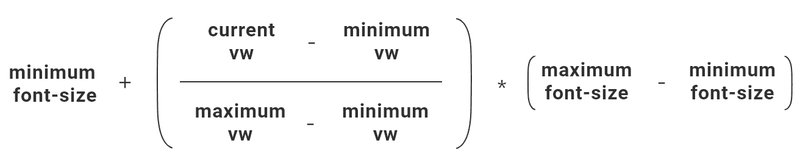
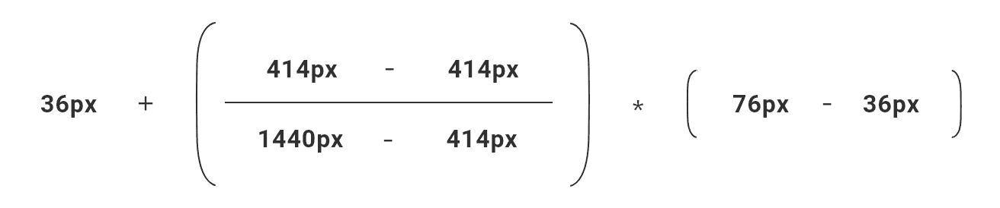
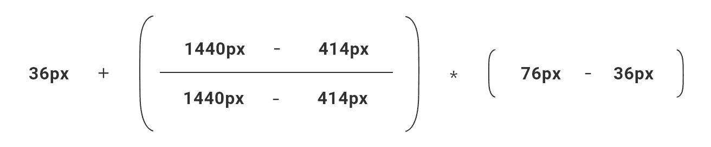

# 响应式排版的要素——LogRocket 博客

> 原文：<https://blog.logrocket.com/the-elements-of-responsive-typography/>

编码响应式排版可能会很混乱。你应该用什么单位来表示字体大小:像素，em，rem，vw？如何确保您的字体是可访问的？什么是流动排版？

这篇文章将带你了解在 CSS 中调整字体大小的基本知识，并看看你可以在自己的网站项目中使用的几种不同的方法。

### 在 CSS 中编写字体样式的一些最佳实践是什么？

让我们解决一些基本的指导方针，使你的字体在所有设备上都好看，并确保它们对于需要放大或改变浏览器基本字体大小的用户来说是可访问的。

**字体使用相对单位，而非绝对单位**

绝对单位是静态的，其结果大小不依赖于任何其他因素。在 CSS 中，我们可能会用到的默认单位是像素(px)单位。

无论你在什么设备或屏幕上观看，字体大小为 18 像素。像素很熟悉，也很容易理解。我们知道 10px 类型是微小的，100px 类型是巨幅标题。

对`font-size`使用像素似乎很诱人，但出于可访问性的原因，不建议这样做。

这是因为尽管放大会使像素变大，但在浏览器设置中更改基本字体大小不会有任何效果。所以像素对于字体来说并不是一个完全可及的解决方案。

相对单位是依赖于其他因素的测量单位，例如视口宽度、视口高度或父元素。

有几个相对单位:百分比(%)、em、rem、视口宽度(vw)和视口高度(vh)。

**百分比(%)单位**

百分比单位就是父元素的百分比。如果你有一个被设置为`width: 50%`的`<div>`，它的宽度将是它的父对象的一半。

对于字体，设置`font-size: 100%`将使您的文本 100%为浏览器中设置的基本字体大小。大多数浏览器默认使用`16px`基本字体大小，所以 100%是`16px`，50%是`8px`。

一般认为[可访问性的最佳实践](https://alistapart.com/article/howtosizetextincss/)是将`<html>`元素的基数`font-size`设置为 100%,并使用相对单位来处理 CSS 中所有其他的`font-size`规则。

这允许用户在浏览器中更改基本字体大小，并控制网页的字体大小。

**Em units**

em 单位是印刷术涉及实际金属活字块和印刷机的时代遗留下来的。根据[维基百科](https://en.wikipedia.org/wiki/Em_(typography))，“一个 em 传统上被定义为当前字体和点大小中大写 M 的宽度。”

所以实际的名字“em”似乎来源于字母 m 的语音发音。

因为 1 em 单位是基于当前字体大小的，这意味着在`1em`大小的文本在屏幕上不会总是相同的像素大小。

转换成 CSS 的方式是，任何使用 em 单位调整大小的文本都将依赖于其父文本的`font-size`。例如，如果您已经将您的`<html>`设置为具有`font-size: 100%`(导致`16px`)，那么具有`font-size: 2em`的子元素将最终成为`2 * 16`或`32px`。

使用 em 单位的一个缺点是，如果您碰巧嵌套了字体大小，您可能会遇到意外的行为。

假设您将基本字体设置为`16px`，将子元素设置为`1.5em`(最终是`24px`)，然后将段落元素作为*的子元素，将*元素设置为`0.75em`。

你可能认为这个段落应该是`0.75 * 16px`或者`12px`。但是`0.75em`将相对于段落的父级设置为`24px`，所以最终的字体大小实际上将是`0.75 * 24px`或`18px`。

**Rem (root em) units**

* * *

### 更多来自 LogRocket 的精彩文章:

* * *

您可以通过使用 rem(根 em)单元来避免这个嵌套问题。

顾名思义，它的行为类似于 em 单元，因为它是相对的。但是不是相对于元素的父元素，使用 rem 单位的字体大小总是相对于网站的根元素，这通常意味着`<html>`元素。

如果你设置你的根字体大小为`100%`或 16px，你可以确定任何其他使用 rem 单位的字体都是相对于那个`16px`的。

你可以在我创建的代码笔演示中看到 em 和 rem 单位的动作[这里](https://codepen.io/thecodercoder/pen/YzKgLYZ)。

**Viewport units**

视口单元对于场景来说相对较新，它们可以为 CSS 增加额外的响应级别。

它们包括视口宽度(vw)和视口高度(vh)。这些单位测量的是您的实际设备宽度和高度。

假设你有一部 iPhone 8，设备宽度为 375 像素，高度为 667 像素。

对于这款 iPhone，`100vw`是 100%的视口宽度，即`375px`，而`50vw`是 50%的视口宽度，即`187.5px`。

使用与字体大小相关的视口单位的令人兴奋的部分是它们固有的响应，因为视口随着不同的设备而变化。

如果你设置文本为`font-size: 4vw`，这将转化为你的视窗宽度的 4%。

在那部 iPhone 上，它将导致一个`15px`的`font-size`。如果你有一个`768px`宽的平板电脑，你会看到一个`30.72px`宽的`font-size`，在`1440px`宽的桌面屏幕上，你的文本会显示在`58px`。

您可能已经发现了字体使用视口单位的问题。

在手机上拥有一些在`15px`时美观易读的段落文本，对于桌面宽度来说，在`60px`时会很快变得太大。

对字体使用视口单位还有一个缺点。事实上，它们是相对于设备大小而非基数`font-size,`而言的，这意味着它们不会受到在浏览器中更改基数`font-size`的影响。

试图通过放大浏览器窗口来放大文本可能不会像预期的那样进行，因为当您放大或缩小时，视口本身会发生变化。

你可以在 Codepen 演示[这里](https://codepen.io/thecodercoder/pen/JjPzZQZ)中看到以视窗为单位调整大小的文本的行为。

然而，正如我们稍后将看到的，我们仍然可以以某种方式利用固有的响应性视口单元来调整字体大小。

### 不同的回应式排版方法

现在我们已经有了字体大小在 CSS 中如何工作的基线，让我们看看为 web 创建响应文本的几种不同方法。

我们将看看传统的响应式方法，以及两种不同的流体方法。根据你自己的喜好和设计要求，这三个都是响应式排版的好解决方案。

### 方法 1:响应式排版

响应式设计是以一种在所有设备宽度上正确显示网站的方式编写 CSS 样式的实践。

无论你使用的是手机、平板电脑还是超宽显示器，网站都应该看起来不错，可读性强，即使它在所有设备上看起来不完全一样。

使用媒体查询以不同的断点宽度为目标，并在不同的断点处编写不同的 CSS 集，这是响应式设计的核心。

例如，您可以在桌面上构建一个 2 列布局，并将其堆叠为平板电脑和移动设备的 1 列布局。

对于排版，我们可以使用媒体查询使移动设备上的字体变小，桌面设备上的字体变大:

```
html {
  font-size: 100%;
}

h1 {
  font-size: 2.25rem; // 36px
}

@media (min-width: 700px){ 
  h1 { 
    font-size: 3.5rem; // 56px
  }
}

@media (min-width: 1000px){   
  h1 {
    font-size: 4.75rem; // 76px
  }
}
```

在本例中，对于宽度小于 700px 的设备，`h1`文本将为`2.25rem` ( `36px`)，对于宽度在 700px 和 1000px 之间的设备，`3.5rem` ( `56px`)，对于宽度大于或等于 1000px 的设备，`4.75rem` ( `76px`)。

通过这种方法，我们使用的是`100%`的基础`font-size`，以及 rems 的相对字体大小单位，因此网站将是可访问的。用户可以通过调整浏览器字体大小设置或放大来增加显示内容的大小。

这是标准的响应式方法，易于使用。标准的响应方法也使得通过查看 CSS 样式来理解字体的行为变得非常容易。

我在这里创建了一个简单的反应式排版的工作演示。

**潜在问题**

对 CSS 样式使用媒体查询带来的一个问题是它不能完全适应未来。

虽然目前大多数手机的宽度至多为`414px`宽，平板电脑的宽度至多为`800px`宽，但我们可以有把握地假设，随着技术的进步，这些设备的宽度将会增加。

所以我们的断点可能需要在某个时候更新。(与其说这是一个实际问题，不如说这是一个原则问题。)

如果我们可以编写随着设备宽度增加而更优雅地向上扩展的样式，如果它可以不考虑设备宽度而不那么依赖于媒体查询，那就太好了。

如果样式缩放流畅，文本在大手机上会比小手机稍大，在台式机屏幕上会比小笔记本大。

让我们看看下一个方法如何解决这个问题。

### 方法 2:流畅的排版

流动排版指的是一种调整字体大小的方法，这样字体可以随着视窗宽度的增加而放大。而且他们不一定需要媒体查询！

流畅排版的两个主要组成部分是:

*   `calc()` [CSS 函数](https://developer.mozilla.org/en-US/docs/Web/CSS/calc)，允许您使用不同 CSS 单元的组合来执行数学运算
*   视口单位，特别是视口宽度(`vw`)单位

正如我们前面提到的，视口单元本身会很快失去控制，无法缩放。

但是如果我们用`calc()`把 vw 单位和 rem 单位结合起来会怎么样呢？使用这个函数，我们可以创建一个这样的规则:

```
h1 {
  font-size: calc(1.3rem + 3.6vw);
}
```

如果视口假设为零(这在现实世界中不会发生)，则该计算值将为最小值`1.3rem`或大约为`21px`。然后`3.6vw`值将增加一个增长率，我们可以控制它，使其比单独的视口单元更加平缓。

在`414px`的视口宽度下，`3.6vw`将为 3.6%或大约为`15px`。所以计算出来的`font-size`会是`21px + 15px`，或者大约是`36px`。在器件宽度为`1440px`时，`3.6vw`将最终约为`52px`，因此`font-size`将为`21px + 52px`或约为`73px`。

这种`calc()`和视口单元的组合是一种非常强大的方式，可以编写任意大小的字体。我们知道，通过设置`html { font-size: 100% }`并使用 rem 单位作为计算的一部分，可以得到这个解。

你可以在这里查看流体排版的工作演示。

如果你对这个主题的进一步阅读感兴趣，Chris Coyier 在 [CSS 技巧](https://css-tricks.com/a-couple-of-use-cases-for-calc/)中谈到了混合单元公式的一些潜在用例，Mike Riethmuller [将这个](https://www.madebymike.com.au/writing/precise-control-responsive-typography/)应用于计算`font-size`。

### 潜在问题

正如我们前面提到的，视口单元存在一些可访问性问题，因为它们不受更改浏览器基本字体大小的影响。尽管 rem 单位本身受到影响，但这将在计算中被视口单位抵消。

这意味着`calc()`函数的`vw`部分设置得越大，偏移量就越大。但是如果你把函数的 rem 部分设置为`1rem`或者更大，一般来说就没问题了。

**通过媒体查询获得更具体的控制**

此外，当使用这个计算函数来计算字体大小时，有一个近似度。就其本质而言，它会随着屏幕尺寸的增加而继续放大`font-size`，并随着设备宽度的减小而缩小。

这在大多数情况下可能是好的，但并不总是可取的。如果您需要添加特定的限制来限制`font-size`的大小，那么很不幸，您必须添加回媒体查询。这样，您可以强制最小和最大断点的最小和最大`font-size`值，并在这些宽度之间灵活缩放。

这里有一个限制字体不小于`36px`且不大于`76px`的例子:

```
h1 {
    font-size: 2.25rem; // 36px
}

@media (min-width: 414px){
  h1 {
    font-size: calc(1.3rem + 3.6vw); // fluidly scale
    }
}

@media (min-width: 1440px){
  h1 {
    font-size: 4.75rem; // 76px
  }
}
```

如果您选择这种方法，您可能需要调整 rem 和 vw 值，以尝试在`414px`接近`36px`，在`1440px`接近`76px`。就我个人而言，我喜欢这种没有媒体查询的方法，因为它让你用一个 CSS 规则就能流畅地响应字体大小。

如果您真的需要对特定断点处的字体大小进行精确的控制，最后一种方法可以满足您的要求。我们去看看吧！

### 方法 3:带“锁”的流畅字体

这种方法类似于前面的方法，使用`calc()`来计算`font-size`。它添加了一些数学运算来确保`font-size`在最小和最大断点处都是我们想要的。

正如我们很快会看到的，缺点是这种精确性需要比简单加法更复杂的数学公式。我们将介绍这是如何工作的，我将让您来决定这是否是您的项目的可行选项。

我们之前的方法使用了`calc(1.3rem + 3.6vw)`，它会随着视口宽度的增加而放大，随着视口宽度的减少而缩小。

我们现在要做的是使结果`font-size`在`414px`的视口宽度处正好是`36px`，在`1440px`的视口宽度处正好是`76px`。

**公式，使用一系列视窗宽度和字体大小**

为了做到这一点，我们将使用蒂姆·布朗(据我所知)于 2012 年在[博客文章](https://tbrown.org/notes/2012/02/03/molten-leading-or-fluid-line-height/)中首次写的数学公式来计算`line-height`。[迈克·瑞思穆勒](https://www.madebymike.com.au/writing/precise-control-responsive-typography/)等人随后将其应用于`font-size`。

蒂姆后来在 2016 年发表了一篇使用[运河船闸类比](https://blog.typekit.com/2016/08/17/flexible-typography-with-css-locks/)的后续解释。

这是我们使用的`font-size: calc()`函数中的公式:



The parts of the formula: minimum font-size, the “viewport multiplier,” and the font-size difference.

让我们看一下公式的三个部分。

最左边的部分从最小字体大小开始。这确保了最终的字体大小至少是该值，如果不是更大的话。

然后，暂时忽略中间部分，我们可以跳到最右边的最后一部分，看看最大字体大小和最小字体大小之间的区别。

如果我们把这个差值加到最小字体大小上，我们将得到最大的期望字体大小。

现在让我们看看看起来更复杂的中间部分，它使用了视口宽度。这是乘以字体大小的差异。

如果该乘数等于 0，则得到的公式将等于最小字体大小。如果乘数等于 1，得到的公式将等于最大字体大小。

当我们为公式的每个部分插入实际值时，这可能更容易看到。

让我们插入值，并假设当前视窗宽度等于最小视窗宽度 414px。(我们将首先使用像素来更容易地解析数学，然后在最后我们将转换为 rems)



当我们进行计算时，我们最终得到 **36px + (0 * 40px) = 36px** 。这正是我们想要的——在 414 像素的视窗宽度下，我们希望字体为 36 像素。

现在让我们假设当前视窗宽度等于最大视窗宽度 1440 像素:



我们算完之后，最终会得到 **36px + (1 * 40px) = 76px** 。同样，这也是我们想要的——当视窗宽度为 1440 像素时，字体将为 76 像素。

现在将我们的像素转换成 rems，最终的`font-size`规则将是这样的:

```
h1 {
  font-size: calc(2.25rem + (((100vw - 20rem) / (90 - 20))) * (4.75 - 2.25));
}
```

注意，为了让`calc()`函数正确工作，我们需要从除了初始的**最小字体大小**和视窗乘数的分子之外的任何地方移除单位。

**添加媒体查询以限制最小和最大字体大小**

由于公式将计算我们的断点`414px`和`1440px`之间的`font-size`，我们需要使用媒体查询来强制我们的最小和最大`font-size`值低于`414px`并大于`1440px`。

这类似于我们在前面的方法中所做的，它看起来像这样:

```
h1 {
    font-size: 2.25rem; // 36px
}

@media (min-width: 414px){
  h1 {
    font-size: calc(2.25rem + (((100vw - 20rem) / (90 - 20))) * (4.75 - 2.25)); // fluidly scale
    }
}

@media (min-width: 1440px){
  h1 {
    font-size: 4.75rem; // 76px
  }
}
```

为了方便起见，您还可以将它制作成一个 Sass mixin:

```
@mixin calc-font-size($min-vw, $max-vw, $min-font-size, $max-font-size){
    font-size: calc(#{$min-font-size}rem + ((100vw - #{$min-vw}rem) / (#{$max-vw} - #{$min-vw})) * (#{$max-font-size} - #{$min-font-size}));
}

h1 {
  font-size: 2.25rem;
}

@media (min-width: 414px){
  h1 {
    @include calc-font-size(25.875, 90, 2.25, 4.75);
  }

@media (min-width: 1440px){
  h1 {
    font-size: 4.75rem;
  }
}
```

你可以点击查看这个流畅的排版公式的现场演示。

这最后一种流畅的排版方式给了我们对如何放大`font-size`的最高级别的控制。

然而，这很可能比需要的更复杂。完全理解所涉及的数学问题需要大量的时间，这对于第一次看到这个 CSS 规则的开发者来说可能会增加挫败感。

### 结论

如果我必须选择一种方法来满足我自己的 web 开发需求，我可能会选择更简单的没有媒体查询的流体方法。

在我看来，很难用一行 CSS 代码来设置你的`font-size`:

```
h1 {
  font-size: calc(1.3rem + 3.6vw);
}
```

即使对`font-size`没有明确的最小或最大限制，只要你更多地依靠 rems 而不是`calc()`语句的 vw 部分，你就不会以太小或太大的字体大小结束。

我希望这篇文章有助于解释一些可能的方法来处理响应式和流畅的排版。我也在我的博客[Coder-Coder.com](https://coder-coder.com/)上写编程教程。

你最喜欢哪种方法？请在下面留下你的想法。

## 你的前端是否占用了用户的 CPU？

随着 web 前端变得越来越复杂，资源贪婪的特性对浏览器的要求越来越高。如果您对监控和跟踪生产环境中所有用户的客户端 CPU 使用、内存使用等感兴趣，

[try LogRocket](https://lp.logrocket.com/blg/css-signup)

.

[](https://lp.logrocket.com/blg/css-signup)[https://logrocket.com/signup/](https://lp.logrocket.com/blg/css-signup)

LogRocket 就像是网络和移动应用的 DVR，记录你的网络应用或网站上发生的一切。您可以汇总和报告关键的前端性能指标，重放用户会话和应用程序状态，记录网络请求，并自动显示所有错误，而不是猜测问题发生的原因。

现代化您调试 web 和移动应用的方式— [开始免费监控](https://lp.logrocket.com/blg/css-signup)。