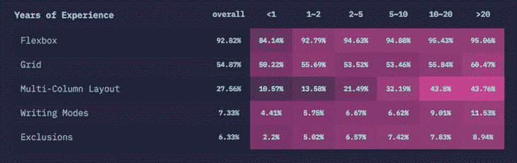
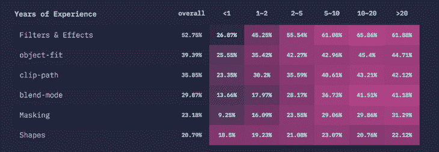
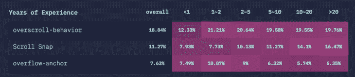
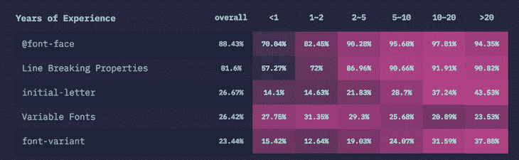
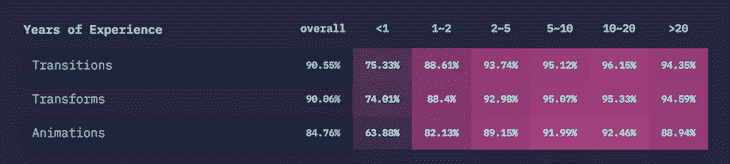

# 2020 年 CSS 特性的未来

> 原文：<https://blog.logrocket.com/the-future-of-css-features-in-2020/>

“[CSS 2019](https://2019.stateofcss.com)状态”报告提供了对前端开发未来的一瞥——更具体地说，是 CSS 的未来。在本文中，我们将回顾这份报告，分解 CSS 的关键特性，并探索 CSS 社区是如何看待它们的。然后，我们将利用这些见解来推测 CSS 世界将会发生什么。

## 什么是“CSS 的状态”？

“CSS 状态”于 2019 年首次发布，是一项年度调查，类似于 JavaScript 的“[状态”，记录并精美地展示了世界各地 CSS 用户的意见。数据点涵盖了 CSS 库和框架、特性、单元和选择器等等。](https://blog.logrocket.com/state-of-javascript-what-are-the-most-in-demand-frontend-frameworks-in-2020/)

在我看来,“CSS 状态”报告是首要的纯 CSS 开发人员调查，我希望它将成为未来几年前端开发人员社区的主要内容。

在这篇文章中，我们将研究在 2020 年需求量最大的 CSS 功能，并了解大约 11，000 名调查受访者对主要 CSS 概念的看法，如排版、布局、交互、动画、形状和图形。

## 布局

知道如何将框放置在相对于视窗和彼此的正确位置，对于您的演示、外观和感觉至关重要。虽然 CSS 大约有 20 年的历史，但我们已经看到了无数的创新，旨在帮助前端开发人员用 CSS 创建越来越多令人惊叹的布局，其中许多已经被广泛采用。

让我们放大到 2020 年开发者正在使用的顶级 CSS 布局。

### flex box(flex box)的缩写形式

[Flexbox 布局](https://developer.mozilla.org/en-US/docs/Web/CSS/CSS_Flexible_Box_Layout/Typical_Use_Cases_of_Flexbox)是一个一维 CSS 模块，用于设计界面和在容器内的展示中布局盒子。您可以向任何方向伸缩盒子，扩展它们以填满未使用的空间，或者收缩它们以避免溢出。Flexbox 允许您进行各种对齐调整。把它想象成网格的延伸。

根据调查，几乎所有 CSS 用户都听说过 Flexbox。更令人印象深刻的是，94.43%的受访者确实在他们的项目中使用过这种布局。

### 格子

CSS 网格布局是一个简单的二维网页布局系统。使用网格，您可以将演示文稿分成列和行。您还可以定义网页各部分在大小或位置上的关系。

几乎每个人都听说过 CSS 网格，但只有 54.4%的受访者实际使用过这种布局。这可能表明用户发现 CSS 网格布局比 Flexbox 更难使用。

### 多栏布局

[多栏布局](https://developer.mozilla.org/en-US/docs/Web/CSS/CSS_Columns)规范使您能够将内容排列成栏，类似于报纸布局。您可以选择列数，自定义它们从一列到另一列的排列方式，以及调整列间距的大小。

尽管近 41%的调查对象(包括我自己)不熟悉多栏布局，但 30.9%的调查对象以前确实使用过。这可能反映了市场上的认知差距，因为大多数知道多栏布局的开发人员倾向于在实践中使用它。

### 写作模式

[CSS 书写模式](https://developer.mozilla.org/en-US/docs/Web/CSS/CSS_Writing_Modes)是一个 CSS 模块，它定义了国际书写模式，例如从左到右(例如拉丁文字)、从右到左(例如希伯来文字)、垂直(例如中文文字)和双向模式。这是一个利基产品，这解释了调查中认知度得分低的原因。

## 形状和图形

随着 CSS 的成熟，用纯 CSS 创建图形和形状变得越来越容易。今天，如果你真正掌握了 CSS 的形状和图形功能，你就可以不用单独的编辑应用程序就能构建出令人惊叹的图形。由于支持滤镜和效果以及 blend 等其他功能，CSS 使这项工作变得更加简单和高效。

使用 CSS 的另一个优势与可访问性有关。用纯 CSS 和 HTML 编写总是有利于可访问性，因为屏幕阅读器和其他辅助设备可以很容易地解释纯 CSS。

### 滤镜和效果

就像今天手机摄像头或任何社交媒体应用程序上的编辑软件一样，filter 属性将图形效果(如颜色偏移)应用于元素。它用于调整图像渲染和背景。几乎每个使用 CSS 的人都知道它，根据“CSS 的状态”，超过三分之二的 CSS 开发人员在实践中使用它。

### 对象匹配

此属性用于被替换元素的内容，如图像。它定义了如何调整内容的大小以适应父容器。就像滤镜和效果一样，超过 67%的 CSS 用户利用了这个属性。

### 形状

您可以将 CSS 中可用的几何形状应用于演示文稿中的浮动元素。该酒店遵循[1 级规范](https://drafts.csswg.org/css-shapes/)中概述的规则。20%的调查受访者使用`shapes`酒店。其他形状和图形功能，如[混合模式](https://developer.mozilla.org/en-US/docs/Web/CSS/blend-mode)、[遮罩](https://developer.mozilla.org/en-US/docs/Web/CSS/CSS_Masking)和[剪辑路径](https://developer.mozilla.org/en-US/docs/Web/CSS/clip-path)，也在 CSS 社区中广泛使用。

## 相互作用

JavaScript 曾经是控制浏览器行为的唯一语言。随着 CSS 的成熟，可以影响浏览器行为的特性，如滚动捕捉，变得可用。让我们看看“CSS 的状态”调查的受访者对其中一些属性有什么看法。

### 滚动捕捉

这个 CSS 模块在滚动一个元素后，为滚动容器的端口提供滚动捕捉位置。尽管一半的调查参与者知道这个功能，但只有 11%的人目前在使用它。

### `overscroll-behavior`

`overscroll-behavior`定义一个元素在滚动的同时到达一个滚动条时的行为。根据调查数据，40%的开发者使用它，而 19%的开发者实际上使用这个特性。

### `overflow-anchor`

使用这个 CSS 属性，您可以禁用默认浏览器的滚动锚，它会自动调整滚动位置以减少内容移动的频率。根据“CSS 现状”，很少有人听说过`overflow-anchor`，在 CSS 社区中使用它的人就更少了。

## 排印

在 CSS 排版中，可变字体需求很大。在我们等待真正的响应式字体时，让我们看看 2019 年最常用的排版功能。

### 字体

这个 CSS at-rule 定义了一个自定义字体。您可以从本地存储或远程服务器上加载它。根据调查，每个 CSS 开发者都听说过它，目前有 92%的人在使用它。

### 可变字体

可变字体使您可以在一个文件中使用多种不同的字体，从而消除了针对每种粗细或样式的单独字体文件。您可以通过一个简单的字体引用来访问所有这些变体。

### 首字母

此 CSS 属性用于将演示文稿中文本的首字母设计为下沉、凸起甚至下沉的样式。大约 70%的 CSS 用户知道这个属性，28%的用户使用它。

## 动画和变换

每个 CSS 开发者都以这样或那样的方式使用过动画，从鼠标悬停到真正复杂的动画，比如“CSS 状态”主页上的。三个最常用的功能是过渡、变换和动画。

### 过渡

这个 CSS 模块使您能够在 CSS 属性值之间建立渐变。您可以控制转场的持续时间和计时功能。根据调查，93%的 CSS 用户使用过过渡。

### 转换

转换是 CSS 模块，指定 CSS 样式的元素如何在二维和三维空间中转换。像 transitions 一样，93%的 CSS 用户使用过 transform。

### 动画片

您可以使用 CSS 模块中称为动画的关键帧，将您随时间定义的 CSS 属性值制作成动画。通过指定计时功能、持续时间和重复次数，可以实现和控制动画。根据“CSS 的现状”，89%的 CSS 用户在他们的工作中使用过这个模块。

## 结论

“CSS 状态”调查揭示了关于属性和模块的宝贵见解，这些属性和模块将在 2020 年席卷 CSS 社区。事实上，Flexbox 是今年最受欢迎的功能，其次是过渡和转换，这表明 CSS 用户更加关注动画。调查数据还显示，开发人员对 CSS 模块的兴趣越来越大，这一趋势在 2020 年将如何发展将令人着迷。

2019 年你最喜欢的 CSS 功能有哪些？2020 年你最期待什么？

## 你的前端是否占用了用户的 CPU？

随着 web 前端变得越来越复杂，资源贪婪的特性对浏览器的要求越来越高。如果您对监控和跟踪生产环境中所有用户的客户端 CPU 使用、内存使用等感兴趣，

[try LogRocket](https://lp.logrocket.com/blg/css-signup)

.

[https://logrocket.com/signup/](https://lp.logrocket.com/blg/css-signup)

LogRocket 就像是网络和移动应用的 DVR，记录你的网络应用或网站上发生的一切。您可以汇总和报告关键的前端性能指标，重放用户会话和应用程序状态，记录网络请求，并自动显示所有错误，而不是猜测问题发生的原因。

现代化您调试 web 和移动应用的方式— [开始免费监控](https://lp.logrocket.com/blg/css-signup)。