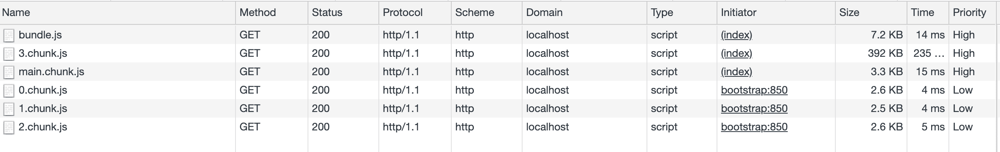

# React 的未来，悬念迭起

> 原文：<https://blog.logrocket.com/the-future-of-react-unfolding-with-suspense/>

自从 React 团队发布了他们的 16.x 版本，它就像风暴一样席卷了整个社区。该集合中一些最酷的新增功能是挂钩、延迟加载、悬念和缓存 API。

这不仅仅是另一篇关于如何编写钩子的文章，而是关于 React 未来的展望！如果您从未听说过 Hooks，或者 React 中的任何其他新 API，那么这篇文章将是一个让您对未来感到兴奋的良好开端。

随着文章的深入，我们将涵盖两个新概念，预计将于 2019 年在 Q2 发布:

*   如何使用悬念获取数据
*   如何使用 react-cache

我已经很兴奋了！但是，在我们深入探讨之前，让我们放慢速度，快速回顾一下。

## 反应钩

在 React 16.8 中，钩子正式成为稳定版本的一部分。它在高层次上解决了一些问题:

*   通过采用使用函数编写一切的概念，它使得编写代码更加模块化，更易于维护
*   不鼓励使用使代码难以理解的 [HOCs](https://reactjs.org/docs/higher-order-components.html) 和其他复杂函数
*   放弃使用复杂的[生命周期](https://hackernoon.com/reactjs-component-lifecycle-methods-a-deep-dive-38275d9d13c0)，如`componentDidMount`、`componentDidUpdate`等。，这需要我们编写重复的代码

如果你想了解更多细节，[查看这里](https://reactjs.org/docs/hooks-intro.html#motivation)。

所以，让我们来看看 React Hooks 的演示，看看一个典型的应用程序会是什么样子！

反应.懒惰

## 这个名字真的泄露了它的意图！当我们想要延迟加载组件时，我们需要它:

借助使用 webpack 的动态导入，我们可以做到这一点；它有助于创建包，这提高了我们的页面加载速度。让我们玩一个演示吧！只需返回到 Codesandbox 演示链接，将导入更改为以下内容:

```
const *TodoList* = *React.lazy*(() => import("./containers/todoList"));
```

请注意下图中单独的包是如何创建的😄

```
const *TodoList* = *React.lazy*(() => import("./containers/todoList"));
const *CompletedList* = *React.lazy*(() => import("./containers/completedList"));
const *AddNewTask* = *React.lazy*(() => import("./containers/addNewTask"));
```



焦虑

## 悬念使用起来相当简单。让我们借助代码演示来更好地理解这一点:

你可以在这里找到[的演示链接](https://codesandbox.io/s/new-6m2gj)，如果你想玩的话。

```
// [https://codesandbox.io/s/new-6m2gj](https://codesandbox.io/s/new-6m2gj)
import React, { useState, useEffect, Suspense } from "react";
import ReactDOM from "react-dom";
import todoListData from "./containers/todoList/todolistData";
import Header from "./containers/header";
import Clock from "./components/Clock";
import "./styles.css";

const TodoList = React.lazy(() => import("./containers/todoList"));
const CompletedList = React.lazy(() => import("./containers/completedList"));
const AddNewTask = React.lazy(() => import("./containers/addNewTask"));

function App() {
  const { todolist } = todoListData;
  const [todoListPayload, setTodoListPayload] = useState(todolist);
  const [completedTodoList, setCompletedTodoList] = useState([]);

  const addTodoTaskHandler = value => {
    // addTodoTaskHandler
  };

  const removeTodoTaskHandler = ({ id }) => {
    // Remove from the set of todo list
  };

  const completeTodoTaskHandler = ({ id }) => {
    // Get item to remove
  };

return (
    <div className="App">
      <Header title={"My Tasks"} />
      <Clock />
      <div className="PageLayout">
        <Suspense fallback={<div>Loading...</div>}>
          <TodoList
            payload={todoListPayload}
            completeTodoTaskHandler={completeTodoTaskHandler}
          />
          <CompletedList list={completedTodoList} />
          <AddNewTask addTodoTaskHandler={addTodoTaskHandler} />
        </Suspense>
      </div>
    </div>
  );
}

const rootElement = document.getElementById("root");
ReactDOM.render(<App />, rootElement);
```

如果我们检查演示中的代码，我们会看到:

就像用悬念包裹组件一样简单。我们使用`React.lazy()`缓慢地加载了一些组件— `TodoList`、`CompletedList`、`AddNewTask`。由于在内部它会为每个包生成包，在较慢的网络条件下，可能需要一些时间来加载它们。

```
<Suspense fallback={<div>Loading...</div>}>
  <TodoList
     payload={todoListPayload}
     completeTodoTaskHandler={completeTodoTaskHandler}
   />
  <CompletedList list={completedTodoList} />
  <AddNewTask addTodoTaskHandler={addTodoTaskHandler} />
</Suspense>
```

“暂停”将通过显示一个`fallback`，如**装载……**或任何其他组件，如旋转器或类似组件，来自动处理此问题。

深入未来

## 太好了！我们简短的回顾很激烈。现在让我们用悬念获得更多的乐趣。

暂停和反应-缓存

### 等等，我们不是已经谈过悬念了吗？那么，如果我告诉你当一个 API 被调用时，悬念也能处理我们的加载状态，会怎么样？但为此，我们真的需要深入研究 API 并更好地理解它。

经过一番挖掘和研究，我终于找到了肖恩·王的🌟 GitHub 库，我想直接引用他的[文档](https://github.com/sw-yx/fresh-concurrent-react/blob/master/apis/react-suspense.md):

反应暂停是组件在从缓存加载数据时暂停渲染的一种通用方式。它解决的问题:当渲染受到 I/O 限制时。

> 好的，“从缓存中加载数据”给了我一个提示，但是我需要更多的信息来了解如何真正处理这个 API。

肯特·c·多兹在他的[理论家课](https://egghead.io/lessons/react-learn-fundamentals-of-react-suspense?pl=react-hooks-and-suspense-650307f2)中教授了一个重要的概念:如果我们抛出一个承诺，悬念会自动知道一个 API 请求已经被调用。

当然，这不是处理代码的最佳方式；它看起来有点粗糙。因此，让我们尝试使用 react-cache 来更好地处理这段代码:

```
import React, { Suspense } from "react";

fetchArticles() {
  // Some fetch API fetching articles
}

let isRequestCalled = false;
function Content() {
  let result = [];
  if (!cache) {
    const promise = fetchArticles();
    isRequestCalled = true;
    throw promise; // Let suspense know
  }
  return <div>Article</div>;
}

const Articles = () => {
  return (
    <div>
     {/* Yay promise is thrown */}
      <Suspense fallback={<div>loading...</div>}>
        <Content />
      </Suspense>
    </div>
  );
};

export default Articles;
```

从 react-cache 通过回调创建一个资源，返回一个承诺。

```
import React, { Suspense } from "react";

import { unstable_createResource as createResource } from "react-cache";

function fetchArticles() {
  // Some fetch API fetching articles
}

const politicalArticles = createResource(fetchArticles);

function Content() {
  const result = politicalArticles.read(someKey);
  return <div>Article</div>;
}

const Articles = () => {
  return (
    <div>
      <Suspense fallback={<div>loading...</div>}>
        <Content />
      </Suspense>
    </div>
  );
};

export default Articles;
```

好吧，悬疑要知道它必须显示加载状态，它需要的只是一个承诺。它将继续显示装货状态，直到承诺得到解决。

然而，这是实验性的。我相信你会遇到错误，所以不要担心，它明确提到 react-cache 仍在开发中。

> 只是提醒一下，确保在组件内部使用`read`方法；否则，它将抛出一个错误。

如果您有兴趣阅读 react-cache 源代码，请查看这个[链接](https://github.com/facebook/react/blob/master/packages/react-cache/src/ReactCache.js)。

```
// A snippet from the React-cache library

function readContext(Context, observedBits) {
  const dispatcher = ReactCurrentDispatcher.current;
  if (dispatcher === null) {
    throw new Error(
      'react-cache: read and preload may only be called from within a ' +
        "component's render. They are not supported in event handlers or " +
        'lifecycle methods.',
    );
  }
  return dispatcher.readContext(Context, observedBits);
}
```

恭喜你！

## 我们现在赶上了 React 的不久的将来，有一件事是显而易见的:React 团队希望使 API 尽可能简单。

越来越多的库正在转向函数式编程，这也让我很兴奋。这种模式肯定会彻底改变我们编写前端的方式。我也在关注 concurrent React——如果你感兴趣，可以查看官方的[路线图文档](https://reactjs.org/blog/2018/11/27/react-16-roadmap.html#react-16x-mid-2019-the-one-with-suspense-for-data-fetching)。React——缓存和暂停是并发 react 的一些特性😎。

*在 [****Twitter****](https://twitter.com/daslusan) 上关注我，获取关于新文章和最新前端开发的更新。还有，在 Twitter 上分享这篇文章，帮助其他人找到它。分享就是关爱^_^*

[LogRocket](https://lp.logrocket.com/blg/react-signup-general) :全面了解您的生产 React 应用

## 调试 React 应用程序可能很困难，尤其是当用户遇到难以重现的问题时。如果您对监视和跟踪 Redux 状态、自动显示 JavaScript 错误以及跟踪缓慢的网络请求和组件加载时间感兴趣，

.

[try LogRocket](https://lp.logrocket.com/blg/react-signup-general)

LogRocket 结合了会话回放、产品分析和错误跟踪，使软件团队能够创建理想的 web 和移动产品体验。这对你来说意味着什么？

[ ](https://lp.logrocket.com/blg/react-signup-general) [](https://lp.logrocket.com/blg/react-signup-general) 

LogRocket 不是猜测错误发生的原因，也不是要求用户提供截图和日志转储，而是让您回放问题，就像它们发生在您自己的浏览器中一样，以快速了解哪里出错了。

不再有嘈杂的警报。智能错误跟踪允许您对问题进行分类，然后从中学习。获得有影响的用户问题的通知，而不是误报。警报越少，有用的信号越多。

LogRocket Redux 中间件包为您的用户会话增加了一层额外的可见性。LogRocket 记录 Redux 存储中的所有操作和状态。

现代化您调试 React 应用的方式— [开始免费监控](https://lp.logrocket.com/blg/react-signup-general)。

Modernize how you debug your React apps — [start monitoring for free](https://lp.logrocket.com/blg/react-signup-general).

* * *