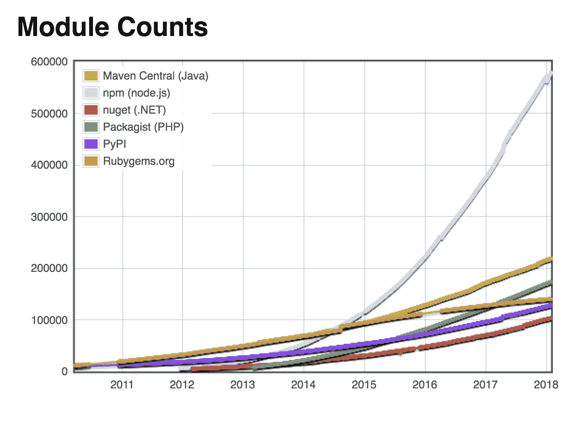

# 前端复杂性的增加——log rocket 博客

> 原文：<https://blog.logrocket.com/the-increasing-nature-of-frontend-complexity-b73c784c09ae/>

前端 web 开发从来都不是一个更热门或更有争议的话题。

曾经是服务器端社区卷入了关于看似晦涩的话题的争论，比如 ORM 是否是有用的抽象，现在你不能问 CSS 是否属于 JavaScript 而不引起每个人的愤怒。

JavaScript 生态系统中框架和流行词汇的激增已经变得如此极端，以至于关于 JavaScript 疲劳的中等思想成为开发世界的新避雷针。我们甚至不能盯着自己的肚脐而不在黑客新闻上引发“盯着肚脐看被认为是有害的”趋势。

所有这些沮丧和焦虑的来源是什么？这是新技术引发投资前代技术的所有人反弹的标准周期，还是有潜在的根本原因？

> 争议伴随着变化和不确定性。当有真正的问题并且没有公认的正确答案时，我们会争论可能性。当我们对问题本身有分歧时，我们就会遇到真正的挑战。

在变革时期，开发社区中的争议往往会激增。令人惊讶的是，我们正处于复杂性从后端向前端大规模快速转变的时期。

复杂性守恒

### 在网络世界中，并不是所有地方的事情都变得越来越复杂。组装一个数据库驱动的 API 从未如此简单。举个简单的例子，你可以启动 Firebase，而不用接触任何代码。工具和自动化已经达到了令人难以置信的复杂程度，因此许多任务比以往任何时候都要简单。

工具的复杂化并没有使我们作为工程师的工作消失。

> 似乎有一个普遍的公理，那就是我们必须考虑的复杂程度永远不会下降，它只是在移动。在这种情况下，创建服务器端应用程序的复杂性的降低与复杂性向前端的戏剧性转变同时发生，这种转变我们仍在处理中。

转变的起源:不是一个大趋势，而是三个

### 前端复杂性的增加源于三个大趋势的汇合，每个大趋势都有自己的原因和影响，它们一起形成了一场完美风暴。

设备的多样化

#### 这些大趋势中的第一个是运行网络浏览器的网络连接设备令人难以置信的多样化。当我开始使用 web 时，您假设您的用户在运行拨号或 DSL 的桌面设备上。我们必须处理的屏幕尺寸、延迟和带宽的变化是最小的。今天的前端开发人员需要考虑从 3G 连接上只有 320px 宽屏的微型手机到运行在高速企业以太网上的巨大桌面屏幕的一切。

质量标准更高

#### 与此同时，质量标准大幅提高。

网络正处于从世界上最广泛使用的文档平台向最广泛使用的应用程序平台转变的过程中。用户希望 web 应用程序能像本地应用程序一样快速响应。设计越来越成为一个差异化因素。

巨大的市场增长

#### 最后，能够访问网络的消费者数量急剧增长。根据关于互联网使用的 ICT 报告，自 2010 年以来，我们的网民数量已经从大约 20 亿增加到超过 40 亿，这是一个*的巨大增长，也是网络开发者的目标受众。*

转变的证据

### 正是这种趋势的结合——环境的日益复杂、更高质量的酒吧，以及受众大规模增加的市场压力，导致了前端网络空间活动的疯狂和混乱的爆发。

这次爆炸的证据随处可见。将 HTML、CSS 和 JavaScript 作为解决前端问题的主要工具，我们可以看到这些生态系统。

生态系统增长

#### 在 npm 上注册的 JavaScript 包数量的增长曲线与其他编程语言中的包完全不同。

前端 HTML 和 CSS 框架也成倍增长。五年前，你可能有三种选择——古老的 grid960 或最近热门的全功能框架之一，Bootstrap 或 Foundation。今天，快速搜索“css 框架”会出现一个超过 100 个[的列表！](https://cssauthor.com/css-frameworks/)

Comparison of module counts by ecosystem. Source: [http://www.modulecounts.com/](http://www.modulecounts.com/)

新的编程模型

#### 除了现有语言生态系统中工具的爆炸之外，我们还看到了编程模型的根本转变&我们可以利用的可能性。为了处理日益复杂的用户界面，我们看到了向新编程模型的转变。

最初的努力是在现有的语言中使用模型，这些模型被证明可以更好地适应复杂性——基于组件的架构、函数式编程机制和精心封装的状态。

下一代走得更远，用新语言超越 JavaScript 编程模型的限制，这些新语言具有完全不同的编程模型，如 Elm 和 Web Assembly。

更多来自 LogRocket 的精彩文章:

* * *

### 这一切意味着什么？

* * *

### 这种复杂性的巨大转变带来的最明显的影响之一就是前端开发人员感受到并抱怨的压力和疲劳。

当你所在的领域变化如此之快，以至于最佳实践在两年内就过时了，你必须努力跟上。

> 十年前在服务器技术领域也发生了同样的事情——跟上 Ruby on Rails 或 Django 的最新最棒的东西是一项全职工作。但是今天，这种技术已经成熟。

这并不是说停滞不前。一点也不。仍在取得重大进展。但是，作为一名使用 Ruby on Rails 的 API 开发人员，你可以过得很好，而不必花费一半的工作时间来努力跟上。事实上，最近发布的一些最大的不同并不在于核心技术，而是集成了最新的前端工具，如 webpack。

你逃不出明面

### 复杂性向前端大规模转移的另一个主要影响是，前端工具不再是“好东西”这既是*必然*也是*明显的痛点*。

工具存在是有目的的。人类一次只能理解和处理这么多的复杂性。工具允许我们将复杂的模块封装成更简单的部分，让我们抽象出问题并创建越来越复杂的解决方案。

随着我们对前端的需求变得越来越复杂，一个完整的前端工具生态系统(T1)出于需要(T3)已经萌芽(T2)。像 [gulp](https://gulpjs.com/) ， [webpack](https://webpack.js.org/) ， [brocolli](http://broccolijs.com/) ， [rollup](https://rollupjs.org/) ， [babel](https://babeljs.io/) ， [flow](https://flow.org/) 等工具的存在，帮助我们驾驭混乱，使之易于管理。

然而，对于所有已经开发的前端工具，它实际上是生态系统中的一个明显的漏洞。与后端工具相比，前端工具生态系统非常原始和不成熟。

浏览器正在迅速改进调试工具，但是日志记录仍然很原始。构建工具也在迅速改进，但它们也仍处于起步阶段。此外，配置它们过于复杂(你最近试过手动配置 webpack 吗？。另外，社区支持和资金继续落后于后端工具。

巨大的机会

### 巨大的市场需求和生态系统中明显的漏洞相结合，为个人和公司创造了一个难以置信的机会。

在公司层面，前端可用工具的不足创造了填补这些空白的商业机会。LogRocket 正在解决前端日志记录的问题，但是这里还有许多其他的机会。

谁将创建一个更好的前端集成开发环境？更好的前端性能监控？更好的测试和验证系统？虽然这些工具的版本都存在，但与后端可用的工具水平相比，它们都显得很原始。

在个人层面，机会更大。新的工具和框架创造了巨大的力量，允许个人解决问题和创造以前需要整个团队来实现(或者甚至不可能实现)的产品。

这个领域的发展速度远远超过了开发者的数量。显然，大量的需求和不足的供给等于求职者的市场。

但是当你把它和指数级增长的创造价值的能力结合起来，你会得到一个市场，一个熟练的前端开发者实际上可以支配他们的条款。

这是要去哪里？

### 在一个变化如此迅速的领域做出预测是一种错误估计。但是，有几件事我可以肯定地说。

首先，短期内不会放缓。推动前端复杂性上升的力量不会消失，当前的解决方案不足以减缓创新的步伐。

1.  **第二，“前端 web 开发”将把**扩展到越来越多的原生领域。
2.  网络虚拟现实的兴起为创造强大的沉浸式媒体体验创造了机会，这在以前可能需要大规模定制解决方案。通过网络，你可以无缝地、渐进地让某人参与到虚拟现实体验中，根据他们设备的能力进行调整，并在更合适的地方链接到非虚拟现实资源。

Web 支付 API 等新规范支持无缝访问以前仅限于本地设备的功能。想象一下这样一个世界，在线支付就像从应用商店买东西一样简单——一个简单的拇指 ID 就搞定了。哪些新的体验将会转移到 web 上？这会带来哪些新的机遇？

复杂性将继续增加，但是支持工具生态系统也将成熟。已经发生了。只要看看我们在核心底层技术上的工作方式就知道了。TC39 致力于 JavaScript 语言，CSS WG 致力于 CSS 规范。

两者都极大地提高了新规范发布的速度和一致性。规范社区已经找到了如何迭代改进规范的方法，浏览器供应商也越来越能够在持续的基础上协调和发布改进。

令人震惊的是，我们已经到了这样一个地步:每个主流浏览器都是常青树。现在我们可以想象一个未来，几乎每个用户都可以在新的 web 平台特性开发出来的时候立即访问它们。

最后，我们也看到非浏览器工具开始改善。Webpack 和 Babel 越来越受到社区的支持，像 LogRocket 这样的工具供应商开始开拓可支持的业务*和*支持前端开发人员。

未来是如此的光明…

### 对于前端开发人员来说，这是一个艰难的时期。

技术发展如此之快，以至于很难跟上，生态系统支离破碎，即使是个人也面临着巨大的压力，要达到并超过大型亿万美元公司设定的用户体验标准。

所有这些都是真的，然而我对前端开发的未来感到无比兴奋。我们正处于一个难以置信的创新和变革时代，浏览器正在转变为面向 40 亿用户的*和*应用交付和执行平台。从来没有过更多的机会，从来没有过更强大的工具。

这是成为前端开发人员的绝佳时机。

凯文·鲍尔从事网络开发已经超过十年，是两家网络初创公司的联合创始人和首席技术官，并在世界各地发表过演讲。现任前端咨询培训公司 ZenDev，LLC 总裁，出版 [*周五前端简讯*](https://zendev.com/friday-frontend.html) *。*

使用 [LogRocket](https://lp.logrocket.com/blg/signup) 消除传统错误报告的干扰

## [LogRocket](https://lp.logrocket.com/blg/signup) 是一个数字体验分析解决方案，它可以保护您免受数百个假阳性错误警报的影响，只针对几个真正重要的项目。LogRocket 会告诉您应用程序中实际影响用户的最具影响力的 bug 和 UX 问题。

然后，使用具有深层技术遥测的会话重放来确切地查看用户看到了什么以及是什么导致了问题，就像你在他们身后看一样。

LogRocket 自动聚合客户端错误、JS 异常、前端性能指标和用户交互。然后 LogRocket 使用机器学习来告诉你哪些问题正在影响大多数用户，并提供你需要修复它的上下文。

关注重要的 bug—[今天就试试 LogRocket】。](https://lp.logrocket.com/blg/signup-issue-free)

Focus on the bugs that matter — [try LogRocket today](https://lp.logrocket.com/blg/signup-issue-free).

* * *